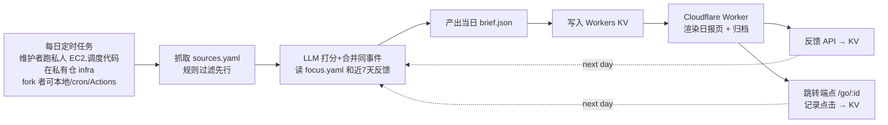

# 001 Daily Brief — 产品方案(评审稿)

> 状态:2026-08-15 评审通过并建成 v1;同日用户二次修订产品形态(见下),已按新形态重构完成,未部署。
>
> **2026-08-15 晚间修订(用户拍板)**:产品是**网页端全操作的系统**——配置信息源、一键生成、每天自动生成、接收反馈都在网页里完成,不是「改 yaml + 命令行」。落地变化:①生成逻辑抽成 `src/shared/pipeline-core.ts`,worker 的 `POST /api/generate` 直接跑(16 源 + 1 次 LLM 调用在 Worker 子请求限额内);②源与关注点存 KV(`config:sources`/`config:focus`),配置页可增删改、启用开关、单源试抓预览;③每日定时首选 **Cloudflare Cron Trigger**(Worker 自触发,零 EC2 零运维),EC2 留给三期 whisper 转录等 Worker 干不了的重活——原「EC2 跑 CLI」方案降级为备选,CLI(`npm run generate`)保留给 fork 者和重活场景。
> 前置调研:GitHub 12 个同类开源项目扫描 + 「日报为什么没人看」留存机制调研(2026-08-15,两份调研的引用散在正文)。
>
> **2026-08-16 三次修订(用户拍板)**:产品转**多用户内测**——登录必须、邮箱白名单准入,每个用户的追踪器配置与简报互相隔离;配置新建改为**分步向导**(理解 → 标签 → 信源,每步用户确认才前进);AI 引擎拍板 **DeepSeek V4 Pro**;「立即生成」成为配置调参的核心回路。详见文末「2026-08-16 修订」一节,架构落地见 [02-技术方案.md](02-技术方案.md)。本文其余部分照旧有效:调研结论与决策 1–5 不动;决策 6 预告的「AI 推荐源 + review 流程」由向导的步骤 3 落地;「架构:生成与展示分离」一节的具体图已过时,以 02 为准。

## TL;DR

做一份**有限、有终点、挂钩你当下项目**的每日简报网页:每天固定不超过 10 条,分四个价值分区,每条只回答「为什么值得你点进去」并给原文链接和拓展链接;每条带一键反馈 + 文字反馈口,所有外链走自己的跳转端点记录点击。生成管线跑在 GitHub Actions 上,网页跑在 Cloudflare Workers 上。第一版(≤8 小时)只做扎实「生成质量 + 原链接 + 反馈数据开始积累」,AI 推荐源和自动调权放二期。主要代价:第一版的源要手工配(继承旧仓现成的 18 个),反馈数据攒够之前排序不会自动变准。

## 背景与问题

上一版每日 digest(私有仓 Kidforever-kb-agent,EC2 定时管线)失败的方式很典型:管线跑得好好的,用户自己不想看了。复盘出的直接原因有四条,这次的两份调研从商业产品和学术实验两个方向独立验证了每一条:

| 旧版问题 | 外部验证 | 来源 |
|---|---|---|
| 摘要过早压成主题结论,读完没收获 | 7 组实验(n=10,462)证明:读 LLM 摘要比自己搜索的人知识更浅、投入感更低,**即便摘要附了链接也一样**——因为「自己发现信息」的过程被剥夺了 | [PNAS Nexus 2025](https://academic.oup.com/pnasnexus/article/4/10/pgaf316/8303888) |
| 没有原文链接,内容是死胡同 | 活得好的同类项目全部严格保留原链 + 评论区链接;HN 用户对摘要工具的正面用法全是「用摘要决定要不要点进去」 | [HackYourNews 评论区](https://news.ycombinator.com/item?id=37427127) |
| 没有反馈机制,「说了也白说」 | 12 个开源同类项目里 11 个没有反馈回路,全是静态配置打分——日报不会因为你昨天没点开某类内容而变化,这正是弃读的共同根源 | GitHub 调研(下文「同类项目」表) |
| 内容和当下关注点脱节 | 财经新闻加 AI 摘要后读者理解得分反而更高、主动搜索更多——但前提是读者对内容有直接利害(投资决策);无利害的泛新闻,摘要沦为替代品,读了白读 | [哈佛商学院 Pacelli 研究](https://www.library.hbs.edu/working-knowledge/can-ai-news-summaries-help-us-read-more-deeply) |

调研还带来两条**增量**认知,直接改变了这次的设计优先级:

1. **弃读的首因不是个性化不准,而是日报无边界、无收获感、无问责。** 反直觉的证据:重算法个性化的 Artifact(Instagram 创始人做的新闻 app)死了,零算法、固定栏目、5 分钟读完的 TLDR newsletter 活得最好(百万订阅);Kagi News 干脆一天只更一次、读完即止。所以「有限性」排在「个性化」前面做。
2. **反馈回路技术上很便宜,难在产品设计。** 唯一做成学习闭环的开源项目 arxiv-sanity-lite(karpathy)用的是 tfidf+SVM 这种老派 ML,不用 LLM;独立开发者 Tullie 的 HN 个性化 feed 只用「收藏」一个信号 + embedding 余弦相似度加权。真正的坑在别处:反馈了但看不出变化,用户就默认「说了也白说」,从此不再反馈。

### 用户已确认的需求(2026-08-15)

| 问题 | 拍板 |
|---|---|
| 阅读场景 | 推送精简版 + 网页完整版都要 |
| 核心价值 | 四种全要:不错过重要的事 / 给项目供弹药 / 教我新东西 / 筛掉噪音省时间 |
| 反馈方式 | 打分系统 + 每条留文字反馈口(可以说「这条不喜欢」「这条没什么细节」) |
| MVP 优先 | 先做扎实生成质量 + 原链接,源推荐和反馈调权可后置 |

## 方案

一句话:**日报不是内容的终点,是当天信息的路由器**——每条内容的任务是帮你在 10 秒内决定「点进去还是划过去」,而不是替你把原文读完。

### 决策 1:网页是主体,推送是入口,邮件绝不做唯一输出

直觉方案是把日报做成每天一封邮件——最省事。但邮件是单向发射:发出去之后,你读没读、点了哪条、在哪条停留,全都不知道,反馈回路从根上就断了。开源项目 auto-news 输出到 Notion 也是同样结局:Notion 不是好的每日消费界面,行为数据也回不来。反过来,Folo(38.8k star)证明 digest 长在一个用户每天本来就会打开的界面里,留存明显更好。

所以:网页(Cloudflare Workers,沿用 nanisle 模板栈)承载完整日报、反馈按钮、点击埋点;推送(邮件或 Telegram)只发「今日 3 句话 + 链接回网页」,放二期。

### 决策 2:硬性有限 + 四个价值分区 + 「已筛掉」区

你要的四种价值揉在一起,正是旧版的问题之一:一条流水线输出,每条内容不知道自己为什么值得你看。新版把四种价值变成四个显式分区,每个分区有**条数硬上限**(总量 ≤10 条),读完有明确的「今天到此为止」:

| 分区 | 对应价值 | 条数 | 内容规则 |
|---|---|---|---|
| 今日大事 | 不错过重要的事 | ≤3 | 宏观数据发布、AI 行业大事件;多个源报同一件事必须合并成一条(LLM 判断,不做 embedding 聚类,理由见「不选什么」) |
| 项目弹药 | 给项目供弹药 | ≤3 | 每条必须写明「这和你的哪个关注点有什么关系」,写不出来就不入选 |
| 教我新东西 | 教我新东西 | ≤2 | 论文、深度播客、博主观点;允许和当下项目无关,但必须有「新在哪」 |
| 已替你筛掉 | 筛掉噪音省时间 | 一行折叠 | 只显示「今天扫了 N 条,筛掉 M 条,主要是 X/Y 类」——省时间的价值必须可见才可信,这也是日报对你的「问责」 |

「已替你筛掉」区看起来多余,其实有两个作用:一是把「省时间」从口号变成每天可感知的数字;二是它是纠错通道——展开折叠能看到被筛掉的标题列表,发现误杀可以点「这条我要」,这是最高质量的负反馈信号(比点踩信息量大,因为它直接暴露筛选标准的盲区)。

### 决策 3:每条内容的字段结构——摘要做路由器,不做终点

每条内容固定五个字段,生成 prompt 按此约束:

1. **标题**(原文标题,或合并事件时的中性描述)
2. **为什么值得你点**:1–2 句,回答的是「值不值得花 10 分钟读原文」,不是复述原文说了什么
3. **原文链接**(必有)+ **讨论区链接**(HN/Reddit/评论区,有则附)
4. **拓展链接**:1–2 个相关内容(同话题旧文、反方观点、数据出处)
5. **保留分歧**:如果原文有明显的存疑、限定、反方观点,必须保留,禁止压成定论——AI 摘要系统性删掉的恰恰是作者的怀疑和转折(BBC 测试:51% 的 AI 新闻摘要有重大问题,13% 的引文是编造的),而引文编造被你发现一次,整份日报的信任就崩了

生成侧的硬规则:**「为什么值得你点」和引文只能来自抓取到的原文文本,禁止模型外推补充**。这条写进 prompt 还不够,v1 先靠人工抽查,后续可以加自动校验(引文字符串必须在原文里能搜到)。

### 决策 4:「当前关注」清单驱动「项目弹药」区

哈佛那条证据是本次调研里最硬的:同样的摘要,读者有利害关系时促进深读,无利害时替代阅读。落地方式是一个你自己维护的关注清单(`focus.yaml`,几行文字,如「nanisle 本周产品方向」「BRK/B 持仓」「小红书 AI 选题」),生成管线拿它给「项目弹药」区打相关分。清单可随时改,改完下一期立即生效——这也是你说的「试跑 + 调整」的最低成本形态:调的不是玄学权重,是一份你看得懂的文字清单。

### 决策 5:反馈双通道,且效果必须下一期可感知

按你的拍板做打分 + 文字反馈,但有一处我建议收窄:调研里 Tullie 试过点赞信号,结论是「太噪、无法撤销、没法调试」,最后只留了收藏一个信号;Feedly/Artifact 的实践也是负反馈权重远大于正反馈。所以**打分不做五分制,只做两态**(👍 有用 / 👎 没用),把表达力留给文字反馈口:

| 通道 | 形态 | 用途 |
|---|---|---|
| 一键评分 | 每条 👍/👎,一次点击 | 攒排序训练数据;👎 立即生效(同源同类内容次日降权) |
| 文字反馈 | 每条一个输入框,想写就写 | 区分两类问题:「选题不对」(调源和筛选)vs「呈现不好,没细节」(调生成 prompt)。这个区分是评分给不了的 |
| 隐式点击 | 所有外链走 `/go/:id` 跳转端点,记录点击 | 零打扰的主信号;Google Discover 和 Tullie 的实践都以隐式信号为主食 |
| 误杀申诉 | 「已替你筛掉」区的「这条我要」 | 暴露筛选盲区的高质量负样本 |

**反馈回显**是这个决策里最容易被省略、但调研证明最不能省的部分:你点踩了宏观类内容后,下一期页首要显式一行「根据昨天的反馈,本期宏观类减少到 1 条」。没有这行字,反馈就是黑洞,两周后你就不点了(Artifact 冷启动太慢流失用户,就是死在「反馈了但感知不到变化」)。v1 的「生效」可以很笨——直接把最近 7 天的 👎 记录和文字反馈塞进生成 prompt——不需要训练模型。

### 决策 6:源管理——种子源继承,AI 推荐源做成 review 流程(二期)

冷启动不靠 AI:旧仓 `Kidforever-kb-agent/playbook/feeds.yaml` 有现成的 13 个博客源 + 5 个播客源(带文字稿获取提示),直接继承挑 10–15 个,再补 1–2 个宏观数据源。**冷启动期把「源质量」的责任放在人工策展上,把 AI 的责任放在筛选和呈现上**——Artifact 用算法背冷启动的教训。

二期做你要的「AI 推荐源」,形态是 review 流程而不是黑盒:你给主题(如「具身智能」)→ AI 搜索并推荐 3–5 个源,每个附「推荐理由 + 最近 3 篇代表作链接」→ 你逐个采纳/拒绝,拒绝时可写原因 → 采纳的进 `sources.yaml`,拒绝原因存下来避免重复推荐。开源界最接近的只有 Horizon 的一次性配置向导,「持续推荐 + review」没人做过,这是差异化点。

B 站 UP 主、无文字稿播客的接入(需要 RSSHub 自建实例 + whisper 转录)放三期:成本高,且 v1 的源池已经够一份好日报。

### 架构:生成与展示分离

为什么生成管线不放 Worker 里:Worker 单请求有子请求数和 CPU 时间限制,抓 15 个源 + 多轮 LLM 调用在免费档(50 个子请求/请求)很容易顶到天花板,而且三期的 whisper 转录这类重活永远放不进去。所以生成是一条独立的 CLI 命令(`npm run generate`),在任何有 Node 的机器上都能跑——公开仓不绑定调度平台,fork 者本地跑、cron 跑、GitHub Actions 跑都行。

维护者自己的实例跑在私人 AWS EC2 上,每日定时触发,调度与部署代码放私有平台仓 `nanisle/infra`(2026-08-15 评审拍板:公开仓只放产品代码,私人云资源和真实配置全部归私有仓)。两条从旧版继承的教训要在 infra 设计时落实:一是旧版 EC2 定时的头号故障是「实例卡在 running 导致后续所有定时启动静默失败」,新 infra 要么用常开的最小实例跑 cron,要么启停方案必须配失败告警;二是产品侧自带兜底——日报页显示生成时间戳,超过 26 小时显式亮「今日未更新」横幅,静默失败最多瞒一天。

fork 体验(公开仓的硬规矩):mock 模式内置一份示例 `brief.json`,零配置 `npm run dev` 就能看到完整日报页;生成管线单独一条命令本地跑通(`npm run generate`,BYOK)。

### 为什么不选(备选方案)

| 备选 | 具体卡点 |
|---|---|
| 邮件作为主输出 | 无行为数据,反馈回路死路(决策 1 已展开) |
| embedding 聚类合并事件(meridian 的 UMAP+HDBSCAN) | 效果好但管线重;meridian 本人 2025-05 就停更了——个人维护重管线的普遍结局。v1 源池才 15 个,同一事件的候选一屏就装下,LLM 在打分时顺手合并足够 |
| 上来就做个性化排序模型 | Artifact 教训:个性化需要大量行为数据才起效,冷启动期用户先流失。先靠 focus.yaml 显式声明 + 分区配额,数据攒 4–6 周后再考虑 embedding 相似度加权(Tullie 公式,不用训练) |
| 复用 kb-agent 的 EC2 管线 | 头号故障模式(卡 running 静默失败)是结构性的;且它和 Notion/wiki 深度耦合,拆比重写贵。注意:这次否掉的是「复用那套管线代码」,不是 EC2 本身——新版生成脚本仍由维护者的 EC2 定时跑,但脚本是全新的、运行时无关的 CLI |
| GitHub Actions 跑生成(初稿方案) | 技术上可行且低运维,但维护者已有私人 EC2,且希望云基础设施统一收进私有仓 `nanisle/infra` 管理(2026-08-15 评审拍板)。Actions 仍是 fork 者的推荐路径 |
| 输出到 Notion | auto-news 走过,消费体验平庸,行为数据回不来 |

## 实施计划

### v1(本周,≤8h)——「生成质量 + 原链接」做扎实,反馈开始攒数据

| # | 任务 | 预算 | 验证标准 |
|---|---|---|---|
| 1 | 从模板复制 `products/001-daily-brief/`,改名 | 0.5h | `npm run check` 过 |
| 2 | `sources.yaml`(继承旧仓挑 10–15 个)+ `focus.yaml` | 0.5h | 文件即文档,给人看得懂 |
| 3 | 生成脚本 `pipeline/generate.ts`:抓 RSS → 规则过滤 → LLM 打分/合并/写五字段 → `brief.json` | 3h | 本地跑一次,人工评当天产出:每条链接可点、「为什么值得你点」不是复述、分区条数守上限 |
| 4 | 日报页 + 归档页(从 KV 读 JSON 渲染) | 2h | mock 模式零配置可看示例日报 |
| 5 | 反馈 API(👍/👎/文字 → KV)+ `/go/:id` 跳转埋点 | 1h | 点击后 KV 里能查到记录 |
| 6 | 定时接线(私有仓 `nanisle/infra`:EC2 每日跑 `npm run generate` + 写 KV) | 0.5h | 在 EC2 上手动触发一次全链路通;此项代码不在本仓 |
| 7 | README + 双语 catalog 行 | 0.5h | conventions.md 的 DoD 清单过完 |

**v1 验收(最重要的一条):连续 5 天,你每天真的把它读完,且至少点开 2 条原文。** 不达标就先修内容再谈功能——调研共识:构建者自己都不读的日报,任何功能都救不了。

### v2(数据攒 2 周后)

- 反馈回显(「根据你的反馈,本期减少了 X」)+ 近 7 天反馈进生成 prompt
- AI 推荐源 review 界面(决策 6 的流程)
- 推送精简版(Telegram 或邮件,3 句话 + 回链)
- 「这条我要」误杀申诉

### v3(按需)

- 隐式点击的 embedding 相似度加权排序(Tullie 公式)
- B 站/无稿播客:RSSHub 自建 + whisper 转录(字幕 API 优先、whisper 兜底、长内容分块)
- 事件追踪:对 focus 里的宏观指标(CPI、利率)做 zenfeed 式的「变化检测 + 持续跟踪」而非摘要
- 「就此话题深挖」按钮(gpt-researcher 式按需研究报告)

## 2026-08-16 修订:多用户内测、分步配置、DeepSeek

> UI/UX 表现形式(追踪定义档案、四节信任链、红标圈改、变更记录)已定稿不动;本节修订的是**谁能用、配置怎么走、AI 用什么**。技术落地见 [02-技术方案.md](02-技术方案.md)。

### 决策 7:多用户内测——登录必须,白名单准入

产品从「站长单用户」转为「少数朋友内测」:

- 使用前必须登录南屿账号。主站的账号系统(better-auth)和 SSO 手递已经建成,直接复用,朋友注册一次南屿账号即可。
- 准入靠一张**邮箱白名单**:登录后邮箱不在名单上,看到一个「内测中,请联系站长」的说明页,不进入产品。
- 每个用户的追踪器、信息源、简报、反馈全部和账号绑定,互相隔离;新用户首次进入只拿到一份默认源库副本,**追踪器一张都不给**——配置页是空的,向导直接问「你想持续知道什么」。上表的分区只是示例:预置的追踪器会被当成「产品替我决定的东西」将就着用,而这个产品的全部价值恰恰在于定义是用户自己的。

为什么用白名单而不是邀请码:朋友的邮箱站长本来就知道,加一行记录即可,不需要设计发码、兑码、防转发的流程;而且这张名单同时就是每日定时生成的用户清单——一份数据两用。

### 决策 8:配置改为分步向导——每一步用户确认了才进下一步

| 步骤 | 系统做什么 | 用户做什么 | 进入下一步的条件 |
|---|---|---|---|
| 1 · 理解 | 用户用自己的话说一个长期问题,可多轮对话补充;编辑(DeepSeek)每轮给出更新后的「编辑的理解」,逐句展示 | 直接圈改任何一句(**改过的句子标红**),或继续对话让编辑重写 | 点「确认理解」 |
| 2 · 标签 | 基于确认后的理解,起草「收什么 / 不收什么」标签 | 增、删、改标签 | 点「确认标签」 |
| 3 · 信源 | 根据问题 + 理解 + 标签提议候选信息源,系统**逐个真实试抓验证**,抓通的才以卡片出现(附推荐理由 + 最近三条真实标题) | 逐条「加入 / 不要」;可点「让编辑再找几个」 | 至少加入 1 个来源后点「完成」,追踪器生效 |

为什么分步而不是一次生成整份定义:一次吐一整份(理解 + 标签 + 来源)时,用户面对的是一张只能整体接受或整体挑错的表,错在哪一层分不清——选题不准到底是理解偏了还是源不对,没法定位。分步之后每一步只确认一件事,上一步确认的产物是下一步的输入:理解错了不会污染标签,标签错了不会污染选源。代价是流程变长(三次确认),对内测朋友可接受——配置是一次性投入,日常是读简报。

步骤 3 有保底:除了模型知道的具体站点,每次提议必含至少 2 个「按关键词构造、必然抓得通」的查询源(Google News RSS 检索、HN 关键词源等)——再冷门的主题也不会空手而归,找源不押在模型的记忆上(四层机制见 02 §7.3)。

向导只管**新建**。建成后的日常维护仍在追踪定义档案页(已定稿的 UI)进行,四节随时可改;「不要」过的候选源记入拒绝名单,编辑此后不再推荐。

### 决策 9:「立即生成」是调参回路的核心

配置完成后用户可以随时点「立即生成」,当场产出一份真实简报样例。这是配置调优的唯一反馈回路:**看样例 → 回档案改定义 → 再生成**。没有它,用户改完配置要等到第二天才知道效果,试错周期从一分钟变成一天——旧版 digest 的弃读路径之一就是这么铺出来的。有每人每日次数上限(防滥用、控费);每日定时生成照常在每天早上产出正式一期。

### 决策 10:AI 引擎拍板 DeepSeek V4 Pro,质量先跑再说

理解、标签、找源、每日简报编辑,全链路先用 DeepSeek V4 Pro。拍板逻辑:先用便宜且够快的模型把全链路跑通、攒真实样本;如果编辑质量不行,再换模型——AI 调用收在一个接缝里,换供应商是配置变更不是重构。简报每条必须带原文链接,这一点不因模型而变(反捏造由结构保证,见 02)。

「质量不行」不能凭感觉,定两条触发线:① v1 验收标准照旧(站长连续 5 天真的读完 + 每天点开至少 2 条原文);② 人工抽查 whyClick,出现「复述原文」或「excerpt 里没有的事实」的比例超过 2/10,就换模型做对照,别在提示词上无限调优。

## 风险与开放问题

1. **最脆弱的假设:「有限 + 挂钩关注点」足以让你持续看。** 调研支持这个优先级,但它来自别人的用户;如果 v1 验收失败(5 天内弃读),先别加功能,回头看弃读那天的日报——是「没东西可看」(源的问题)还是「有东西但不想点」(呈现的问题),两者的修法完全不同。
2. **个人配置放公开仓的边界(已拍板 2026-08-15)。** 公开仓只放 `focus.example.yaml` 和示例 `sources.yaml`;真实 `focus.yaml` 走 gitignore 本地路径,维护者实例的真实配置由私有仓 `nanisle/infra` 侧注入到 EC2。
3. **8h 大概率不够全做。** 砍的顺序(从后往前):归档页 → Actions 自动化(先手动跑 3 天)→ 文字反馈(先只留 👍/👎)。「五字段生成质量」和「原链接」不砍——它们是这次重做的存在理由。
4. **宏观数据源 v1 怎么进来。** FRED/BLS 有 RSS 但格式是发布通知,不是数据本身;v1 先当普通 RSS 源进「今日大事」,真正的「变化检测 + 追踪」等 v3。若你希望 v1 就有数据表格,需要加预算。
5. **产品名。** slug 定为 `001-daily-brief`(2026-08-15 评审未提异议),Worker 名 `nanisle-001-daily-brief`;中文名和 nanisle.com 页面文案待定。
6. **EC2 调度的具体形态。** 常开最小实例跑 cron,还是 EventBridge 启停 + 告警,在私有仓 `nanisle/infra` 设计时定;无论哪种,产品侧的「超 26 小时未更新」横幅都要做,不依赖 infra 侧不出错。
