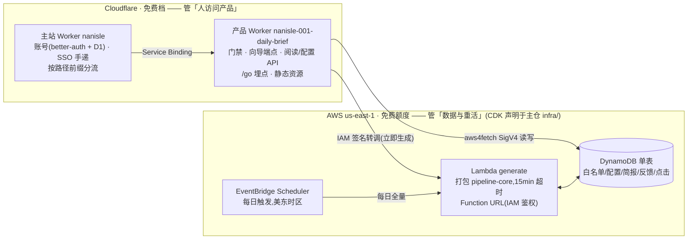
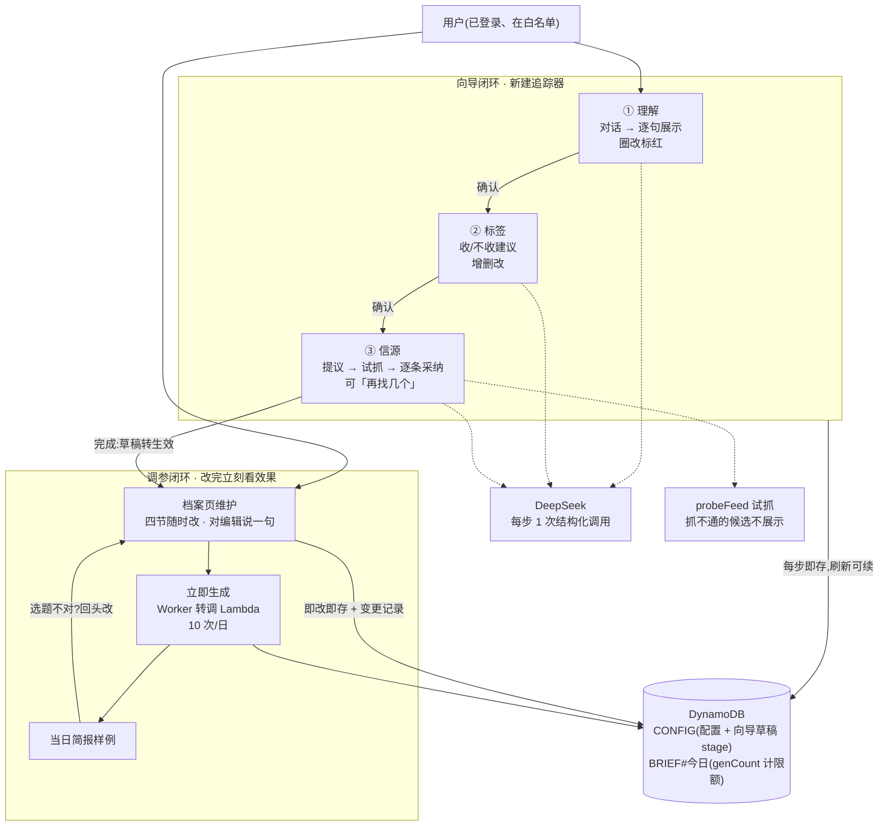
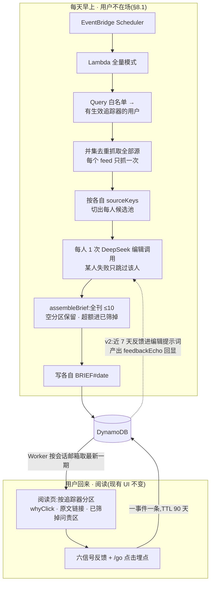
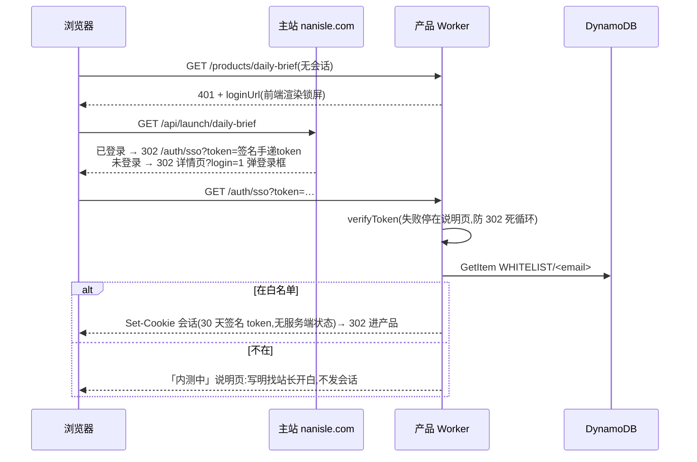
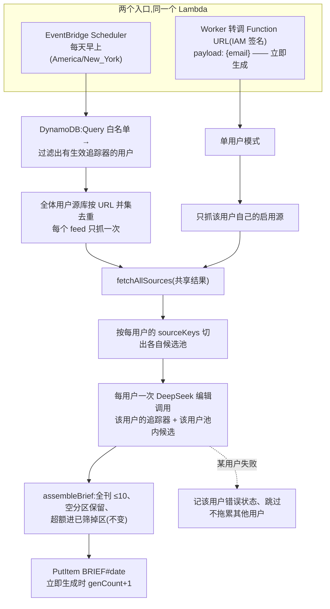

# 001 每日简报 — 技术方案(多用户内测版)

> 状态:2026-08-16 按用户拍板的目标架构写成,**待评审**。现状代码是单用户版(产品仓 HEAD `718ad26` + 工作区未提交的追踪器改版);本文描述目标架构,并在 §9 给出从现状到目标的迁移计划。
>
> 2026-08-16 三项拍板(用户):①AI key 先直连,**开放注册再走网关**;②存储与生成**迁到 AWS**(DynamoDB + Lambda + EventBridge Scheduler,用免费额度,省掉 Workers Paid)——服务层留在 Cloudflare 的边界与理由见 §3;③DeepSeek 的 model id 接入时按控制台实际值填。
>
> 读者假设:一位没参与过之前讨论的工程师。看得懂 TypeScript,但不知道这个产品的历史决策。
>
> 与 [01-产品方案.md](01-产品方案.md) 的关系:01 是产品侧的调研与形态论证,其 2026-08-16 修订节(决策 7–10)拍板了多用户内测、分步向导、立即生成回路和 DeepSeek 引擎。本文只讲这些怎么落成系统、为什么这么落。

## TL;DR

多用户内测版的每日简报,跨两朵云但边界清晰:**Cloudflare 管「人访问产品」,AWS 管「数据和重活」**。朋友用南屿账号登录,邮箱白名单准入;每人一套追踪器配置、一份每日简报,数据存 **DynamoDB**;每日生成跑在 **Lambda** 上,由 **EventBridge Scheduler** 按美东时区定时触发,立即生成也由 Worker 转调同一个 Lambda——三者都在 AWS 永久免费额度内,Cloudflare 停留在免费档,月固定成本 $0,只付 DeepSeek API 费。AWS 资源全部用 CDK 声明,收进主仓 `infra/`(那里本来就是给 CDK 预留的位置)。

AI 全链路用 **DeepSeek V4 Pro**(OpenAI 兼容 API,key 直连,开放注册前再上网关——已拍板);配置新建走**三步向导**——理解、标签、信源,每步一次结构化 LLM 调用、用户确认才前进,现有的 agent 工具循环整个退役。

贯穿全系统的硬约束不变:**反捏造**——模型只能返回候选 id 和从抓取正文派生的文字,永远不产出 URL;它提议的信息源必须先被真实抓通才允许出现在用户面前。

主要代价:两朵云意味着两套凭证、两条部署管线、两处日志(排查生成问题去 CloudWatch,排查访问问题去 Cloudflare)——这是持续付出的认知成本,不是一次性的;以及 DeepSeek 的编辑质量未经验证,拍板是「先跑再说」,触发线写在 01 决策 10。

## 1. 从现状到目标:漂移清单

现状代码已经建成了一个完整可用的**单用户**版。本方案不是推倒重来,而是在保留大部分结构的前提下换掉三块:身份与存储、AI 供应商、配置新建流程,并把生成搬出 Worker。

| 维度 | 现状(已建成) | 目标(本方案) |
|---|---|---|
| 身份 | 站长访问码为主,SSO 会话只能读 | 登录必须;邮箱白名单准入;一切数据按用户隔离 |
| 存储 | 一个 KV namespace,全局键(`config:*`、`brief:*`) | DynamoDB 单表;KV 降级为本地开发 / fork 模式的替身(§4.3) |
| 生成 | Worker 里跑,站长手动触发,受子请求限额压着 | Lambda 里跑(无子请求限额、15 分钟超时);EventBridge Scheduler 每日定时 + Worker 转调的立即生成 |
| AI | `@anthropic-ai/sdk`,mock / anthropic / gateway 三模式 | 加 `deepseek` 模式(OpenAI 兼容)并设为默认;接缝保留,换模是配置变更 |
| 配置新建 | 一次起草整份定义 + agent 工具循环(5 个工具、NDJSON 流) | 三步向导,每步一次结构化调用,无工具循环 |
| infra | 全部内嵌在 wrangler.jsonc 注释里 | AWS 资源用 CDK 收进主仓 `infra/`;wrangler.jsonc 只剩 Worker + 静态资源声明 |

**保留不动的**(这些是已验证的结构,别碰):`pipeline-core.ts` 的抓取 → 规则过滤 → 编辑 → 组装管线(它本来就是运行时无关的——全局 fetch、零 Node API,正好原样进 Lambda);反捏造结构(§8.5);追踪定义档案 UI(四节信任链、红标圈改、变更记录、逐来源审阅);来源库;六信号反馈与 `/go` 点击埋点;主站 Service Binding 挂载与本地 3000→5199 开发代理(§2.4)。

## 2. 系统全景:一张部署图,两条时间轴

系统的活分布在两条完全不同的时间轴上:**配置时**(用户在场,分钟级交互)和**运行时**(用户不在场的每日生成,以及用户回来之后的阅读)。一张图挤不下这两件事,拆开画:先看东西部署在哪,再分别看两条时间轴上各自发生什么。

### 2.1 部署边界:谁在哪朵云



外部依赖三样,两边按分工各自碰:RSS/Atom 源(Worker 只在试抓候选时碰,Lambda 在生成时碰)、DeepSeek API(Worker 发向导调用,Lambda 发编辑调用)、HN Algolia(只有 Lambda 碰)。

### 2.2 配置时:用户在场,两个闭环

配置时只有两个闭环:**向导闭环**(新建追踪器,三步逐级确认,§7)和**调参闭环**(改定义 → 立即生成 → 看样例 → 再改,§8.2)。所有写入的终点都是 DynamoDB 里这个用户自己的条目:



### 2.3 运行时:用户不在场的生成,和回来之后的阅读



配置时与运行时唯一的接口就是 DynamoDB 里的配置条目:向导和档案页写进去的定义,第二天早上被 Lambda 原样读出来喂给编辑调用——中间没有任何别的通道,所以「系统按谁的话在跑」永远可以从这一份数据里对账。

### 2.4 挂载与本地开发(不变,为完整性重述)

产品长在 `nanisle.com/products/daily-brief/` 下,代码和部署留在公开仓。主站 Worker 在 [custom-worker.ts](../../../../web/custom-worker.ts) 里把 `/products/daily-brief/{assets,auth,api,brief,config,go}` 前缀的请求经 Service Binding(Cloudflare 的 Worker 间直连,不走公网)转给产品 Worker;产品侧用 `unmountRequest` 削掉前缀再进 Hono 路由。三处必须一致:主站的 `DAILY_BRIEF_ROUTES`、产品 `wrangler.jsonc` 的 `run_worker_first`、产品 `vite.config.ts` 的 `base`。本地没有 Service Binding,`next.config.ts` 用 dev rewrite 复刻同一层代理,产品 Vite 固定 5199 端口(`strictPort`)。

## 3. 两朵云的边界:为什么不全迁 AWS

用户的诉求是「都迁移到 AWS」,动机是 EventBridge Scheduler 等免费额度够用。诉求里真正要的两样东西——**用 AWS 免费额度承担重活、省掉 Workers Paid**——混合架构都给到了;但「全迁」有一个具体卡点,把服务层也搬走会付出远超收益的代价:

**卡点:产品必须是 CF Worker 才能长在 nanisle.com 下。** 挂载机制是主站 Worker 经 Service Binding 转发(§2.4),Service Binding 只能指向同账号的另一个 Worker。若产品服务层搬去 AWS,主站就得改成公网反向代理到 Lambda/API Gateway(每次页面访问多一跳跨云往返),静态资源要挪 S3 + CloudFront,SSO 手递、本地开发代理、`npm run deploy` 的部署约定全部重做——而被替换掉的 Worker 服务层在免费档上运行,本来就一分钱不花。**全迁省不下钱,只换来一堆重做。**

所以边界这样切,判据是「这个活受不受 Worker 免费档的限制」:

| 活 | 放哪 | 为什么 |
|---|---|---|
| 页面服务、门禁、配置读写、`/go` 埋点 | CF Worker(免费档) | 每请求就是几次 DynamoDB 点查 + 转发,轻;且必须在 CF 才有挂载 |
| 向导三端点(每步 1 次 LLM 调用、≤6 个候选试抓) | CF Worker(免费档) | 单请求子请求 ≈ 30,免费档 50 以内(§8.4);搬走反而多一跳 |
| **每日定时生成**(抓几十个 feed + N 次 LLM 调用,分钟级) | **Lambda** | Worker 免费档 50 子请求/请求必爆、CPU 限额紧;Lambda 无子请求概念、15 分钟超时、内存可调 |
| **立即生成**(单用户版的同一件重活) | **Lambda**(Worker 转调) | 同上;Worker 只花 1 个子请求等结果,生成代码只维护一份 |
| 定时触发 | EventBridge Scheduler | 原生支持 `America/New_York` 时区(CF cron 只认 UTC,冬夏令时会漂);免费额度每月千万次级,一天一次≈白送 |
| 用户数据 | DynamoDB | 和计算重的一侧放同云(Lambda 原生 SDK 直连);反馈/点击用原生 TTL 自动过期,省掉清理任务;永久免费额度 25GB + 25 读写容量,朋友规模用不完 |

代价要诚实列出:

1. **两套凭证与两条部署管线。** Worker 侧 `npm run deploy`(不变),AWS 侧 `cdk deploy`(主仓 infra/)。Worker 访问 AWS 用一个最小权限 IAM 用户的 access key,以 Worker secret 存放——长期凭证,轮换 runbook 放 infra/。
2. **两处日志。** 生成问题查 CloudWatch,访问问题查 Cloudflare observability。排障前先问「是哪一朵云的活」。
3. **Worker 读 DynamoDB 要自己签名。** Workers 运行时没有 AWS SDK 的原生环境,用 `aws4fetch`(SigV4 签名的轻量库)直调 DynamoDB HTTP API;每次点查多约 50–100ms 跨云延迟(用户在美东,库在 us-east-1,可接受)。

### 3.1 infra 代码放哪(用户要求:收进 infra 文件夹)

这次 AWS 入场后,主仓 `infra/` 从占位变成真的 CDK app——它的 README 本来就写着「以后用到 AWS 资源时,CDK app 放这里」,正好兑现:

| 位置 | 放什么 |
|---|---|
| 主仓 `infra/`(CDK app) | ①DynamoDB 表(含 TTL 配置);②Lambda generate(NodejsFunction,esbuild 打包产品仓的 pipeline-core 与生成入口)+ Function URL(IAM 鉴权);③EventBridge Scheduler 每日计划(美东时区);④最小权限 IAM 用户(只许这张表的读写 + 调这个 Function URL)与密钥轮换 runbook;⑤白名单管理脚本(`whitelist-add.ps1`,包一层 DynamoDB PutItem);⑥每周 DynamoDB 导出冷备脚本 |
| 产品仓 `wrangler.jsonc` | 只剩 Worker + 静态资源 + 本地开发用的 KV 声明——wrangler 要求声明跟着部署单元走,拆不走 |

一个结构性提醒:Lambda 的代码在产品仓(公开)、CDK 声明在主仓(私有),`cdk deploy` 需要能读到产品仓路径。两仓已经是同一工作区的兄弟目录(`nanisle/nanisle-product`),CDK 里用相对路径引即可;CI 化部署时再考虑产物发布,内测阶段人肉 `cdk deploy` 够用。

### 3.2 成本

| 项 | 额度 | 本产品用量(20 个内测用户) |
|---|---|---|
| Lambda | 永久免费 100 万次调用 + 40 万 GB-秒/月 | 每天 1 次定时(~10 分钟 × 512MB ≈ 300 GB-秒)+ 立即生成若干次 → 月 ~1 万 GB-秒,零头 |
| EventBridge Scheduler | 免费额度每月 1400 万次 | 每天 1 次 |
| DynamoDB | 永久免费 25GB + 25 读/写容量单位(预置模式) | 简报每天 20 行 × 几十 KB,预置 5/5 都用不满 |
| Cloudflare | 免费档 | 服务层全部在限额内(§8.4) |
| **月固定成本** | | **$0**;变动成本只有 DeepSeek API(§8.4 末) |

## 4. 数据模型(DynamoDB 单表)

一张表,`PK`(分区键)+ `SK`(排序键),所有访问模式都是主键点查或前缀 Query——这正是 DynamoDB 免费档最舒服的用法:

| 条目 | PK | SK | 属性 | 说明 |
|---|---|---|---|---|
| 白名单 | `WHITELIST` | `<email>` | note, addedAt | Query PK=WHITELIST 即 Cron 的用户清单——一份数据两用 |
| 用户配置 | `USER#<email>` | `CONFIG` | trackers(JSON), sources(JSON), updatedAt | 整存整取 |
| 每日简报 | `USER#<email>` | `BRIEF#<YYYY-MM-DD>` | brief(JSON), generatedAt, genCount | 重复生成覆盖;genCount 承载立即生成限额 |
| 反馈事件 | `USER#<email>` | `FB#<ISO时间>#<uuid>` | kind, itemId, date, text, **ttl** | 一事件一条,TTL 90 天自动过期 |
| 点击事件 | `USER#<email>` | `CLICK#<ISO时间>#<uuid>` | itemId, date, **ttl** | 同上;未登录点击记在 `USER#anonymous` 下 |

几个值得解释的取舍:

**为什么单表而不是五张表。** 访问模式全部已知且都带用户前缀(取某人配置、取某人最新简报、按人收反馈),单表用 `PK=USER#email` 天然把一个用户的所有数据放进同一分区;CDK 里也只有一个资源要声明、一个 IAM ARN 要授权。多表在这里只是把同样的键结构抄五遍。

**「最新一期」怎么取。** Query `PK=USER#email, SK begins_with BRIEF#`,倒序取 1 条——日期字符串按字典序即时间序,这就是把日期编进 SK 的原因。单用户版里 `brief:latest` 指针键(以及「回灌旧日期不许把 latest 往回拨」的补丁逻辑)整个消失。

**追踪器仍整存整取。** UI 的语义就是「整份列表 PUT 上来」(即改即存,顺序也是数据),没有跨追踪器的查询需求。`Tracker` 的 TypeScript 形状([pipeline-core.ts:79](../src/shared/pipeline-core.ts))保持现状,新增可选字段 `stage?: "understanding" | "tags" | "sources"`——有 stage 的是向导草稿,刷新可续;没有的是生效追踪器。**尺寸红线**:DynamoDB 单条目上限 400KB。配置(≤12 追踪器 + ≤30 源)几十 KB,简报含「已筛掉」100 条上限也在几十 KB 量级,都够;`filteredOut.items` 的 100 条截断([pipeline-core.ts:592](../src/shared/pipeline-core.ts))从「省流量」升格为「保尺寸」的硬约束,不许放开。

**源库按用户各存一份。** 逐来源审阅、局部规则、拒绝名单都是个人决策,共享全局池会让 A 的「删掉 36Kr」影响 B。Cron 抓取量随用户数涨的问题用按 URL 并集去重解决(§8.1)。

**新用户首次进入**:`CONFIG` 条目不存在时现场种一条——只有 `DEFAULT_SOURCES` 副本,`trackers: []`。追踪器不预置:空列表让配置页直接落在向导第一步(`Config.tsx` 见 `list.length === 0` 分支),第一份定义由用户口述、编辑起草。源库照种,因为它是向导第三步找候选和首期生成的底料。种子逻辑在读路径上做(读不到就种),不挂在登录回调上,fork 者本地零配置也能自然触发;CLI(`pipeline/generate.ts`)另有 `DEMO_TRACKERS` 兜底,只为无账号的本地跑通。

### 4.3 存储接缝:DynamoDB 是生产实现,KV 是 fork 替身

公开仓有一条硬规矩:fork 者零配置 `npm run dev` 必须能跑通全流程。AWS 凭证不能成为 fork 的前置条件,所以存储要留一个接缝(和 AI 接缝同一个思路):

```ts
/** 全部访问模式收在一个窄接口里,两个实现。 */
interface Store {
  isWhitelisted(email: string): Promise<boolean>;
  listWhitelist(): Promise<string[]>;
  getConfig(email: string): Promise<UserConfig | null>;
  putConfig(email: string, config: UserConfig): Promise<void>;
  getBrief(email: string, date?: string): Promise<StoredBrief | null>; // 无 date = 最新一期
  putBrief(email: string, brief: Brief, bumpGenCount: boolean): Promise<number>; // 返回今日次数
  appendEvent(email: string, ev: FeedbackEvent | ClickEvent): Promise<void>;
}
```

| 实现 | 选择条件 | 说明 |
|---|---|---|
| DynamoDB(aws4fetch) | 配了 `AWS_ACCESS_KEY_ID` 等 secret | 生产 |
| KV(现有 namespace) | 未配 AWS 凭证 | 本地 dev / fork,单用户 `dev@local`,键加用户前缀;miniflare 本地持久化,开发体验不降级 |

代价是同一套键语义写两遍。接口刻意收窄到七个方法、全部点查,两个实现各 ~100 行,可接受;换来的是 fork 故事完整保留、以及万一将来要撤离 AWS 时有现成的退路。

**KV 里现存的单用户数据不迁移**:只有站长一人,手工在新系统重录。

## 5. 身份、白名单与门禁改造

### 5.1 登录与准入



主站的 launch 路由**不改**:它只负责「已登录就手递」,准入判断全部在产品侧——两边都判会有两份名单要同步,迟早漂移。白名单在 `/auth/sso` 查一次之外,每个 API 的门禁**再查一次**(被移出名单的人,30 天会话没过期时也要立即失效)。一次 DynamoDB 点查,成本可忽略。

### 5.2 门禁从三道改成两道

现状的三道门是单用户世界的产物(读者/站长两种人、访问码两种用途),多用户下重排:

| 现状 | 目标 | 守什么 |
|---|---|---|
| `accessGuard`(会话**或**访问码) | **userGuard**:有效会话 + 邮箱在白名单。会话与 AWS 凭证都未配置时(本地 dev / fork)回落为单一 `dev@local` 用户——零配置规矩保留 | 简报读写、反馈、自己的配置、向导、立即生成 |
| `ownerGuard`(访问码守配置) | **退役**。配置是用户自己的,userGuard 天然隔离(所有存取都以会话邮箱为键) | — |
| `aiGuard`(访问码 + 总闸) | userGuard + `AI_DISABLED` 总闸 + 每用户限额(§8.3) | 向导三端点、立即生成 |
| (新增) | **adminGuard**:站长访问码(`x-access-code`) | 手动触发全量生成;白名单增删走 infra/ 脚本,不开 API |
| ingest 的 `x-ingest-token` | **退役**。生成侧(Lambda)直写 DynamoDB,不再有「外部管线 POST 回 Worker」这条路;CLI `pipeline/generate.ts` 的角色由 Lambda 入口取代,保留为本地调试脚本(只写文件) | — |

`/go/:date/:id` 跳转端点维持无门禁(普通 `<a>` 带不了请求头),但同站导航自动带会话 cookie——有就把 email 记进点击事件,没有记 anonymous。它只暴露本来就公开的 URL,风险面不变。

### 5.3 页眉:产品套在主站的外壳里

产品挂在 `nanisle.com/products/daily-brief` 下,和主站同源,但两边前端是两个独立应用。第一版只有报头,没有字标、导航和账号——从主站点进来像换了个网站,「我是谁」也一起丢了。现在产品的每个状态(读、配置、锁屏、报错)都套在同一副页眉下(`src/react-app/SiteChrome.tsx`),样式从主站 `web/app/globals.css` 的页眉/按钮/用户菜单三节照搬,只把 `--color-*` 换成本产品的同值 token。

身份两级取,先保可用再求好看:

| 来源 | 取到什么 | 什么时候用 |
|---|---|---|
| 产品 `/api/health` | 会话邮箱、主站地址、登录闸口 | 总是。产品自己的会话说了算,独立部署与本地 dev(`dev@local`)也有 |
| 主站 `/api/auth/get-session`(同源 better-auth) | 名字、头像 | 补充。拿不到就只显示邮箱,页眉照常可用 |

主站地址由 Worker 回(`siteUrl()`:`NANISLE_URL` 优先,否则取 `APP_URL` 的 origin),不写死在前端——写死的话本地 dev 点导航会跳去线上站。

退出登录要退两份会话:主站的 better-auth(前端同源 `POST /api/auth/sign-out`)和产品自己的会话 cookie(`GET /auth/logout`,清完 302 回主站)。只退一边的结果是「回主站还是登录态」或者「产品里还能接着读」,两种都比不退更让人困惑。

## 6. AI 层:DeepSeek V4 Pro 直连

### 6.1 接缝改造

所有 AI 调用继续收在 [ai.ts](../src/worker/ai.ts) 一个接缝里(Worker 和 Lambda 共用,和 pipeline-core 一样保持运行时无关),`AI_PROVIDER` 增加第四个值:

| 模式 | 用途 | 变化 |
|---|---|---|
| `deepseek`(**新默认**) | 全链路生产 | 新增:OpenAI 兼容 `/chat/completions`(base URL `https://api.deepseek.com`),普通 fetch 即可,不引第二个 SDK;JSON 输出用 `response_format: {type:"json_object"}` 强制 |
| `mock` | 零配置演示、fork 首跑 | 不变 |
| `anthropic` / `gateway` | 换模对照的退路 | 不变,但 `@anthropic-ai/sdk` 的工具循环用法随 chat.ts 一起退役,SDK 仅剩单轮补全 |

两个待接入时落实的细节:①「DeepSeek V4 Pro」的 API model id 以 DeepSeek 控制台实际值为准,填进 `AI_MODEL`,文档和代码里不硬编码猜测的名字(已拍板);②若其 JSON mode 不稳,退路是提示词约束 + 宽容解析——现有 `parseEditorialJson` 已经带「剥 markdown 围栏、只认已知 key、按配额截断」的护栏,直接复用。

### 6.2 key 直连(已拍板:开放注册再走网关)

主仓 `backend/README.md` 原计划托管产品不持有任何 AI 凭证、一律走网关(LiteLLM 等做虚拟 key、预算、限速)——那是为**匿名公开 demo** 设计的防刷层。2026-08-16 拍板:内测期用 `DEEPSEEK_API_KEY` 直连(Worker 与 Lambda 各配一份 secret)。成立的前提是白名单把匿名流量整个挡在登录外,威胁模型从「任何人刷 token」降到「朋友把额度用超」,后者用每用户每日限额 + `AI_DISABLED` 总闸 + DeepSeek 控制台的用量告警覆盖。**开放注册是回到网关的触发点**,届时产品侧只需把 provider 换回 `gateway`,一行配置。

### 6.3 每步一次结构化调用,不再有工具循环

现状的配置 AI 是一个最多 6 轮的 agent 工具循环(模型自己决定调 `set_trackers` 还是 `preview_sources`,NDJSON 流式回放)。分步向导把控制权从模型手里拿回来:**每一步要产出什么是确定的,一步 = 一次「输入明确、输出 JSON」的调用**,用户确认才有下一步。

收益逐条:提示词短而专(每步只描述一件事);失败可单步重试(不用重放整轮对话);对模型能力的要求从「多轮工具调度」降到「按 schema 吐 JSON」——换供应商时这是最不挑模型的形态;子请求预算固定可算(§8.4)。代价:编辑不能自由组合动作,比如一句话同时改理解和找源——档案页的「对编辑说一句」保留为一次单独的结构化调用(输入这句话 + 当前定义,输出更新后的定义 JSON),覆盖这种日常小改。

## 7. 配置向导

### 7.1 三个端点

| 步骤 | 端点 | 输入 | LLM 产出(JSON) | 服务端后处理 | 用户动作 |
|---|---|---|---|---|---|
| 1 理解 | `POST /api/wizard/understand` | 本次向导的全部对话往返(用户原话) | `name` 建议 + `intentSegments[]` | 存草稿 tracker(`stage:"understanding"`) | 逐句圈改(红标)/ 继续对话 / 确认 |
| 2 标签 | `POST /api/wizard/tags` | 确认后的理解(含用户改过的句子) | `include[]` / `exclude[]` 建议 | 存草稿(`stage:"tags"`) | 增删改 / 确认 |
| 3 信源 | `POST /api/wizard/sources` | 问题 + 理解 + 标签 + 已拒绝与已采纳的 URL | 候选源 `{name,url,category,reason}[]` ≤6,其中至少 2 个可构造的查询源(§7.3) | **probeFeed 逐个实抓**,只回传抓通的(附最近三条真实标题);存活 <3 自动带失败清单补提议一轮;`stage:"sources"` | 逐条加入 / 不要 / 再找几个 / 完成 |

「再找几个」= 重调步骤 3,请求里带上 `rejectedSourceUrls` 和已采纳 URL,提示词禁止重复提议。「完成」把 `stage` 字段删掉,追踪器生效,落回档案页维护。草稿存在用户 `CONFIG` 条目里,刷新、关页、换设备都能续上。

```mermaid
sequenceDiagram
    participant U as 用户
    participant C as 向导前端
    participant W as Worker
    participant M as DeepSeek
    participant F as probeFeed
    participant DB as DynamoDB

    U->>C: 「找中国有、美国没有的 SaaS 机会」
    C->>W: /wizard/understand(对话历史)
    W->>M: 一次调用:产出 name + intentSegments(JSON)
    W->>DB: 存草稿 stage=understanding
    W-->>C: 逐句展示;用户圈改的句子标红(edited:true)
    U->>C: 确认理解
    C->>W: /wizard/tags(确认后的理解)
    W->>M: 一次调用:产出 include/exclude(JSON)
    W->>DB: 存草稿 stage=tags
    U->>C: 修剪标签,确认
    C->>W: /wizard/sources(问题+理解+标签)
    W->>M: 一次调用:提议 ≤6 个候选 feed(JSON)
    loop 每个候选
        W->>F: 真实试抓(失败则 feed 自动发现,≤4 次抓取)
        F-->>W: ok/失败 + 最近三条标题
    end
    W->>DB: 存草稿 stage=sources
    W-->>C: 只展示抓通的候选卡
    U->>C: 逐条 加入/不要;「再找几个」重调本步
    U->>C: 完成 → stage 删除,tracker 生效
```

### 7.2 理解步骤防「越聊越漂」

多轮对话时,每轮都基于**全部原话重新产出完整理解**,不做增量 patch——增量 patch 几轮后会累积出没人说过的东西。但用户已红标圈改的句子要在提示词里锁定原样保留(「以下句子用户已亲手改过,逐字保留,不许改写」),否则重生成会把用户的手改冲掉。兜底不信任模型的自觉:重生成返回后,服务端把旧草稿里 `edited:true` 的句子**按位置强制覆盖**回去。

### 7.3 信源发现:怎么保证找得到用户要的源

先把话说死:「保证 DeepSeek 知道用户想要的那个网站」做不到——模型的站点知识是训练时的快照,会过时、会记错,它也没有实时搜索能力。工程上的做法是**不把宝押在模型的记忆上**:把「找源」拆成翻译题(把意图变成检索式)+ 选择题(从已验证目录里挑)+ 验证题(提了就试抓),四层递进,第一层就是保底:

| 层 | 机制 | 保证什么 |
|---|---|---|
| 1 · 可构造的查询源(**保底**) | 有一类 feed 不需要「知道网站」,按模板填关键词就能构造出来且必然抓得通:Google News RSS 检索(`news.google.com/rss/search?q=…`,中英文各有参数)、hnrss 关键词(`hnrss.org/newest?q=…&points=50`)、Reddit 子版(`/r/<sub>/top/.rss?t=week`)、arXiv 分类。模型在这层的任务是把「编辑的理解」**翻译成好检索式**(同义词、布尔组合、中英双查)——这是语言任务,是 LLM 的强项,不是记忆任务。提示词硬性要求:每次提议至少 2 个查询源 | 任何主题、再冷门,用户都至少拿到能跑的源,追踪器不会空转 |
| 2 · 仓内精选目录 | repo 维护一份人工验证过的 feed 目录(`catalog.yaml`,由 DEFAULT_SOURCES 扩展到一两百条,按主题/语言/类型打标),整份进找源提示词,模型**优先从目录里挑** | 从目录里挑不存在编造;高质量老牌源确定性命中 |
| 3 · 模型自身的站点知识 | 模型记得的具体站点(某人博客、某公司 releases.atom)照样可以提,probeFeed 抓不通就不展示 | 错误记忆对用户不可见,代价只是一次试抓 |
| 4 · 查询源反哺具体源(观察式发现,v1 之后) | 查询源噪音大,但它是免费的侦察兵:追踪器跑几天后,统计查询源命中条目的**域名分布**,反复出现的域名自动跑一遍 feed 发现(probeFeed 本就支持从主页发现 feed),生成升级建议卡:「36Kr 在你的检索结果里出现了 7 次,直接订阅它?」 | 模型不知道、目录没收录的长尾站点,从用户自己的检索结果里长出来——不需要任何搜索 API |

配套两个机制:

- **服务端自动补足**:一轮提议试抓后存活不足 3 个时,带着失败清单自动重调一次模型(仅一次,防循环);仍不足就如实展示「只找到 N 个」,不凑数。
- **仪表**:三个数判断这套机制是否够用——候选源采纳率(点「加入」/展示数)、每追踪器无命中天数、**入选内容里查询源 vs 具体源的占比**。最后一个是新加的:长期全靠查询源撑,说明第 2/3/4 层没起作用,该修目录或提前做第 4 层。*(已实现:`GET /api/metrics`,来源库页底部展示;采纳率累计在 `UserConfig.metrics`,后两个数从近 14 期简报现算,见 03 清单 P0-1。)*

再往上才是搜索 API(tavily/Brave)——立项条件:四层跑起来之后,采纳率持续低或无命中天数持续高。它解决的是这套机制真正够不着的部分:模型不知道、目录没收录、用户检索结果里也从没出现过的站点。

mock 模式下向导照走但不联网:步骤 1 用现有 `skeletonDraft` 思路本地搭骨架,步骤 2/3 给空建议并明说「AI 未接入」——fork 者零配置仍能看全交互形态。

## 8. 生成:每用户一份,跑在 Lambda 上

### 8.1 管线怎么改

抓取 → 过滤 → 编辑 → 组装的核心(`pipeline-core.ts`)不动——它零 Node 依赖、全局 fetch,原样打进 Lambda。变的是外层编排:



关键点:

- **编辑调用维持每用户单次**。单用户版「单次调用」的理由(候选一屏装得下、拆分无质量收益)在每个用户内部照旧成立;用户之间必须隔离调用,因为追踪器定义和源池都是私人的。
- **失败隔离**。定时运行中某个用户的 feed 全挂或 LLM 调用失败,记进该用户当天的错误状态(阅读页「今日未更新」横幅、26 小时判定逻辑不变),继续跑下一个用户。
- **HN 讨论区查询**保留(Lambda 没有子请求限额,单用户版在 Worker 里做的 `lookupDiscussions` 开关不再是预算问题,只影响时长——每用户 ≤10 次、8 秒超时,可接受)。
- **立即生成与定时生成是同一份代码**:Lambda 收 `{email}` 就走单用户模式。生成逻辑只维护一份,这是把立即生成也搬进 Lambda 的主要理由——否则 Worker 里还得留一份受子请求限额挤压的旁支。

### 8.2 立即生成 = 调参回路

`POST /api/generate`(userGuard)→ Worker 用 aws4fetch 签名转调 Lambda Function URL(带 `{email: 会话邮箱}`)→ 同步等结果(30–60 秒,Worker 等待子请求的时间不计 CPU)→ 返回新一期。这是 01 决策 9 的调参回路:改定义 → 立即生成 → 看样例,分钟级闭环。Function URL 用 IAM 鉴权(`AWS_IAM`),只有持有产品 IAM key 的 Worker 能调,公网扫不到裸端点。

### 8.3 限额

| 项 | 值 | 执行点 |
|---|---|---|
| 立即生成 | 10 次 / 人 / 日 | `BRIEF#date` 条目的 `genCount`(UpdateItem 原子自增),超了返回明确报错(带「明早定时生成照常」的文案) |
| 向导 LLM 调用 | 60 次 / 人 / 日 | 粗粒度日计数,防失控脚本不是防正常人 |
| 全局总闸 | `AI_DISABLED=1` → 所有 AI 端点 503 | Worker 与 Lambda 各自读同名环境变量,事故止血 |
| 追踪器 / 源 | ≤12 个 / 人、≤30 源 / 人 | 现有 `cleanTrackers` / `cleanSources` 上限逻辑,按用户执行 |

### 8.4 预算实算

**Lambda(定时,20 个内测用户)**:抓 feed 并集去重 ~60–120 次、DeepSeek 编辑 20 次、HN 查询 ≤200 次、DynamoDB 读写 ~100 次——没有子请求限额,只关心墙钟:抓取并发 1–2 分钟 + 20 次顺序编辑调用(每次 10–30 秒)≈ 5–12 分钟,15 分钟超时内。**用户到 ~50 人时此路要改**(编辑调用改小并发,或 Scheduler 拆多个批次),内测阶段不做,写在这里当刻度线。

**Worker(免费档,每请求 50 子请求、10ms CPU)**:

| 端点 | 子请求 | 说明 |
|---|---|---|
| 阅读页 API / 配置读写 | 2–4 | DynamoDB 点查 + 白名单校验 |
| 向导 understand / tags | ~4 | 1 次 LLM + DynamoDB |
| 向导 sources | ~30 | 1 次 LLM + 6 候选 × ≤4 次试抓 + DynamoDB |
| 立即生成 | ~4 | 1 次 Lambda 转调 + DynamoDB |

全部在 50 以内。CPU 限额的风险点只有 probeFeed 的 XML 解析(fast-xml-parser 解一个大 feed 可能到毫秒级),现单用户版已在免费档跑着同样的解析,实证可行;若上线后撞线,把试抓也挪进 Lambda 是现成退路。

**成本**:每次编辑调用输入大头是候选 excerpt(16 源 × ≤10 条 × 800 字符 ≈ 3–6 万 token),按 DeepSeek 的价位单次几分钱人民币;20 人每天一次 + 立即生成余量,月成本百元人民币以内,上线首周用真实账单校准。AWS 侧 $0(§3.2)。

### 8.5 反捏造(不变,为完整性重述)

| 环节 | 模型能返回什么 | 谁决定最终 URL |
|---|---|---|
| 编辑选材 | 候选 `id` + 从 excerpt 派生的 whyClick/caveat/relatesTo | `byId.get(id)` 回查候选池,查不到就丢弃 |
| 拓展阅读 | 只能引用候选列表内的其它 id | 同上,越界不渲染 |
| 讨论区链接 | 模型不参与 | HN Algolia 按 URL 精确匹配 |
| 向导候选源 | 一个待验证的 URL 字符串 | probeFeed 抓通了才展示、才可采纳 |

## 9. 实施计划(从现状迁移)

| 阶段 | 内容 | 验证标准 |
|---|---|---|
| 1 · infra 与存储 | 主仓 infra/ 落 CDK app(表、Lambda 骨架、Scheduler、IAM、Function URL);产品仓实现 Store 接缝(DynamoDB + KV 双实现);白名单脚本 | `cdk deploy` 一次成型;`whitelist-add.ps1` 加一条后 GetItem 可查;本地无 AWS 凭证时自动落 KV 单用户模式,`npm run check` 过 |
| 2 · 身份改造 | userGuard/adminGuard;`/auth/sso` 查白名单;配置与简报全部按会话邮箱隔离;首次进入种默认配置;ingest 与旧三道门退役 | 两个真实账号各自配置互不可见;白名单外账号停在「内测中」页;从名单移除的人带着未过期会话也被 API 拒绝 |
| 3 · DeepSeek 接入 | ai.ts 加 `deepseek` provider(fetch 直连,JSON mode);编辑调用与「对编辑说一句」切到 DeepSeek;确认真实 model id | 立即生成产出无 `[mock]` 前缀;人工抽查 10 条 whyClick,无复述、无 excerpt 外事实 |
| 4 · 生成上 Lambda | 生成入口打包进 Lambda(定时全量 + `{email}` 单用户两模式);Worker 的 `/api/generate` 改为转调;genCount 限额;Scheduler 启用;stale 横幅按用户 | 连续三天,两个账号每天早上各自有新一期;限额打满返回明确报错;单个用户源全挂不影响他人;CloudWatch 里能看到每用户的成功/失败行 |
| 5 · 向导 | 三个 wizard 端点 + 前端分步 UI(红标圈改复用 `intentSegments.edited`);草稿 stage 续跑;`catalog.yaml` 首版(人工验证,进找源提示词)+ 查询源保底配比与自动补足(§7.3);工具循环退役(删 chat.ts 与死文件 Chat.tsx) | 从一句原话到生效追踪器全程不填任何表单;每步刷新后能续;「不要」过的源不再被提议;拿一个冷门主题实测,仍能拿到 ≥2 个可用的查询源候选 |
| 6 · 收尾 | README 重写(现在还停在三分区 + focus.yaml 的旧形态);`.dev.vars.example` 更新(AWS 凭证、DeepSeek key);01/02 文档核对 | README 与实际一致;fork 者零配置 `npm run dev` 走通 mock 全流程 |

顺序理由:infra 与存储接缝是其余一切的地基,且 CDK 一旦成型后面全是增量;身份第二,因为向导和生成的每个端点都要按用户隔离;DeepSeek 先于向导,免得向导的三个调用先写 Anthropic 版再适配一遍;生成上 Lambda 放在向导前,是因为它验证「Worker↔Lambda↔DynamoDB」这条跨云链路,向导只依赖其中最简单的一段。

## 10. 风险与开放问题

1. **最脆弱的假设:DeepSeek V4 Pro 的编辑质量。** 全链路里最难的是编辑选材(读几万 token 候选、按多份私人定义选题、写不复述的 whyClick),这恰是没验证过的一环。拍板是「先用,低了再说」,触发线已定(01 决策 10:5 天验收 + whyClick 抽查 >2/10 不合格就换模对照)。接缝保证换模是一行配置,**别在提示词上无限调优来救模型**。
2. **跨云是持续成本,不是一次性成本。** 每次排障先判断「哪朵云的活」;IAM access key 是长期凭证,存在 Worker secret 里,泄露半径 = 这张表 + 这个 Lambda(权限已收到最小),轮换 runbook 放 infra/,每季度轮一次。如果内测期发现跨云摩擦大于省下的 $5/月,退路是回本方案上一版的全 Cloudflare 形态(D1 + Cron + Workers Paid)——Store 接缝的存在让这个回退只动实现层。
3. **「V4 Pro」的 API 细节未验证。** model id、JSON mode 稳定性、上下文窗口都要接入时实测;JSON 不稳的退路(宽容解析)已备。
4. **DynamoDB 400KB 条目上限是硬红线。** 简报与配置当前尺寸有数量级余量,但「已筛掉」列表和 excerpt 长度的任何放宽都要先过一遍尺寸账;超限的表现是 PutItem 直接报错,生成整期失败,比「内容被截断」更响也更好排查——保持这样,不要为了「兜住」而静默截断。
5. **Lambda 单点批处理。** 定时全量跑在一次调用里,15 分钟超时是天花板(~50 用户);且一次调用中途崩,后面的用户全没有当日简报——失败隔离只隔离「单用户内的错误」,不隔离「整次调用崩溃」。缓解:CloudWatch 告警(调用失败或时长 >12 分钟);用户量逼近刻度线时拆批。
6. **理解步骤的「锁定用户手改」依赖服务端兜底**(§7.2):按位置强制覆盖 `edited:true` 的句子,不信任模型的自觉——这条要有测试。
7. **信源发现的天花板**(§7.3):四层机制保证的是「有源可用」(查询源保底),保证不了「最好的那个源被找到」——模型不知道、目录没收录、用户检索结果里也没出现过的站点,这套机制就是够不着,那是搜索 API 的活。内测两周后看三个仪表数(采纳率、无命中天数、查询源占比),差就立项主动搜索,别继续磨向导交互。另一个隐形维护债:`catalog.yaml` 里的 feed 会陆续死掉,需要一个定期试抓全目录的巡检脚本(放 infra/,季度跑一次即可)。
8. **单向迁移**:KV 旧数据不迁,站长手工重录;若内测前已有第二个真实用户在旧系统上,此方案需加双写过渡(目前没有)。
