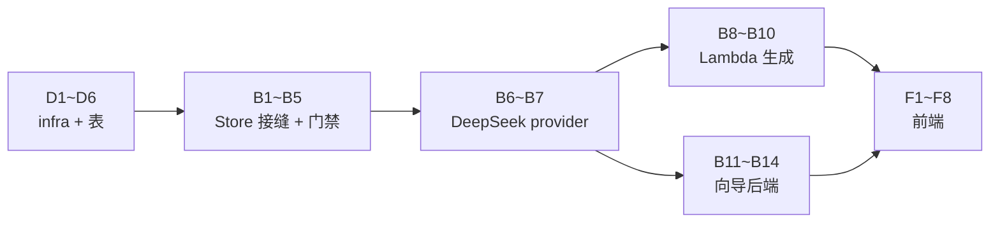

# 001 每日简报 — 实施清单(action items)

> 从 [02-技术方案.md](02-技术方案.md) 拆出的可执行任务清单,按**数据库与 infra / 后端 / 前端**三条线组织。
> 每条带落点文件路径;□ 可勾选。方案层面的「为什么」不在这里重复,括号里的 § 指回 02 的对应节。

## 0. 建议动工顺序(依赖关系)

| 里程碑 | 完成判据(照抄 02 §9) |
|---|---|
| M1 = D 线全部 + B1–B5 | 两个账号配置互不可见;白名单外账号停在「内测中」页;无 AWS 凭证时本地自动落 KV 单用户模式;`npm run check` 过 |
| M2 = B6–B10 | 立即生成产出无 `[mock]`;人工抽查 10 条 whyClick 无复述/编造;连续三天两个账号早上各有新一期 |
| M3 = B11–B14 + F 线 | 一句原话 → 生效追踪器全程零表单;每步刷新可续;冷门主题也能拿到 ≥2 个查询源候选 |

---

## 1. 数据库与 infra(主仓 `infra/`,除注明外)

- [x] **D1 · CDK app 脚手架**:`infra/` 落 `package.json`、`cdk.json`、`bin/infra.ts`、`lib/daily-brief-stack.ts`;region 固定 `us-east-1`;`cdk bootstrap` 一次
- [x] **D2 · DynamoDB 表**(§4):表名 `nanisle-daily-brief`,`PK`(S)+ `SK`(S),TTL 属性名 `ttl`,预置 5 读/5 写(永久免费档内)。键约定直接抄 02 §4 的表:`WHITELIST/<email>`、`USER#<email>` + `CONFIG` / `BRIEF#<date>` / `FB#<ts>#<uuid>` / `CLICK#<ts>#<uuid>`
- [x] **D3 · Lambda generate**:NodejsFunction,entry 指产品仓 `pipeline/lambda.ts`(B8 新建,相对路径 `../nanisle-product/products/001-daily-brief/...`),timeout 15 min、内存 512MB;**Function URL 开 AWS_IAM 鉴权**;env:`DDB_TABLE`、`AI_PROVIDER=deepseek`、`AI_MODEL`、`DEEPSEEK_API_KEY`、`BRIEF_TZ=America/New_York`
- [x] **D4 · EventBridge Scheduler**:每天 07:00 `America/New_York`(原生时区参数),目标 D3 的 Lambda,payload `{"mode":"all"}`
- [x] **D5 · 最小权限 IAM**:用户 `nanisle-daily-brief-worker`,policy 只含两条——该表的 `GetItem/PutItem/UpdateItem/DeleteItem/Query` + 该 Function URL 的 `lambda:InvokeFunctionUrl`;access key 手动 `aws iam create-access-key` 后 `wrangler secret put`(步骤写进 runbook)
- [x] **D6 · 脚本与 runbook**:`infra/scripts/whitelist-add.ps1`(包一层 PutItem)、`infra/scripts/ddb-export.ps1`(周备份)、`infra/README.md` 更新为密钥清单 runbook(哪个 secret 放哪个 Worker/Lambda、轮换周期)
- [x] **D7 ·(M3 后)目录巡检脚本**:`infra/scripts/catalog-probe.ps1`,全量试抓 `catalog`,报死链(§7.3 风险 7)。2026-08-16 首跑:4 条死链(a16z/36氪/虎嗅/机器之心)已从 catalog.ts 删除,补入实抓验证过的量子位、InfoQ 中文,52 条全通

**Worker 侧 secrets 清单**(D5/D6 的一部分,产品 Worker):`AWS_ACCESS_KEY_ID`、`AWS_SECRET_ACCESS_KEY`、`DEEPSEEK_API_KEY`、`NANISLE_SSO_SECRET`(已有)、`ACCESS_CODE`(降级为 admin 用,已有);vars 加 `DDB_TABLE`、`GENERATE_URL`(D3 的 Function URL)、`AWS_REGION`。同步更新 `.dev.vars.example`。

---

## 2. 后端(产品仓 `src/`,Worker 与 Lambda 共用 shared)

### 存储与身份(→ M1)

- [x] **B1 · Store 接口**:`src/shared/store.ts`——照 02 §4.3 的七方法接口,外加 `listBriefDates(email)`(阅读页日期下拉要用);定义 `UserConfig {trackers, sources, updatedAt}` 类型
- [x] **B2 · DynamoDB 实现**:`src/shared/store-dynamo.ts`,依赖 `aws4fetch`(新增,SigV4 签名直调 DynamoDB HTTP API);**Worker 和 Lambda 共用这一个实现**(fetch-based,两个运行时都能跑);`getBrief` 无 date 时 Query `BRIEF#` 前缀倒序取 1(§4「最新一期」);`putBrief` 用 UpdateItem 原子自增 `genCount`;`appendEvent` 写 ttl = now + 90d
- [x] **B3 · KV 替身实现**:`src/worker/store-kv.ts`,键加 `user:<email>:` 前缀,语义对齐 B1;选择逻辑:配了 AWS 凭证 → dynamo,否则 KV + 固定用户 `dev@local`(§4.3)
- [x] **B4 · 门禁改造**:`src/worker/guard.ts` 重写为两道(§5.2)——`userGuard`(有效会话 + `store.isWhitelisted`,dev 回落)、`adminGuard`(`x-access-code`);删 `ownerGuard`/`aiGuard`/`accessGuard`;`AI_DISABLED` 总闸并进 userGuard 的 AI 端点变体
- [x] **B5 · SSO 与准入**:`/auth/sso` 验签后查白名单,不在 → 「内测中」说明页不发会话(§5.1);`/api/*` 全部改为从会话邮箱取用户、经 Store 读写;首次读 `CONFIG` 不存在时种 `BUILTIN_TRACKERS` + `DEFAULT_SOURCES` 副本;**退役**:`/api/ingest`、`x-ingest-token`、KV 全局键读写

### AI 与生成(→ M2)

- [x] **B6 · deepseek provider**:`src/worker/ai.ts` 加第四模式(§6.1)——fetch 直调 `https://api.deepseek.com/chat/completions`,`response_format: {type:"json_object"}`,不引新 SDK;`AI_PROVIDER` 默认改 `deepseek`;model id 从 `AI_MODEL` 读,不硬编码
- [x] **B7 · ai.ts 去 Worker 化**:把 ai.ts 挪到 `src/shared/`(Lambda 也要调),入参从 `AppEnv` 改为普通 config 对象;`@anthropic-ai/sdk` 只剩单轮补全路径
- [x] **B8 · Lambda 入口**:`pipeline/lambda.ts`(§8.1)——`{"mode":"all"}` 走全量(Query 白名单 → 过滤有生效追踪器的人 → **并集去重抓取** → 按 `sourceKeys` 切人均候选池 → 每人一次编辑调用,失败记该用户错误状态并继续 → 各写 `BRIEF#date`),`{"email":"…"}` 走单用户(只抓其启用源);复用 pipeline-core 与 B2 的 store;HN 查询保留
- [x] **B9 · 立即生成转调**:`POST /api/generate` 改为 aws4fetch 签名调 `GENERATE_URL` 带 `{email}`,同步等结果(§8.2);调用前查 `genCount ≥ 10` → 明确报错文案(§8.3);dev/fork 无 AWS 时回落为 Worker 内直跑现有生成逻辑(mock)
- [x] **B10 · 旧 CLI 降级**:`pipeline/generate.ts` 删掉 ingest push,只写 `pipeline/out/`,文件头注释改为「本地调试用,生产入口是 lambda.ts」

### 向导(→ M3)

- [x] **B11 · 三个向导端点**:`src/worker/wizard.ts`(§7.1)——`POST /api/wizard/understand | tags | sources`,每个 = 组 prompt → 一次 `complete()` → 校验 JSON → 写草稿 tracker(`stage` 字段,复用 `cleanTrackers` 扩展)→ 返回;understand 的 prompt 锁定 `edited:true` 句子,**返回后服务端按位置强制覆盖**用户手改句(§7.2,必须有测试)
- [x] **B12 · 找源保底与补足**:sources 端点 prompt 硬性要求 ≥2 个可构造查询源(模板清单照抄现 chat.ts 系统提示词里的平台段);candidates 逐个 `probeFeed`,存活 <3 带失败清单自动重调一次(§7.3);「再找几个」同端点,请求带已拒绝 + 已采纳 URL
- [x] **B13 · 精选目录**:`src/shared/catalog.ts`(Worker 运行时读不了文件,用 TS 模块而非 yaml)——首版从 `DEFAULT_SOURCES` 扩到 ~50 条人工验证过的 feed,带主题/语言标签,整份进找源 prompt(§7.3 第 2 层)。⚠️ 首版按知名度挑选,尚未全量试抓验证——上线前跑一遍 D7 巡检
- [x] **B14 · 「对编辑说一句」单次调用**:`POST /api/refine`——输入 tracker key + 一句话,输出更新后的定义 JSON(只许改 intent/include/exclude/sourceRules),替代原工具循环路径(§6.3);**退役**:删 `src/worker/chat.ts`
- [x] **B15 · 类型与校验收尾**:`Tracker` 加 `stage?` 字段(§4);`env.ts` 重写(新 secrets/vars,删 INGEST_TOKEN);`wrangler.jsonc` 删 KV 之外的过时注释、保留 KV 绑定(dev 替身用)

---

## 3. 前端(产品仓 `src/react-app/`)

- [x] **F1 · 向导组件**:新建 `Wizard.tsx`,替换 Config.tsx 里的 `new`/`drafting` 两个 view——三步分屏,步进条;步骤状态从草稿 tracker 的 `stage` 恢复(刷新可续);步骤 1 逐句展示 + 圈改标红(**复用现有 `intentSegments` + `edited:true` 的渲染**,Dossier 里已有);步骤 2 复用 `ChipRow`;步骤 3 候选卡复用 Dossier 的「编辑建议」卡样式,加入/不要/再找几个
- [x] **F2 · editor.ts 改造**:`streamEditor`(NDJSON 流)退役,换成三个普通 fetch helper(`wizardUnderstand/wizardTags/wizardSources`)+ `refine`;调用中的等待态用现有 `caret` 样式即可,不需要流
- [x] **F3 · Config.tsx 收敛**:目录左栏不变;`runEditor`/candidates 状态机里挂到工具循环的部分删掉,「让编辑再找几个」改调 wizardSources(带该 tracker 的拒绝/已有 URL);**删除死文件 `Chat.tsx`**
- [x] **F4 · Dossier 的「对编辑说一句」**:改调 `POST /api/refine`,返回的新定义直接落 `onPatch` + 变更记录一行;mock 分支(本地正则提案)保留
- [x] **F5 · 锁屏简化**:App.tsx 的 locked 态只留「用南屿账号登录」主按钮;访问码输入框删除(访问码已降级为 admin 凭证,不再是阅读凭证);401 带回的 `loginUrl` 逻辑不变
- [x] **F6 · 请求头清理**:`headers()` / `apiHeaders()` 里的 `x-access-code` 从常规请求移除(userGuard 认 cookie);`localStorage` 的 code 存取一并清
- [x] **F7 · 立即生成的限额反馈**:generate 失败分支识别「今日次数已用完”错误,按钮旁展示明确文案(含「明早定时生成照常」);成功路径不变
- [x] **F8 · 内测提示**:被白名单挡下的「内测中」页由服务端渲染(B5),前端只需确保 401/403 两种态文案不串;首次进入(刚种完默认配置)时阅读页仍显示内置示例简报,引导去建第一个追踪器

---

## 4. 开工第一天建议

1. `infra/` 脚手架 + D2 表(半小时内能 `cdk deploy` 出表)——后面一切都靠它
2. B1–B3 Store 接缝(纯代码,不依赖 AWS 部署完成,先对着本地 KV 实现写测试)
3. B6 deepseek provider(独立小块,拿真 key 先在本地 `npm run generate` 验证编辑质量——**这是全方案最脆弱的假设,越早见真章越好**,02 §10.1)
