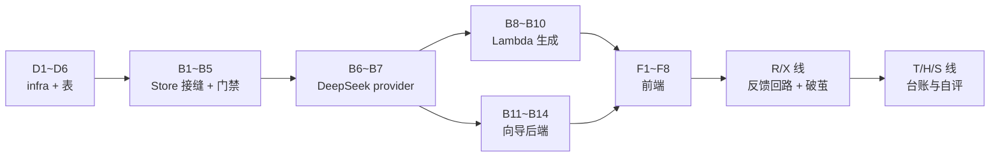

# 001 每日简报 — 实施清单(action items)

> 从 [02-技术方案.md](02-技术方案.md) 拆出的可执行任务清单,按**数据库与 infra / 后端 / 前端**三条线组织。
> 每条带落点文件路径;□ 可勾选。方案层面的「为什么」不在这里重复,括号里的 § 指回 02 的对应节。

## 0. 建议动工顺序(依赖关系)

| 里程碑 | 完成判据(照抄 02 §9) |
|---|---|
| M1 = D 线全部 + B1–B5 | 两个账号配置互不可见;白名单外账号停在「内测中」页;无 AWS 凭证时本地自动落 KV 单用户模式;`npm run check` 过 |
| M2 = B6–B10 | 立即生成产出无 `[mock]`;人工抽查 10 条 whyClick 无复述/编造;连续三天两个账号早上各有新一期 |
| M3 = B11–B14 + F 线 | 一句原话 → 生效追踪器全程零表单;每步刷新可续;冷门主题也能拿到 ≥2 个查询源候选 |
| M4 = R + X 两线 | 昨天点的「没用」明天真的少了那一类,且首屏那句回响的数字对得上;每期有一条标注清楚的轴外推荐,且没人点就会自己停掉 |
| M5 = T + H + S 三线 | 档案页能看到一条线索从第一次出现到今天的完整时间线;一个源连挂 3 次会在来源库标红并给出替代候选;每周一生成一份纯计算的指标 + 至多 3 条带依据的提案 |

---

## 1. 数据库与 infra(主仓 `infra/`,除注明外)

- [x] **D1 · CDK app 脚手架**:`infra/` 落 `package.json`、`cdk.json`、`bin/infra.ts`、`lib/daily-brief-stack.ts`;region 固定 `us-east-1`;`cdk bootstrap` 一次
- [x] **D2 · DynamoDB 表**(§4):表名 `nanisle-daily-brief`,`PK`(S)+ `SK`(S),TTL 属性名 `ttl`,预置 5 读/5 写(永久免费档内)。键约定直接抄 02 §4 的表:`WHITELIST/<email>`、`USER#<email>` + `CONFIG` / `BRIEF#<date>` / `FB#<ts>#<uuid>` / `CLICK#<ts>#<uuid>`
- [x] **D3 · Lambda generate**:NodejsFunction,entry 指产品仓 `pipeline/lambda.ts`(B8 新建,相对路径 `../nanisle-product/products/001-daily-brief/...`),timeout 15 min、内存 512MB;**Function URL 开 AWS_IAM 鉴权**;env:`DDB_TABLE`、`AI_PROVIDER=deepseek`、`AI_MODEL`、`DEEPSEEK_API_KEY`、`BRIEF_TZ=America/New_York`
- [x] **D4 · EventBridge Scheduler**:每天 07:00 `America/New_York`(原生时区参数),目标 D3 的 Lambda,payload `{"mode":"all"}`
- [x] **D5 · 最小权限 IAM**:用户 `nanisle-daily-brief-worker`,policy 只含两条——该表的 `GetItem/PutItem/UpdateItem/DeleteItem/Query` + 该 Function URL 的 `lambda:InvokeFunctionUrl`;access key 手动 `aws iam create-access-key` 后 `wrangler secret put`(步骤写进 runbook)
- [x] **D6 · 脚本与 runbook**:`infra/scripts/whitelist-add.ps1`(包一层 PutItem)、`infra/scripts/ddb-export.ps1`(周备份)、`infra/README.md` 更新为密钥清单 runbook(哪个 secret 放哪个 Worker/Lambda、轮换周期)
- [x] **D7 ·(M3 后)目录巡检脚本**:`infra/scripts/catalog-probe.ps1`,全量试抓 `catalog`,报死链(§7.3 风险 7)。2026-08-16 首跑:4 条死链(a16z/36氪/虎嗅/机器之心)已从 catalog.ts 删除,补入实抓验证过的量子位、InfoQ 中文,52 条全通

**Worker 侧 secrets 清单**(D5/D6 的一部分,产品 Worker):`AWS_ACCESS_KEY_ID`、`AWS_SECRET_ACCESS_KEY`、`DEEPSEEK_API_KEY`、`NANISLE_SSO_SECRET`(已有)、`ACCESS_CODE`(降级为 admin 用,已有);vars 加 `DDB_TABLE`、`GENERATE_URL`(D3 的 Function URL)、`AWS_REGION`。同步更新 `.dev.vars.example`。

---

## 2. 后端(产品仓 `src/`,Worker 与 Lambda 共用 shared)

### 存储与身份(→ M1)

- [x] **B1 · Store 接口**:`src/shared/store.ts`——照 02 §4.3 的七方法接口,外加 `listBriefDates(email)`(阅读页日期下拉要用);定义 `UserConfig {trackers, sources, updatedAt}` 类型
- [x] **B2 · DynamoDB 实现**:`src/shared/store-dynamo.ts`,依赖 `aws4fetch`(新增,SigV4 签名直调 DynamoDB HTTP API);**Worker 和 Lambda 共用这一个实现**(fetch-based,两个运行时都能跑);`getBrief` 无 date 时 Query `BRIEF#` 前缀倒序取 1(§4「最新一期」);`putBrief` 用 UpdateItem 原子自增 `genCount`;`appendEvent` 写 ttl = now + 90d
- [x] **B3 · KV 替身实现**:`src/worker/store-kv.ts`,键加 `user:<email>:` 前缀,语义对齐 B1;选择逻辑:配了 AWS 凭证 → dynamo,否则 KV + 固定用户 `dev@local`(§4.3)
- [x] **B4 · 门禁改造**:`src/worker/guard.ts` 重写为两道(§5.2)——`userGuard`(有效会话 + `store.isWhitelisted`,dev 回落)、`adminGuard`(`x-access-code`);删 `ownerGuard`/`aiGuard`/`accessGuard`;`AI_DISABLED` 总闸并进 userGuard 的 AI 端点变体
- [x] **B5 · SSO 与准入**:`/auth/sso` 验签后查白名单,不在 → 「内测中」说明页不发会话(§5.1);`/api/*` 全部改为从会话邮箱取用户、经 Store 读写;首次读 `CONFIG` 不存在时种 `BUILTIN_TRACKERS` + `DEFAULT_SOURCES` 副本;**退役**:`/api/ingest`、`x-ingest-token`、KV 全局键读写

### AI 与生成(→ M2)

- [x] **B6 · deepseek provider**:`src/worker/ai.ts` 加第四模式(§6.1)——fetch 直调 `https://api.deepseek.com/chat/completions`,`response_format: {type:"json_object"}`,不引新 SDK;`AI_PROVIDER` 默认改 `deepseek`;model id 从 `AI_MODEL` 读,不硬编码
- [x] **B7 · ai.ts 去 Worker 化**:把 ai.ts 挪到 `src/shared/`(Lambda 也要调),入参从 `AppEnv` 改为普通 config 对象;`@anthropic-ai/sdk` 只剩单轮补全路径
- [x] **B8 · Lambda 入口**:`pipeline/lambda.ts`(§8.1)——`{"mode":"all"}` 走全量(Query 白名单 → 过滤有生效追踪器的人 → **并集去重抓取** → 按 `sourceKeys` 切人均候选池 → 每人一次编辑调用,失败记该用户错误状态并继续 → 各写 `BRIEF#date`),`{"email":"…"}` 走单用户(只抓其启用源);复用 pipeline-core 与 B2 的 store;HN 查询保留
- [x] **B9 · 立即生成转调**:`POST /api/generate` 改为 aws4fetch 签名调 `GENERATE_URL` 带 `{email}`,同步等结果(§8.2);调用前查 `genCount ≥ 10` → 明确报错文案(§8.3);dev/fork 无 AWS 时回落为 Worker 内直跑现有生成逻辑(mock)
- [x] **B10 · 旧 CLI 降级**:`pipeline/generate.ts` 删掉 ingest push,只写 `pipeline/out/`,文件头注释改为「本地调试用,生产入口是 lambda.ts」

### 向导(→ M3)

- [x] **B11 · 三个向导端点**:`src/worker/wizard.ts`(§7.1)——`POST /api/wizard/understand | tags | sources`,每个 = 组 prompt → 一次 `complete()` → 校验 JSON → 写草稿 tracker(`stage` 字段,复用 `cleanTrackers` 扩展)→ 返回;understand 的 prompt 锁定 `edited:true` 句子,**返回后服务端按位置强制覆盖**用户手改句(§7.2,必须有测试)
- [x] **B12 · 找源保底与补足**:sources 端点 prompt 硬性要求 ≥2 个可构造查询源(模板清单照抄现 chat.ts 系统提示词里的平台段);candidates 逐个 `probeFeed`,存活 <3 带失败清单自动重调一次(§7.3);「再找几个」同端点,请求带已拒绝 + 已采纳 URL
- [x] **B13 · 精选目录**:`src/shared/catalog.ts`(Worker 运行时读不了文件,用 TS 模块而非 yaml)——首版从 `DEFAULT_SOURCES` 扩到 ~50 条人工验证过的 feed,带主题/语言标签,整份进找源 prompt(§7.3 第 2 层)。⚠️ 首版按知名度挑选,尚未全量试抓验证——上线前跑一遍 D7 巡检
- [x] **B14 · 「对编辑说一句」单次调用**:`POST /api/refine`——输入 tracker key + 一句话,输出更新后的定义 JSON(只许改 intent/include/exclude/sourceRules),替代原工具循环路径(§6.3);**退役**:删 `src/worker/chat.ts`
- [x] **B15 · 类型与校验收尾**:`Tracker` 加 `stage?` 字段(§4);`env.ts` 重写(新 secrets/vars,删 INGEST_TOKEN);`wrangler.jsonc` 删 KV 之外的过时注释、保留 KV 绑定(dev 替身用)

---

## 3. 前端(产品仓 `src/react-app/`)

- [x] **F1 · 向导组件**:新建 `Wizard.tsx`,替换 Config.tsx 里的 `new`/`drafting` 两个 view——三步分屏,步进条;步骤状态从草稿 tracker 的 `stage` 恢复(刷新可续);步骤 1 逐句展示 + 圈改标红(**复用现有 `intentSegments` + `edited:true` 的渲染**,Dossier 里已有);步骤 2 复用 `ChipRow`;步骤 3 候选卡复用 Dossier 的「编辑建议」卡样式,加入/不要/再找几个
- [x] **F2 · editor.ts 改造**:`streamEditor`(NDJSON 流)退役,换成三个普通 fetch helper(`wizardUnderstand/wizardTags/wizardSources`)+ `refine`;调用中的等待态用现有 `caret` 样式即可,不需要流
- [x] **F3 · Config.tsx 收敛**:目录左栏不变;`runEditor`/candidates 状态机里挂到工具循环的部分删掉,「让编辑再找几个」改调 wizardSources(带该 tracker 的拒绝/已有 URL);**删除死文件 `Chat.tsx`**
- [x] **F4 · Dossier 的「对编辑说一句」**:改调 `POST /api/refine`,返回的新定义直接落 `onPatch` + 变更记录一行;mock 分支(本地正则提案)保留
- [x] **F5 · 锁屏简化**:App.tsx 的 locked 态只留「用南屿账号登录」主按钮;访问码输入框删除(访问码已降级为 admin 凭证,不再是阅读凭证);401 带回的 `loginUrl` 逻辑不变
- [x] **F6 · 请求头清理**:`headers()` / `apiHeaders()` 里的 `x-access-code` 从常规请求移除(userGuard 认 cookie);`localStorage` 的 code 存取一并清
- [x] **F7 · 立即生成的限额反馈**:generate 失败分支识别「今日次数已用完”错误,按钮旁展示明确文案(含「明早定时生成照常」);成功路径不变
- [x] **F8 · 内测提示**:被白名单挡下的「内测中」页由服务端渲染(B5),前端只需确保 401/403 两种态文案不串;首次进入(刚种完默认配置)时阅读页仍显示内置示例简报,引导去建第一个追踪器

---

## 3.5 P0 · 放人内测前:找源体验与仪表(2026-08-17)

- [x] **P0-1 · 找源仪表落地**(§7.3 配套仪表,原先只写在文档里):`GET /api/metrics`——候选采纳率(`UserConfig.metrics` 累计计数:向导/找几个每次展示的存活候选记 shown,候选卡「加入」带 `origin:"candidate"` 记 adopted)+ 近 14 期简报现算每追踪器无命中连续期数与查询源占比(`isQueryFeedUrl` 判定,`BriefItem` 新增 `sourceKey`,老简报按源名回退匹配);来源库页底部展示三个数
- [x] **P0-2 · 源名称回填**:`probeFeed` 带回 feed 自报标题(`parseFeedMeta`),`/api/sources/add` 名称留空时依次回填 feed 标题 → 域名;来源库添加表单名称改为可留空
- [x] **P0-3 · 试抓失败给退路**:来源库手动添加失败(非重复/上限类)时,提示改用 Google News 检索该站点/名称,一键把表单换成查询源 URL(中文关键词自动切 zh-CN 参数)
- [x] **P0-4 · 精选目录进 UI**:新组件 `CatalogPicker`(主题筛选 + 逐条加入,`catalog.ts` 直接进前端包)——来源库「浏览精选目录」全局添加;档案页 04 节「从精选目录添加」同时绑定该定义
- [x] **P0-5 · 删源二次确认**:来源库删除改两段点击(4 秒自动收回),tooltip 说明会影响所有引用该源的定义
- [x] **P0-6 · 上限对齐**:`MAX_SOURCES` 50 → 30,与 02 §8.3 的账一致(DynamoDB 条目尺寸、dev 回落路径的免费档子请求预算都按 30 算)

## 3.6 P1 · 反馈回路与破茧(2026-08-18)

> 02 定稿之后新增,02 里没有对应 §。**先做本节,再做 3.7**:R1 是 3.7 里 S 线全部指标的前置。
> 动机:反馈目前是**只写不读**——`Store` 接口只有 `appendEvent` 没有任何读方法,`pipeline-core.ts` 里 grep 不到一处 feedback 使用,`feedbackEcho` 字段声明了却没有任何代码产出它。也就是说今天点的所有反馈,不影响明天的任何一条选材。这条回路不通,后面的自评、提案、源淘汰全都无从谈起。
> X 线是另一件事:一个「用户自己定义追踪范围」的产品,茧房是结构性副作用,得主动对冲。
>
> 动工顺序:**R1 → R2/R3 →(R4/R5/R6 一组)→ X1 →(R7+R8 一起,改 prompt 要拿真 key 验质量)→ X2**。X1 插在中间是因为它纯代码零依赖。

### R 线 · 让反馈真的回到明天

- [x] **R1 · Store 加读事件方法**:`src/shared/store.ts` 加 `listEvents(email, sinceISO, limit)`;`store-dynamo.ts` 对 `FB#` 与 `CLICK#` 两个前缀各做一次 Query(SK 是 `<前缀>#<ISO>#<uuid>`,ISO 字典序即时间序,用 `BETWEEN` 卡起止),`store-kv.ts` 同步实现;**limit 上限 500**,防重度用户拖垮生成。这是本节和 3.7 全部指标的前置
- [x] **R2 · 反馈进次日选材**:`pipeline-core.ts` 的编辑 prompt 加「近 7 天读者反馈」段。⚠️ 实现坑:`FeedbackEvent` 只有 `itemId`,要拿到标题/源必须回查当天的 brief——读完事件先按 `date` 批量 `getBrief` 做 join,再组 prompt。四类信号的处理**方向不同,别混为一谈**:`down` 下调同类;`more`/`up` 加权该条的源与关键词;`known` **只降新鲜度、不降主题**(这是它存在的全部意义);`want` 把那条当初的过滤原因写成「下次别这么滤」
- [x] **R3 · feedbackEcho 由代码算**:生成后对比昨今两期——被 `down` 的那些**来源**在两期里的真实条数差——**纯模板拼句,零 LLM**。测不出变化就只说「已计入今天的选材」,绝不写「所以今天少了 X」。同 P0-1/T4 的原则:自证性的数字不能出自模型之口,否则回响会变成一句永远正确的空话,比不做更伤信任
- [x] **R4 · 反馈按钮收敛到三个**:`App.tsx` 的 `VOTE_KINDS` 改为 `👍 有用 / 没用 / 留下我的看法`;文本框引导语写具体——「这条你怎么看?(不同意、想更深、或者你已经因为它做了什么)」,把砍掉的三个按钮的语义捡回来。**只改 UI 不改类型**:`FeedbackKind` 保留 `known`/`more`(老事件还要被 R2 消费;`acted` 没加——它从未上线,不存在老事件,加了就是死代码),`index.ts` 的 `FEEDBACK_KINDS` 白名单不动,「已筛掉」区的 `want` 按钮不动。代价要认:`known` 与 `down` 的区分从此只能从自由文本里读,所以 R2/R5 必须真做
- [x] **R5 · 期末一问**:页尾「已替你筛掉」下方加输入框「今天有什么本该知道,但没出现在这里?」。它问的是**地图上的空洞**,是所有按钮都问不到的东西——按钮只能评价已经给出的内容。约定:`FeedbackEvent.itemId` 用哨兵值 `"__issue__"`,`kind: "text"`,不改数据结构
- [x] **R6 · 自由文本的三个去处**:① 次日选材(R2 已含);② `GET /api/export` 吐 JSON(本人或 admin),想拿去喂别的模型就拿;③ 每周汇总成定义/源的修改提案——**本轮未做**,挂在 3.7 的 S3(那时才有冷却期机制)
- [x] **R7 · `purpose` 字段**:`Tracker` 加 `purpose?: string`,`Dossier.tsx` 顶部显示。**必须同时进两处 prompt**——第三步找源的 `sourcesPrompt`、每天选材的编辑 prompt;不进 prompt 它就只是个装饰字段。定价页、权限文档这类源,只有知道「他在做产品、怕平台改规则」才提得出来
- [x] **R8 · 向导步骤 1 改选项式追问**:`UNDERSTAND_SYSTEM` 加要求 + 返回加 `ask?: {question, options[]}`,`Wizard.tsx` 渲染选项。问法用口语「你现在主要在忙这块的什么?——这决定了我该给你挑哪一类」,选项照着「什么会改变你的动作」设计(做产品盯竞品与平台规则 / 选模型搭技术栈 / 找机会看投资 / 就是想跟上 / 其他)。**开放式提问在向导里最容易被跳过**,选项本身就是在教用户这个字段要什么。两条护栏:最多追问一轮(两轮以上从「帮我想清楚」变成「被盘问」,放弃率会掉);**「就是想跟上」是合法答案**,选它就退化成现在的行为,不追问不减分

### X 线 · 破茧

- [x] **X1 · 单源占比上限**:一期内同一个源最多 3 条(和抓取层的 `max_items_per_feed` 不是一回事,这是选材层的约束)。纯代码零依赖,改不坏东西,随手就做
- [x] **X2 · 轴外位**:每期固定 1 条**不属于任何追踪器**的条目,理由必须写明「为什么我觉得你该看见」。三条护栏缺一条就变成讨人嫌的广告位——① 明确标注,不许混在正常分区里假装是你要的;② 配置页一个开关,关了就没有;③ **连续 10 期没被点开自动停掉**并明说「给你的轴外推荐你一条没看,先停了」,用点击率而不是主观判断决定它该不该活着(依赖 R1 的点击数据)

> 本轮讨论中**未进清单**的破茧方案,留档备查:探索预算(候选池 10% 名额给低分高不确定性条目)等 X2 见效后再议;对立面配额(冲突口径不合并,`caveat` 已做一半)要改 `mergedFrom` 的合并逻辑,单独一轮;集中度报警并进 3.7 的 S2 指标;反选入口已被 R4 的自由文本覆盖。

---

## 3.7 P1 · 台账化:让追踪器真的在追踪(2026-08-18)

> 02 定稿之后新增,02 里没有对应 §,设计要点直接写在条目里。**动工在 3.6 之后**(S 线全部指标依赖 R1)。
> 动机:现在的「追踪器」其实只是每日筛选条件——生成完即丢,用户看不到一个问题三个月来的进展;源坏了没人知道;简报质量的好坏没有任何仪表,只能靠感觉吵架。

### T 线 · 线索台账(Thread)

- [x] **T1 · Thread 数据模型**:`src/shared/types.ts` 新增 `Thread {key, trackerKey, title, firstSeen, lastEvidence, stage, evidence, updatedAt}`;`evidence: {date, itemId, title, url, source}[]` 硬上限 10 条,超出挤掉最旧(同 `cleanTrackers` 对 `changelog` 的做法);`stage: "fresh" | "active" | "quiet" | "dormant"`。DynamoDB 键 `USER#<email>` + `THREAD#<trackerKey>#<threadKey>`,**不设 TTL**——台账是长期资产,和 90 天就该消失的事件流不是一回事
- [x] **T2 · Store 扩两个方法**:`listThreads(email, trackerKey?)`、`putThread(email, thread)`;`store-dynamo.ts` 走 `THREAD#` 前缀 Query,`store-kv.ts` 同步实现——fork 者零配置 `npm run dev` 跑通全流程是硬规矩(§4.3)
- [x] **T3 · 生成时归并,不加额外调用**:`pipeline/lambda.ts` 在编辑调用前,把该追踪器的活跃线索(key + title,≤20 条)一并塞进 prompt,要求模型给每条选中项返回 `threadKey`:命中已有线索就用它的 key,否则给新 key + 新标题。**仍是每人一次结构化调用**,§6.3 的成本约束不破。返回后服务端校验 key 合法性,非法一律按新线索处理
- [x] **T4 · 线索注记由代码算,不由模型写**:`BriefItem` 加 `threadKey?`(老简报没有该字段,渲染时降级为无线索);「本线索第 5 条证据,上次是 12 天前」这句由 Worker 查台账现算后拼出,模型只负责归类。同 P0-1 的原则——**自证性的数字不能出自模型之口**
- [x] **T5 · 阶段机与主动坦白**:每次生成回写 `lastEvidence`;21 天无新证据 → `dormant`,45 天移出活跃列表(标 `archived`,不删)。追踪器层面同理:连续 **7** 期零命中(窗口只有 14 期,14 要求全窗口皆空,太苛刻),档案页顶部明说「它连续 N 期没出过内容」并给两个可点的改法(放宽 include / 补源)。**不要静默**——配了 5 个追踪器有 2 个永远是空的却无人解释,是最典型的留存杀手
- [x] **T6 · 档案页事态时间线**:`Dossier.tsx` 新增「事态」节,按 `lastEvidence` 倒序列活跃线索,展开是该线索的证据时间线(日期 + 标题 + 原链接),沉寂的折进「已沉寂」。这一节是「追踪定义档案」名副其实的地方

### H 线 · 信源健康与反向发现

- [x] **H1 · 源健康字段**:`SourceConfig` 加 `health?: {lastOkAt, consecutiveFailures, lastError}`;`pipeline-core.ts` 每轮抓取后回写。注意全量生成里源是并集去重抓的,回写要落到每个引用该源的用户 config
- [x] **H2 · 来源库暴露健康**:`SourceLibrary.tsx` 对 `consecutiveFailures ≥ 3` 的源标红,显示「最近一次成功:MM-DD」;`GET /api/metrics` 一并带上不健康源计数
- [x] **H3 · 一键自愈**:`POST /api/sources/heal`——对失败源重跑 `probeFeed` 的自动发现(站点首页 → feed),再失败则回退到 P0-3 的 Google News 检索式改写,把可行 URL 作为候选交用户确认。能力全是现成的,缺的只是触发器:**用户永远不会来报告「我的 feed 挂了」**,他只会觉得简报变差然后不来了
- [x] **H4 · 点击落域名**:`/go/:date/:id` 埋点的 `ClickEvent` 加 `host`(从 `BriefItem.url` 取);老事件没有该字段,聚合时跳过即可
- [x] **H5 · 从点击反向发现源**:近 30 天点击按 `host` 聚合,某域名 ≥4 次点击且不在 `sources` 里 → 来源库顶部提议「你这个月点了 6 次 xxx.com,加成信源?」,`probeFeed` 试抓其 feed 后走现有候选卡流程,计入 `SourceFunnelMetrics`。这是比模型凭空推荐可信一个量级的推荐形态(01 决策 6 的 v2 该长成这样),而数据早在 v1 就埋好了

### S 线 · 每周自评与越线提案

- [x] **S1 · 周任务入口**:`pipeline/lambda.ts` 加 `{"mode":"weekly"}`,EventBridge 每周一 07:30 `America/New_York`(D4 旁边加一条 rule);结果存 `USER#<email>` + `METRICS#<YYYY-Www>`
- [x] **S2 · 五个指标**(全部纯计算,零 LLM 调用;落点 `src/shared/weekly.ts`,10 个单测盯着):

| 指标 | 算法 | 越线阈值 |
|---|---|---|
| 每源贡献率 | 近 4 周该源的入选条数 / 抓取条数,以及被点击数 | 3 周零入选 → 提议停用该源 |
| 反馈消化率 | 被点 down/known 的条目所属线索/关键词,其后占比的变化 | 未下降 → `feedbackEcho` 在说空话,记进报表 |
| 时效滞后 | 原文发布 → 进简报的中位天数 | > 2 天 → 源太慢,或抓取窗口太短 |
| 误杀率 | 「已筛掉」里被点 want 的比例 | > 5% → 规则过滤太狠 |
| 阅读留存 | 连续打开天数 + 日均点击原文数 | 连续 3 天 0 点击 → 是内容问题,别去加功能 |

- [x] **S3 · 越线即提案,而不是画图给人看**:指标越线时生成 `PROPOSAL#<id>`(改哪个追踪器/源、改成什么、依据哪个指标的哪个数),**每人每周 ≤3 条**;没有指标依据的提案不许生成——这条在代码里挡,不靠提示词里的叮嘱
- [x] **S4 · 冷却期与否决权**:提案展示在档案页 / 来源库,7 天内不处理则自动生效,生效时写一行 `changelog`(`TrackerLogEntry` 天生就是干这个的),且随时可一键撤销
- [x] **S5 · 不可改区(必须有测试)**:用户手写的 `question` 与 `edited: true` 的 `intentSegments` 永远不被提案覆盖,服务端按位置强制保留——做法同 B11,理由也一样:**AI 可以演化定义,用户的原话是宪法**
- [x] **S6 · 定义不许只加不减**:提案生效累积进 tracker 时,`include` / `exclude` / `sourceRules` 各有硬上限(建议 12 / 12 / 每源 6),超限时新提案必须**替换**而非追加。自我修订机制最常见的败法就是只加不减,几个月后定义变成谁也读不懂的补丁堆

## 3.8 P1 · 想法台账:反馈也是读者自己的资产(2026-08-19)

> 02 定稿之后新增,02 里没有对应 §,设计要点直接写在条目里。
> 动机:R 线把反馈接回了明天的选材,但对**读者自己**,反馈仍是只写不读——事件 TTL 90 天、只存 itemId,昨天写下的想法既看不见也找不回。「我上个月对那条 XX 是怎么想的」这个问题,今天没有任何入口能回答(`/api/export` 是给机器的裸 JSON,不算)。台账化的道理同 T1:**事件流是写给模型的,想法是读者的长期资产**,不该跟着事件一起失忆。

### N 线 · 想法台账(Note)

- [x] **N1 · ItemNote 数据模型 + 写入落账**:`types.ts` 新增 `ItemNote {date, itemId, title?, url?, source?, sectionTitle?, entries, updatedAt}`,`entries: {at, kind, text?}[]` 硬上限 50 条(有界状态,同 `MAX_THREAD_EVIDENCE`)。DynamoDB 键 `USER#<email>` + `NOTE#<date>#<itemId>`,**不设 TTL**。`POST /api/feedback` 写事件的同时落账(`src/shared/notes.ts` 的 `applyEventToNote`,纯函数,有单测):每一票、每段话、期末一问都记。两条硬规矩:① 快照(标题/链接/分区)只在**建账**时从当期简报抄一次,追加永远不动它——台账记的是「当时」;② 台账写失败不拦反馈本身(事件已落地,选材照常),只 log
- [x] **N2 · Store 扩三个方法**:`getNote` / `putNote` / `listNotes`(新账在前,`MAX_NOTES_READ = 300` 封顶);`store-dynamo.ts` 走 `NOTE#` 前缀倒序 Query(日期编进 SK,字典序即时间序),`store-kv.ts` 同步实现——fork 者零配置跑通仍是硬规矩
- [x] **N3 · 想法页**:第三个视图 `简报 / 想法 / 配置`(`Notes.tsx`,路径 `/notes`)。按简报日期分组;标题链接用**快照 URL** 而不是 `/go/`(简报过期后 `/go` 就 404 了,快照不会);搜索和「只看写了想法的」在前端做,几百条的量级不值得服务端分页。每条账可「补记」——走的还是 `/api/feedback` 那根管子,旧账上的新想法既进台账,也进近 7 天反馈窗口,顺带影响明天的选材。轴外位和「已筛掉」区的反馈同样有名有姓(`snapshotFromBrief` 比 feedback.ts 的 `findInBrief` 多找这两处)

> 未做,留档备查:老账回补(把还没过期的 FB 事件一次性 join 成账——内测用户少、事件还活着,真要就写个一次性脚本);想法导出进 `/api/export`;跨条目的想法检索喂给周自评(S 线消费台账而不只是事件流)。

## 3.9 P1 · 额度:把 §8.3 从「写了没做」变成真的(2026-08-20)

> 动机:02 §8.3 白纸黑字写着两条限额,代码里只实现了一条,而且实现方式是坏的。
> ①向导四端点(`wizard/understand|tags|sources`、`refine`)**一个计数器都没有**——一个白名单账号的脚本可以无限调;
> ②立即生成的 10 次/日是 check-then-act:读 `genCount` → 转调 Lambda 等 30–60 秒 → Lambda 结束时才自增,那期间并发进来的请求全部通过前置检查,而这是全站最贵的端点(选材 + 成稿两次大输入调用)。
> 威胁模型没变(白名单把匿名流量整个挡在门外,灰产刷不到),补的是「熟人手滑 / 页面重试循环 / 好奇者写脚本」这一档,以及开放注册那天要用的地基。

### Q 线 · 每日额度

- [x] **Q1 · 额度条目 + 原子占位**:DynamoDB 新键 `USER#<email>` + `USAGE#<YYYY-MM-DD>`,两个计数器 `gen` / `ai` 同住一条,ttl 7 天。`Store` 加三个方法:`reserveQuota`(`ADD #k :one` + `ConditionExpression: #k < :limit`,自增与判上限压在同一个原子写里)、`refundQuota`、`getQuota`;`store-kv.ts` 同步实现(读改写,本地无并发对手)。`call()` 改抛带错误码的 `DynamoError`,条件写失败才分得清「到上限」和「真故障」。上限收在 `shared/store.ts` 的 `QUOTA_LIMITS` 一处
- [x] **Q2 · 执行点改成先占位后干活**:`/api/generate` 先 `reserveQuota` 再转调 Lambda;`runWizard` 在解析 body 之后、调模型之前占一次 `ai`(格式错的请求不扣额度)。`putBrief` 不再管计数(`bumpGenCount` 参数与 `StoredBrief.genCount` 一并退役),Lambda 侧同步简化——定时全量本来就不该消耗任何人的额度。退还只发生在「`fetch` 抛错 = 请求根本没送到 = 零 token」这条路上;Lambda 返回 502 不退(它跑过了,钱可能已经花了)
- [x] **Q3 · 额度对用户可见**:`GET /api/usage` 回当日两个计数器与上限(走 `userGuard` 不走 `userAiGuard`——看读数不花 token,AI 总闸关着也该显示)。页眉常驻一行读数,简报页只显示生成额度、配置页两个都显示;用完时生成按钮自己禁用并说明「明早定时生成照常」。配置页的编辑调用花的是同一份额度,`editor.ts` 每次调用后广播 `USAGE_CHANGED`,页眉据此重取。上限值由服务端下发,前端不硬编码
- [x] **Q4 · 代码之外的两道闸(主仓 `infra/`)**:Lambda `reservedConcurrentExecutions: 3`(并发硬闸,不依赖任何应用逻辑);调用量告警 >60 次/小时 → SNS 邮件,`ALERT_EMAIL` 环境变量启用、不设则整段跳过。第三道不在代码里:DeepSeek 账户只充一个月的量 + 控制台用量告警

> 验证:对着线上表跑过一次自测——20 个并发 `reserveQuota` 恰好放行 10 个且序号 1–10 互不重复(旧实现在这里会 20 个全过),超限返回 429、退还不写成负数、ttl 约 7 天;dev 上 `/api/usage` 读数正确、`refine` 一次请求把 `ai` 从 0 推到 1。

> 未做,留档备查:**按 token 计量而不是按次**(`ai.ts` 的 `CompleteResult` 目前不带 usage,DeepSeek 的用量在流式响应末尾的 chunk 里,要捞出来往上传;做完额度和告警才能按钱算)。`wizard/sources` 偶尔重试的第二次调用不另计一笔——粗粒度是刻意的,这道闸防的是失控脚本不是手速。开放注册那一档的事全部不在这里:切网关、注册门槛(magic link 挡不住一次性邮箱批量注册)、新账号首日试用额度,见 02 §6.2 的触发点。

## 4. 开工第一天建议

1. `infra/` 脚手架 + D2 表(半小时内能 `cdk deploy` 出表)——后面一切都靠它
2. B1–B3 Store 接缝(纯代码,不依赖 AWS 部署完成,先对着本地 KV 实现写测试)
3. B6 deepseek provider(独立小块,拿真 key 先在本地 `npm run generate` 验证编辑质量——**这是全方案最脆弱的假设,越早见真章越好**,02 §10.1)
