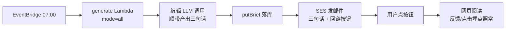

# 04 · 邮件推送:三句话 + 回链

> 状态:待评审。对应 01-产品方案「二期:推送精简版」,由 2026-08-18 拍板启动。

## TL;DR

每天 07:00 定时刊生成成功后,给该用户发一封极简邮件:正文只有编辑写的「今日三句话」和一个「打开今日简报」按钮,不放任何具体条目链接——消费仍然全部发生在网页上,反馈回路不受损。发信用 AWS SES(和生成 Lambda 同账号同区域,无新增外部依赖),三句话由现有编辑 LLM 调用顺带产出(不加调用次数)。主要代价:要在 Cloudflare 给 nanisle.com 加 3 条 DNS 记录做发信认证,且 SES 新账号处于沙箱期、要么逐个验证收件邮箱要么申请解除(约 24h)。改动量约半天。

## 背景与问题

现状:每日刊 07:00 由 EventBridge Scheduler 触发 Lambda 生成、写入 DynamoDB,但**没有任何通知**。用户必须自己记得打开 `nanisle.com/products/daily-brief` 才知道今天的刊出了。内测阶段用户就几个人,「忘了看」是留存的头号敌人——刊生成了没人看,反馈数据为零,选材就永远不会变好。

01-产品方案决策 1 已经论证过:邮件**绝不做主输出**,因为邮件是单向发射,读没读、点了哪条全收不回来。但同一节也预留了出路:「推送(邮件或 Telegram)只发『今日 3 句话 + 链接回网页』,放二期」。本方案就是把这个二期做出来,并且严格守住边界:**邮件只当门铃,不当报纸**。

## 方案

### 总体形态

邮件正文只有三部分:三句话、一个按钮(链到 `https://nanisle.com/products/daily-brief`)、页脚退订链接。**不放条目标题、不放原文链接**——一旦邮件里能直接点原文,消费就流失到邮件里了,这正是决策 1 要防的事。

### 决策 A:发信服务选 AWS SES

| 候选 | 结论 | 具体理由 |
|---|---|---|
| **AWS SES** | ✅ 选它 | 生成 Lambda 已在 494347858613/us-east-1,SES 就在同账号:权限走 Lambda 执行角色加一条 `ses:SendEmail`,不需要新的 API key、不需要管理第二家服务商的账号。调用可以沿用 store-dynamo 已在用的 aws4fetch 直接签名发 HTTP 请求,**零新增 npm 依赖**。费用 $0.10/千封,内测规模约等于零 |
| Resend / Postmark 等 | ❌ 不选 | API 确实更顺手,但要新开账号、多管一个 API key(Lambda 环境变量 + 轮换),而域名 DNS 验证这一步一样躲不掉。为「每天几封邮件」引入一家新服务商,维护面变大、收益为零 |
| Cloudflare Email Workers | ❌ 不选 | Cloudflare 的 Email Routing 只做收件转发;主动外发曾依赖 MailChannels 合作,该通道 2024 年已关闭,现在没有可靠的免费外发路径 |

SES 有一个必须提前知道的坑:**新账号默认处于「沙箱」**——只能发给在 SES 控制台里逐个验证过的收件邮箱。应对分两步走:内测白名单目前只有 1 个邮箱,先手动验证它,当天就能发;同时在控制台提交解除沙箱的申请(填用途说明,通常 24 小时内通过),之后新增白名单用户就不用逐个验证了。

### 决策 B:发信域名认证只做 DKIM

发邮件要让 Gmail 相信「这封信真是 nanisle.com 发的」,业界标准是 DKIM——SES 给每封信加数字签名,Gmail 用 DNS 里公布的公钥验签。落地动作:CDK 里声明 `EmailIdentity`(域名 nanisle.com),部署输出 3 条 CNAME 记录,**手动**去 Cloudflare DNS 加上(一次性操作,记录值部署后从 CfnOutput 拿)。发件人用 `南屿简报 <brief@nanisle.com>`。

不做自定义 MAIL FROM(另一项 SPF 对齐配置):DKIM 对齐已足够通过 Gmail 的 DMARC 检查,内测规模没必要多两条 DNS 记录。将来如果进垃圾箱率异常再补。

### 决策 C:三句话由现有编辑调用顺带产出

直觉方案是发邮件前再调一次 LLM「把今天的简报总结成三句话」。卡点:每天每用户多一次调用,成本翻倍还慢;而且总结调用拿到的是已成形的简报 JSON,信息不比编辑调用当场知道的多。所以改为:在 `buildEditorialPrompt` 的输出结构里加一个 `tldr` 字段(恰好 3 句,每句 ≤40 字,写「今天为什么值得点开」而不是复述标题),`parseEditorialJson` 里做长度截断。同一次调用顺带产出,增量成本约等于零。

模型漏给 `tldr` 或给的格式不对时的兜底:从各追踪器版块的第一条各取一句「《标题》——whyClick 前 30 字」,机械拼满 3 句。兜底文案生硬一点没关系,邮件的任务只是把人叫回网页。

`tldr` 存进 `Brief` 一起落库。这带来一个顺手的好处:网页顶部将来也可以渲染「今日速览」,但那不在本方案范围内。

### 决策 D:只在定时全量模式发,立即生成不发

发送点在 `generateAll` 的 per-user 循环里、`produceBrief` 成功之后。「立即生成」(用户在配置页手点)不发邮件——人就在页面上,发邮件是打扰。发送失败只 `console.error` 记日志,**不影响该用户的简报落库**(邮件是锦上添花,刊本身已经安全)。这也天然继承了现有的失败隔离:一个用户发信失败不拖累别人。

### 决策 E:默认开启 + 一键退订

内测阶段 `prefs.emailPush` 缺省视为**开**:白名单用户都是熟人,推送恰恰是他们要的提醒;默认关的话没人会想起来去开,功能等于没做。制衡手段两个:

1. **配置页开关**:Config 页加一行「每日邮件提醒」开关,写 `prefs.emailPush`(沿用 `offAxis` 的整存整取路径)。
2. **邮件页脚一键退订**:链接指向 Worker 新端点 `GET /api/email/unsub?token=…`,token 是 HMAC 签名的(内容 = 邮箱 + 用途),点开即把 `prefs.emailPush` 置 false 并返回一个纯文本确认页,不需要登录。同时邮件头加 `List-Unsubscribe` / `List-Unsubscribe-Post`,让 Gmail 顶部原生显示「退订」按钮——这是 Gmail 2024 起对群发信的硬要求,也顺便降低被标垃圾的概率。

token 的签名密钥需要 Lambda(生成链接)和 Worker(验证)两边共享。不复用 `NANISLE_SSO_SECRET`——那是主站↔产品 Worker 的登录信物,Lambda 拿到它就意味着泄漏面扩大到 AWS 侧;新设一个专用的 `EMAIL_UNSUB_SECRET`,即使泄漏,最坏后果只是别人能替你退订。

### 邮件样式

纯 HTML 内联样式 + plain-text 双版本(multipart),不引模板引擎。主题:`南屿简报 · M月D日`。正文自上而下:三句话(每句一行)、按钮「打开今日简报 →」、页脚一行小字(「不想收到这封邮件?退订」)。整封信目标 5 秒读完。

## 实施计划

| # | 事项 | 文件 | 验证 |
|---|---|---|---|
| 1 | 编辑输出加 `tldr`(提示词 + 解析 + 兜底拼接) | `src/shared/pipeline-core.ts`、`src/shared/types.ts` | `npm test`(补 parse/兜底用例);本地 mock 模式跑一次看 `tldr` 落库 |
| 2 | SES 发信模块(aws4fetch 签名调 SES v2 API + HTML/文本模板 + unsub token 生成) | 新建 `src/shared/email.ts` | 单测:模板渲染、token 往返验签 |
| 3 | `generateAll` 循环里接发送(读 `prefs.emailPush`,失败只记日志) | `pipeline/lambda.ts` | 见 #7 线上验证 |
| 4 | 退订端点 + 配置页开关 | `src/worker/index.ts`、`src/react-app/Config.tsx` | 本地 dev:点退订链接 → prefs 变化 → 开关状态同步 |
| 5 | CDK:`EmailIdentity(nanisle.com)`、Lambda 角色加 `ses:SendEmail`、环境变量 `EMAIL_FROM` / `EMAIL_UNSUB_SECRET` | 主仓 `infra/lib/daily-brief-stack.ts` | `cdk diff` 过目后 `cdk deploy`(profile kb-agent) |
| 6 | 运维一次性操作:Cloudflare 加 3 条 DKIM CNAME;SES 验证收件邮箱 panghd0811@gmail.com;提交沙箱解除申请;Worker 侧 `wrangler secret put EMAIL_UNSUB_SECRET` | — | SES 控制台显示域名 Verified |
| 7 | 端到端:手动触发一次 `{"mode":"all"}`,收到邮件、三句话正确、按钮回站、退订链接生效 | — | 真实收件箱验证 |

依赖顺序:#6 的 DNS/沙箱验证有等待时间(DKIM 生效最长几小时),建议 #5、#6 先行,代码(#1–#4)并行推进。全部改完后产品仓、主仓照常 `npm run deploy` / `cdk deploy`,注意当前工作区还有未提交的多用户版代码,提交时分开成独立 commit。

## 风险与开放问题

- **最脆弱的假设:邮件真能把人叫回来。** 如果三句话写得平庸,邮件沦为每天一封的背景噪音,被 Gmail 归档甚至标垃圾,反而伤害 nanisle.com 这个域名将来的发信信誉(后续每周产品都可能要用它发信)。对策:内测期亲自盯自己的收件箱观感,三句话的提示词大概率要迭代几轮;如果两周后自己都不点邮件里的按钮,就该停下来重想形态(比如改 Telegram)。
- **沙箱解除申请可能被拒**(AWS 对新账号发信用途审核有一定随机性)。被拒的兜底:内测期继续逐邮箱验证,反正加白名单本来就是手动操作,顺手多验一个邮箱;规模化之前再重新申请。
- **发送时刻绑定出刊时刻**(07:00 美东)。用户全在美东时区时没问题;将来有别的时区用户,「早 7 点的刊、下午才到的邮件」会很怪,到时需要按用户时区分批调度——本方案不做。
- **`tldr` 的反捏造边界**:三句话是导语不是事实陈述,不走现有的反捏造校验(只入选条目可引用)。理论上模型可能在三句话里吹一条没入选的内容,点进去找不到。暂按低风险接受,提示词里明确「只概括入选内容」;若实际出现,再把 `tldr` 纳入校验。
