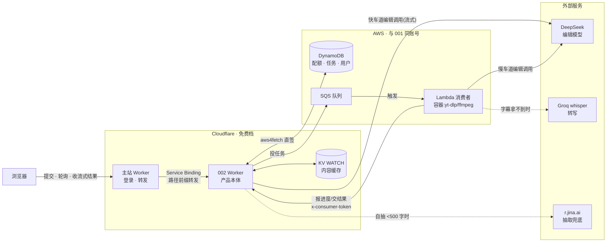

# 002 Watch Router — 技术方案

> 状态:2026-08-23 草稿,待评审。前置文档:[01-产品方案.md](01-产品方案.md)(2026-08-22 草稿,定义产品形态:四段式分流、字幕优先、按内容缓存)。本文回答 01 没有展开的五个技术问题:**重活跑在哪、长内容怎么喂给模型、摘要怎么防幻觉、与 001 怎么交互、多用户怎么便宜地扛**。
>
> 读者假设:一位没参与过之前讨论的工程师。看得懂 TypeScript,不知道 nanisle 的历史决策。
>
> 前置调研两份,引用散在正文:①GitHub 同类项目技术调研(2026-08-23,覆盖正文抽取/分块策略/输出形态/字幕获取/忠实度防护约 15 个项目);②双仓参考代码盘点(templates/web-app 模板、001 的可复用模块、主站挂载机制)。
>
> **本文对 01 的四处修订**(①②是技术修订,③是 2026-08-23 用户对产品形态的澄清,④是 2026-08-24 用户对架构前提的拍板):
>
> ①01 决策 6 把所有输入统一走「异步队列 + EC2」,本文按输入类型拆成快慢两条路(§3 决策 T1)——文章几秒出结果,没必要陪着视频排队。
>
> ②01 把「与 001 打通」整体排在 v2,应用户要求,本文把其中两项低成本交互(深读入口、个性化高亮)提前设计并纳入本周排期(§3 决策 T7),「回流简报」仍留 v2。
>
> ③**输出形态改版(用户 2026-08-23 拍板)**:用户澄清「AI 帮我看」的含义是——**总结内容 + 大致标记每一段在讲什么,方便回去听/看原片;只以内容稿件(转写文本)为主,不考虑画面**。因此 01 决策 1 的四段式里「需要你亲自看」不再单独成区,决策 2 的「价值在画面里」入选标准**整个删除**(连同靠转写线索猜画面的代理判断);输出主体改为「判决 + 总体要点 + 分段地图」,追踪器相关段落降级为地图上的高亮标记(§3 T4)。01 与本文冲突处以本文为准。另两条同日拍板:输入以播客和长视频为主,**YouTube 是常用来源、必须做稳**(§3 T9);文章快车道保留。
>
> ④**慢车道后端换 AWS,直接按多用户设计(用户 2026-08-24 拍板)**:初稿按「维护者一人内测」设计,状态全放 KV、消费者是常驻 EC2 单进程。多用户前提下这套会先后撞三堵墙:KV 免费档写入限额(1,000 次/天,日提交一百来条即撞线)、配额计数无原子自增(竞态穿透)、单消费者算力单点。拍板后改为:KV 只留内容缓存,配额/任务/用户记录上 DynamoDB,队列用 SQS,消费者改 SQS 触发的 Lambda 容器,常驻 EC2 退场(§3 T1/T6)。Cloudflare 侧(收单、快车道、挂载、门禁)不动——这是 001 已验证的「CF 前端 + AWS 后端」混合形态,账号与 CDK 底座直接复用。

## TL;DR

002 的服务层是一个独立的 Cloudflare Worker(`nanisle-002-watch-router`,从产品仓模板复制),按输入类型走两条路:**文章/粘贴文本走快车道**——Worker 内完成正文抽取(linkedom + Readability,失败兜底 r.jina.ai)加一次 DeepSeek 流式调用,几秒到几十秒出结果;**视频/播客走慢车道**——Worker 在 DynamoDB 记任务、向 SQS 投递,SQS 触发 Lambda 容器消费者(yt-dlp/ffmpeg 打进镜像,移植 kb-agent 已验证的字幕优先管线)转写、调 DeepSeek,经 Worker 端点交回结果,页面轮询进度。长文不做任何摘要链:128K context 一把梭覆盖 95% 的真实输入,超长先截断并标注。忠实度用「要点级原文锚定」低成本兜住:每条要点强制附一段逐字引文,前端做字符串匹配,配不上的要点标低置信。

输出形态按用户 2026-08-23 的澄清定为**「判决 + 总体要点 + 分段地图」**:总体要点替你把内容看完,分段地图(每段时间范围 + 一句大意)让你能精确跳回原片重听任何一段——摘要和回看导航是一体两面,只基于转写文本,不做画面判断。与 001 的交互走三层,**契约只存在于 URL 和 HTTP 层,零代码共享**(守 conventions 的自包含规则):①001 简报每条加「深读 →」链接,带 url 参数跳 002 收单页(本周);②002 通过带共享密钥的 interop 端点读取 001 的追踪器定义,把分段地图上「与你手头的事相关」的段落标高亮,001 不可用时自动降级为无高亮的通用地图(本周);③002 处理完的内容一键回流 001 次日简报弹药区(v2)。身份复用南屿账号:SSO 验签、userGuard、白名单三件全部从 001 物理复制。

主要代价:两条车道意味着两套失败模式要分别兜底;慢车道横跨两朵云,部署链多一节(产品仓 deploy 之外还要私有 infra 仓 cdk deploy 才真生效),Lambda 的 15 分钟执行上限给超长视频封了顶;Workers 出口 IP 的反爬劣势是结构性的,快车道的成功率依赖 r.jina.ai 兜底这条外部生命线;以及 YouTube(用户拍板必须做稳)要为住宅代理付每月几美元的军备竞赛成本,并接受它是一条要持续盯着的运营链路(§3 T9)。还要说清一点:AWS 化降的只是固定成本(EC2 月费、CF 付费档),多用户真正的变动成本大头(DeepSeek 编辑 + 转写)与选哪朵云无关,靠按内容缓存命中和配额闸压制(§3 T6)。

## 1. 背景:01 定了形态,还剩五个技术问题

01-产品方案已拍板产品骨架(字幕优先提取、按内容 ID 全站缓存、Worker 收单 + 重活出 Worker;其中输出形态经文首修订 ③ 改为「判决 + 要点 + 分段地图」),但落到代码前还有五个问题没有答案:

| # | 问题 | 01 的现状 | 本文的回答 |
|---|---|---|---|
| 1 | 文章类输入也要过 EC2 队列吗 | 决策 6 统一异步 | 不。文章在 Worker 内几秒完成,拆快慢两条车道(§3 T1) |
| 2 | 一小时播客的转写(约 1.5–2 万 token)怎么喂给模型 | 未展开 | 128K context 直接喂,不做分块链(§3 T3) |
| 3 | 「AI 替你看完的」怎么让人敢信 | 只有反捏造 prompt 规则 | 要点级原文锚定 + 字符串校验(§3 T4) |
| 4 | 与 001 的交互怎么做才不破坏产品自包含 | 整体推到 v2 | 契约收在 URL/HTTP 层,三层交互分期落地(§3 T7) |
| 5 | 多用户下存储与慢车道算力怎么便宜地扛 | 未展开(01 按维护者自用设想) | KV 只留内容缓存;状态上 DynamoDB、队列 SQS、消费者 Lambda,CF 侧不动(§3 T1/T6) |

### 1.1 GitHub 技术调研增量(2026-08-23)

01 的调研看的是产品形态(BibiGPT、AI-Video-Transcriber 等),这次补的是技术选型。关键结论按主题列出,批判性判断在备注列:

| 主题 | 结论 | 关键证据 | 备注 |
|---|---|---|---|
| 正文抽取 | Workers 没有 DOMParser,标准解法是 `linkedom`(纯 JS 的 DOM 实现)+ `@mozilla/readability`;[Defuddle](https://github.com/kepano/defuddle)(9.1k★,Obsidian Web Clipper 团队)输出更干净且直接出 Markdown,同样接受 linkedom 的 document | [Workers 社区验证](https://community.cloudflare.com/t/domparser-in-worker/169917);[Defuddle vs Readability 评测](https://biggo.com/news/202505240122_Defuddle_Web_Content_Extractor) | Readability 偏保守,代码块/表格/脚注是误删重灾区;两者都会**静默失败返回半空正文**,必须加字数阈值判断 |
| 抽取兜底 | [Jina Reader](https://jina.ai/reader/):`GET https://r.jina.ai/{url}` 直接返回 Markdown,免费 key 有 1000 万 token 额度、100 RPM,代码 Apache-2.0 可自托管 | [jina-ai/reader](https://github.com/jina-ai/reader) 11.9k★ | Workers 出口是 Cloudflare 数据中心 IP,直接 fetch 对硬防护站成功率为零——兜底不是锦上添花,是生命线 |
| 不选 Firecrawl | 自托管版没有反爬层(fire-engine 不开源),只有裸 Playwright;AGPL-3.0 | [官方自托管文档](https://docs.firecrawl.dev/contributing/self-host) | 自托管拿不到它的核心价值,等于白背一个 Docker |
| 长文策略 | 2025–26 实际主流是「大 context 一把梭」;LangChain 的 map_reduce/refine 链质量 issue 成灾([输出为空](https://github.com/langchain-ai/langchain/issues/21406)、[丢段](https://github.com/langchain-ai/langchain/issues/26424))且官方已逐步弃用 | Kagi Universal Summarizer 被 [HN 扒出](https://news.ycombinator.com/item?id=35834198)本质就是长 context + 好 prompt | refine 串行调用延迟爆炸,map-reduce 丢跨段主线——都是为 4K context 时代发明的补丁,DeepSeek 128K 下是纯亏 |
| 输出形态 | 单一形态不够:「判断值不值得读」要一句话,「代替阅读」要分节展开;纯 TL;DR 口碑最差(「说了跟没说一样」),带具体数字/人名/结论的要点口碑显著更好 | [Kagi summarizer 用户反馈](https://news.ycombinator.com/item?id=43630397);Karakeep/SMRY/Readwise 形态对比 | 01 的四段式已经优于全部调研样本(没有一家做分流);要点必须「有料」这条要写进 prompt 硬规则 |
| YouTube 字幕 | YouTube 系统性封锁数据中心 IP 段([youtube-transcript-api #511](https://github.com/jdepoix/youtube-transcript-api/issues/511)),本地能跑、上云就挂;纯 Workers 方案(youtubei.js 走内部 API)能跑但随时崩 | 该库 issue 区即血泪史;2025 年起又加了 PoToken 反爬层 | 用户拍板 YouTube 必须做稳,专项解法(住宅代理主路 + SaaS 兜底)见 T9 |
| 忠实度防护 | 产品级开源项目几乎没人做(全是裸 prompt 直出);研究侧共识:「带引用生成」的引用本身也会幻觉,必须事后校验 | [LongCite](https://github.com/THUDM/LongCite)(需专用模型)、[CiteGuard](https://github.com/KathCYM/CiteGuard)(检索校验) | 低成本可行解是「事后 span 对齐的穷人版」:模型输出逐字引文,前端字符串匹配校验——一次调用完成,校验零成本(§3 T4) |

## 2. 系统全景

002 的部件分住三处:Cloudflare 管入口与快车道,AWS(与 001 同一账号)管慢车道的状态、队列与算力,模型与兜底是外部服务。本节先用一张表认部件,再看一张只画主数据面的接线图,最后把两条车道各自的时序走一遍。与 001 的三层交互和登录继承是另一个维度的事,集中在 §3 T7,不混进本节。

### 2.1 部件清单

| 部件 | 跑在哪 | 干什么 |
|---|---|---|
| 主站 Worker `nanisle` | Cloudflare 免费档 | 域名入口:登录(better-auth)、SSO 手递、把 `/products/watch-router/*` 按路径前缀转发给 002。002 的业务逻辑一点不在这里 |
| **002 Worker** `nanisle-002-watch-router` | Cloudflare 免费档 | 产品本体:收单路由、门禁、快车道从抽取到编辑的全部工作、慢车道的任务簿记与进度/结果 API。**所有任务状态只有它能写**(T1 的不变量) |
| KV namespace `WATCH` | Cloudflare | 只存**丢了能重算的东西**:按内容共享的缓存(T6) |
| DynamoDB 表 | AWS | 一切有主的状态:配额(原子自增)、任务状态机、用户处理记录、白名单(T6) |
| SQS 队列 | AWS | 慢车道任务的在途载体:原子领取、失败重投、死信兜底(T1) |
| 消费者 Lambda | AWS(私有 infra 仓 CDK 定义) | 慢车道的重活:下载、字幕/转写、编辑调用。容器镜像内置 yt-dlp/ffmpeg,SQS 触发、按任务计费。**有意不给它 KV/DynamoDB 写权限**,进度与结果经带 `x-consumer-token` 的 HTTP 端点交回 002 Worker(T1) |
| DeepSeek API | 外部 | 两条车道共用的编辑模型,同一接缝同一输出 schema(T5) |
| Groq whisper | 外部 | 慢车道转写:官方字幕拿不到时,音频喂它(T5) |
| r.jina.ai | 外部 | 快车道抽取兜底:自抽静默失败时的生命线(T2) |

### 2.2 接线图(主数据面)



图上有意不画的三样:①与 001 的两条交互箭头(简报「深读 →」入口、追踪器定义读取)——它们是可降级的交互层,任何一条断掉主数据面照常工作,接线细节见 T7;②登录/SSO 的流转——那是从 001 原样继承的机制,见 T7 末段;③mock 旁路——不配任何 key 时快车道返回内置示例、慢车道跳过整条 AWS 链直接返回示例任务,fork 者零凭证零 AWS 跑通(T5)。

### 2.3 两条车道的时序

收单端点 `POST /api/submit` 按输入类型路由;两条车道第一步都先查内容缓存,命中直接出结果,以下时序都是缓存未命中的情况。

**快车道(文章 URL / 粘贴文本),全程在一次 Worker 请求内:**

1. 浏览器提交,Worker 查 `content:<platform>:<id>` 未命中;
2. Worker fetch 原文,linkedom + Defuddle 抽正文(T2);
3. 正文 < 500 字符视为静默失败,改调 r.jina.ai;再失败则返回「把正文粘贴进来」的提示,流程止步;
4. 拿到正文,发起一次 DeepSeek 流式调用(T4 schema),SSE 字节透传给浏览器,边生成边渲染;
5. 生成完成,Worker 校验 quote 锚定、写回内容缓存。

**慢车道(视频 / 播客),异步任务,SQS 触发消费者、浏览器轮询进度:**

1. 浏览器提交,Worker 在 DynamoDB 记任务(pending)并向 SQS 投一条消息,立即返回任务 ID;页面开始轮询 `GET /api/task/:id`(读 DynamoDB),显示五步进度;
2. SQS 触发 Lambda 消费者,容器冷启动几秒,对分钟级任务无感;
3. 消费者用 yt-dlp 拉官方字幕,拿不到就下载音频喂 Groq whisper(YouTube 走住宅代理,T9);期间用 `POST /api/queue/progress` 报进度和路径徽章,Worker 写进任务记录;
4. 消费者调 DeepSeek 出同一份 T4 schema,`POST /api/queue/complete` 交结果;
5. Worker 校验后把内容写 KV 缓存、任务标完成,浏览器下一次轮询拿到完整结果;
6. 任务超 10 分钟没有 complete,Worker 在下次轮询时显式标失败,绝不静默挂起;消息重投 2 次仍失败进死信队列,供事后排查。

两条车道的分工对比:

| | 快车道 | 慢车道 |
|---|---|---|
| 输入 | 文章 URL、粘贴的长文 | B站/YouTube 视频、播客 |
| 跑在哪 | Worker 请求内,流式返回 | DynamoDB 任务 + SQS 投递 → Lambda 消费者 → 经 Worker 回写 |
| 耗时 | 几秒到几十秒 | 几十秒到几分钟 |
| 等待体验 | 浏览器保持一个流式连接,边生成边渲染 | 进度页轮询 `GET /api/task/:id`,五步进度 + 路径徽章 |
| 失败兜底 | 自抽 → r.jina.ai → 提示手动粘贴正文 | 超时 10 分钟显式报失败;SQS 重投 2 次后进死信队列 |

「路径徽章」指结果页标明内容走了哪条提取路径(官方字幕 / whisper 转写 / 手动粘贴),抄自 AI-Video-Transcriber——转写路径的时间戳精度和文字准确度都低一档,用户有权知道。

## 3. 技术决策

编号 T1–T8,避免与 01 的产品决策 1–6 混淆。

### T1:按输入类型拆快慢车道,不搞统一异步

01 决策 6 把所有输入统一设计成「收单 → 队列 → EC2 → 轮询」。写本文时重新算了一遍:文章类输入的全部工作(fetch 正文 + 一次 LLM 调用)在 Worker 请求内就能完成——抽取是毫秒级,DeepSeek 流式调用期间 Worker 只是在等字节,CPU 占用极低,免费档的 10ms CPU 限额压不到它。让一篇 5 分钟能读完判断的文章也去队列里排队、让用户盯轮询进度页,是拿最常见的输入形态陪最重的输入形态受罪。

所以拆开:文章走快车道(同步流式),音视频走慢车道(异步队列)。代价是两套失败模式要分别兜底(快车道兜抽取失败,慢车道兜超时和转写失败),但两条路共享同一个输出 schema、同一个缓存层、同一个 AI 接缝,分叉只在「正文从哪来」这一段。

**慢车道的队列用 SQS,消费者用 SQS 触发的 Lambda 容器,没有常驻进程。** 初稿在这里用的是「KV 假队列 + 维护者 EC2 单消费者」,靠「只有一个消费者」的假设绕开 KV 没有原子操作的问题。按多用户前提(文首修订 ④)这个假设不能再当地基:两个消费者同时领到同一条任务就会重复干活、重复花钱。SQS 恰好把这类问题整个接走——消息被领走后对其他消费者不可见(visibility timeout 设 15 分钟,盖住任务的 10 分钟预算),处理失败自动重投,重投 2 次仍失败进死信队列;每月 100 万请求的永久免费额度在本产品量级上等于不要钱。消费者从常驻进程改成 Lambda 容器镜像(yt-dlp/ffmpeg/Node 管线打进同一镜像),SQS 触发、按任务计费:典型任务 2–3 分钟,月免费额度(40 万 GB-秒)大概率整月盖住,常驻 EC2 约 $15/月的固定成本归零;容器冷启动几秒,对分钟级异步任务无感。

Worker 侧投递用 aws4fetch 直签 SQS(001 的 Worker 已用同款方式直连 DynamoDB;AWS 凭证经 `wrangler secret put` 注入,公开仓零凭证的规矩不破)。消费者的回程仍走带 `x-consumer-token`(专用密钥,与用户门禁分离、独立轮换,沿用 001 曾经的 INGEST_TOKEN 模式)的 HTTP 端点:

```
POST /api/queue/progress  消费者报进度(下载中/转写中/编辑中 + 路径徽章)
POST /api/queue/complete  消费者交结果或报失败
```

初稿还有一个 `claim` 端点,SQS 触发天然替掉了它。**有意不给 Lambda 配 DynamoDB/KV 的写权限**(IAM 上做得到,但不做):进度和结果一律经 Worker 中转,「任务状态只有 Worker 能写」这条不变量就守在一个地方,门禁、schema 校验、写缓存也只需要在 Worker 实现一遍。并发上限用 Lambda reserved concurrency 卡(先设 2–3,既是烧钱闸也是 Groq/DeepSeek 配额闸)——注意 001 踩过的坑:账号 Lambda 并发额度太低时 reserved concurrency 部署不上去(提额 case 尚在等批复),批下来之前退而求其次靠收单侧配额限流,并发闸装不上不阻塞上线。

### T2:文章抽取链——自抽为主,r.jina.ai 兜底,粘贴保底

```
fetch(url, 常规浏览器 UA)
  → linkedom parse → Defuddle 抽正文(出 Markdown;不行再退 @mozilla/readability)
  → 正文 < 500 字符 → 视为静默失败
  → GET https://r.jina.ai/{url}(带免费 key,1000 万 token 额度)
  → 仍失败 → 结果页提示「这个站抓不动,把正文粘贴进来」
```

三级的理由:自抽零成本零外部依赖,对普通博客/新闻站够用;但 Workers 出口是 Cloudflare 数据中心 IP,被相当一部分站点(讽刺的是包括 Cloudflare 自家防护的站点)当 bot 拦掉,调研估算直抓成功率七八成、对硬防护站为零——r.jina.ai 用自己的浏览器渲染集群把成功率提到九成五。它挂了或限流(100 RPM)时,粘贴入口保证产品永远有路可走。为什么优先 Defuddle 而不是更有名的 Readability:后者偏保守,误删代码块/表格/脚注,而 002 的输入里技术文章占比会很高;Defuddle 直接输出 Markdown,LLM 吃 Markdown 比吃纯文本保留更多结构信号(标题层级、列表),对分节摘要直接有利。

明确不做的:自建 headless browser 渲染(Cloudflare Browser Rendering 又贵又慢)、Firecrawl 自托管(见 §1.1)、付费墙攻坚(SMRY 的 archive.org 竞速方案记为 v2 候选)。

### T3:长文喂法——128K 一把梭,不做摘要链

先算账:一篇 2 万字中文文章约 3 万 token,一小时播客转写约 1.5–2 万 token,B站两小时讲座的字幕也就 3–4 万 token——**95% 以上的真实输入远够不着 DeepSeek 的 128K context**,单次调用成本按当前挂牌价在几分钱量级。而经典的分块方案(LangChain 三件套)各有硬伤:refine 串行 N 次调用、延迟随长度线性涨,交互式产品等不起;map-reduce 每块独立摘要时不知道全文主线,拼出来是「段落摘要清单」不是「内容摘要」,且 LangChain 实现本身质量 issue 成灾(§1.1)。这些方案是 4K context 时代的补丁,现在保留它们只有惯性没有收益。

所以:估算 token(字符数 ÷ 2 粗算即可),≤ 100K 直接整篇进一次调用;超过 100K 的极端输入(第一周大概率遇不到)**截断到 100K 并在结果页标注「内容过长,已按前 N 分钟/前 N 字处理」**——诚实截断好过把复杂度花在一年遇不到几次的输入上。真需要分块时(v2),做最简单的单层并行 map + 一次 reduce,每个分块附带「全文开头 2000 字 + 标题」当全局上下文,缓解丢主线;整个实现是几十行 fetch,**严禁引入 LangChain**(抽象税、打包体积、上述质量问题)。

### T4:输出 schema——判决 + 总体要点 + 分段地图,加要点级原文锚定

按用户 2026-08-23 的形态澄清(见文首修订 ③),输出不再是 01 的四段式,而是三件东西:**判决**(值不值得花时间,一句话)、**总体要点**(替你看完的收获,每条带证据)、**分段地图**(整条内容按自然转折切段,每段一句大意 + 时间范围,方便跳回原片重听)。「已替你筛掉」问责区没有消失,而是改了形态:低价值段(寒暄/广告/车轱辘话)在地图上灰显,顶部统计「低价值段共 N 分钟」——省下的时间仍然可见,但用户随时能点开灰段核对,比一个折叠区的问责力度更强。落成 JSON schema,由 DeepSeek 的 `response_format: json_object` 约束输出(001 的 `shared/ai.ts` 已支持,`CompleteInput.json: true`):

```jsonc
{
  "verdict": { "worth": "yes|no|partial", "reason": "一句话" },
  "keyPoints": [
    {
      "point": "带具体数字/结论的要点,禁止空泛",
      "quote": "≤30 字,逐字摘录的支撑原文",   // 忠实度锚定,见下
      "start": 754                              // 视频/播客:秒;文章:段落锚点
    }
  ],
  "chapters": [                                  // 分段地图:覆盖全程,无空洞、不重叠
    {
      "start": 0, "end": 312,
      "gist": "这一段大致在讲什么,一句话",
      "value": "core|context|low",               // low = 寒暄/广告/车轱辘话,渲染成灰段
      "tracked": "ai-agents"                     // 命中用户追踪器时由用户级调用回填 key,地图上高亮
    }
  ],
  "meta": { "path": "subtitle|whisper|article|paste", "truncated": false }
}
```

分段的切法:约束模型「按内容自然转折切段,每段 2–10 分钟,首尾相接覆盖全程」;来源自带章节结构时(YouTube chapters、B站分P、播客 shownotes 时间轴)优先沿用官方边界,模型只补每段大意——官方章节是作者自己标的,比模型猜的转折点可信。跳转的落地:B站/YouTube 用带秒数的 URL 直达;播客展示 `mm:ss` 供播放器手动拖;文章的 `start` 换成段落锚点,点击滚动到 002 自己存的抽取正文对应位置(文章不用跳出去,正文就在手边)。

`quote` 字段是本方案的忠实度机制:调研发现产品级开源项目在防幻觉上集体交白卷,研究侧的教训是「让模型带引用生成」不够——引用本身也会幻觉,必须校验。校验的低成本做法是把它变成纯字符串操作:**模型每条要点必须附一段 ≤30 字的逐字原文,Worker 在原文/转写里做模糊匹配(去空白与标点后子串查找),匹配上的要点渲染成可跳转(文章高亮定位、视频带秒数 URL),匹配不上的标「低置信」灰显**。一次调用完成,校验不花 token。这也是 001「引文只能来自抓取文本,禁止外推」反捏造规则在 002 的落地形态——001 靠 prompt 约束加人工抽查,002 多了一道机器校验,因为 002 的输出直接替用户「看」了内容,幻觉的伤害比 001 的一句 whyClick 大得多。

内容级与用户级拆成两次调用(01 决策 5 已定):`verdict/keyPoints/chapters` 全部是内容属性,全站按内容缓存;`tracked` 高亮是用户属性,单独一次便宜的小调用——输入只有各段 gist 列表 + 该用户的追踪器定义(不重喂全文转写),输出是「哪几段命中哪个追踪器」,回填进该用户自己的结果副本。缓存命中的内容,新用户只花第二次小调用的钱;没接 001 或没有追踪器的用户,这次调用整个跳过,地图无高亮但完整可用(T7 ② 的降级路径)。

### T5:AI 接缝与模型——整套照抄 001 的 shared/ai.ts

「接缝」指全产品唯一的 AI 调用入口函数,换供应商是改配置不是改代码。002 不用模板里的三档版本,直接物理复制 001 的 `src/shared/ai.ts`(四档:mock/deepseek/anthropic/gateway,默认 deepseek),因为它多出的四样东西 002 全都需要:

| 特性 | 002 为什么需要 |
|---|---|
| deepseek 无 key 自动回落 mock | fork 者零配置跑通是公开仓的发布门槛(conventions 原则 #1) |
| **必须流式**(`readSse`) | DeepSeek V4 Pro 默认开 thinking,非流式下 5 分钟无字节会被 undici 空闲超时掐断——002 的输入(整篇转写)比 001 的候选列表长得多,这条是生死线 |
| 运行时无关(入参是普通对象不是 Worker env) | 慢车道的 Lambda 消费者和 Worker 用同一份文件,DeepSeek key 在两边分别注入(Worker 走 `wrangler secret put`,Lambda 走 CDK 注入的环境变量,001 的 D 线已验证同款) |
| `json: true` → `response_format` | T4 的 schema 输出直接用 |

模型沿用 001 现状:`deepseek-v4-pro`(`deepseek-chat` 已于 2026-07-24 退役);转写用 Groq `whisper-large-v3` 免费档(每天 2000 请求、每小时 7200 音频秒,ffmpeg 压 32kbps 单声道约 14MB/小时),01 决策 4 已定,不重复论证。mock 模式下:快车道返回内置示例摘要,慢车道跳过队列直接返回内置示例任务——保证 fork 者不碰 AWS、不配任何 key 也能端到端看完整个产品形态。

### T6:存储——KV 只管可丢的缓存,有主的状态全上 DynamoDB

划分标准一句话:**丢了能重算的进 KV,丢了要负责的进 DynamoDB,在途的任务进 SQS。**

本文初稿的立场是「全 KV,不上 DynamoDB」,理由是内测期数据量小,为配额原子性引入第二朵云(两套凭证、CDK、CloudWatch)不划算。多用户拍板(文首修订 ④)后这笔账两头都变了。一头是 KV 免费档的硬限额:**写入每天只有 1,000 次**——任务状态每迁移一次是「删旧键 + 写新键」两次写,加上配额占位和缓存回写,一条慢车道提交要吃近十次写,日提交一百来条就撞线,撞线后要么整站写入报错、要么被迫上付费档。另一头是「第二朵云」的一次性成本 001 已经付掉了:账号(与 001 同一个 494347858613)、CDK 底座、CloudWatch 告警、Worker 用 aws4fetch 直签 DynamoDB 的姿势全是现成的,002 的边际成本只是同一个 infra 仓里多几个资源定义。于是选择从「付 $5/月上 CF 付费档、配额竞态照旧」变成「近零月费、顺带把竞态真解掉」(这个量级下 DynamoDB on-demand 月账单不到 $0.1),后者全面占优。

| 数据 | 放哪 | 理由 | TTL |
|---|---|---|---|
| `content:<platform>:<id>`(提取结果 + 内容级摘要 + 路径徽章) | KV | 全站共享、读多写少、单条可到几百 KB——超 DynamoDB 400KB 单条上限,且丢了可重算 | 60 天 |
| 配额计数(每邮箱每日) | DynamoDB | UpdateItem 原子自增,001 同款;初稿承认的「并发穿透」竞态就此消除,不再是已知洞 | 7 天(DDB TTL) |
| 任务状态机(状态/进度/徽章/结果指针) | DynamoDB | 条件写做状态迁移,轮询读它;任务的在途载体是 SQS 消息(T1) | 1 天(DDB TTL) |
| 用户处理记录 + 个性化片段 | DynamoDB | 个人长期资产,和 001 的用户数据同一存放标准 | 不设 |
| 白名单 | DynamoDB 单条 | 顺手放一起,不值得为它单独留一套存储 | 不设 |

配额立场沿用 001 的「先占位后干活」(占位失败直接 429;模型报错不退还——钱可能已经花掉,退还等于纵容失败狂重试这条真实的烧钱路径),且现在是原子占位,不再需要初稿那段「竞态窗口毫秒级、内测期可接受」的自我辩护。Worker 到 DynamoDB 跨云一跳约几十毫秒,对收单和轮询两个场景都无感;真正的读热点(结果页、缓存命中)仍在 KV,不受影响。

fork 路径不受影响:mock 模式下存储层换成内存假实现,快慢两条车道零 AWS、零付费依赖跑通(T5 的 mock 行为);真部署的 AWS 资源全在私有 infra 仓 CDK 定义,公开仓只出现资源名与 secret 占位——公开仓零凭证的规矩不破。

### T7:与 001 的交互——契约收在 URL 和 HTTP 层,三层分期

这是本文相对 01 的主要增量。先立边界:conventions 的自包含规则(「产品之间永不 import,宁可复制代码」)管的是**代码**,不管**协议**——两个已部署的产品通过 URL 参数和 HTTP API 对话,和它们各自调用 DeepSeek 没有本质区别,任何一侧下线、回滚、重写,另一侧照常独立可用。按这条边界设计三层交互,成本从低到高:

**①深读入口(001 → 002,本周)。** 001 简报的每条内容天然是 002 的输入:`BriefItem.url` 字段永远存在(001 类型注释原话:「Always present — the brief is a router」)。在 001 阅读页每条的操作区加一个「深读 →」链接:

```
https://nanisle.com/products/watch-router/?url=<encodeURIComponent(item.url)>&from=daily-brief
```

002 收单页读 query 预填并直接可提交。001 侧的改动是渲染层十来行;`from` 参数只做埋点归因,002 不依赖它。这层交互把两个产品的立场接成了一条完整的链:**001 回答「这条值不值得点」,点进去发现是一小时的视频,002 接着回答「哪几分钟值得看」**——这正是 01 背景问题 1 里「001 覆盖不到的黑箱」的补全。

**②个性化高亮(002 → 001,本周,可降级)。** 分段地图对所有人长一个样,唯一的个性化是「与你手头的事直接相关」的段落标高亮(T4 的 `tracked` 字段)——同一期播客,别人看到的是通用地图,你看到「第 41–47 分钟在讲你正在做的东西」。判断依据复用 001 的追踪器定义。002 不能 import 001 的代码,也不该直连 001 的 DynamoDB(那是 001 的私有存储,绕过它的门禁层等于在两个产品间开后门),正路是 001 增加一个跨产品端点:

```
GET https://nanisle-001-daily-brief.../api/interop/trackers?email=<email>
    header: x-interop-token: <共享密钥>
    返回: { trackers: [{ key, name, question, intent }] }   // 只给定义文本,不给源配置/简报/反馈
```

鉴权用两个 Worker 之间的共享密钥 `INTEROP_TOKEN`(双方 `wrangler secret put`,不进任何仓库——公开仓零凭证规矩)。002 在用户级小调用(T4)前拉一次,10 分钟按用户缓存,避免每次提交都打 001。**降级路径是设计的一部分**:001 端点 404、密钥没配、或用户在 001 没有任何追踪器时,002 直接跳过用户级调用,分段地图无高亮但完整可用,结果页标注「未接入你的追踪器,相关段落高亮未启用」——不假装、不报错、不阻塞主流程。这保证了两个产品的部署顺序解耦:002 可以先上线,①③②任意一层后补。

**③回流简报(002 → 001,v2)。** 002 处理完的内容,结果页给「加进明天的简报 →」按钮,POST 到 001 的 `/api/interop/inbox`(同一把共享密钥),001 把它当一条已带摘要的候选进次日「项目弹药」区。留 v2 的原因不是技术(端点很便宜),是产品:01 风险 6 写明合并的触发条件是「002 验收通过且 001 的 v3 排期启动」——在 002 自己的分流假设被验证前,往 001 灌内容是给两个产品同时加未验证的变量。schema 现在就定下来(`{ email, url, title, verdict, keyPoints, trackedChapters }`),避免 v2 时反向迁就。

一条批判性提醒:interop 端点是产品间耦合的口子,今天开两个、明天就有人想开第十个,最终长成隐形的分布式单体。守住的办法是把契约当外部 API 对待——只传定义文本这类「读了不改」的数据、版本化(路径带 `/api/interop/`前缀集中管理)、任何一侧可以随时下线而对方只是降级。什么时候该停:如果发现某个功能必须两侧同时改代码才能上线,说明它不该是 interop,该是合并(01 风险 6 的既定路径)。

**身份层不算交互,是继承。** 002 与 001 同样只认南屿账号:主站 `GET /api/launch/watch-router` 签 5 分钟 HMAC token 手递,002 的 `/auth/sso` 验签后种 30 天会话 cookie(scope 收窄到 `/products/watch-router`)。`sso.ts`(与主站 `web/lib/sso.ts` 是同一格式契约,**原样复制一字不改**)、`guard.ts`(userGuard/userAiGuard/adminGuard,401 带 loginUrl / 403 内测文案的两态区分)、白名单每请求复查,三件全部从 001 物理复制,只改 slug 相关常量。白名单本身在 002 自己的 KV 里存一份独立副本(自包含;内测期人数个位数,手工同步成本可忽略),不做跨产品统一白名单——那是母平台账号系统未来的活,不是单个产品的。门禁的开放节奏与这次多用户架构改造解耦:002 仍从白名单内测起步,转开放使用时复刻 001 于 08-24 验证过的护栏(注册限流、按 IP 日额度、模型分档)即可——存储与队列层(T1/T6)已经按那个量级设计,届时不用再动地基。

### T8:主站挂载与双仓改动清单

002 沿用 001 蹚平的挂载机制,正式入口 `nanisle.com/products/watch-router/`,不暴露 workers.dev。改动五处(挂载注册表 `web/lib/product-mounts.ts` 是单一事实源,三个消费方从它派生,唯一的手工同步项是 wrangler.jsonc):

| # | 仓 | 文件 | 改动 |
|---|---|---|---|
| 1 | 主仓 | `web/lib/product-mounts.ts` | 加 `{ slug: "watch-router", binding: "WATCH_ROUTER", devPort: 5200, landing: "" }`;`ProductMount` 加可选 `landing` 字段(见下) |
| 2 | 主仓 | `web/wrangler.jsonc` | `services` 加 `{ "binding": "WATCH_ROUTER", "service": "nanisle-002-watch-router" }`(注释已写明:没法 import TS,手工同步) |
| 3 | 主仓 | `web/custom-worker.ts` | `type Env` 加 `WATCH_ROUTER: Fetcher`(转发逻辑已泛化,无需改) |
| 4 | 主仓 | `web/app/api/launch/[slug]/route.ts` | 落地页从硬编码 `dest("config")` 改为 `dest(mount.landing ?? "config")`——002 的落地页是收单首页不是配置页,不改这里 SSO 完成后会 302 到不存在的 `/config` |
| 5 | 产品仓 | 002 自身 | `vite.config.ts` 加 `base: "/products/watch-router/"` + `port: 5200, strictPort: true`;`wrangler.jsonc` 加 `assets.binding/run_worker_first`;`index.ts` 加 `PRODUCT_MOUNT` 常量与 `unmountRequest()`(从 001 复制改常量) |

另有三处 001 侧小改动(属交互层,见 T7):深读链接、interop trackers 端点、`INTEROP_TOKEN` secret。主站产品文案页 `web/content/products/002-watch-router.md` 按 `_template.md` 三段骨架(为什么做它/它做了什么/学到了什么)写,frontmatter 对齐 001(`login: true`、`demo` 指主域挂载路径、`status: building` 起步);文案基调沿站点现行口径——第一人称、每个判断带证据链接、验证期的「学到了什么」写死验收标准。

### T9:YouTube 加固——住宅代理做主路,SaaS 做兜底,协议层的招只当增强

用户拍板 YouTube 是常用来源、必须做稳,为此单独做了一轮 GitHub 调研(2026-08-23)。先说调研里最重要的一个认知,它决定了整个方案的形状:**数据中心 IP 被封是 IP 信誉问题,不是协议问题**。yt-dlp 生态里所有协议层的招——PO token provider、切换 player client、带登录 cookies——都只能降低触发率,不能根治,因为 YouTube 拦的不是「你的请求长得不像浏览器」,而是「你的出口 IP 段整个在黑名单上」(社区归因约 80% 的 403 来自出口 IP 本身)。实证:GCP 数据中心 IP 上,bgutil 生成的有效 PO token + 有效 cookies 双双到位,照样只拿到 storyboard([yt-dlp #16082](https://github.com/yt-dlp/yt-dlp/issues/16082));曾经免 token 的 client 口子(`tv_embedded`、`android_vr`)在 2025–2026 被一个个封掉。所以正确的投入顺序是:**先把出口 IP 换干净,再谈协议调优**——反过来做全是无用功。

分层方案(消费者管线内的失败路由,上层失败自动落下层):

| 层 | 方案 | 成本 | 说明 |
|---|---|---|---|
| 主路 | **Webshare 轮换住宅代理**,yt-dlp 加一个 `--proxy`,只有 YouTube 请求走它 | 约 $2–7/月 | [youtube-transcript-api 作者亲测后官方集成](https://github.com/jdepoix/youtube-transcript-api)的方案,社区验证最充分。**必须买 Residential 轮换包**——免费层是数据中心代理配了白配,静态住宅 IP 用久了照样被封,3000 万 IP 轮换池才是可靠性来源。字幕+元数据每条约 1MB,每天几十条约 1–1.5GB/月,流量成本可忽略 |
| 兜底 1 | **TranscriptAPI**($5/月 1000 条)或 Supadata(免费 100 条/月) | $0–5/月 | 托管 SaaS 本质是把住宅代理池和军备竞赛外包;主路重试 2 次失败后调它 |
| 兜底 2 | Groq whisper 转写(既有路径) | 免费档内 | 字幕彻底拿不到时下载音频转写;音频下载走同一个住宅代理(32kbps 单声道约 14MB/小时,代理流量费每小时几美分) |
| 增强(可选,主路就绪后) | bgutil PO token provider(脚本模式打进消费者镜像——Lambda 里没有 sidecar 形态)+ `player_client=web_embedded,web` 调优 | $0 | 降低触发率、延长出口 IP 寿命;[yt-dlp 维护者背书](https://github.com/Brainicism/bgutil-ytdlp-pot-provider),活跃维护 |

**零成本备选记录在案**:家里有常驻设备(树莓派/家用 PC)的话,Tailscale exit node 或盒子上跑 tinyproxy 自建家庭住宅出口,IP 信誉天然干净、零流量计费,技术上完全成熟(通用 VPN/代理方案,无需专门项目)。代价是一次性搭建 + 「家里断电断网管线就瘸」的运维心智。v1 选 Webshare(改动最小、零家庭运维),家庭盒子作为月费想省掉时的既定迁移路径。

**明确不做**:服务器上长期挂登录 cookies(yt-dlp 官方明文警告封号风险,账号变消耗品,无人值守管线迟早烧号);依赖 Invidious(2026 年数据中心部署已被 YouTube 封死,[官方文档承认](https://docs.invidious.io/youtube-errors-explained/));依赖 Cloudflare Workers 直连 innertube(靠 CF 出口 IP 信誉比 AWS 好这个偶然事实存活,随时塌)。同类项目 [martinopiaggi/summarize](https://github.com/martinopiaggi/summarize) 的多级回退链(免费直连全试一遍→掏钱给托管服务兜底)验证了这个「失败路由」形态,我们只是把层的内容换成上表。

B站、小宇宙/播客 RSS 不受此问题影响,不走代理(省流量费,也避免代理成为无关平台的单点)。

### 为什么不选(技术备选)

| 备选 | 卡点 |
|---|---|
| 全部输入统一异步队列(01 决策 6 原样) | 文章几秒能出的结果被拖进分钟级轮询,拿 80% 的常见输入陪 20% 的重输入受罪;修订理由 T1 已展开 |
| Cloudflare Queues 做任务队列 | 要 Workers 付费档($5/月起);消费者在 AWS 侧,任务还得再跨一次云;SQS 有每月 100 万请求的永久免费额度,且与 Lambda 触发原生集成 |
| 全 KV + EC2 常驻消费者(本文初稿方案) | 多用户前提下三处同时破口:KV 免费档写入 1,000 次/天、配额无原子自增、消费者算力单点且约 $15/月固定成本;翻案的完整账见 T6 |
| CF 付费档 $5/月解决 KV 限额 | 只解决写限额这一堵墙,配额竞态和消费者单点原样留着;AWS 路径近零月费,还顺带把后两个真解掉 |
| AWS Transcribe / Bedrock 连模型层也 AWS 化 | Transcribe $1.44/音频小时,是 Groq 付费档($0.04–0.11/小时)的 13–36 倍;Bedrock 最便宜档也数倍于 DeepSeek——AWS 化只动基础设施层,模型层不动 |
| LangChain 摘要链 | 抽象税 + 质量 issue 成灾 + 官方弃用;「chain」在本产品就是几十行 fetch |
| Firecrawl 自托管做抽取 | 反爬层不开源,自托管只剩裸 Playwright;AGPL 对下游 fork 者也是雷 |
| 002 直读 001 的 DynamoDB 表 | 绕过 001 的门禁与白名单复查,两产品变成共享数据库的隐形单体;正路是 interop 端点(T7②) |
| LLM-judge 二次校验摘要 | 成本延迟翻倍;字符串锚定(T4)以零 token 成本覆盖最伤信任的「编造引文」一类,先用它验证 |

## 4. 实施计划

按 conventions 周流程走(复制模板 → 改名 → MVP → README → fork 路径验证 → deploy → 双语 catalog + 主站文案)。账要算明白:v1 核心约 9.5 小时,比初稿多约 1.5 小时——多出的部分全在多用户地基上(CDK 资源 + Lambda 容器镜像,任务 4b/5),是文首修订 ④ 的直接代价,砍不得;YouTube 加固 1 小时(任务 5b)是「必须做稳」拍板的代价;交互包(T7①②)约 2 小时作为同周 v1.5 单独排——合计约 12.5 小时,超出 8 小时守则的 4.5 小时明示给用户拍板(可砍项只有两个:5b 砍掉则 YouTube 退回尽力而为,交互包砍掉则 002 首周是独立小岛)。

### v1 核心(≤8h)

| # | 任务 | 预算 | 验证 |
|---|---|---|---|
| 1 | 复制模板 → `products/002-watch-router/`,改名、端口 5200、挂载常量;主仓五处登记(T8) | 1h | `npm run check` 过;next dev 代理下 `/products/watch-router/` 200;launch 302 链路通 |
| 2 | 门禁移植:sso.ts/guard.ts/白名单 KV,ai.ts/style.ts 复制 | 1h | 无会话 401 带 loginUrl;非白名单 403;mock 模式零配置可跑 |
| 3 | 快车道:抽取链(linkedom+Defuddle→jina→粘贴)+ T4 schema 一次流式调用 + 结果页渲染(判决/要点/分段地图/灰段统计)+ quote 锚定校验 | 2.5h | 10 条真实文章 URL:≥8 条出正文;锚定匹配率人工抽查;mock e2e |
| 4 | 慢车道 Worker 侧:submit 路由分流、内容缓存、DynamoDB 配额(原子占位)与任务状态机(aws4fetch 直签)、SQS 投递、progress/complete 两端点、进度页轮询 | 1.5h | mock 下任务全生命周期(排队→进度→完成/超时报错)e2e;缓存命中秒出 |
| 4b | 私有 infra 仓 CDK:DynamoDB 表、SQS 队列 + 死信队列、Lambda 容器与 SQS 触发、secrets 注入;复用 001 的账号与告警底座 | 1h | cdk deploy 成功;线上真投一条任务能触发到空转 Lambda 并回写状态 |
| 5 | 慢车道消费者:kb-agent 字幕优先管线移植成 Lambda 容器镜像(SQS 事件→yt-dlp/whisper→DeepSeek→progress/complete 回传),verbose_json 拿时间戳 | 2h | 线上投 1 条 B站长视频 + 1 条播客端到端;人为掐断 complete,验证 10 分钟超时显式失败、重投 2 次后落死信队列 |
| 5b | YouTube 加固(T9):注册 Webshare Residential 轮换包,yt-dlp 只对 YouTube 挂 `--proxy`;失败路由(代理重试 2 次→TranscriptAPI→whisper);代理凭证只进 Lambda 环境变量(CDK 注入) | 1h | 线上 Lambda 实抓 3 条 YouTube 长视频字幕全通;拔掉代理验证兜底路由真的接手 |
| 6 | README、`.dev.vars.example`、双语 catalog 行、主站 `002-watch-router.md` 文案 | 0.5h | fork 路径:纯净 clone 单文件夹 `npm i && npm run dev` mock 跑通(发布门槛) |

### v1.5 交互包(同周,+2h,超 8h 部分待拍板)

| # | 任务 | 验证 |
|---|---|---|
| 7 | 001 阅读页加「深读 →」链接;002 收单页读 `?url=` 预填 | 从线上 001 简报任一条一键进 002 并直接提交 |
| 8 | 001 加 `GET /api/interop/trackers` + 双方 `INTEROP_TOKEN`;002 用户级调用注入追踪器定义;降级文案 | 有 token:个性化片段出现且标注来源追踪器;删掉 token:自动降级、主流程无感 |

### v2(01 的 v2 清单不变,补技术项)

回流简报端点(T7③,schema 已定)、抖音/小红书降级形态、VLM 关键帧、map-reduce 真分块、SMRY 式 archive.org 抽取竞速、agent skill/MCP 分发、「留邮箱好了发你」(复用 001 email.ts)。另:conventions.md 与 docs/ai-access.md 仍写着模板旧三档 AI 接缝(`src/worker/ai.ts`、默认 claude-opus-5),001/002 实际已是 shared 四档 deepseek——顺手更新文档,别让第三个产品再踩一次。

## 5. 风险与开放问题

1. **最脆弱的技术假设:快车道成功率系于 r.jina.ai。** Workers 出口 IP 的反爬劣势是结构性的,不是调参能解的;自抽失败后全靠 jina 兜底,它的免费档 100 RPM 在起量后会成为瓶颈,它若关停或转全付费,快车道成功率立刻掉回七成。缓释:粘贴入口永远在;jina 代码 Apache-2.0 可自托管(Docker 含 headless Chrome,起一台小 EC2 或家用盒子都行),记为既定逃生路径而非未知数。
2. **YouTube 是一场持续的军备竞赛,T9 买的是当下的稳,不是永久的稳。** 住宅代理是社区 2026 年的共识答案,但 YouTube 的反爬在逐年加码(PO token 铺开、免 token client 口子逐个被封、SABR 强制),Webshare 这类供应商的 IP 池也可能整段被标记。T9 的失败路由(代理→SaaS→whisper 转写)保证单点失效不断链,但要接受两件事:①这条链每层都可能涨价或死掉,YouTube 的可用性要当成运营指标盯(消费者日志里按平台统计成功率,连续掉线是更换供应商的信号);②B站/播客不受影响,产品最坏情况退回「B站+播客稳定、YouTube 间歇」——粘贴 transcript 的手动入口永远保留,作为一切链路之外的最终保底。
3. **DeepSeek 对长转写的编辑质量未验证。** 001 的同款脆弱假设在 002 上更重:输入从「候选标题列表」变成「两万 token 的口语转写」,分段、去车轱辘话、时间戳对齐都要模型稳定完成。拿到第一条真实转写先跑 T4 schema 看质量,不过线的备选是编辑调用单独换 anthropic(接缝支持按调用换 provider,成本升一档)。
4. **慢车道横跨两朵云,部署链多一节。** 产品仓 `npm run deploy` 只更新 Worker,DynamoDB/SQS/Lambda 的任何改动要私有 infra 仓 `cdk deploy` 才真生效——001 吃过「代码推了没 deploy 等于没上线」的亏。缓释:README 部署一节把两条命令并排写死;消费者镜像构建收进 CDK 链路,不留手工步骤。(初稿此处的风险是「KV 配额竞态穿透」,DynamoDB 原子自增后该风险整个消除,见 T6。)
5. **interop 的耦合蔓延。** T7 末段已立守则:只读、版本化、可随时单侧下线;出现「必须两侧同时改」的需求时,走合并不走加端点。
6. **Lambda 的两个硬约束。** ①15 分钟执行上限:任务预算 10 分钟压得进去,但「超长视频 + whisper 兜底 + 代理慢」叠加可能顶穿,顶穿的表现是超时显式失败,失败提示要引导用户走「粘贴 transcript」这条链路之外的终极保底;②账号 Lambda 并发额度:提额 case 未批前 reserved concurrency 可能部署不上去(001 实测踩过,并发闸一度只能停用),批复前烧钱闸退化为收单侧配额限流 + CloudWatch 调用量告警(001 已配同款)人工盯。
7. ~~**中文名与 slug 仍未定**(01 风险 5 遗留)。~~ **已拍板(2026-08-26)**:中文名「长视频总结」,slug 维持 `watch-router`。
