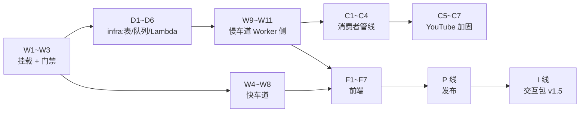

# 002 Watch Router — 实施清单(action items)

> 状态:2026-08-25 从 [02-技术方案.md](02-技术方案.md)(多用户版,含文首修订 ④)拆出;**2026-08-26 用户侧四件套全部到位(SNS 确认/Docker/Webshare/GROQ),真容器带代理与转写凭证上线,慢车道全自动运转**。剩余项见 §7:I 线交互包、C6 失败路由、单测欠账。
> 按**infra / Worker 后端 / 消费者 / 前端 / 与 001 交互 / 发布**六条线组织,每条带落点文件路径;□ 可勾选。方案层面的「为什么」不在这里重复,括号里的 T 指回 02 的对应决策。
> 与 02 §4 任务表的关系:那张表是周排期视角(1/2/3/4/4b/5/5b/6 + 交互包),本清单是工程执行视角,粒度更细;对应关系标在每节标题里。
> **命名已拍板(2026-08-26,02 风险 7 关闭)**:中文名「长视频总结」,slug 维持 `watch-router`;文档正文里的旧称「观影路由」是历史记录不回改。
>
> **2026-08-25 已全量上线**(除 C 线消费者):KV namespace `f0573f4f…` 已建;五个 secrets 经 `wrangler secret bulk` 注入(⚠️ 实测坑:PowerShell 管道给 `wrangler secret put` 会污染值的尾部,SSO 验签 401 才暴露,必须用 bulk);Worker 与主站双端已部署;白名单已种 panghd0811@gmail.com。**线上实测**:SSO 302 全链路、快车道 3/3(含阮一峰盾页站,44–93s,SSE 经真实 CF 代理无 524,锚定全中)、慢车道任务消息带完整 payload 到达占位 Lambda、配额 429 如实触发。⚠️ 第二个实测坑:aws4fetch 只签 string/ArrayBuffer body,传 `URLSearchParams` 对象会抛异常(sqs.ts 已修)。CF 出口 IP 的抽取成功率初步样本 3/3,继续观察。
>
> **2026-08-26 慢车道生产端到端验证**:消费者管线(C1–C4/C7)完成,用本机跑 `consumer/dist/local.mjs` 当临时消费者——Karpathy 1hr YouTube 视频经「提交 → SQS → 字幕(zh 429 后 en 成功)→ DeepSeek → 锚定 → 回程」产出 12 段地图覆盖全片、锚定 6/6、174 段转写入缓存;失败语义(无字幕+无 whisper key → 显式报错)同验。~~当前运行形态:占位 Lambda 事件源已禁用,慢车道无常驻消费者~~(已过时,见下)。`CONSUMER_TOKEN` 存 `.dev.vars`(gitignored)与 CF secret 同值。
>
> **2026-08-26 晚收尾:真容器 + 全部凭证上线,慢车道全自动**。用户侧四件套齐:SNS 告警已确认、Docker 构建通(坑:基础镜像 dnf python3 缺 SSL,yt-dlp 改官方单文件二进制)、Webshare Rotating Residential 1GB($3.50/月,用户误填国家固定会话 `-gb-1`,已纠正为 `-rotate`,轮换实测三连不同国家 IP)、GROQ key 验证 200。凭证经 cdk deploy 注入 Lambda env;**代理生效实证:此前 AWS IP 连字幕都拿不到,注入后云端任务 `path=subtitle` 直接过**。当前形态:SQS→Lambda 容器自动消费,无需任何常驻进程;本机 `local.mjs` 降级为后备(提额被拒/顶穿 15 分钟时用)。

## 0. 建议动工顺序(依赖关系)

| 里程碑 | 完成判据(照抄 02 §4 的验证列) | 状态(2026-08-26) |
|---|---|---|
| M1 = W1–W3 | next dev 代理下 `/products/watch-router/` 200;launch 302 链路通;无会话 401 带 loginUrl;非白名单 403;mock 模式零配置可跑;`npm run check` 过 | ✅ 全过(含线上) |
| M2 = W4–W8 + F1–F5 | 10 条真实文章 URL ≥8 条出正文;quote 锚定匹配率人工抽查;mock 下快车道 e2e | ✅ 10/10 抽取、锚定 11/11(本地)+ 3/3(线上) |
| M3 = D 线 + W9–W11 + C1–C4 + F6 | `cdk deploy` 成功;线上投 1 条 B站长视频 + 1 条播客端到端;人为掐断 complete,验证 10 分钟超时显式失败、重投 2 次后落死信队列;缓存命中秒出 | ✅ 全链验证(YouTube 1hr/2hr 端到端、**BBC 播客 enclosure → whisper 转写 done**、超时显式失败、DLQ 37min 落信、缓存秒出);B站补记:海外 IP 的地区限制内容显式报错=正确行为,海外可看样本留日常使用自然验证 |
| M4 = C5–C7 | 线上 Lambda 实抓 3 条 YouTube 长视频字幕全通;拔掉代理验证兜底路由真的接手 | ◐ **字幕判据达成:3/3 YouTube 经代理 `path=subtitle` 完成**(含 2 小时 Karpathy——暴露并修复 Lambda 输出预算 8192→16384,thinking 占预算被截断);「拔代理验兜底」与 C6 失败路由未做。**方案级发现:B站从 AWS IP 一律 412(风控拦数据中心段),T9「B站不走代理」假设被推翻,B站已改走代理**(流量账:1hr 视频音频约 14MB,1GB 池约 70 小时) |
| M5 = P 线 | 纯净 clone 单文件夹 `npm i && npm run dev` mock 跑通(发布门槛);双语 catalog 行 + 主站文案上线 | ✅ 全过 |
| M6 = I 线(v1.5) | 从线上 001 简报任一条一键进 002 并直接提交;有 token 时地图出现追踪器高亮;删掉 token 自动降级、主流程无感 | ✅ 达成(2026-08-26):深读链接进线上 bundle;高亮 17 段正命中 + 零命中缓存 + 无配置用户安静降级,三态线上实测 |

---

## 1. infra(私有 infra 仓,D 线;↔ 02 任务 4b)

- [x] **D1 · stack 脚手架**:私有 infra 仓加 `lib/watch-router-stack.ts`,挂进现有 CDK app;账号/region 与 001 同(<AWS 账号 ID> / us-east-1),复用告警底座。*2026-08-25 已部署,stack `NanisleWatchRouter`,12 资源全绿*
- [x] **D2 · DynamoDB 表**(T6):表名 `nanisle-watch-router`,`PK`(S)+ `SK`(S),TTL 属性名 `ttl`,预置 5 读/5 写(部署时从清单原定的 on-demand 改为预置——账户级 25 RCU/WCU 永久免费额度内,同 001 理由)。键约定:`WHITELIST/<email>`;`USER#<email>` + `USAGE#<date>`(配额,001 Q1 同款原子占位,ttl 7 天)/ `READ#<platform>:<id>`(处理记录 + 个性化片段,不设 ttl);`TASK#<id>` + `META`(任务状态机,ttl 1 天)。*表 ACTIVE、TTL 已启用实测确认*
- [x] **D3 · SQS 队列**(T1):主队列 + 死信队列;`visibilityTimeout` 16 分钟(> Lambda 超时)、`maxReceiveCount` 2 → DLQ。*全链路已实测:正常消费秒级完成;`__fail__` 消息 2 次失败后于 37 分钟落入 DLQ(与 2×16min 可见性超时吻合)*
- [x] **D4 · Lambda 容器函数**(T1):`DockerImageFunction`(x86_64,与镜像内 ffmpeg 一致),timeout 15 min、memory 2048MB、ephemeralStorage 4GB;SQS 事件源 `batchSize: 1, maxConcurrency: 2`(不占账号并发配额)。*2026-08-26 真容器上线:镜像构建 87s、事件源恢复 Enabled;不再钉 functionName(换资源类型整体替换会撞名)。**云端端到端已验**:SQS→容器→yt-dlp 跑通→progress 回调(任务可见 step/path)→无 key 显式报错;YouTube 字幕被 AWS 数据中心 IP 拦=T9 精确应验,成功路径等 GROQ key + Webshare 代理。两个构建坑:①基础镜像 dnf 的 python3 缺 SSL 模块 pip 必挂——yt-dlp 改官方单文件二进制;②env 注入沿 001「漏设即硬报错」守门,部署命令要先从 .dev.vars 读 CONSUMER_TOKEN/DEEPSEEK 进环境*
- [x] **D5 · 最小权限 IAM**:用户 `nanisle-watch-router-worker` + `nanisle-watch-router-dev`(两把 key 分开,轮换理由同 001),policy 只含该表的 `GetItem/PutItem/UpdateItem/DeleteItem/Query` + 该队列的 `sqs:SendMessage`;Lambda 执行角色**不给**表和 KV 的任何权限(T1 的不变量:状态只有 Worker 能写)。*access key 未发——等 W 线 Worker 存在时再 `aws iam create-access-key` + `wrangler secret put`,钥匙不提前放着*
- [x] **D6 · 告警**:CloudWatch——Lambda 调用量 >30 次/小时告警(001 Q4 同款,阈值按 002 量级调低);DLQ 深度 >0 告警(死信 = 有任务两次都失败,必须有人看见)。*完成:部署到 panghd0811@gmail.com(与 001 同邮箱;告警名 `nanisle-watch-router-*` 前缀与 001 的 `daily-brief` 系天然区分),SNS 订阅 2026-08-26 用户已确认。坑:SNS 确认信容易进垃圾箱,卡 PendingConfirmation 时重新 subscribe 同端点即可重发*

**Worker 侧 secrets 清单**(D5 配套,产品 Worker):`AWS_ACCESS_KEY_ID`、`AWS_SECRET_ACCESS_KEY`、`DEEPSEEK_API_KEY`、`NANISLE_SSO_SECRET`、`CONSUMER_TOKEN`、`JINA_KEY`,v1.5 加 `INTEROP_TOKEN`;vars:`DDB_TABLE`、`QUEUE_URL`、`AWS_REGION`。同步维护 `.dev.vars.example`。
**Lambda env 清单**(D4 配套,CDK 注入):`DEEPSEEK_API_KEY`、`GROQ_API_KEY`、`CONSUMER_TOKEN`、`WORKER_BASE_URL`、`PROXY_URL`,可选 `TRANSCRIPT_API_KEY`。

---

## 2. Worker 后端(产品仓 `src/`)

### 挂载与门禁(→ M1;↔ 02 任务 1、2)

- [x] **W1 · 模板复制改名**(T8 #5):复制 `templates/web-app` → `products/002-watch-router/`;`vite.config.ts` 加 `base: "/products/watch-router/"` + `port: 5200, strictPort: true`;`wrangler.jsonc` 加 `assets.binding/run_worker_first`;`src/worker/index.ts` 加 `PRODUCT_MOUNT` 常量与 `unmountRequest()`(从 001 复制改常量)。*2026-08-25 完成;`npm run check` 全绿(tsc + vite build + wrangler dry-run);KV namespace id 为占位符,首次真部署前 `wrangler kv namespace create WATCH`*
- [x] **W2 · 主仓五处登记**(T8 #1–4):`web/lib/product-mounts.ts` 加 `{ slug: "watch-router", binding: "WATCH_ROUTER", devPort: 5200, landing: "" }` 并给 `ProductMount` 加可选 `landing` 字段;`web/wrangler.jsonc` services 手工同步;`web/custom-worker.ts` 的 `Env` 加 `WATCH_ROUTER: Fetcher`;`web/app/api/launch/[slug]/route.ts` 落地页改 `dest(landing)`。*完成;launch 302 链路的线上验证待两端一起部署时做*
- [x] **W3 · 门禁移植**(T5/T7):`src/worker/sso.ts` 从 001 **原样复制一字不改**;`guard.ts`(userGuard/userAiGuard/adminGuard,401 带 loginUrl / 403 内测文案两态,白名单每请求复查);白名单查 DynamoDB(`shared/store.ts` 最小 Store:DdbStore aws4fetch + MemoryStore 替身);`src/shared/ai.ts`(四档接缝)、`style.ts` 物理复制。*完成;本地 mock 冒烟通过:health(provider=mock/store=memory/dev@local)、submit 返回 mock 结果、空输入 400、task 端点诚实 501;/auth/sso 含内测 403 页,会话 cookie 名 `nanisle_watch_session` 与 001 区分*

### 快车道(→ M2;↔ 02 任务 3)

- [x] **W4 · 抽取链**(T2):`src/worker/extract.ts`——fetch(常规浏览器 UA)→ linkedom parse → Defuddle 抽正文(退 `@mozilla/readability`)→ 正文 <500 字符判静默失败 → `r.jina.ai/{url}`(带 `JINA_KEY`,没配时匿名兜底聊胜于无)→ 仍失败返回「粘贴正文」提示。*完成;10/10 真实 URL 抽取通过(含 GitHub 仓库页)。两个实测大坑已修:①Defuddle 的 markdown 选项在 linkedom 下静默失效,返回无换行 HTML,整篇挤成 1 段——改为自己从块级元素提取干净段落(`htmlToParagraphs`);②上古排版(paulgraham.com)段落靠 `  ` 分隔,块提取前先把 br 转换行。**测试口径局限:本地出口是家用 IP,线上 CF 数据中心 IP 的直抓成功率要部署后看真实数据***
- [x] **W5 · 输出 schema 与编辑调用**(T4):`src/shared/schema.ts`(类型 + `validateWatchResult` 运行时校验)+ `src/shared/editor.ts`(prompt 硬规则 + 调用)——按段落编号 `[P#]` 喂全文,一次调用出 T4 schema(`json: true`,ai.ts 内部流式防空闲超时);超 200K 字符按段落边界诚实截断;meta 由代码填,模型给的丢弃;mock 模式内部短路返回示例。*完成;真 key 实测两篇:阮一峰 curl 教程(中文,135 段 → 22 段地图 + 5/5 锚定,66s)、Paul Graham Great Work(英文,233 段 → 17 段地图 + 6/6 锚定,123s),两篇地图均首尾相接无空洞、要点具体有料。「来源自带章节优先沿用官方边界」属慢车道消费者侧,随 C 线做。注:超长英文散文耗时可到 2 分钟,02 §2 快车道「几秒到几十秒」按此上修*
- [x] **W6 · quote 锚定校验**(T4):`src/shared/anchor.ts` 纯函数——去空白/标点/符号后小写子串匹配,每条要点标 `anchored`,配不上的前端灰显「未能在原文中定位」,不删要点。*完成;真 key 中英两篇合计 11/11 命中(段落提取修干净之前是 0/5——锚定对正文噪声极敏感,这正是它能兼职当抽取质检器的原因)。单测待 vitest 基建进来后补边界样例*
- [x] **W7 · 内容缓存**(T6):KV `content:<platform>:<id>` 读写,TTL 60 天;`/api/submit` 两条车道共用的命中短路。*完成;实测同内容不同 URL 形态命中同一缓存,且缓存命中不占配额*
- [x] **W8 · 内容 ID 归一**:`src/shared/content-id.ts`——URL → `platform + id`(YouTube watch/youtu.be/shorts、B站 BV+分P、小宇宙 episode、裸音频、文章 URL 去跟踪参数后 hash、粘贴文本按内容 hash),同内容不同 URL 形态命中同一缓存键。*完成(冒烟验证 B站/YouTube 变体);已知局限记录在文件头:b23.tv 短链不跟重定向,按 hash 归一。单测待测试基建(vitest)进来后补*

### 慢车道 Worker 侧(→ M3;↔ 02 任务 4)

- [x] **W9 · Store 接缝**(T6):`src/shared/store.ts`——DynamoDB 实现用 `aws4fetch`(001 B2 同款姿势);方法:任务状态机(条件写迁移,不静默 upsert)、`reserveQuota`(原子占位,001 Q1 同款,占位失败 429、模型报错不退还)、处理记录读写、白名单;mock 内存实现同接口,fork 者零配置跑通。*完成。踩坑记录:内存替身必须模块级单例(makeStore 每请求调用,new 出来的状态活不过单次请求);dev 多 isolate 下内存配额是 isolate 本地的,429 触发点可能偏移——只影响 mock,生产 DynamoDB 原子占位无此问题*
- [x] **W10 · submit 分流**(T1):`POST /api/submit`——W8 判型 → 缓存命中短路(不占配额)→ 快车道(抽取后占位、SSE 流式,W4–W6 真实现)/音视频先 `reserveQuota` 再记任务(pending)→ aws4fetch 直签 SQS `SendMessage` → 返回任务 ID;mock 模式跳过 AWS 链直接完成示例任务。*完成;任务先落库再投递的顺序不变量写进注释;SQS body 必须 toString(aws4fetch 只签 string,线上 500 实测)*
- [x] **W11 · 任务 API**(T1):`GET /api/task/:id`——轮询读任务状态(属主校验,非属主与不存在同为 404),超 10 分钟无进展在读取时判定显式失败;`POST /api/queue/progress` / `complete`——`x-consumer-token` 鉴权(未配置 = 端点关闭),complete 先校验 result schema(`validateWatchResult`)→ 写 KV 缓存 → 落处理记录 → 任务标 done(先缓存后标 done 的顺序不变量);W6 锚定校验位置已留 TODO。*完成;mock 全生命周期 + 401/404/429 边界冒烟通过*

---

## 3. 消费者(产品仓 `consumer/`,→ M3/M4;↔ 02 任务 5、5b)

- [x] **C1 · Dockerfile**(T1):base `public.ecr.aws/lambda/nodejs:22`;pip 装 yt-dlp(钉版本);ffmpeg 静态包构建时下载(80MB 二进制不进仓);esbuild 单文件产物零 node_modules。*已写(`consumer/Dockerfile`);**镜像是 x86_64,CDK 换容器时 Architecture 要从占位的 ARM_64 改成 X86_64**(注释已写死)。构建待 Docker Desktop*
- [x] **C2 · handler 骨架**(T1):`consumer/src/{lambda,local,pipeline,callbacks}.ts`——同一份管线两个入口:Lambda(SQS event)+ **本地长轮询模式**(`local.mjs`,联调工具兼提额被拒/超长视频的既定后备,契约与 Lambda 完全一致);幂等靠 progress 回包 `done:true`(Worker 端配合改造);每任务独立临时目录 + finally 清理;失败语义:管线内失败 `complete({error})` 显式上报不重试,只有回程失败抛给 SQS 重投。*esbuild 打包(`npm run build:consumer`),tsc+dry-run 全绿*
- [x] **C3 · 字幕优先管线**(T5):yt-dlp 逐语言组尝试(zh 组 → en 组,**通配 sub-langs 一把抓会因任何一条语言轨 429 而整体失败,实测**);VTT 解析含滚动字幕去重 + 20 秒窗合并;`editTranscript`(shared/editor.ts 新增秒数语义 prompt)。*2026-08-26 生产端到端验证:Karpathy 1hr 视频,zh 组 429 后 en 组成功,174 段 → 12 段地图覆盖 0–3588s、锚定 6/6、转写段落入缓存。**家用 IP 连续测试也会被字幕接口 429——T9 代理必要性的又一实证**。B站 CC/播客 enclosure 样本待测*
- [x] **C4 · whisper 兜底**(T5):yt-dlp 下音频 → ffmpeg 32kbps 单声道 → Groq `verbose_json` 拿分段时间戳。*完成并活测:BBC Global News 播客 enclosure(~30min)云端 `path=whisper` 端到端 done;无 key 失败语义此前亦已生产验证*
- [x] **C5 · YouTube 代理**(T9):Webshare Rotating Residential 1GB($3.50/月,Pro 附加项全不需要:High Concurrency 默认 500 远超我们并发闸 2,IP 授权与我们的密码认证无关);yt-dlp `--proxy` 只对 YouTube 生效;凭证只进 `.dev.vars`(gitignored)与 Lambda env(CDK 注入),不进任何仓。*完成;⚠️ 用户名必须用 `-rotate` 后缀的轮换入口——Proxy List 列表里 `-gb-1` 这类是国家固定会话(用户初填踩过);轮换实测三连不同国家 IP;注入后云端任务字幕直接拿到(此前 AWS IP 全拦)*
- [ ] **C6 · 失败路由**(T9):YouTube 字幕:代理重试 2 次 → TranscriptAPI(或 Supadata 免费档)→ whisper 兜底;每条任务按平台记成功/失败与所走路径,CloudWatch 里能按平台统计成功率(02 风险 2 的运营指标)
- [x] **C7 · 本地调试路径**:`consumer/README.md`——本地长轮询跑法(环境变量清单 + export-credentials)、docker run + RIE 示例、失败语义三条。*完成;比原计划多出「本地进程直接当生产消费者」这条路,Docker 未就绪也能跑通慢车道*

---

## 4. 前端(产品仓 `src/react-app/`,→ M2/M3)

- [x] **F1 · 收单页**:首页即输入框(URL 或粘贴正文),读 `?url=` query 预填(I1 深读入口的承接端);提交后按车道进流式状态或进度轮询。*完成*
- [x] **F2 · 快车道流式渲染**:`/api/submit` 快车道改 SSE(phase→delta→result/error;thinking 期无 content 增量,10 秒 ping 兜底保活),前端读流显示「抽取中/编辑中…已生成 N 字」。**这不只是体验:主站域名经 CF 代理 100 秒无字节会 524,长文编辑实测 123 秒,缓冲式响应上线必挂**。ai.ts 加了可选 `onDelta` 回调(对 001 版的加法式扩展,已注明)。*真 key 实测:62 秒流里 2 phase + 6 ping + 8 delta + result,保活成立*
- [x] **F3 · 结果页**(T4):判决/总体要点(带 quote 与位置)/分段地图(灰段 + 低价值统计,`tracked` 高亮待 I3)/路径徽章/`truncated` 标注/标题。*完成*
- [x] **F4 · 跳转落地**(T4):B站/YouTube 带秒数 URL(`t=` 参数,新窗口开原片);播客展示 `mm:ss`;文章/粘贴的段号可点,展开原文区滚动定位 + 短暂高亮(缓存与 SSE result 均带 `paragraphs`,任务结果带 `url`)。*完成;慢车道转写文本的段落跳转待 C 线把 transcript 段落交上来*
- [x] **F5 · 低置信渲染**(T4):锚定没配上的要点灰显 + 「未能在原文中定位」,不可跳转。*完成*
- [x] **F6 · 进度页**:轮询五步进度 + 失败态(超时/转写失败/配额的区分文案由服务端下发,超时文案引导粘贴 transcript)。*完成(mock 全生命周期验证;真实慢车道等 C 线)*
- [x] **F7 · 配额读数**:`GET /api/usage`(userGuard,只读不占位)+ 页眉「今日额度 N/10」,提交后刷新;上限由服务端下发。*完成;实测 0→1、缓存命中不涨*

---

## 5. I 线 · 与 001 的交互包(v1.5,→ M6;↔ 02 任务 7、8)

- [x] **I1 · 深读入口**(T7①,001 仓):001 阅读页操作区「深读 →」链接(根相对路径 `/products/watch-router/?url=…&from=daily-brief`,同源挂载下本地代理与线上都通,002 下线只是 404 不牵连)。*完成,线上 bundle 已确认*
- [x] **I2 · interop 端点**(T7②,001 仓):`GET /api/interop/trackers?email=`,`x-interop-token`(safeEqual)鉴权,只返回生效追踪器的定义文本(草稿过滤);未配 token = 端点关闭。*完成并线上验证:无/错 token 401,本人返回真实定义,**无配置用户返回空数组且零副作用——差点踩雷:loadConfig 对无配置用户会落默认配置并写进订阅名单,interop 改用裸 getConfig***
- [x] **I3 · 用户级高亮调用**(T4/T7②,002 仓):交付时刻(缓存命中/快车道 result/任务 done)做 fast 档小调用(gist 列表 + 追踪器定义),`tracked` 合并进**该用户的结果副本**(共享缓存原件不动),结果缓存进处理记录(`ReadRecord.tracked`,含 `{}` 零命中——算过就不重算);任何失败安静降级。*完成并线上验证:Building Effective Agents 一文 17 段命中「AI Agent 追踪」并带名字渲染;LLM 入门讲座零命中被正确缓存(高置信口径下合理)。**两个实测坑**:①Worker fetch 回自己 zone(nanisle.com)一律 522——interop 必须走 001 的 workers.dev 直连域;②Worker 侧 AI_MAX_OUTPUT_TOKENS 8192 被高密度长文顶穿(thinking 占预算),对齐 Lambda 提到 16384*

---

## 6. P 线 · 发布(→ M5;↔ 02 任务 6)

- [x] **P1 · README 与示例配置**:产品 README(部署一节 `npm run deploy` 与 infra 仓 `cdk deploy` **两条命令并排写死**,并注明快车道只需第一条)、`.dev.vars.example`。*完成;`consumer/README.md` 随 C 线*
- [x] **P2 · catalog 与主站文案**:双语 catalog 行(_building_/_开发中_);`web/content/products/002-watch-router.md` 三段骨架,frontmatter 对齐 001(`login: true`、demo 指主域挂载根路径、`status: building`),验收标准与四条已交学费的坑写进「学到了什么」。*完成;中文名暂用「观影路由」——slug/中文名仍是 02 风险 7 待拍板项,评审时定*
- [x] **P3 · fork 路径验证**:002 目录拷出为纯净单文件夹,零配置 `npm i && npm run dev` 实测——health mock/memory、快车道 SSE 出 mock 结果、慢车道 mock 全生命周期 done、额度计数正常。*完成(发布门槛达标)*
- [x] **P4 · 已知约束记录**:README「Known constraints」一节三条——开放使用前须复刻 001 护栏;Lambda 15 分钟上限与账号并发额度现状(烧钱闸暂为提交配额 + 调用量告警);快车道对硬防护站依赖 r.jina.ai、粘贴框是永久保底。*完成*

---

## 6.5 N 线 · 记录与想法(2026-08-26 用户首用反馈新增;哲学同 001 N 线:结果是内容,想法是读者的长期资产)

- [x] **N1 · 存储**:`ReadRecord` 天然就是历史索引(每次处理已在写);新增 `NoteRecord`(`USER#<email>` + `NOTE#<contentKey>`,entries 上限 50 条有界,快照原则:title/url 建账抄一次不再动);Store 加 `listReadRecords`(全量拉封顶 200 按 at 排序——SK 非时间序,内测规模一次 Query 够,量大再加 GSI)/`getNote`/`putNote`
- [x] **N2 · 端点**:`GET /api/history`(历史列表)、`GET /api/result/:key`(重开:缓存 60 天内直接回,过期带 expired 标记引导重算——比永久化每份结果便宜,重算若他人算过=缓存命中零成本;高亮从处理记录合并零调用)、`GET /api/note/:key`、`POST /api/note`(target 白名单 `overview|general|kp:n|ch:n`,2000 字上限,须先有处理记录)、`POST /api/note/delete`;submit/task 各响应补 `contentKey`
- [x] **N3 · 前端**:报头「我的记录」视图(标题+时间,点开重看);想法四类锚点(导读卡/每条要点/每个分段/页尾「我的想法」),亲笔内容用衬线+朱红左边线与 AI 产出一眼可分,追加/删除即时。*mock 全流程冒烟:提交→记两条→历史→重开带想法→非法 target 400;线上匿名 401*
- [x] **同批 · 导读区**(用户反馈「summary 太简单」):`overview{summary/interesting/counter}` 进 schema(可选兼容老结果),双 prompt 硬规则(counter 批判视角须落在内容论点上,没有就诚实说没有);内容缓存键升 `v2`(schema 破坏性升级的换代手法,老缓存随 TTL 消亡)。*Boris 访谈实测:概述连贯、counter 指出嘉宾立场偏向——质量过线*

---

## 7. 当前待办(2026-08-26 晚更新;用户侧阻塞项已全部清零)

按优先级(2026-08-26 深夜再更新:I 线完成,UI 已对齐主站设计语言):

1. **C6 · 失败路由**(约 1h,最后一个功能项):代理重试 2 次 → TranscriptAPI/Supadata → whisper;按平台记成功/失败与路径进 CloudWatch(02 风险 2 的运营指标);顺带补 M4 的「拔代理验兜底」验证
2. 单测基建(vitest)+ W6 锚定/W8 归一的边界样例(清单备注挂着的欠账)
3. 主站文案 `status: building → active` 与「学到了什么」实录更新(观察一两周真实使用后)
4. 运营观察项(不排期):CF 出口 IP 快车道成功率、Webshare 流量消耗(1GB 池)、DeepSeek 编辑质量、高亮命中口径是否过严——素材进「学到了什么」

## 8. 详细总结 + 订阅模式(2026-08-28;方案正本 [05-订阅模式与详细总结方案.md](05-订阅模式与详细总结方案.md))

- [x] **A1 · schema 与大纲调用**:`notes/terms/targetChars/coverageGaps` 进 schema 与校验;大纲 prompt 加术语表;缓存键 `v2→v3`。**消息结构对调**:原文块当 system、指令当 user——为的是后面 N 次逐章调用共享同一前缀命中 DeepSeek 缓存(`editor.ts` 文首注释)。*mock 结果自带三章示例笔记*
- [x] **A2 · 逐章详写 + 校验 + 拼装**(`src/shared/notes.ts`):并发池、reasoning 参数(`ai.ts` 加 `reasoning: none|low|high` → `reasoning_effort`/`thinking`)、引文限本章窗口锚定、确定性拼装;`ai.ts` 加 `stream_options.include_usage` 把 `prompt_cache_hit_tokens` 打进日志。*基准(consumer/src/notes-bench.ts)实测:PG《Great Work》66K 字符英文长文 → 18~28 章、1.3~1.6 万字、要点锚定 90/96 与 136/142;Karpathy 1h → 16~17 章、7.3~8.5K 字。**前缀缓存生效**:章节调用 cache_hit≈26.7K/28.4K(前 2~3 个并发首发未命中是缓存写入延迟,之后全中)。**两个真实问题已修**:①英文原文有一章模型把 quote 翻成中文,整章锚定 0/6——加「全部未锚定则带纠正提示重试一次」;②YouTube 自动字幕的滚动半重复(cue 两行、第一行重复上一 cue)让 `parseVtt` 的整 cue 去重漏掉,一句话进模型两遍、模型引用时自己去重导致锚定失败(11/60)——改按行去重。**思考力度对照**:详写 none 比 low 快一半(284s vs 575s)但锚定 82%→69% 且出现「70 亿参数」这类数字错——留 low,并发 3→6 换时间*
- [x] **A3 · 覆盖检查 + 补漏**:每 5 分钟/每 8 段一窗,窗内无带位置要点且不在 low 章 → flash 只看该窗补 1~3 条(锚定不过的丢),`meta.coverageGaps` 记补漏前空窗数。*PG 长文 2 空窗补 1;Karpathy 0 空窗*
- [x] **A4 · 快车道跟进 + 前端**:文章 ≥3,000 字启用详写(SSE 每章推 `phase:notes` 保活);结果页「详细笔记」按章渲染(章头时间码/标题/低价值章一行灰、要点带引文可跳、补漏与失败标注)、术语表、有笔记时分段地图并入章头;老结果提示「重新生成可得」。*本地真 key 全流程:PG 长文 18 章 SSE 无断流*
- [x] **B0 · 发现接口验证(本机)**:`src/shared/discover.ts` 纯函数(自包含 md5 做 B站 APP 签名、UULF RSS、播客 RSS、挑选规则)从本机实测三平台全通(YouTube 15 条、B站 20 条含时长、播客 281 条含时长;`card?mid=` 免签取昵称)。**云端(真 Lambda + 轮换代理)成功率待 cdk deploy 后验**
- [x] **B1 · 订阅管理**:`Store` 加订阅/候选/SUBRUN/PREFS(DDB `SUB#`/`CAND#`/`SUBRUN#`/`PREFS` + `SUBSCRIBERS` 索引分区;内存替身同步);`GET/POST /api/subs`、`/api/subs/delete`、`/api/subs/prefs`;输入解析(频道 URL/@handle 抓频道页 meta、space URL、b23 跟 302、播客 RSS 校验);前端「订阅」视图。*本地 e2e:三平台各订一个、重复 409、YouTube 频道名从 `<author><name>` 取(playlist feed 顶层 title 是「Videos」的坑已修)*
- [x] **B2 · 发现与挑选**:`wrangler.jsonc` 两条 cron(00:00 发现 / 01:30 兜底,UTC)+ `scheduled()`;`{kind:"discover"}` 消息与总结任务同队列,消费者 `discover.ts` 经代理 curl 抓三平台(YouTube 前 3 条 yt-dlp 补时长)→ `POST /api/queue/candidates` → Worker 当场挑(`pickDaily`:48h/≥8min/≤150min/未处理/非直播番剧 Shorts/频道轮转/新在前)→ 缓存命中直达或 `createTask(origin=subscription)`;`POST /api/subs/run` 本地/调试内联跑一轮。*本地 e2e:306 候选挑中一条 48h 内播客,mock 慢车道 done 进「我的记录」,`lastPickedAt` 更新,`today` 读数正确*
- [x] **B3 · 邮件**:`src/shared/email.ts` 从 001 复制改模板(频道·标题·时长·判决一句 + 「打开总结」按钮,不放要点不放原片链接);complete 端点 `origin=subscription` 时 `notifySubscription`;`?open=<key>` 前端重开;`/api/email/unsub` GET/POST;`EMAIL_UNSUB_SECRET`/`EMAIL_FROM`;infra `watch-router-stack.ts` Worker 用户加 `ses:SendEmail`。*未配密钥时日志 `email skipped`,不影响落库;真发信待部署后验*
- [x] **部署与云端验证(2026-08-28 晚)**:`wrangler secret bulk` 种 `EMAIL_UNSUB_SECRET`(Worker 版本 `9e9f7976`,两条 cron 已注册)→ `cdk deploy NanisleWatchRouter` 新镜像。**线上实测**:①Karpathy 1hr 走字幕路径 **Lambda 5.4 分钟**,11 章 6,755 字、术语 12、要点锚定 45/46、空窗 0,章节调用 cache_hit 12,416/13,880(≈89%);按行去重后转写 token 从 27.5K 降到 13.9K;②SQS 直投 `discover` → Lambda 经代理:**B站 APP 接口云端 20/20**、YouTube 5、播客 281 → 回传 → 挑中一条播客 → whisper 路径 done → **第一封订阅邮件已发出**(Worker 日志 `[subscription] email sent`)。**三个部署坑**:①cdk 整 app synth 要过 001 的 `EMAIL_UNSUB_SECRET` 守卫与 002 的 `CONSUMER_TOKEN` 守卫,且**不带 `ALERT_EMAIL` 会把 D6 告警和 SNS 主题整个删掉**——本次发现之前已被删过一次,重建后 SNS 确认信要用户再点;②infra 里并行会话写的 `./owner-lane.js` 导入在 `--experimental-strip-types` 下找不到模块,改 `.ts`;③首封邮件主题是 UUID——裸 mp3 链接 yt-dlp 给的「标题」是路径 id,已改为订阅挑选时把 RSS 标题随 `TaskMessage.title` 带给消费者、邮件与记录以它为准(待再部署)。Cloudflare 出口解析:YouTube `@handle` 频道页能抓、B站 `card` 被 412(昵称留空),与预判一致
- [ ] **B4 · 观察两周**:`SUBRUN`、`coverageGaps`、Webshare 流量(B站多走 whisper)、Lambda 时长(2h 视频逼近 15 分钟时提并发或降章数)
