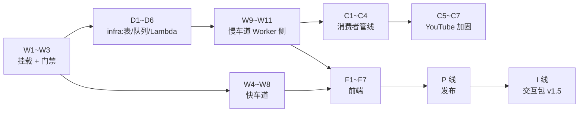

# 002 Watch Router — 实施清单(action items)

> 状态:2026-08-25 从 [02-技术方案.md](02-技术方案.md)(多用户版,含文首修订 ④)拆出,随 02 一起待评审,拍板后动工。
> 按**infra / Worker 后端 / 消费者 / 前端 / 与 001 交互 / 发布**六条线组织,每条带落点文件路径;□ 可勾选。方案层面的「为什么」不在这里重复,括号里的 T 指回 02 的对应决策。
> 与 02 §4 任务表的关系:那张表是周排期视角(1/2/3/4/4b/5/5b/6 + 交互包),本清单是工程执行视角,粒度更细;对应关系标在每节标题里。
> ⚠️ slug 暂按 `watch-router`(02 风险 7 未拍板),若改名需全局替换本清单中的路径与常量。

## 0. 建议动工顺序(依赖关系)

| 里程碑 | 完成判据(照抄 02 §4 的验证列) |
|---|---|
| M1 = W1–W3 | next dev 代理下 `/products/watch-router/` 200;launch 302 链路通;无会话 401 带 loginUrl;非白名单 403;mock 模式零配置可跑;`npm run check` 过 |
| M2 = W4–W8 + F1–F5 | 10 条真实文章 URL ≥8 条出正文;quote 锚定匹配率人工抽查;mock 下快车道 e2e |
| M3 = D 线 + W9–W11 + C1–C4 + F6 | `cdk deploy` 成功;线上投 1 条 B站长视频 + 1 条播客端到端;人为掐断 complete,验证 10 分钟超时显式失败、重投 2 次后落死信队列;缓存命中秒出 |
| M4 = C5–C7 | 线上 Lambda 实抓 3 条 YouTube 长视频字幕全通;拔掉代理验证兜底路由真的接手 |
| M5 = P 线 | 纯净 clone 单文件夹 `npm i && npm run dev` mock 跑通(发布门槛);双语 catalog 行 + 主站文案上线 |
| M6 = I 线(v1.5) | 从线上 001 简报任一条一键进 002 并直接提交;有 token 时地图出现追踪器高亮;删掉 token 自动降级、主流程无感 |

---

## 1. infra(私有 infra 仓,D 线;↔ 02 任务 4b)

- [x] **D1 · stack 脚手架**:私有 infra 仓加 `lib/watch-router-stack.ts`,挂进现有 CDK app;账号/region 与 001 同(494347858613 / us-east-1),复用告警底座。*2026-08-25 已部署,stack `NanisleWatchRouter`,12 资源全绿*
- [x] **D2 · DynamoDB 表**(T6):表名 `nanisle-watch-router`,`PK`(S)+ `SK`(S),TTL 属性名 `ttl`,预置 5 读/5 写(部署时从清单原定的 on-demand 改为预置——账户级 25 RCU/WCU 永久免费额度内,同 001 理由)。键约定:`WHITELIST/<email>`;`USER#<email>` + `USAGE#<date>`(配额,001 Q1 同款原子占位,ttl 7 天)/ `READ#<platform>:<id>`(处理记录 + 个性化片段,不设 ttl);`TASK#<id>` + `META`(任务状态机,ttl 1 天)。*表 ACTIVE、TTL 已启用实测确认*
- [x] **D3 · SQS 队列**(T1):主队列 + 死信队列;`visibilityTimeout` 16 分钟(> Lambda 超时)、`maxReceiveCount` 2 → DLQ。*全链路已实测:正常消费秒级完成;`__fail__` 消息 2 次失败后于 37 分钟落入 DLQ(与 2×16min 可见性超时吻合)*
- [ ] **D4 · Lambda 容器函数**(T1):`DockerImageFunction`,code 指产品仓 `consumer/`;timeout 15 min、memory 2048MB、ephemeralStorage 4GB;SQS 事件源 `batchSize: 1`。*当前为 zip 空转 handler 占位(本机 Docker 不可用),SQS 触发链路已在真资源上验证;换容器镜像随 C 线。并发闸已改用事件源 `maxConcurrency: 2`——不占账号并发配额,避开 001 的 reserved concurrency 部署失败坑,原清单里的 reservedConcurrentExecutions 方案作废*
- [x] **D5 · 最小权限 IAM**:用户 `nanisle-watch-router-worker` + `nanisle-watch-router-dev`(两把 key 分开,轮换理由同 001),policy 只含该表的 `GetItem/PutItem/UpdateItem/DeleteItem/Query` + 该队列的 `sqs:SendMessage`;Lambda 执行角色**不给**表和 KV 的任何权限(T1 的不变量:状态只有 Worker 能写)。*access key 未发——等 W 线 Worker 存在时再 `aws iam create-access-key` + `wrangler secret put`,钥匙不提前放着*
- [ ] **D6 · 告警**:CloudWatch——Lambda 调用量 >30 次/小时告警(001 Q4 同款,阈值按 002 量级调低);DLQ 深度 >0 告警(死信 = 有任务两次都失败,必须有人看见)。*代码已就位(ALERT_EMAIL 门控,同 001),待用户拍板告警邮箱后补一次部署 + 点 SNS 确认信*

**Worker 侧 secrets 清单**(D5 配套,产品 Worker):`AWS_ACCESS_KEY_ID`、`AWS_SECRET_ACCESS_KEY`、`DEEPSEEK_API_KEY`、`NANISLE_SSO_SECRET`、`CONSUMER_TOKEN`、`JINA_KEY`,v1.5 加 `INTEROP_TOKEN`;vars:`DDB_TABLE`、`QUEUE_URL`、`AWS_REGION`。同步维护 `.dev.vars.example`。
**Lambda env 清单**(D4 配套,CDK 注入):`DEEPSEEK_API_KEY`、`GROQ_API_KEY`、`CONSUMER_TOKEN`、`WORKER_BASE_URL`、`PROXY_URL`,可选 `TRANSCRIPT_API_KEY`。

---

## 2. Worker 后端(产品仓 `src/`)

### 挂载与门禁(→ M1;↔ 02 任务 1、2)

- [x] **W1 · 模板复制改名**(T8 #5):复制 `templates/web-app` → `products/002-watch-router/`;`vite.config.ts` 加 `base: "/products/watch-router/"` + `port: 5200, strictPort: true`;`wrangler.jsonc` 加 `assets.binding/run_worker_first`;`src/worker/index.ts` 加 `PRODUCT_MOUNT` 常量与 `unmountRequest()`(从 001 复制改常量)。*2026-08-25 完成;`npm run check` 全绿(tsc + vite build + wrangler dry-run);KV namespace id 为占位符,首次真部署前 `wrangler kv namespace create WATCH`*
- [x] **W2 · 主仓五处登记**(T8 #1–4):`web/lib/product-mounts.ts` 加 `{ slug: "watch-router", binding: "WATCH_ROUTER", devPort: 5200, landing: "" }` 并给 `ProductMount` 加可选 `landing` 字段;`web/wrangler.jsonc` services 手工同步;`web/custom-worker.ts` 的 `Env` 加 `WATCH_ROUTER: Fetcher`;`web/app/api/launch/[slug]/route.ts` 落地页改 `dest(landing)`。*完成;launch 302 链路的线上验证待两端一起部署时做*
- [x] **W3 · 门禁移植**(T5/T7):`src/worker/sso.ts` 从 001 **原样复制一字不改**;`guard.ts`(userGuard/userAiGuard/adminGuard,401 带 loginUrl / 403 内测文案两态,白名单每请求复查);白名单查 DynamoDB(`shared/store.ts` 最小 Store:DdbStore aws4fetch + MemoryStore 替身);`src/shared/ai.ts`(四档接缝)、`style.ts` 物理复制。*完成;本地 mock 冒烟通过:health(provider=mock/store=memory/dev@local)、submit 返回 mock 结果、空输入 400、task 端点诚实 501;/auth/sso 含内测 403 页,会话 cookie 名 `nanisle_watch_session` 与 001 区分*

### 快车道(→ M2;↔ 02 任务 3)

- [x] **W4 · 抽取链**(T2):`src/worker/extract.ts`——fetch(常规浏览器 UA)→ linkedom parse → Defuddle 抽正文(退 `@mozilla/readability`)→ 正文 <500 字符判静默失败 → `r.jina.ai/{url}`(带 `JINA_KEY`,没配时匿名兜底聊胜于无)→ 仍失败返回「粘贴正文」提示。*完成;10/10 真实 URL 抽取通过(含 GitHub 仓库页)。两个实测大坑已修:①Defuddle 的 markdown 选项在 linkedom 下静默失效,返回无换行 HTML,整篇挤成 1 段——改为自己从块级元素提取干净段落(`htmlToParagraphs`);②上古排版(paulgraham.com)段落靠 `  ` 分隔,块提取前先把 br 转换行。**测试口径局限:本地出口是家用 IP,线上 CF 数据中心 IP 的直抓成功率要部署后看真实数据***
- [x] **W5 · 输出 schema 与编辑调用**(T4):`src/shared/schema.ts`(类型 + `validateWatchResult` 运行时校验)+ `src/shared/editor.ts`(prompt 硬规则 + 调用)——按段落编号 `[P#]` 喂全文,一次调用出 T4 schema(`json: true`,ai.ts 内部流式防空闲超时);超 200K 字符按段落边界诚实截断;meta 由代码填,模型给的丢弃;mock 模式内部短路返回示例。*完成;真 key 实测两篇:阮一峰 curl 教程(中文,135 段 → 22 段地图 + 5/5 锚定,66s)、Paul Graham Great Work(英文,233 段 → 17 段地图 + 6/6 锚定,123s),两篇地图均首尾相接无空洞、要点具体有料。「来源自带章节优先沿用官方边界」属慢车道消费者侧,随 C 线做。注:超长英文散文耗时可到 2 分钟,02 §2 快车道「几秒到几十秒」按此上修*
- [x] **W6 · quote 锚定校验**(T4):`src/shared/anchor.ts` 纯函数——去空白/标点/符号后小写子串匹配,每条要点标 `anchored`,配不上的前端灰显「未能在原文中定位」,不删要点。*完成;真 key 中英两篇合计 11/11 命中(段落提取修干净之前是 0/5——锚定对正文噪声极敏感,这正是它能兼职当抽取质检器的原因)。单测待 vitest 基建进来后补边界样例*
- [x] **W7 · 内容缓存**(T6):KV `content:<platform>:<id>` 读写,TTL 60 天;`/api/submit` 两条车道共用的命中短路。*完成;实测同内容不同 URL 形态命中同一缓存,且缓存命中不占配额*
- [x] **W8 · 内容 ID 归一**:`src/shared/content-id.ts`——URL → `platform + id`(YouTube watch/youtu.be/shorts、B站 BV+分P、小宇宙 episode、裸音频、文章 URL 去跟踪参数后 hash、粘贴文本按内容 hash),同内容不同 URL 形态命中同一缓存键。*完成(冒烟验证 B站/YouTube 变体);已知局限记录在文件头:b23.tv 短链不跟重定向,按 hash 归一。单测待测试基建(vitest)进来后补*

### 慢车道 Worker 侧(→ M3;↔ 02 任务 4)

- [x] **W9 · Store 接缝**(T6):`src/shared/store.ts`——DynamoDB 实现用 `aws4fetch`(001 B2 同款姿势);方法:任务状态机(条件写迁移,不静默 upsert)、`reserveQuota`(原子占位,001 Q1 同款,占位失败 429、模型报错不退还)、处理记录读写、白名单;mock 内存实现同接口,fork 者零配置跑通。*完成。踩坑记录:内存替身必须模块级单例(makeStore 每请求调用,new 出来的状态活不过单次请求);dev 多 isolate 下内存配额是 isolate 本地的,429 触发点可能偏移——只影响 mock,生产 DynamoDB 原子占位无此问题*
- [x] **W10 · submit 分流**(T1):`POST /api/submit`——W8 判型 → 缓存命中短路(不占配额)→ `reserveQuota` → 文章快车道(暂 mock,W4–W6 落地后换真)/音视频记任务(pending)→ aws4fetch 直签 SQS `SendMessage` → 返回任务 ID;mock 模式跳过 AWS 链直接完成示例任务。*完成;任务先落库再投递的顺序不变量写进注释*
- [x] **W11 · 任务 API**(T1):`GET /api/task/:id`——轮询读任务状态(属主校验,非属主与不存在同为 404),超 10 分钟无进展在读取时判定显式失败;`POST /api/queue/progress` / `complete`——`x-consumer-token` 鉴权(未配置 = 端点关闭),complete 先校验 result schema(`validateWatchResult`)→ 写 KV 缓存 → 落处理记录 → 任务标 done(先缓存后标 done 的顺序不变量);W6 锚定校验位置已留 TODO。*完成;mock 全生命周期 + 401/404/429 边界冒烟通过*

---

## 3. 消费者(产品仓 `consumer/`,→ M3/M4;↔ 02 任务 5、5b)

- [ ] **C1 · Dockerfile**(T1):base `public.ecr.aws/lambda/nodejs:22`;`pip3 install yt-dlp==<钉死版本>`;ffmpeg 静态二进制 COPY 进 `/usr/local/bin`;**显式指定镜像架构**,与 ffmpeg 包一致
- [ ] **C2 · handler 骨架**(T1):`consumer/src/handler.ts`——SQS event(batchSize 1)→ 幂等检查(先问 Worker 任务状态,已完成直接返回,防重投重复花钱)→ 开工清 `/tmp` 工作目录 → 管线 → progress/complete 回传(`x-consumer-token`);处理失败直接抛异常,重试交给 SQS
- [ ] **C3 · 字幕优先管线移植**(T5):移植 kb-agent 已验证逻辑——yt-dlp 拉官方字幕/CC(B站分P、播客 RSS enclosure 各自的取法),拿到即跳过转写
- [ ] **C4 · whisper 兜底**(T5):yt-dlp 下音频 → ffmpeg 压 32kbps 单声道 → Groq `whisper-large-v3`,`verbose_json` 拿分段时间戳;路径徽章标 `whisper`
- [ ] **C5 · YouTube 代理**(T9):注册 Webshare **Residential 轮换包**;yt-dlp `--proxy` 只对 YouTube 生效;凭证只进 Lambda env(CDK 注入),不进任何仓
- [ ] **C6 · 失败路由**(T9):YouTube 字幕:代理重试 2 次 → TranscriptAPI(或 Supadata 免费档)→ whisper 兜底;每条任务按平台记成功/失败与所走路径,CloudWatch 里能按平台统计成功率(02 风险 2 的运营指标)
- [ ] **C7 · 本地调试路径**:`docker run -p 9000:8080` + RIE 示例事件的调用命令、样例 SQS event JSON,写进 `consumer/README.md`——和线上同一个镜像,YouTube 反爬缠斗全靠它复现

---

## 4. 前端(产品仓 `src/react-app/`,→ M2/M3)

- [x] **F1 · 收单页**:首页即输入框(URL 或粘贴正文),读 `?url=` query 预填(I1 深读入口的承接端);提交后按车道进流式状态或进度轮询。*完成*
- [x] **F2 · 快车道流式渲染**:`/api/submit` 快车道改 SSE(phase→delta→result/error;thinking 期无 content 增量,10 秒 ping 兜底保活),前端读流显示「抽取中/编辑中…已生成 N 字」。**这不只是体验:主站域名经 CF 代理 100 秒无字节会 524,长文编辑实测 123 秒,缓冲式响应上线必挂**。ai.ts 加了可选 `onDelta` 回调(对 001 版的加法式扩展,已注明)。*真 key 实测:62 秒流里 2 phase + 6 ping + 8 delta + result,保活成立*
- [x] **F3 · 结果页**(T4):判决/总体要点(带 quote 与位置)/分段地图(灰段 + 低价值统计,`tracked` 高亮待 I3)/路径徽章/`truncated` 标注/标题。*完成*
- [x] **F4 · 跳转落地**(T4):B站/YouTube 带秒数 URL(`t=` 参数,新窗口开原片);播客展示 `mm:ss`;文章/粘贴的段号可点,展开原文区滚动定位 + 短暂高亮(缓存与 SSE result 均带 `paragraphs`,任务结果带 `url`)。*完成;慢车道转写文本的段落跳转待 C 线把 transcript 段落交上来*
- [x] **F5 · 低置信渲染**(T4):锚定没配上的要点灰显 + 「未能在原文中定位」,不可跳转。*完成*
- [x] **F6 · 进度页**:轮询五步进度 + 失败态(超时/转写失败/配额的区分文案由服务端下发,超时文案引导粘贴 transcript)。*完成(mock 全生命周期验证;真实慢车道等 C 线)*
- [x] **F7 · 配额读数**:`GET /api/usage`(userGuard,只读不占位)+ 页眉「今日额度 N/10」,提交后刷新;上限由服务端下发。*完成;实测 0→1、缓存命中不涨*

---

## 5. I 线 · 与 001 的交互包(v1.5,→ M6;↔ 02 任务 7、8)

- [ ] **I1 · 深读入口**(T7①,001 仓):001 阅读页每条操作区加「深读 →」链接,`?url=<encoded>&from=daily-brief`;渲染层改动,十来行
- [ ] **I2 · interop 端点**(T7②,001 仓):`GET /api/interop/trackers?email=`,`x-interop-token` 鉴权,只返回定义文本;双方 `wrangler secret put INTEROP_TOKEN`
- [ ] **I3 · 用户级高亮调用**(T4/T7②,002 仓):拉 I2(10 分钟按用户缓存)→ 各段 gist + 追踪器定义的小调用 → `tracked` 回填该用户结果副本;端点 404/无 token/无追踪器一律跳过,结果页标注「未接入你的追踪器,相关段落高亮未启用」——**降级路径必须真的测过**(删 token 后主流程无感)

---

## 6. P 线 · 发布(→ M5;↔ 02 任务 6)

- [ ] **P1 · README 与示例配置**:产品 README(部署一节把 `npm run deploy` 与 infra 仓 `cdk deploy` **两条命令并排写死**,02 风险 4 的缓释)、`.dev.vars.example`、`consumer/README.md`
- [ ] **P2 · catalog 与主站文案**:双语 catalog 行;`web/content/products/002-watch-router.md` 按 `_template.md` 三段骨架,frontmatter 对齐 001(`login: true`、`demo` 指主域挂载路径、`status: building`),验收标准写进「学到了什么」
- [ ] **P3 · fork 路径验证**:纯净 clone 单文件夹 `npm i && npm run dev`,mock 模式下快慢两条车道 + 结果页全形态可走通(发布门槛,conventions 原则 #1)
- [ ] **P4 · 已知约束记录**:SECURITY/README 记两条——开放使用前复刻 001 护栏(注册限流/IP 日额度/模型分档)的触发条件(T7);Lambda 15 分钟上限与并发额度 case 的现状(02 风险 6)

---

## 7. 开工第一天建议

1. **W1 + W2**(挂载跑通,半天内 launch 302 链路可验证)——所有后续工作的壳
2. **W4–W6 快车道核心**(不依赖任何 AWS 部署;拿真 key 用一篇长文 + 一份手头现成的长转写文本先验 DeepSeek 的编辑质量与 T4 schema 稳定性——**这是全方案最脆弱的假设,越早见真章越好**,02 风险 3)
3. **D1–D3**(表 + 队列先立起来,慢车道 Worker 侧就能对着真资源写;D4 的 Lambda 可以先部署空转 handler 验证触发链路)
