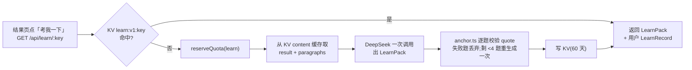
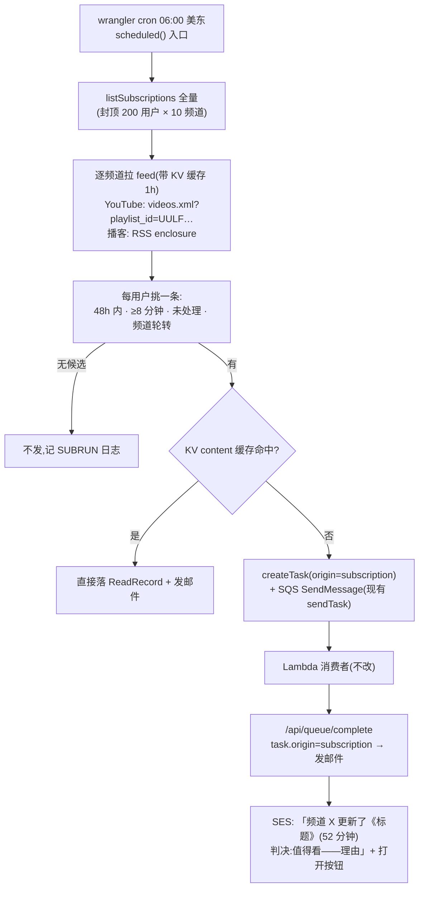

# 04 · 学习模式与频道订阅方案

> 状态:2026-08-28 草稿。**同日用户拍板:学习模式搁置(调研结论保留在此备查),订阅部分按「纳入 B站 + 总结要详细不漏」两项新要求重写为 [05-订阅模式与详细总结方案.md](05-订阅模式与详细总结方案.md),正本以 05 为准**(05 与本文最大差异:发现步骤从 Worker 挪进走代理的 Lambda,B站进 v1)。前置文档:[02-技术方案.md](02-技术方案.md)(输出 schema、快慢车道、DynamoDB/SQS/Lambda 底座)、[03-实施清单.md](03-实施清单.md)(已上线的 N 线记录与想法)。
> 来源:用户 2026-08-28 提的两个方向(①总结之后用某种学习法让用户快速吃到精髓并触发思考;②订阅 YouTube 主,每天帮用户抓一条做总结)+ 两份 GitHub 调研(2026-08-28,引用散在正文;调研原文见文末「附录」)。
>
> 读者假设:一位没参与过之前讨论的工程师。看得懂 TypeScript,不知道 nanisle 的历史决策。

## TL;DR

两个功能,一个共同前提:**002 已经把「判决 + 导读 + 带逐字引文的要点 + 分段地图」算出来并缓存了,新功能全部站在这份结果上,不重跑转写。**

- **学习模式**(工作名「想一想」):三种形态按证据强度和成本排序——① **先猜后看**:视频在慢车道排队的那几分钟,让用户先写一句「我猜它会说什么」,结果出来后 AI 对照点评;② **分段自测题**:按需生成、每题必须带一段能在转写里逐字找到的引文,找不到的题直接丢弃(复用现有锚定器 `src/shared/anchor.ts`);③ **导出闪卡**(CSV,含 `url&t=秒` 回链),间隔复习交给 Anki,**不自建复习系统**。GitHub 上 30 来个同类项目没有一个做「题目与原文对应校验」、也没有一个做「先猜后看」,而这两点恰是学习科学证据最强、我们成本最低的地方。
- **频道订阅**:用户订阅 YouTube 频道或播客 RSS(B站不进第一版);Worker 定时任务(wrangler cron,每天 06:00 美东)读各频道 feed → 按「≥8 分钟、48 小时内、没处理过、频道轮转」挑**每人每天一条** → 复用现有 `createTask + SQS` 投慢车道 → 完成时发一封「判决一句话 + 回链」的邮件(从 001 复制 `email.ts`,同一个 SES 域名)。
- 主要代价:学习模式每个内容多一次生成调用(按需、内容级缓存)+ 每次答题一次 flash 小调用;订阅每人每天固定一次完整慢车道(DeepSeek 约 ¥0.1、Groq/代理视路径而定)。改动量估计:学习模式 2 天、订阅 1.5 天。

## 1. 背景与问题

### 1.1 现状

002 现在的交付是「替你看完」:结果页给判决、导读(概述/有意思处/反着想)、要点(每条带 ≤30 字逐字引文和秒数)、分段地图(core/context/low),外加 N 线的「想法」批注。用户读完结果页就结束了。

两个问题:

| 问题 | 具体表现 | 证据 |
|---|---|---|
| 读了摘要 ≠ 学到了 | 用户读完导读「感觉懂了」,几天后什么都不剩;而且「感觉懂了」这个自我判断本身就是错的 | Roediger & Karpicke 2006:读完材料后**自测**的人一周后记住 56%,**重读**的人 42%,但重读组自认为学得更好([PubMed](https://pubmed.ncbi.nlm.nih.gov/16507066/));001 调研引用的 PNAS Nexus 2025 也说读摘要比读原文知识更浅 |
| 只有用户主动粘链接才有输入 | 002 上线三天,输入完全依赖用户想起来来粘;YouTube 订阅的更新散在算法流里,用户自己也追不过来 | 001 的经验:「忘了看」是留存头号敌人,邮件门铃上线后才有稳定回访 |

### 1.2 GitHub 同类项目怎么做的(2026-08-28 调研)

学习形态方向,按「有没有人真用」分三档:

| 档位 | 项目 | 做法 | 对我们的启示 |
|---|---|---|---|
| **真被用起来** | [AnkiGPT](https://github.com/nilsreichardt/AnkiGPT)(183★,托管站 + 付费 Plus,自称累计 338 万张卡);NotebookLM 2025-09 上线闪卡/测验、2026-04 升级「自适应学习循环」;[open-notebook](https://github.com/lfnovo/open-notebook)(37.8k★)社区最高票需求就是闪卡+测验([#203](https://github.com/lfnovo/open-notebook/issues/203)) | 「粘贴材料 → 一键闪卡/测验」 | 这个形态有真实付费用户;但**没有一个校验题目与原文的对应**,[Skill-Anything](https://github.com/SYuan03/Skill-Anything)(324★)把模型给的 answer 照单全收 |
| 带时间戳回链 | [BiliNote](https://github.com/JefferyHcool/BiliNote)(7.2k★,170 个 issue) | 让模型在笔记里写 `*Content-[mm:ss]` 占位符,后端换成跳转链接 | 中文用户确实在用「回到视频某一秒」;但止步于笔记,没做学习环节 |
| 质量控制最完整 | [ankithis](https://github.com/logannye/ankithis)(2★) | 先给内容打六维画像 → 概念抽取去重 → 按 Bloom 层级规划 → 生成 → 「AI 批评 + 确定性反模式过滤(琐碎题/原句照抄/歧义填空/复合题)」 | 反模式过滤这一层值得抄;整套 8 阶段管线对我们太重 |
| 玩具 | 单文件「transcript → GPT → 题目」类、纯费曼/苏格拉底聊天 Web 应用 | 无分段、无校验、无持久状态 | [socratic-bench](https://github.com/GiovanniGatti/socratic-bench) 实测「让 LLM 只问不答」最好的模型成功率也只有 ~23%——**纯追问式伴学做不稳** |

学习科学侧可引用的结论(全文见附录 A 表):

| 效应 | 结论 | 对设计的约束 |
|---|---|---|
| 检索练习(自测) | 元分析 159 个效应量 g≈0.50;**回忆题 > 选择题**,有反馈更强(Rowland 2014) | 优先出简答题;每题必附反馈 = 回链原文段落 |
| 预测试(先猜后看) | 读材料前先答题(哪怕答错)优于直接读;即时反馈 d≈1.2,延迟 24h 反馈仍有 d≈0.6(Mera et al. 2025) | 「先猜」成本最低、证据最强;猜完要**立刻**给对照 |
| 检索 vs 概念图 | 一周后自由回忆练习在所有指标上优于「对照原文画概念图」(Karpicke & Blunt 2011) | 思维导图不做主卖点 |
| AI 出题实证 | LLM 生成检索题使周测 73%→89%,但作者明确题目质量参差、需人工复核(An et al. 2025) | 题目必须可核验,不能裸出 |

**GitHub 上的空白 = 我们的差异化**:没有项目做「先猜后看」;没有项目做「题目锚定原文校验」;LLM 闪卡没有一个把时间戳当一等字段。002 这三样的底子都已经有了(排队等待窗口、`anchor.ts`、`chapters[].start`)。

频道订阅方向,结论先行(细节见 §3):

| 决策点 | 调研结论 |
|---|---|
| 发现新视频 | 这个细分没有大 star 项目,全是 0–20★ 个人脚本;真正成熟的是媒体归档器 [Pinchflat](https://github.com/kieraneglin/pinchflat)(5.3k★)——首次 yt-dlp 全量扫,之后靠频道 RSS(上限 15 条),每月补一次全量 |
| 「每天挑一个」 | **没人做**;都是「全量新视频 + 最短时长门槛(300s/5min)」;只有 [yt-bot](https://github.com/namanxajmera/yt-bot) 用兴趣画像让 LLM 打 1–10 分排序 |
| 推送 | 开源项目多把摘要全文塞邮件(因为没有站内页可回链);有站内页的产品(商业的 Digest,$6/月,只给标题+链接)反而短通知 + 回链 |

## 2. 学习模式方案

### 2.1 形态取舍

直觉方案是「结果页下面加一个思维导图 + 一组选择题」——这是 GitHub 上最常见的组合,因为它本质上是摘要的另一种排版,工程上最省事。卡点有两个:一是证据说看图不如回忆(§1.2),二是选择题只测「认得出」不测「说得出」,而且模型出的干扰项常常一眼假。所以改成下面三种,按优先级:

| 优先级 | 形态 | 用户动作 | 为什么排这里 |
|---|---|---|---|
| ① | **先猜后看** | 慢车道排队时(或缓存命中时主动点「先猜再看」),写一句「我猜它的结论是…」+ 最多三条「我猜它会讲…」;结果出来后看 AI 对照评语 | 证据最强、成本最低(一次 flash 小调用)、**天然填补慢车道 3–10 分钟的等待空窗** |
| ② | **分段自测题** | 结果页点「考我一下」;每题一个输入框,答完看反馈(覆盖了什么 / 漏了什么 / 有没有说反)+ 原文引文 + 跳到那一秒 | 检索练习本体;简答优先,选择题只做兜底(用户不想打字时) |
| ③ | **导出闪卡** | 一键下载 CSV(front/back/tags/回链) | 想长期记的人已经在用 Anki;调度算法(FSRS)是成熟公共物品,自建复习系统是把产品做成另一个 Anki |

明确**不做**:思维导图作为学习主卖点;纯苏格拉底式追问聊天;自建间隔复习提醒(v2 有一个便宜的替代,见 §3.6)。

### 2.2 数据形态

在 `src/shared/schema.ts` 新增(内容级,全站共享,与 `WatchResult` 同缓存纪律):

```ts
export interface LearnQuestion {
	id: string;              // q1, q2 …
	kind: "recall" | "choice";
	question: string;        // 简答:一句话能答;选择:题干
	options?: string[];      // 仅 choice,4 项,含常见误解干扰项 + 「我不确定」
	answer: string;          // 参考答案(简答 1–3 句;选择为选项原文)
	explanation: string;     // 为什么,不是复述答案
	chapter: number;         // 对应 chapters[] 下标
	start: number;           // 秒(文章为段号),来自引文所在位置
	quote: string;           // ≤30 字逐字引文,锚定校验对象
	difficulty: "easy" | "medium" | "hard";
}
export interface LearnPack {
	questions: LearnQuestion[];   // 5–12 题,按 chapter 排序
	cards: { front: string; back: string; tag: string; start: number }[];  // 闪卡,≤20 张
	generatedAt: number;
	model: string;
}
```

用户级状态(DynamoDB,`USER#<email>` + `LEARN#<contentKey>`,有界):

```ts
export interface LearnRecord {
	contentKey: string;
	pretest?: { verdict: string; points: string[]; at: number; review?: string };  // 猜 + AI 对照评语
	answers: Record<string, { text: string; feedback: string; status: "developing" | "got" ; at: number }>;  // 每题最近一次
	updatedAt: number;
}
```

关键约束:**每题的 `quote` 必须能在转写/正文里逐字找到,找不到整题丢弃**。这和要点的处理不同——要点锚定失败只是灰显,因为要点仍有信息价值;而一道引文造假的题,用户答完看到的「原文依据」是假的,比没有题更糟。

### 2.3 生成时机与调用链



三条设计判断:

1. **按需生成,不并入主编辑调用。** 直觉是让主编辑调用顺带出题(001 的三句话就是这么省的)。卡点:主调用的输出预算已经在 16384 上被 2 小时视频顶穿过一次(docs/03 W5/I3 的实录),再塞 10 道带引文的题会把主结果截坏;而且不是每个用户都会做题,并入等于给所有人付钱。按需生成的代价是首次点击要等 20–40 秒——用流式进度条(复用 F2 的 SSE 姿势)交代清楚即可。
2. **输入用缓存里的 `paragraphs`,不重跑转写。** 快车道和慢车道现在都把段落/转写段写进 `CachedContent.paragraphs`(consumer/src/pipeline.ts:260),出题直接读它;缓存过期(60 天)则提示「先重新生成总结」——和 N2「重开」的过期语义一致。
3. **模型档位先用 `AI_MODEL`(V4 Pro),不用 flash。** 出题要理解整篇,flash 的干扰项和 explanation 质量在 001 已经验证过偏弱(001 模型分档的实录);答题反馈用 `FAST_AI_MODEL`——输入只有一题一答一段引文,flash 够用且要快。

出题 prompt 的硬规则(落在 `src/shared/learn.ts`,与 `editor.ts` 同风格):

- 题目「测理解不测记忆」:禁止「视频里提到的数字是多少」这类纯记忆题,除非那个数字本身是论点;禁止题干照抄原句(ankithis 的反模式过滤在 prompt 层先挡一遍,再在代码层挡:题干与 quote 相似度 >0.8 丢弃)。
- 每个 `core` 章节至少 1 题、最多 3 题;`low` 章节不出题。
- 难度分布 20/50/30(Skill-Anything 的经验值)。
- `quote` 规则与编辑 prompt 第 3 条完全相同(逐字、≤30 字、不拼接)。
- 简答题为主;每 5 题最多 1 题 choice,choice 的 4 个选项里 1 正确 + 2 个「看过视频但理解错了的人会选的」+ 「我不确定」。

### 2.4 先猜后看的流程

```mermaid
sequenceDiagram
    participant U as 用户
    participant W as Worker
    participant C as 消费者(Lambda)
    U->>W: POST /api/submit(慢车道)
    W-->>U: taskId
    Note over U: 进度页出现「等的时候先猜一猜」<br/>标题已知,写一句结论 + ≤3 条要点
    U->>W: POST /api/learn/pretest {contentKey, verdict, points}
    W->>W: 存 LearnRecord.pretest(不调模型)
    C->>W: /api/queue/complete
    U->>W: GET /api/task/:id → done
    U->>W: GET /api/learn/:key
    W->>W: 有 pretest 且无 review → flash 调用:猜 vs overview+keyPoints
    W-->>U: review:「猜中:…;漏了:…;和内容相反:…」每条带 keyPoint 序号可跳
```

为什么把猜放在等待窗口而不是结果页前置一屏:结果页前置一屏会拦住所有人(包括只想扫一眼判决的人),等待窗口本来就是空的,不打扰任何人。缓存命中没有等待窗口,结果页给一个「先猜再看」开关,默认关,打开后结果区蒙住直到提交猜测——开关状态记 localStorage。

对照评语只依据 `overview` 和 `keyPoints` 做,输入 1–2K 字,flash 一次调用 2–3 秒;评语每条落到 keyPoint 序号,前端渲染成可点的锚。**评语不打分**:参考 Mia Kiraki 的家教原型,给状态不给数字——「猜中 / 漏了 / 相反」三类就够。

### 2.5 答题反馈

`POST /api/learn/answer {contentKey, questionId, text}`:

- 输入给 flash 的只有:题目、参考答案、explanation、quote、用户回答。输出 JSON `{ covered: string[], missed: string[], wrong: string[], status: "developing" | "got" }`。
- 不做多轮追问。socratic-bench 的数据说追问做不稳,用户被追问两轮就会走;一答一评、想再答就再提交,每次覆盖上一次。
- 配额:新增 `QUOTA_LIMITS.learn = 40`(出题 + 答题 + 对照评语共用一个日额度;出题占 5 个单位,答题和对照各占 1),用同一套 `reserveQuota` 原子占位,键 `USAGE#<date>#learn`。为什么单独一个额度而不是共用 `submit` 的 10 次:答题是高频小动作,和一天 10 条视频的额度不是一个量级,混在一起会让做题把提交额度吃光。

### 2.6 导出闪卡

`GET /api/learn/export/:key` 返回 CSV(`front,back,tags,source`),`source` 为 `https://www.youtube.com/watch?v=…&t=<start>s`(B站 `?t=`,播客/文章为 `#t=<start>` 或段号)。卡片内容来自 `LearnPack.cards`(出题同一次调用顺带产出,输入相同,增量输出约 1–2K token)。Anki 导入 CSV 是内置功能,不做 `.apkg`——genanki 是 Python 库,Worker 里没有,而 CSV 已经能带回链。

### 2.7 前端改动

结果页(`src/react-app/App.tsx`)加一个「想一想」区,放在导读之后、要点之前——这个位置是用户「刚读完主线、还没看要点」的时刻,是做检索练习的最佳时机(要点看完再答就变成抄了)。区里三个入口:「考我一下」(展开题目)、「导出闪卡」、以及有 pretest 时的对照评语卡。进度页(F6)加「等的时候先猜一猜」输入区。视觉上用户亲笔的内容沿用 N3 的衬线+朱红左边线,AI 反馈用现有 AI 产出样式——一眼分清谁写的。

### 2.8 为什么不选的备选

| 备选 | 具体卡点 |
|---|---|
| 主编辑调用顺带出题 | 输出预算已被 2h 视频顶穿过(16384),再加题会截坏主结果;所有人为少数做题的人付钱 |
| 思维导图(markmap)做主卖点 | 证据反面(Karpicke & Blunt 2011);[Ai-Markmap](https://github.com/kongkongyo/Ai-Markmap) 437★ 证明它只是排版工具;要做也只做「空白导图让用户填」的检索版,排 v2 |
| 苏格拉底式多轮伴学 | socratic-bench:最佳模型成功率 ~23%;每轮一次调用,成本和劝退率都高 |
| 自建间隔复习(FSRS + 定时邮件) | 要新增复习状态机、每日调度、提醒邮件三块;Anki 已经做得更好;v2 用订阅日报顺带塞一题(§3.6)拿到 80% 的效果 |
| 选择题为主 | 测「认得出」不测「说得出」;元分析回忆题效应更大;干扰项质量难保证 |

## 3. 频道订阅方案

### 3.1 总体流程



### 3.2 订阅什么、存哪里

| 项目 | 决定 | 理由 |
|---|---|---|
| 平台 | v1:YouTube 频道、播客 RSS;**B站不进 v1** | B站投稿列表接口要 WBI 签名 + `dm_img_*` 风控参数 + buvid3 cookie,-352/-412 频发,RSSHub 也要登录 cookie 且 3–5 天过期([bilibili-API-collect #868](https://github.com/SocialSisterYi/bilibili-API-collect/issues/868)、[RSSHub #20406](https://github.com/DIYgod/RSSHub/issues/20406));播客 RSS 是标准 2.0,有 `enclosure` + `itunes:duration`,零风控,消费者已经能吃 enclosure(docs/03 M3) |
| 存储 | DynamoDB `USER#<email>` + `SUB#<platform>:<channelId>`,字段 `{platform, channelId, title, feedUrl, addedAt, lastPickedAt}`;每人上限 10 个 | 有主状态进 DDB(02 T6);上限 10 是「每天挑一条」下合理的候选池大小,也封住 cron 的总工作量 |
| 已挑过的 | 复用 `READ#<contentKey>` 处理记录判「处理过」,另加 `SUBRUN#<date>` 记当天挑了哪条、为什么(或为什么没挑) | 不新造一个 seen 集合;SUBRUN 是运营排查用(「为什么今天没给我发」) |
| 输入解析 | 用户粘频道 URL / `@handle` / 播客 RSS 地址;`@handle` → channelId 在 Worker 里抓频道页 `<meta itemprop="channelId">`;失败(CF 出口被拦)则退到 Lambda 经代理跑 `yt-dlp --flat-playlist -I 0 --print playlist:channel_id`(输出格式待本地验一次) | 无 API key 也能解析;只做一次、落 DDB |

### 3.3 发现新视频:RSS 为主,Data API 为可选加固

| 手段 | 事实 | 结论 |
|---|---|---|
| 频道 RSS `feeds/videos.xml?playlist_id=UULF<id去掉UC>` | 免费、无 key;`UULF` 是未文档化的隐藏 playlist 前缀 = 纯视频(排除 Shorts 与直播)([来源](https://blog.amen6.com/blog/2025/01/no-shorts-please-hidden-youtube-rss-feed-urls/));上限 15 条;字段有 id/title/published/description/views,**没有时长**;2025-12 起有间歇 404(09–12 UTC 多发,[n8n 社区](https://community.n8n.io/t/youtube-rss-feed-endpoint-returns-404-errors/241692)) | **主路**。「每天挑一条」下 15 条上限绰绰有余;把 cron 定在 06:00 美东 = 10:00/11:00 UTC 正撞故障高发段——**改 05:00 美东**(09:00 UTC 前),并对 404 重试一次 + 用上次成功的 KV 缓存兜底 |
| YouTube Data API v3 | `playlistItems.list` 1 单位/页(uploads playlist = `UC`→`UU`),`videos.list?part=contentDetails` 50 个 id = 1 单位给 ISO 8601 时长 + `liveStreamingDetails` 剔直播;日配额 10,000;`channels.list?forHandle=` 1 单位解析 handle,API key 即可无需 OAuth | **可选加固**:配了 `YOUTUBE_API_KEY` 就用它补时长和做 RSS 404 时的备路;没配照样跑(fork 零配置原则)。1000 个频道/天约 1,020 单位 |
| yt-dlp `--flat-playlist` | 一次拿到时长/直播状态,但走 innertube,数据中心 IP 会被「Sign in to confirm you're not a bot」,必须过代理;TubeArchivist 建议请求间隔 ≥10s | 只做 handle 解析兜底,不做日常轮询 |
| WebSub 推送 | 官方 hub 可用,但租约最长 10 天要续、payload 只是 ping 还得回抓 feed、实测滞后可到 1 小时([feedmail](https://blog.feedmail.org/2023/10/delay-on-youtube-feeds.html)) | 不做;日更场景收益为零 |

**时长过滤没有 RSS 字段怎么办**:`UULF` 已排除 Shorts,剩下的「短视频但不是 Shorts」(1–8 分钟)v1 用两条便宜规则挡——描述里含 `#shorts` 剔除;配了 API key 时用 `videos.list` 精确过滤;都没有就放行,由编辑判决兜底(短视频总结成本也低)。

**出口 IP 会不会被拦**:调研只找到零散 403 案例(FreeTube、rss-bridge 各一例),没有「CF/AWS 抓 RSS 系统性被拦」的定论,且有人[在 Cloudflare Worker 里直接 fetch RSS 并缓存 15 分钟](https://philippdubach.com/posts/degoogling-cost-me-my-youtube-feed-so-i-made-my-own/)未报被拦。**这是本方案最脆弱的假设**,实施第一步就是用 Worker 打 20 个频道验证(§4 阶段 B1)。被拦的退路是 API key(不走 innertube,不受影响)。

### 3.4 每天挑一条:先规则,后 LLM

v1 用确定性规则,不调模型:

1. 候选 = 该用户所有订阅的 feed 里 `published` 在 48 小时内、未处理过(`READ#` 不存在)、非直播、非 `#shorts` 的条目;
2. 排序键:**频道轮转优先**(上次被挑的频道排后,用 `lastPickedAt`)→ 再按发布时间新的在前;
3. 取第一条。

为什么不一上来就 LLM 打分:yt-bot 的做法是每个候选先拿字幕再打分,那等于对所有候选跑一遍抓取——一个 10 频道的用户每天可能有 5–8 条候选,成本翻五倍。轮转规则保证高产频道不霸屏,新的在前保证时效,已经覆盖「每天一条」的大部分合理性。

v1.5 加 LLM 排序(只用标题 + 描述,零抓取成本):有 001 追踪器定义的用户,把候选的标题/描述与追踪器定义喂给 flash 打 1–10 分(复用 I3 的 interop 通道,`INTEROP_TOKEN` 没配就退回规则),分数相同再按轮转。观察 v1 两周的 SUBRUN 日志再决定要不要做。

### 3.5 推送:判决一句话 + 回链,不放摘要正文

沿用 001 决策 1「邮件是门铃不是报纸」:正文只放**频道名、标题、时长、判决(值得/部分/不值)+ 一句理由、一个「打开总结」按钮、退订链接**。不放要点、不放原视频链接——原视频链接放进去,用户就直接去看视频了,分段地图和学习模式都没机会出场。

实现全部从 001 复制(自包含原则,`docs/conventions.md`):`src/shared/email.ts`(退订 HMAC token + 模板 + aws4fetch 直调 SES v2),发件人 `长视频总结 <watch@nanisle.com>`(域名身份 nanisle.com 在 001 的 stack 里已验证,同账号直接用),Worker IAM 用户 `nanisle-watch-router-worker` 加一条 `ses:SendEmail`(infra 仓 `watch-router-stack.ts`),新 secret `EMAIL_UNSUB_SECRET`。发送点在 `/api/queue/complete` 里 `task.origin === "subscription"` 时;失败只 `console.error`,不影响结果落库(001 决策 D 同款)。

回链形态:`https://nanisle.com/products/watch-router/?open=<contentKey>`,前端读 `open` 参数走现有 N2 的 `GET /api/result/:key` 重开——这个端点已经存在,只差前端认一个 query。订阅来的结果同时出现在「我的记录」里,加一个「订阅」角标。

### 3.6 两个功能的接缝(v2,记录不排期)

订阅日报邮件里顺带塞**一道昨天(或三天前)那条视频的自测题**:题目来自已缓存的 `LearnPack`,零新增生成成本;点题进结果页作答。这就是「间隔检索」——证据里最强的那种(跨天自测),而且不用自建任何复习状态机,只是在已有的每日邮件里多一段。是否做取决于学习模式 v1 有没有人用。

### 3.7 为什么不选的备选

| 备选 | 具体卡点 |
|---|---|
| 定时任务放 EventBridge → Lambda(像 001) | 挑选步骤要读 DDB 订阅、读 KV feed 缓存、写 DDB 任务、投 SQS——这四样的凭证和代码都在 Worker 里;放 Lambda 要把 Store/KV 访问再实现一遍,还破坏 T1 的不变量「状态只有 Worker 能写」。wrangler cron 免费,且 `scheduled()` 里 `waitUntil` 能跑到几十秒 |
| 全量总结每个新视频 | 成本线性于频道更新量;更关键的是违背「每天一条」的注意力设计——用户要的是被挑过的一条,不是另一个信息流 |
| 邮件里放摘要全文 | 消费流失到邮件,反馈、想法、学习模式全断;001 已经论证并验证过 |
| 站内 inbox 不发邮件 | 「忘了看」问题原样保留;001 邮件门铃上线前后的回访差就是证据 |
| Telegram 推送 | 用户群是邮件习惯的熟人;多一个 bot token 与服务商,001 没做的理由照搬 |
| 先做 B站 | 风控成本远高于 YouTube;等 `app.biliapi.com/x/v2/space/archive/cursor`(文档标注免 WBI)实测过再说 |

## 4. 实施计划

| 阶段 | 内容 | 落点 | 验证 |
|---|---|---|---|
| **A1 · 出题与锚定** | `LearnPack` schema + `learn.ts` prompt + 锚定丢弃 + KV 缓存 `learn:v1:<key>` + `GET /api/learn/:key`(SSE 进度)+ `learn` 配额 | `src/shared/schema.ts`、`src/shared/learn.ts`、`src/shared/store.ts`、`src/worker/index.ts` | 用 Karpathy 1h 视频与阮一峰 curl 文章各生成一次:锚定存活率 ≥70%、每个 core 章节有题、无题干照抄;mock 模式返回示例 pack |
| **A2 · 答题反馈 + 先猜后看** | `LearnRecord` 存取、`POST /api/learn/answer`、`POST /api/learn/pretest`、对照评语 | 同上 + `src/react-app/App.tsx`(进度页猜测区、结果页「想一想」区) | 慢车道提交 → 猜 → done → 评语落到要点序号可跳;答题三类反馈渲染;配额 429 |
| **A3 · 导出** | CSV 端点 + 按钮 | `src/worker/index.ts`、`App.tsx` | Anki 导入一次,回链点开落到对应秒 |
| **B1 · feed 验证(先做,决定后面路线)** | Worker 里 fetch 20 个频道的 `UULF` feed 与 5 个播客 RSS,记成功率与 404 时段 | 临时脚本/`/api/admin/feedcheck` | 成功率 ≥18/20 → RSS 主路;否则申请 API key 走备路 |
| **B2 · 订阅管理** | `SubRecord` + `GET/POST/DELETE /api/subs` + handle 解析 + 前端「我的订阅」 | `store.ts`、`index.ts`、`App.tsx` | 粘 `@handle`/频道 URL/播客 RSS 三种都能解析;上限 10 触发 |
| **B3 · 定时挑选 + 投递** | `wrangler.jsonc` `triggers.crons`、`scheduled()`、挑选规则、`SUBRUN` 日志、`TaskRecord.origin` | `wrangler.jsonc`、`src/worker/index.ts`(或拆 `subs.ts`) | `wrangler dev --test-scheduled` 触发一次:挑中一条投 SQS,消费者跑完 done;第二天同频道被轮转 |
| **B4 · 邮件** | 复制 001 `email.ts`、IAM 加 SES、`EMAIL_UNSUB_SECRET`、complete 钩子、`?open=` 重开 | `src/shared/email.ts`、`infra/lib/watch-router-stack.ts`、`App.tsx` | 真收到一封;按钮直达结果;退订生效;发信失败不影响落库 |
| **B5 · 上线观察** | SUBRUN 两周;Webshare 流量、Lambda 调用量告警阈值按订阅量上调 | — | 决定 v1.5 LLM 排序要不要做 |

顺序建议:**B1 先跑**(半小时,决定订阅路线)→ A1–A3(学习模式整体 2 天)→ B2–B4(1.5 天)。学习模式排前面是因为它不依赖任何外部不确定性。

## 5. 成本与容量

| 项 | 每次 | 备注 |
|---|---|---|
| 出题(Pro,一次/内容) | 输入 ≈ 主编辑同量(≤100K token)、输出 ≈ 4K | 内容级缓存,第二个用户零成本 |
| 答题/对照(flash) | 输入 <2K、输出 <0.5K | 每人每天 ≤40 单位 |
| 订阅每日一条 | 一次完整慢车道:字幕路径代理流量几十 KB、whisper 路径约 14MB + Groq;DeepSeek 约 ¥0.1 | 缓存命中(同一热门视频多人订阅)零成本 |
| Lambda 并发 | `maxConcurrency: 2`,每条 3–10 分钟 | **100 个订阅用户 = 约 5 小时才跑完**;内测规模没问题,过 30 人要提并发或错峰投递(05:00 投一半、06:00 投一半) |
| Webshare 1GB/月 | 字幕路径几乎不耗;全 whisper 路径约 70 条/月 | 订阅上量后要看 SUBRUN 里 `path` 的分布再决定升档 |

## 6. 风险与开放问题

| # | 风险 | 应对 |
|---|---|---|
| 1 | **CF 出口 IP 抓 YouTube RSS 被拦**(最脆弱的假设) | B1 先验证;退路 Data API key(不走 innertube) |
| 2 | RSS 2025-12 起的间歇 404 | cron 避开 09–12 UTC;失败重试 + 上次成功缓存;配 key 走备路 |
| 3 | 出题质量:题干变相照抄、干扰项一眼假 | 代码层相似度过滤 + 锚定丢弃;A1 验证用两条真实样本人工过一遍;不达标先只上「先猜后看」(不依赖出题) |
| 4 | 先猜后看没人用(要打字) | 输入区默认一行,允许只猜判决三选一(值得/部分/不值)不写字;看两周 pretest 提交率再决定留不留 |
| 5 | 订阅来的视频用户不想看 | 邮件里「换一条」链接(v1.5):把当天候选池里的下一条投进去;SUBRUN 记录点击率 |
| 6 | 「每天一条」对高产订阅者太少 | 上限就是设计;真有需求再加「每天 N 条」的付费档,不在 v1 讨论 |
| 7 | 播客 RSS 里 enclosure 是 2 小时音频,whisper 路径撞 Lambda 15 分钟 | 现有 local.mjs 后备 + 超时显式失败已在;订阅挑选时对 `itunes:duration` >150 分钟的条目跳过 |
| 8 | 开放问题:学习模式的题目要不要让用户改/删 | v1 不做;记 issue,看有没有人抱怨 |
| 9 | 开放问题:订阅的邮件时间是否让用户选 | v1 固定 05:00 美东投递、结果陆续到;001 也没让选,先不做 |

## 附录 A · 学习科学证据表

| 效应 | 文献 | 结论 |
|---|---|---|
| 测试效应 | Roediger & Karpicke 2006, *Psychological Science*([PubMed](https://pubmed.ncbi.nlm.nih.gov/16507066/)) | 一周后自测组约 56% vs 重读组 42%;重读组自评更高 |
| 检索练习元分析 | Rowland 2014, *Psych. Bulletin*([PubMed](https://pubmed.ncbi.nlm.nih.gov/25150680/));Adesope et al. 2017([ERIC](https://eric.ed.gov/?id=EJ1141817)) | g≈0.50,81% 对比支持;回忆题 > 再认题;有反馈更强 |
| 检索 vs 概念图 | Karpicke & Blunt 2011, *Science*([PubMed](https://pubmed.ncbi.nlm.nih.gov/21252317/)) | 回忆练习在回忆/推理/画图上均优于画概念图 |
| 合意困难 | Bjork & Bjork 2011([ResearchGate](https://www.researchgate.net/publication/284097727)) | 当下更难的条件换来长期保持 |
| 预测试 | Richland, Kornell & Kao 2009([PDF](https://learninglab.uchicago.edu/Pre-Testing_files/RichlandKornellKao.pdf));Mera et al. 2025([PMC](https://pmc.ncbi.nlm.nih.gov/articles/PMC12292081/)) | 先答后读优于直接读;即时反馈 d≈1.2 |
| AI 场景 | Akgun & Toker 2024([arXiv](https://arxiv.org/abs/2412.13487));An et al. 2025([arXiv](https://arxiv.org/abs/2507.05629)) | LLM 出题有效但需复核 |

## 附录 B · 调研涉及的项目索引

学习形态:[AnkiGPT](https://github.com/nilsreichardt/AnkiGPT) · [anki-llm](https://github.com/raine/anki-llm) · [ankithis](https://github.com/logannye/ankithis) · [true-recall](https://github.com/pieralukasz/true-recall) · [yt-to-anki](https://github.com/kamui-fin/yt-to-anki) · [open-notebook](https://github.com/lfnovo/open-notebook) · [PageLM](https://github.com/CaviraOSS/PageLM) · [Skill-Anything](https://github.com/SYuan03/Skill-Anything) · [learn-anything](https://github.com/ChenChenyaqi/learn-anything) · [Bloom](https://github.com/Li-Evan/Bloom) · [socratic-bench](https://github.com/GiovanniGatti/socratic-bench) · [agent-tutor-skill](https://github.com/Bhala-Srinivash/agent-tutor-skill) · [teach-me SKILL.md](https://github.com/claude-code-best/claude-code/blob/main/.claude/skills/teach-me/SKILL.md) · [BiliNote](https://github.com/JefferyHcool/BiliNote) · [BiliSum](https://github.com/lycohana/BiliSum) · [Ai-Markmap](https://github.com/kongkongyo/Ai-Markmap) · [llmapper-skill](https://github.com/jorgearango/llmapper-skill)
订阅/发现:[yt-bot](https://github.com/namanxajmera/yt-bot) · [apond308/youtube-digest](https://github.com/apond308/youtube-digest) · [gemini-youtube-parser](https://github.com/uuzinger/gemini-youtube-parser) · [Pinchflat](https://github.com/kieraneglin/pinchflat) · [TubeArchivist](https://github.com/tubearchivist/tubearchivist) · [RSS-Bridge](https://github.com/RSS-Bridge/rss-bridge) · [YouTube Data API playlistItems](https://developers.google.com/youtube/v3/docs/playlistItems/list) · [videos.list](https://developers.google.com/youtube/v3/docs/videos) · [WebSub 官方](https://developers.google.com/youtube/v3/guides/push_notifications) · [bilibili-API-collect](https://github.com/SocialSisterYi/bilibili-API-collect) · [Digest(商业)](https://usedigest.com/features/youtube-digest/)
