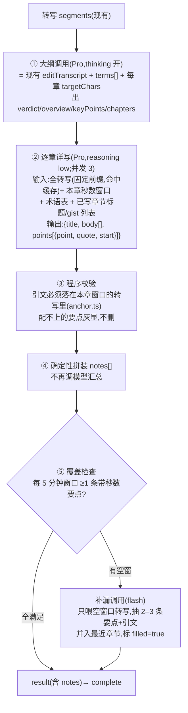
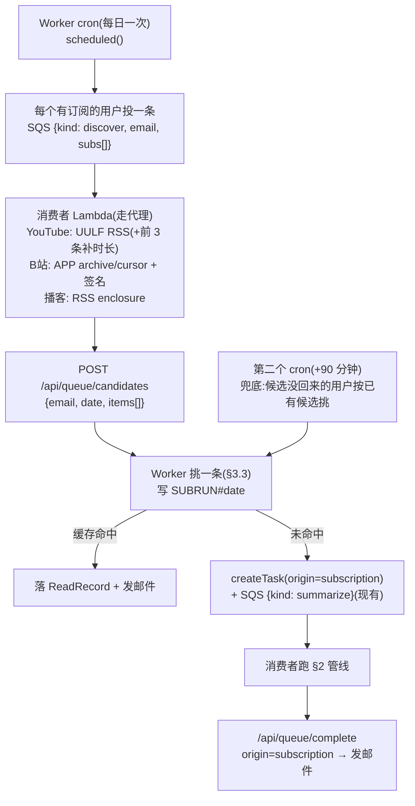

# 05 · 订阅模式与详细总结方案

> 状态:2026-08-28 用户拍板通过,**同日实现完成(A1–A4、B0–B3 本地验证全过),**2026-08-28 晚已部署,线上验证全过(Karpathy 1h 5.4 分钟/11 章/锚定 45/46;B站 APP 接口云端 20/20;首封订阅邮件已发)**;进度与实测数据见 [03-实施清单.md](03-实施清单.md) §8。实测对方案的修正:详写思考力度留 low(none 快一半但引文保真与数字准确掉)、并发 3→6;YouTube 自动字幕滚动半重复要按行去重。前置文档:[02-技术方案.md](02-技术方案.md)(输出 schema、快慢车道、DynamoDB/SQS/Lambda 底座)、[03-实施清单.md](03-实施清单.md)、[04-学习模式与频道订阅方案.md](04-学习模式与频道订阅方案.md)(同日早先的草稿;用户拍板**学习模式搁置**,订阅部分并入本文并按 B站纳入与「详细总结」两项新要求重写,冲突处以本文为准)。
> 来源:用户 2026-08-28 两条拍板——①做订阅模式:订阅 YouTube 频道或 B站 UP 主,每天抓一条做长视频总结;②总结要**足够详细、中长篇幅可接受、不能漏精华**。另两份调研(2026-08-28):「长视频总结怎么详细且不漏」的开源项目与论文;「B站 UP 主投稿从云端怎么稳定发现」(含从本机与 Webshare 代理的实测)。引用散在正文。
>
> 读者假设:一位没参与过之前讨论的工程师。看得懂 TypeScript,不知道 nanisle 的历史决策。

## TL;DR

两件事,先后有依赖:**先把总结做厚,再让订阅每天自动喂一条**——订阅送来的如果还是现在这种薄总结,用户不会读。

- **详细总结**:现在是一次 DeepSeek 调用出「判决 + 导读 + 要点 + 分段地图」,几百字。薄有两个结构性原因:模型天然写不长(实证:主流模型输出卡在 2k 词左右),以及长转写一次喂入时**中部内容最容易被略过**(长文摘要的位置偏置,NAACL 2025 实证)。GitHub 上的视频总结项目几乎全是单次调用靠 prompt 措辞控长,所以全都薄;**没有一个做覆盖率检查**。改成被几个项目实际验证过的管线:**大纲一次(现有调用 + 术语表 + 每章字数配额)→ 逐章详写(全转写做固定前缀命中 DeepSeek 缓存,每章都是模型的「开头」)→ 详细笔记按章确定性拼装、不再经过任何「汇总」调用(汇总就是再变薄)→ 每 5 分钟窗口必须至少有一条带秒数的要点,空窗口才触发补漏调用**。一小时视频约 4,000–6,000 字,成本约 $0.05(比现状贵 2–3 倍,绝对值几美分),消费者 Lambda 15 分钟预算内能跑完。
- **订阅**:YouTube 频道 + B站 UP 主 + 播客 RSS。**发现新视频全部放进现有消费者 Lambda 走住宅代理**(B站只有 APP 端接口 `app.biliapi.com/x/v2/space/archive/cursor` + 公开 appkey 签名能稳定过——实测本机与代理 12/12 成功,Web 端接口与 yt-dlp 在两种出口都是 412 抽奖;YouTube 用隐藏 playlist 前缀 `UULF` 的 RSS 排除 Shorts)。Worker 定时任务每天 05:00 美东给每个订阅用户投一条「发现」消息,Lambda 抓列表回传候选,Worker 按「48 小时内、≥8 分钟、没处理过、频道轮转」挑**每人每天一条**投现有慢车道,完成时发一封「判决一句话 + 回链」邮件(复制 001 的 `email.ts`,同一 SES 域名)。
- 主要代价:消费者管线从 1 次调用变成 1 + N + 少量补漏(N = 章节数,并发 3);新增 Lambda 消息类型 `discover`;订阅每人每天固定一次完整慢车道。改动量估计:详细总结 2 天、订阅 2 天。

## 1. 背景与问题

### 1.1 现状

| 项 | 现状 | 问题 |
|---|---|---|
| 输出 | 一次 `editTranscript` 调用(`src/shared/editor.ts`)出 `WatchResult`:判决一句、导读 3–5 句、要点 ≥3 条(带 ≤30 字逐字引文和秒数)、分段地图每段一句 gist | 用户反馈「太薄」:已经替他省了一小时,却只给几百字,精华有没有漏根本看不出来 |
| 输入 | 用户手动粘链接 | 没人粘就没输入;订阅的频道更新散在算法流里,用户自己也追不完 |
| 平台 | YouTube(代理)、B站(代理)、播客 enclosure 都已能转写(docs/03 M3/M4) | 只差「自动发现新视频」这一环 |

### 1.2 为什么现在薄:不是输出预算,是两个结构性原因

直觉解释是「`AI_MAX_OUTPUT_TOKENS=16384` 不够」。查证后不成立:DeepSeek V4 官方输出上限 384K,16384 是我们自设的;用户要的「几千字」按 1 汉字 ≈ 0.6 token 算只要 3K token,现有预算装得下。真正的原因:

| 原因 | 证据 | 含义 |
|---|---|---|
| 模型天然写不长 | LongWriter(ICLR 2025,[arXiv 2408.07055](https://arxiv.org/abs/2408.07055)):现成模型输出普遍卡在约 2k 词,原因是训练数据里长输出稀缺;「先写计划再逐段生成」能把同一模型推到 20k+ 词 | 单次调用无论 prompt 怎么说「详细」,都会自动收敛到短输出;要长就得**分段生成** |
| 长输入的中部被略过 | 《On Positional Bias of Faithfulness for Long-form Summarization》(NAACL 2025,[arXiv 2410.23609](https://arxiv.org/pdf/2410.23609)):LLM 对长文**开头最忠实、中部最差**;提示「关注中部」、分块、重排三种缓解都只能部分解决 | 一小时视频 20–40 分钟那段最容易被薄化——恰是很多视频的核心论证段 |
| thinking 占输出预算 | docs/03 W5/I3 实录:2 小时视频在 8192 下被截断,提到 16384 才过 | 详写阶段应关掉或调低 thinking,把思考留给大纲阶段 |

### 1.3 GitHub 上别人怎么做(2026-08-28 调研)

| 项目 | ★ / 活跃 | 做法 | 对我们的启示 |
|---|---|---|---|
| [BiliNote](https://github.com/JefferyHcool/BiliNote) | 7.2k / 2026-08 | 一次调用,45MB 才分块(等于永不分块);「详细」风格只是一句 prompt:「需要尽可能多的记录视频内容,最好详细的笔记」 | 靠措辞控长的代表,产出仍薄 |
| [BiliSum](https://github.com/lycohana/BiliSum) | 533 / 2026-08 | 转写 >18,000 字符就按 2,200 字符分块(重叠 2 段),每块出同一 JSON,**章节按秒数确定性合并**,再一次 LLM 汇总;「缓存优先」模式串行跑以命中提供商前缀缓存 | 分块结构最完整的中文项目;但章节 summary 硬截 160 字符——**汇总阶段把它又压薄了** |
| [Skill-Anything](https://github.com/SYuan03/Skill-Anything) | 324 / 2026-06 | 5 分钟一桶,每桶 map 出「摘要/概念/术语表/笔记」;**详细笔记直接按桶确定性拼装,不经过 reduce、不截断**;按桶大小用最大余数法分配配额,每桶保底 | 唯一带「覆盖保证」设计的项目;「不经 reduce」是不漏的最朴素保证 |
| [steipete/summarize](https://github.com/steipete/summarize) | 6.6k / 2026-08 | 一次调用,长度用字符档位精确控制(long 4,200 / xl 9,000 / xxl 22,000 字符 + 对应 maxTokens);强制「Key moments」时间戳段;「不要注水,写不满就提前结束」 | 「目标/下限/上限字数 + 禁止注水」的写法值得抄 |
| [martinopiaggi/summarize](https://github.com/martinopiaggi/summarize) | 214 / 2026-07 | 按段落分块并行 5 路,**每块独立成文后按时间戳直接拼接,没有汇总**;prompt:「像在继续一段对话,不要写开场白」 | 输出最长最细;但块间重复、术语不一致无人处理 |
| [klokie/yt-summarize](https://github.com/klokie/yt-summarize) | 2 / 2026-07 | map 阶段每块抽 `terms[{term, definition}]`,reduce 汇成术语表 | 术语一致的现成模式:先抽术语表,再把它喂给逐章生成 |
| [AI-Video-Transcriber](https://github.com/wendy7756/AI-Video-Transcriber) | 3.2k / 2026-08 | 摘要刻意做薄(180–450 词);功夫花在转写清洗:分块前缀「[上文续:前块末 100 字]」、块间去重、禁改人称 | 与目标相反;转写清洗那段对 whisper 路径有参考价值 |
| 通义听悟([API 文档](https://help.aliyun.com/zh/tingwu/large-model-summary)) | 商业 | 文档原话:「全文摘要的计算除了依赖原始音视频信息、ASR 转写结果之外,还额外依赖章节标题信息」 | 商业产品也是**章节先行,全文依赖章节** |

研究侧可直接用的三条(全文见附录 A):

| 方法 | 结论 | 我们怎么用 |
|---|---|---|
| 分层合并的代价(BooookScore,ICLR 2024) | 块越大、合并步骤越少越好;逐步合并「细节量」最好但连贯性差;**每合并一次就丢一层细节** | 详细笔记不做全局汇总,只拼装 |
| 合并时带原文(Context-Aware Hierarchical Merging,2025) | 递归合并会放大幻觉;合并阶段把原文段落/锚点一起带回去能显著改善 | 逐章详写时输入的是**全转写 + 本章窗口**,不是上一层的摘要 |
| QA 式覆盖审计(LongSumEval,2026) | 从原文抽问题,判摘要能否回答,把答不上的转成重写指令:覆盖率 0.549→0.767 | 简化成「每 5 分钟窗口必须有带秒数的要点」的程序检查 + 空窗口补漏 |

### 1.4 B站 UP 主投稿从云端怎么发现(2026-08-28 调研,含实测)

背景变化:bilibili-API-collect 原仓 2026-01-28 收到 B站律师函已归档([报道](https://www.ithome.com/0/917/481.htm)),文档看 fork [pskdje/bilibili-API-collect](https://github.com/pskdje/bilibili-API-collect)。实测出口:本机美国住宅 IP、Webshare 轮换住宅代理。

| 手段 | 实测结果 | 结论 |
|---|---|---|
| **APP 端 `app.biliapi.com/x/v2/space/archive/cursor` + APP 签名**(公开 appkey `1d8b6e7d45233436`,md5 签名,[算法](https://github.com/pskdje/bilibili-API-collect/blob/main/docs/misc/sign/APP.md)) | 3 个 UP × 3 轮 × 2 出口 = **18/18 成功**;不要 cookie、WBI、dm_img;返回 `bvid/title/duration(秒)/ctime/is_live_playback/is_pgc`,分页用上一页最后一条的 `param` 作 `aid`;文档写的「无需签名」已过时,**必须带 `ts` + `sign`**;Python 默认 UA 会 412,要带浏览器 UA | **主路** |
| Web 端 `x/space/wbi/arc/search`(WBI + dm_img + buvid3) | 4 种参数组合 × 2 轮 × 2 出口 = **0/16**,全是 412 或 -352 风控;RSSHub [#20406](https://github.com/DIYgod/RSSHub/issues/20406):2026-03 起要全套登录 cookie 且低频 | 不走 |
| yt-dlp `BilibiliSpaceVideoIE --flat-playlist` | 内置 WBI 与 dm_img([PR #12089](https://github.com/yt-dlp/yt-dlp/pull/12089)),但走的就是上面那个 Web 接口,代理下 1/2 成功;flat 模式**拿不到时长和发布时间**(只 `url_result`) | 只当兜底拿 bvid |
| `x/polymer/web-dynamic/v1/feed/space` | 本机 WBI + dm + buvid3 过了 1/1,信心不足;文档原话「有一些奇奇怪怪的校验,存在运气成分」 | 兜底 1 |
| RSSHub | 公共实例 403「请自建」;自建内部就是 Web 接口 + Playwright,风控与自己写完全一样,cookie 3–5 天过期 | 不走 |
| `x/web-interface/card?mid=` | 免签免 cookie,两出口 6/6 成功,返回昵称/头像/投稿数 | 解析与校验 UP 主用它 |
| 同类项目(bilibili-new-video-notifier 等) | 全靠扫码登录 cookie,抓自己账号的关注流,不是逐 UP 抓 | 我们的免登录路线更轻 |

## 2. 详细总结方案

### 2.1 目标形态

结果页从「一屏」变成「一篇」:判决 → 导读 → **分章详细笔记**(每章:时间范围 + 标题 + 正文若干段 + 本章要点带引文可跳)→ 术语表 → 全局要点(保留现有,短)。分段地图不再单独渲染,合并进章节标题(时间范围 + core/context/low 标记)。

长度按时长配额,不按「详细/简洁」档位:

| 项 | 规则 | 理由 |
|---|---|---|
| 每章目标字数 | 章节分钟数 × 70 字,下限 200、上限 1,200 | 一小时信息密视频 ≈ 4,200 字,落在用户说的「中长篇」;上限防单章无限展开 |
| `low` 章节 | 不详写,只留一句 gist | 寒暄广告不值得字数 |
| 注水禁令 | prompt 写死「目标 X 字;内容不够就提前结束,禁止为凑字数复述或空泛总结」(steipete 写法) | 长度是上限不是任务 |
| 每章要点 | 每 5 分钟至少 1 条,每条带 ≤30 字逐字引文 + 秒数 | 覆盖率的可程序检查的代理指标 |

### 2.2 管线:1 + N + 补漏



每一步为什么这么定:

1. **大纲调用就是现有调用**,只加两个字段:`terms[]`(术语表,klokie 的做法——让后面每章用同一套名词)和每章 `targetChars`(由代码按时长算,不让模型定)。现有 verdict/overview/keyPoints/chapters 全部保留,老缓存兼容。
2. **逐章详写把全转写放在 prompt 最前面作固定前缀**。DeepSeek 上下文缓存按前缀命中,命中价是未命中的 1/30($0.022 vs $0.66 每百万 token)。N 章 N 次调用如果每次都全价喂 20K token 转写,一小时视频要 $0.16;命中后 $0.05。BiliSum 的「缓存优先」模式就是为这个设计的。**代价**:并发 3 的第一批可能同时未命中(缓存要第一次调用写入后才可用)——先跑大纲调用,它已经把前缀写进缓存,后面的详写全部命中。
3. **详写输入的是原文不是摘要**。Context-Aware Hierarchical Merging 的结论:递归合并会放大幻觉,带原文才稳。每章的 prompt 明确「只写 [t=a]–[t=b] 窗口内的内容」,同时给「已写章节的标题与 gist」防止重复展开同一论点(不给已写正文——那会把前缀撑大且诱导复述)。
4. **详写用 reasoning low**。thinking 对「按窗口如实展开」帮助小,却吃输出预算和时间;大纲阶段(判断章节边界、判决、批判视角)才需要它。
5. **不做全局汇总调用**。BooookScore 的数据:每合并一层就丢一层细节;Skill-Anything 的详细笔记「不经 reduce、不截断」是它「不漏」的全部秘诀。术语统一靠术语表前置,风格统一靠同一 prompt,章间重复靠「已写标题/gist」——都是生成时防,不是生成后删。
6. **覆盖检查是程序不是模型**。LongSumEval 的 QA 审计要 3 次调用;我们退化成「每 5 分钟窗口有没有带秒数的要点」——零成本,大部分视频不会触发补漏。有空窗才让 flash 只看那一段转写抽要点。这个检查兼职当质量仪表:`SUBRUN`/任务记录里记「空窗数」,长期看趋势。

### 2.3 数据形态

`src/shared/schema.ts`:

```ts
export interface WatchNoteChapter {
	chapter: number;            // 对应 chapters[] 下标
	title: string;              // 章标题(由详写调用给,比 gist 更像标题)
	body: string[];             // 正文段落,3–8 段;low 章为空数组
	points: WatchKeyPoint[];    // 本章要点(quote/start/anchored 同现有规则)
	filled?: boolean;           // 覆盖补漏并入过
}
export interface WatchTerm { term: string; definition: string; }

export interface WatchResult {
	verdict: WatchVerdict;
	overview?: WatchOverview;
	keyPoints: WatchKeyPoint[];
	chapters: WatchChapter[];   // 加可选 targetChars
	notes?: WatchNoteChapter[]; // 新增;老缓存没有,前端按可选渲染
	terms?: WatchTerm[];
	meta: WatchMeta;            // 加 coverageGaps?: number(空窗数,补漏前)
}
```

内容缓存键从 `v2` 升 `v3`(同 N 线「导读」上线时的换代手法,老缓存随 60 天 TTL 消亡;用户在「我的记录」重开老结果时看到「重新生成可得详细笔记」提示)。KV 单值上限 25MB,一小时视频的 notes 约 10KB,不是问题;DynamoDB 处理记录仍只存元数据。

### 2.4 快车道(文章)要不要跟

跟,但降一档:文章的「章」是段落区间,逐章详写同样适用;但文章通常 2–8K 字,详细笔记可能比原文还长——规则改为「总字数不超过原文的 60%」,且只对 ≥3,000 字的长文启用详写,短文维持现状。快车道跑在 Worker 里,N 次调用串行会撞 CF 100 秒无字节的 524 线——已有 SSE 保活(F2),每章完成推一个 `delta`,不受影响;Worker 单请求 CPU 时间不是问题(等待模型不计 CPU)。

### 2.5 时间与成本(一小时视频,转写约 2 万 token)

| 项 | 数字 |
|---|---|
| 大纲调用 | 60–120 秒(现状实测) |
| 逐章详写 | 8–12 章 × 15–25 秒,并发 3 → 约 60–90 秒 |
| 补漏 | 0–3 次 flash,各 <10 秒 |
| 合计 | 约 3–4 分钟,在 Lambda 15 分钟与 Worker 侧 10 分钟无进展超时之内;2 小时视频约 6 分钟 |
| 费用(非高峰,前缀命中) | 输入 $0.013 + 9×($0.0004 + $0.001) + 输出 13K×$1.98/M ≈ **$0.05**;现状 $0.02 |
| 费用(高峰时段翻倍) | ≈ $0.10;订阅定时投递在 05:00 美东 = 09:00 UTC,落在 DeepSeek 高峰(UTC 06–10 工作日)——**把投递改到 04:00 美东(08:00 UTC)还是高峰**;要省钱就挪到 20:00 美东(00:00 UTC)投,早上到;见 §3.4 |

### 2.6 为什么不选的备选

| 备选 | 具体卡点 |
|---|---|
| 单次调用 + 把目标字数写死 + Fabric 式「至少 20 条」逼产量 | 逼出来的是条数不是覆盖;中部略过的位置偏置不解决;LongWriter 说单次输出天花板在那儿 |
| 单次调用 + QA 覆盖审计 + 重写(LongSumEval 原版) | 审计 3 次调用比逐章详写还贵;重写等于让模型再把整篇写一遍,又回到单次长输出 |
| 逐章串行 refine(每次带「到目前为止的笔记」) | 串行 10 次无法并发;笔记随轮次膨胀要压缩,压缩就丢细节;前缀每轮都变,缓存全部未命中,成本 3 倍 |
| 分章后再来一次「全局润色」调用 | 就是 BiliSum 把章节压到 160 字符的那一步;润色 = 变薄 |
| Chain of Density(定长加密) | 解决「同样字数装更多实体」,不解决「加长」;可用于导读那 3–5 句,不作为主线 |

## 3. 订阅方案

### 3.1 总体流程



**发现步骤放 Lambda 而不是 Worker**,这是与 04 草稿最大的不同。04 的最脆弱假设是「Cloudflare 出口抓 YouTube RSS 会不会被拦」;B站纳入后,APP 接口从数据中心 IP 能否直连**没有验证**、Web 接口已知被拦——两个平台都需要住宅代理,而代理只在 Lambda 里。把 YouTube 和播客也一并放进 Lambda,三个平台一条路,Worker 只做「挑」和「记」,T1 的不变量(状态只有 Worker 写)不破。代价是多一种消息类型和一次回程,以及每用户一次 Lambda 冷启(<30 秒,不进 15 分钟预算的边)。

### 3.2 订阅什么、存哪里

| 项 | 决定 |
|---|---|
| 平台 | YouTube 频道、B站 UP 主、播客 RSS;每人上限 10 个 |
| 存储 | DynamoDB `USER#<email>` + `SUB#<platform>:<id>`,`{platform, id, title, feedUrl?, addedAt, lastPickedAt}` |
| 用户输入 → id | YouTube:频道 URL/`@handle`,Lambda 经代理抓频道页 `<meta itemprop="channelId">`;B站:`space.bilibili.com/<mid>` 正则、`b23.tv` 跟一次 302、昵称不支持(Web 搜索接口同风控体系),校验与取昵称用 `x/web-interface/card?mid=`(免签);播客:RSS 地址直接存。解析走一条同步的 `discover` 变体(`kind: resolve`),前端等 5–10 秒 |
| 已处理判定 | 复用 `READ#<contentKey>`;另 `SUBRUN#<date>` 记当天候选、挑中的、理由或「没挑」原因 |
| 候选暂存 | `USER#<email>` + `CAND#<date>`,ttl 2 天;候选回传时覆盖写 |

B站 APP 签名与 YouTube RSS 解析都做成纯函数放 `src/shared/discover.ts`(消费者 esbuild 打包时和 `editor.ts` 一样跨目录引用),有单测。签名 10 行:参数加 `appkey`,按 key 排序 urlencode,拼 `appsec` 取 md5 作 `sign`;必带 `ts`;UA 用浏览器 UA(Python 默认 UA 实测 412)。

### 3.3 每天挑一条

v1 确定性规则,不调模型:

1. 候选 = 该用户各订阅 48 小时内的条目,剔 `is_live_playback`/`is_pgc`(B站字段)、描述含 `#shorts`(YouTube)、时长 <8 分钟(B站与播客有时长;YouTube RSS 没有——对前 3 条候选用 `yt-dlp --print duration` 经代理补,约 2 秒一条);
2. 排序:**频道轮转优先**(`lastPickedAt` 早的频道在前)→ 发布时间新的在前;
3. 取第一条;没有候选 → `SUBRUN` 记「无新内容」,不发邮件。

为什么不一上来 LLM 打分:要打分先得拿标题描述以外的信息,否则就是标题党排序;拿字幕等于对所有候选跑一遍抓取,成本翻数倍。轮转 + 时效已经覆盖「每天一条」的大部分合理性。v1.5 加「标题 + 描述 vs 001 追踪器定义」的 flash 打分(interop 通道已有),看两周 `SUBRUN` 再定。

### 3.4 定时与投递时间

| 项 | 决定 | 理由 |
|---|---|---|
| 发现 cron | 每日 20:00 美东(00:00 UTC) | DeepSeek 非高峰(高峰 UTC 01–04、06–10 工作日,价格翻倍);YouTube RSS 的 404 高发段是 09–12 UTC,避开;用户早上起床邮件已在 |
| 兜底 cron | 21:30 美东 | 候选没回来(Lambda 失败/DLQ)的用户按已有候选挑;仍无则记「发现失败」 |
| 并发 | 消费者 `maxConcurrency: 2`,每条 3–6 分钟 | 30 个订阅用户约 1–1.5 小时跑完;过 50 人再提并发或错峰 |
| 频率礼貌 | B站每 UP 间隔 ≥2 秒、不并发翻页;YouTube 每频道一次 RSS | yt-dlp [#14857](https://github.com/yt-dlp/yt-dlp/issues/14857):抓一个频道就被封 IP 的案例是并发翻页 |

### 3.5 邮件:判决一句话 + 回链

沿用 001 决策 1「邮件是门铃不是报纸」:正文只放**频道名、标题、时长、判决 + 一句理由、「打开总结」按钮、退订链接**;不放要点、不放原视频链接——原视频链接放进去用户就直接去看视频了,详细笔记没机会出场。详细笔记本身几千字,更不该进邮件。

实现:从 001 复制 `src/shared/email.ts`(退订 HMAC token + 模板 + aws4fetch 直调 SES v2),发件人 `长视频总结 <watch@nanisle.com>`(域名身份在 001 的 stack 里已验证,同账号直接用),Worker IAM 用户加 `ses:SendEmail`(infra 仓 `watch-router-stack.ts`),新 secret `EMAIL_UNSUB_SECRET`。发送点在 `/api/queue/complete` 里 `task.origin === "subscription"` 时;失败只 `console.error`,不影响结果落库。回链 `?open=<contentKey>`,前端认这个 query 走现有 N2 `GET /api/result/:key` 重开;订阅来的结果在「我的记录」里带「订阅」角标。

### 3.6 为什么不选的备选

| 备选 | 具体卡点 |
|---|---|
| 发现步骤放 Worker(04 草稿) | B站 Web 接口从数据中心 IP 412、APP 接口直连未验证;YouTube RSS 从 CF 出口无定论;代理只在 Lambda |
| B站走 Web 接口 + WBI(RSSHub 同款) | 实测 0/16;2026-03 起需全套登录 cookie,3–5 天过期,多用户等于替每人维护登录态 |
| B站扫码登录抓关注流(同类项目做法) | 登录态爬取 + cookie 续期,运营成本高;我们的免登录 APP 接口更轻 |
| 全量总结每条新视频 | 成本线性于更新量;违背「每天一条」的注意力设计 |
| 邮件放摘要全文 | 消费流失到邮件,想法/记录全断;001 已论证并验证 |
| Telegram 推送 | 多一个 bot 与服务商;001 没做的理由照搬 |

## 4. 实施计划

顺序:**先 A(详细总结)后 B(订阅)**——订阅送薄总结没意义;B0 验证可以与 A 并行先跑。

| 阶段 | 内容 | 落点 | 验证 |
|---|---|---|---|
| **A1 · schema 与大纲调用** | `notes/terms/targetChars/coverageGaps` 进 schema 与 `validateWatchResult`;大纲 prompt 加 `terms`;代码算每章 `targetChars`;缓存键 v3 | `src/shared/schema.ts`、`editor.ts`、`store.ts` | mock 结果含 notes;老 v2 缓存不再命中 |
| **A2 · 逐章详写 + 校验 + 拼装** | `src/shared/notes.ts`:`writeChapter()`(前缀=全转写)、并发 3、reasoning low、引文窗口校验、拼装;消费者 `pipeline.ts` 接入;`ai.ts` 加 `reasoningEffort` 参数 | `src/shared/notes.ts`、`consumer/src/pipeline.ts`、`src/shared/ai.ts` | Karpathy 1h(英)、一条 B站 40 分钟(中)、BBC 播客各跑一次:总字数落在配额 ±30%;引文锚定率 ≥80%;人工对照原视频章节列「漏没漏」;Lambda 耗时 <6 分钟;DeepSeek 用量里 `prompt_cache_hit_tokens` 占比 >80%(命中没生效就是前缀没对齐) |
| **A3 · 覆盖检查 + 补漏** | 5 分钟窗口检查;空窗 flash 补漏;`meta.coverageGaps` | `notes.ts` | 人为把一章 points 清空,补漏并入且标 `filled` |
| **A4 · 快车道跟进 + 前端** | ≥3,000 字长文启用详写(SSE 每章推 delta);结果页「详细笔记」按章渲染、术语表、地图并入章标题、老结果「重新生成可得详细笔记」提示 | `src/worker/index.ts`、`App.tsx` | 线上真 key 一篇长文 + 一条视频走完;524 不出现 |
| **B0 · 发现接口云端验证** | 真 Lambda 走 `-rotate` 代理打 B站 `archive/cursor` ≥20 次跨 ≥3 国出口;不走代理直连一次看能否省流量;YouTube UULF RSS 20 个频道;`card?mid=` 从 Worker 直连 | 临时 `kind: probe` 消息 | B站成功率 ≥18/20 → 主路成立;否则兜底 1 顶上并回评审 |
| **B1 · 订阅管理** | `SubRecord`、`GET/POST/DELETE /api/subs`、`kind: resolve` 解析、前端「我的订阅」 | `store.ts`、`index.ts`、`consumer/src/discover.ts`、`App.tsx` | 三种平台各订一个;上限 10;b23 短链解析 |
| **B2 · 发现与挑选** | `triggers.crons` 两条、`scheduled()`、`discover` 消息、`/api/queue/candidates`、挑选规则、`SUBRUN`/`CAND`、`TaskRecord.origin` | `wrangler.jsonc`、`src/worker/subs.ts`、`consumer/src/discover.ts`、`shared/discover.ts`(签名/RSS 纯函数 + 单测) | `wrangler dev --test-scheduled` 触发:候选回传 → 挑中 → 慢车道 done;第二天同频道被轮转;兜底 cron 对缺候选用户生效 |
| **B3 · 邮件** | 复制 `email.ts`、IAM `ses:SendEmail`、`EMAIL_UNSUB_SECRET`、complete 钩子、`?open=` 重开、「订阅」角标 | `src/shared/email.ts`、`infra/lib/watch-router-stack.ts`、`App.tsx` | 真收到一封;按钮直达详细笔记;退订生效;发信失败不影响落库 |
| **B4 · 观察** | `SUBRUN` 与 `coverageGaps` 两周;Webshare 流量、Lambda 调用量告警阈值按订阅量上调 | — | 决定 v1.5 LLM 排序、是否放开每天 N 条 |

## 5. 风险与开放问题

| # | 风险 | 应对 |
|---|---|---|
| 1 | **B站 APP 接口在真 Lambda + 轮换代理下的成功率**(实测只在本机与一次代理出口跑过,共 18 次) | B0 先验;兜底 1(polymer 动态接口 + WBI)与兜底 2(yt-dlp flat 只拿 bvid)代码一起写;appkey 失效(-663/-3)切 iOS key `27eb53fc9058f8c3` |
| 2 | B站 `ctime` 是否等于发布时间;定时发布/充电专属/合集隐藏视频的字段表现 | B0 顺带核;`is_ugcpay`/`is_fold` 有值就剔 |
| 3 | 逐章详写的章间连贯性不如单次(BooookScore 的 hierarchical vs incremental 权衡) | 接受;详细笔记是「按章查阅」的形态,不是散文;「已写标题/gist」防重复 |
| 4 | 前缀缓存没命中,成本 3 倍 | A2 验证 `prompt_cache_hit_tokens`;system 与转写必须逐字节相同、放在最前 |
| 5 | 详写 prompt 仍注水(模型为凑 targetChars 复述) | 「不够就提前结束」写死;A2 人工抽读;上限 1,200 字/章封顶 |
| 6 | 2 小时以上视频:15–20 章,详写 2–3 分钟,总耗时逼近 Worker 侧 10 分钟无进展超时 | 详写阶段每章完成 `reportProgress`(步骤内子进度),超时判定按「无进展」不按总时长,现有逻辑天然兼容 |
| 7 | 订阅用户过 30 人后每晚跑不完 | `maxConcurrency` 2→4 或分两批投;并发闸提额申请仍 CASE_OPENED |
| 8 | Webshare 1GB/月:字幕路径几乎不耗,whisper 路径 14MB/小时 | B4 看 `path` 分布;B站多数视频无字幕走 whisper——**B站订阅多的话流量会先撞线**,升 5GB 档约 $10/月 |
| 9 | 开放问题:详细笔记要不要给「精简/详细」切换 | v1 不给;导读 + 全局要点本身就是精简层 |
| 10 | 开放问题:订阅来的条目用户不想看,要不要「换一条」 | v1.5:邮件里「换一条」链接,投当天候选池的下一条;`SUBRUN` 记点击率再定 |
| 11 | 最脆弱的假设:**「每 5 分钟至少一条要点」能代表「不漏精华」** | 它只保证位置覆盖,不保证挑对了精华。真正的校验是 A2 的人工对照;上线后靠 N 线「想法」里用户写的「这里漏了」做长期信号 |

## 附录 A · 引用的研究

| 主题 | 文献 | 结论 |
|---|---|---|
| 长输出天花板 | LongWriter / AgentWrite,ICLR 2025([arXiv 2408.07055](https://arxiv.org/abs/2408.07055)) | 现成模型输出卡在约 2k 词;计划→逐段可到 20k+ |
| 长文摘要位置偏置 | Positional Bias of Faithfulness,NAACL 2025([arXiv 2410.23609](https://arxiv.org/pdf/2410.23609));Lost in the Middle,TACL 2024([链接](https://aclanthology.org/2024.tacl-1.9/)) | 开头最忠实、中部最差;三种缓解都只是部分 |
| 分层合并 | BooookScore,ICLR 2024([arXiv 2310.00785](https://arxiv.org/abs/2310.00785));Wu et al. 2021([arXiv 2109.10862](https://arxiv.org/abs/2109.10862)) | 块越大越好;每层合并丢细节;「散在各处的小细节」在层级摘要里丢失 |
| 合并带原文 | Context-Aware Hierarchical Merging([arXiv 2502.00977](https://arxiv.org/abs/2502.00977)) | 递归合并放大幻觉;带原文段落/锚点显著改善 |
| 覆盖审计 | LongSumEval([arXiv 2604.25130](https://arxiv.org/pdf/2604.25130)) | QA 式覆盖 + 重写:0.549→0.767 |
| 定长加密 | Chain of Density([arXiv 2309.04269](https://arxiv.org/abs/2309.04269)) | 人类偏好第 3–4 轮密度;解决密度不解决长度 |
| 价格与上限 | [DeepSeek pricing](https://api-docs.deepseek.com/quick_start/pricing) | 输出上限 384K;缓存命中 $0.022/M vs 未命中 $0.66/M(Pro,非高峰);高峰 UTC 01–04、06–10 翻倍 |

## 附录 B · B站接口速查(来自 fork 文档与实测)

| 接口 | 鉴权 | 用途 | 实测 |
|---|---|---|---|
| `app.biliapi.com/x/v2/space/archive/cursor?vmid&ps=20&order=pubdate&ts&appkey&sign` | APP 签名([APP.md](https://github.com/pskdje/bilibili-API-collect/blob/main/docs/misc/sign/APP.md)),浏览器 UA | 投稿列表:`item[].{bvid,title,duration,ctime,param,is_live_playback,is_pgc}`,`has_next`,翻页传上一页末条 `param` 作 `aid` | 18/18 |
| `api.bilibili.com/x/web-interface/card?mid=` | 无 | 昵称/头像/投稿数,校验 mid | 6/6 |
| `api.bilibili.com/x/frontend/finger/spi` | 无 | 取 buvid3/4(兜底 1 用) | 通 |
| `api.bilibili.com/x/polymer/web-dynamic/v1/feed/space?host_mid=` | WBI + dm_img + buvid3 | 兜底 1:动态流里 `DYNAMIC_TYPE_AV` 的 bvid | 1/1(信心不足) |
| `api.bilibili.com/x/space/wbi/arc/search` | WBI + dm_img + 登录 cookie | — | 0/16,不用 |
| `b23.tv/*` | — | 302 一跳到 `space.bilibili.com/<mid>` 或视频页 | 通 |
