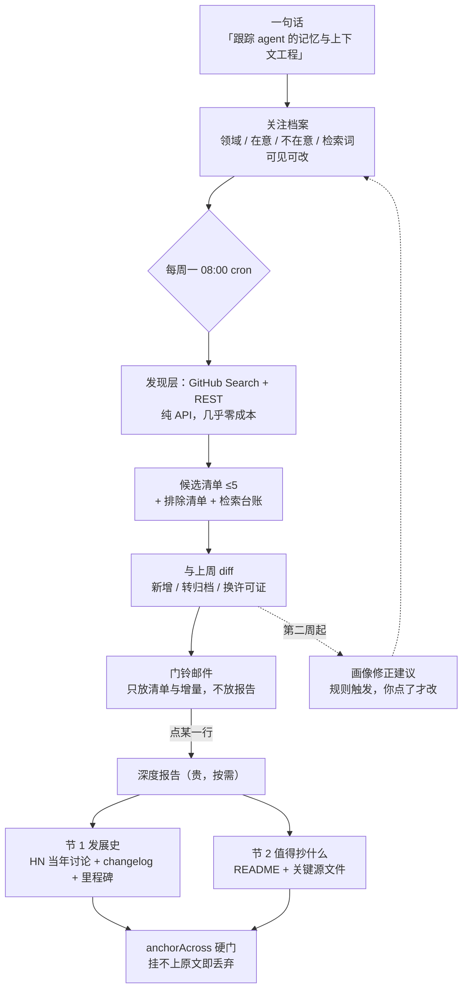

# 003 每周拆一个 — 产品方案（草稿，待评审）

> 状态：2026-08-31 草稿，待评审。工作名「每周拆一个」，slug `weekly-teardown`，中文名待定（见「开放问题」）。
>
> 本稿**取代** [`00-旧草稿-先例勘察（已被取代）.md`](00-旧草稿-先例勘察（已被取代）.md)。旧稿把这个需求做成了一次性的开源同类项目扫描，站长 2026-08-31 重新拍板：正本是「一句话 → 每周一份深度调研」。旧稿留档，因为它的数据源实测、锚定设计、成本论证在本稿里被大量复用，读者要追证据时需要它。
>
> 证据来源分三类，文中逐处标注：①2026-08-30 两轮 agent 勘察的实测数字（旧稿正文，74 个 agent，GitHub API 实查）；②2026-08-31 本轮 GitHub Search API 实查（针对「周期性」这一层，旧稿没覆盖）；③本仓已有代码的实际行数与路径。
>
> 站长 2026-08-31 拍板八项，分别落在决策 1–8。
>
> **2026-09-01 修订一处：决策 7 的「从 30 条候选评论里挑 3 条」原来建立在「按分数排序」上，阶段 7 评审直接打真 API 把这个前提证伪了（HN 不公开评论分数），改成按官方 `kids` 的顺序。这是本方案第一次因为实测被改，修订理由与证据写在决策 7 里，原文一并保留。**

## TL;DR

你给一句话（「我想跟踪 AI agent 的记忆与上下文工程」），产品把它拆成一份**看得见、改得动**的关注档案；此后每周一早发一封邮件，里面是 5 个候选开源项目和「这周和上周比变了什么」；你点其中一个，才跑那份贵的深度报告——**上半节是它当年怎么走到今天**（Hacker News 一手讨论 + changelog + GitHub 里程碑），**下半节是它源码里值得抄什么**（每条结论挂逐字引文和带 commit sha 的永久行号链接，挂不上就直接丢弃）。

推荐这个形态的核心理由：一次性深度调研这条赛道已经卷到 8 万星且头部在死，而**周期性**这一层在开源侧最高只有 19 星（2026-08-31 实查）。空位是真的，但它不在无人区——Perplexity 的 Scheduled Tasks 字面上就是「按周自动出报告」。所以差异化不能是「自动」，只能是它**结构上做不到**的那几件事：跨周只讲增量、公开淘汰名单、判断句挂硬锚定。

主要代价有两个，都得在评审时接受。一是**第一周注定看起来平庸**：四条差异化里有三条要到第二周才有东西可看（没有上一周就没有增量）。二是**「点一个才跑」把验收权交给了站长自己的手指**——如果邮件来了不点，整条深度线一次都没被验证过，产品是死的，功能却是全的。

## 背景与问题

### 1. 这个动作站长每次立项都在做，而且是手工做

「先扫一遍同行，再决定自己做什么」不是设想中的需求，是已经在发生的行为：

| 时间 | 场景 | 规模 | 产出形态 |
|---|---|---|---|
| 2026-08-15 | 001 Daily Brief 立项 | 12 个开源同类项目 | 结论「12 个里 11 个没有反馈回路，这正是弃读的共同根源」 |
| 2026-08-21 | 001 信息源评审 | 13 个仓 | 三项质量机制 |
| 2026-08-22 | 002 Watch Router 立项 | 5 个项目 | 三列手工表 + 判例「BibiGPT 开源两年即归档转闭源」 |
| 更早 | translate-agent 立项 | 4 份 research 文档 | 固定五节模板，表头是 `Stars / 更新 / 许可证` |

两次 nanisle 立项，两次都做了。而 [`docs/conventions.md`](../../../docs/conventions.md) 的完工定义第一行是 `v1 built in ≤8h, solves my own need this week`——只要「每周一个产品」还在跑，这个动作就停不下来。

值得单独看一眼 translate-agent 那四份研究文档：文首站长自己写了一句「所有 stars / 更新时间均通过 GitHub API 实际核验，没有凭记忆编造的数字」。**这句话就是本产品立场 4（反捏造）的原文，站长在没有产品的情况下先写出来了。**

### 2. 但手工做的是「扫一遍」，站长这次要的是「每周一份」——两者的差别不是频率

手工那四次都是**立项那一刻**做的：要在半小时内判断这周该不该做这个东西。那种场景要的是一张表（谁做过、死没死、许可证能不能用）。

站长 2026-08-31 描述的是另一件事：**没有具体决定要做时，持续地往一个领域里看**。这两件事的产出物不一样——前者要查全（漏一个撞车的竞品就白做一周），后者要深度（这周只看一个，但要看透）。旧稿把两者当成一件事的两屏，本稿把它们分成两个时刻：**每周的候选清单负责查全，点开的那一份负责深度。**

### 3. 一次性深度调研这条赛道已经饱和，且头部在死

数据来自 2026-08-30 实查：

| 项目 | ★ | 状态 | 说明 |
|---|---|---|---|
| [bytedance/deer-flow](https://github.com/bytedance/deer-flow) | 81,140 | 活跃 | 赛道头名 |
| [stanford-oval/storm](https://github.com/stanford-oval/storm) | 31,177 | **停更 11 个月** | 找视角 → 模拟专家对话 → 大纲 → 写 |
| [assafelovic/gpt-researcher](https://github.com/assafelovic/gpt-researcher) | 29,208 | 活跃 | `SIMILARITY_THRESHOLD=0.42` **静默丢源**，用户看不见丢了什么 |
| [langchain-ai/open_deep_research](https://github.com/langchain-ai/open_deep_research) | 12,678 | **2026-08-10 已归档** | 最有资源、最懂编排的团队主动停手 |
| [guy-hartstein/company-research-agent](https://github.com/guy-hartstein/company-research-agent) | 2,255 | 活跃 | 本赛道**专用**星最高；要 Tavily + Gemini + OpenAI + Google Maps 四把 key |

第一条可直接用的结论：**编排循环本身没有护城河。**[dzhng/deep-research](https://github.com/dzhng/deep-research)（19,618★）把项目目标明写成「keep repo <500 LoC」并被社区认同，说明「搜索 → 读 → 写报告」这个循环已经是常识，不值得作为差异化。

### 4. 而「周期性」这一层，开源侧最高只有 19 星

这是本轮（2026-08-31）新查的，旧稿没覆盖。GitHub Search API 实查：

| 查询 | 命中总数 | 最高星 |
|---|---|---|
| `scheduled research agent cron report` | 3 | **19★** [vincenzo-afk/Intelis-Agent](https://github.com/vincenzo-afk/Intelis-Agent)（按你的时间表监控网络、LLM 核实、推送情报） |
| `arxiv daily digest agent llm` | 7 | **19★** [yang3kc/daily_arxiv_digest](https://github.com/yang3kc/daily_arxiv_digest) |
| `weekly newsletter generator ai agent` | 3 | **0★**（三个仓全是 0 星） |
| `topic:research-agent` | 404 | 8,361★ MiroThinker——但 404 个仓里**没有一个**以「持续追踪某个人的关注点」为核心 |
| `company research agent` | 1,208 | 2,255★ guy-hartstein（一次性）；214★ mayooear/ai-company-researcher **已归档** |

一个诚实的注脚：GitHub 全文搜索要求所有词同时命中，所以 `0 total` 更多是查询串写长了的假象，不能当成「没人做」的证明。但**短查询也只顶到 19 星**，这个是真信号：一次性调研有 8 万星的项目，周期性调研没有超过 20 星的。

### 5. 真正的对手不在 GitHub 上，而且它字面上就是这个产品

| 产品 | 已经做到哪 |
|---|---|
| **Perplexity Scheduled Tasks** | 按你设的周期在云端自动跑监控 / 报告 / 简报，用与一次性对话**同一套**工具、connector 和子 agent。笔记本不用开着。 |
| Gemini Notebook | 免费 50 源/notebook，内联引用点一下跳原文精确位置，Timeline 是内置生成物，公开分享链接 |
| ChatGPT Deep Research | 5–30 分钟出长报告，引用准确率约 78% |

**站长描述的「AI 每周帮我调研一次并出报告」，Perplexity 已经免费或低价发完了。**所以「自动」「周期」「出报告」这三个词都不能作为差异化，一个都不能。

这几家共同的缺口有两处，而且都是结构性的、不是偷懒：

1. **没有一家告诉你它淘汰了什么。** gpt-researcher 用 0.42 的相似度阈值静默丢源，Perplexity 不公开淘汰名单，Gemini Notebook 的 Discover sources 只给你它选中的。
2. **每次任务之间没有记忆。** Perplexity 的 scheduled task 建在会话模型上，第 5 次跑不知道前 4 次说过什么，所以它只能每次都从头写一份完整报告。这不是它没做，是**它的产品结构让"只讲增量"没有落脚点**——一份"只讲增量"的报告，对没读过前四份的人是废纸，而它的用户模型里没有"这个人读过前四份"这个状态。

站长本轮把四条差异化全选了，而这两处缺口正是其中两条。剩下两条（逐字锚定、画像进化）的定位在决策 6 里单独说。

## 方案

一句话：**你给一句话，我每周递给你 5 个候选和一份变更清单；你点一个，我把它拆开给你看，每句话都挂得上原文。**



### 决策 1：正本是周更，不是一次性扫描（站长 2026-08-31 拍板）

旧稿在「为什么不选」里明写了不做订阅推送，理由是「站长已有 001 日更 + 002 事件驱动两条邮件流，第四条会被无视」。这个理由本稿不接受，原因在第 2 节：**周更这一份不是第三封简报，它是另一种东西**——001 是每天的信息流，002 是你主动扔进去一个链接才触发，而这一份的作用是「在你没有具体决定要做什么的时候，替你把某个领域看住」。

代价是真的：**第四条邮件流确实可能被无视**，这是本方案第二脆弱的假设（第一脆弱的见风险 1）。所以邮件形态被限制成门铃（决策 5），且验收判据直接盯点击（风险 2）。

### 决策 2：对象只做开源项目（站长 2026-08-31 拍板）

站长原话是「一家公司或者一个开源项目或者领域内一条方向」。砍掉公司线不是偏好，是供给侧现实。2026-08-30 实测：

| 数据源 | 实测结果 | 判定 |
|---|---|---|
| SEC EDGAR `company_tickers.json` | Stripe / Anysphere / Notion / Raycast / Perplexity / OpenAI **CIK 命中 0/6** | 目标对象根本不在里面 |
| Wayback Machine 快照 | 单张 **12.5 秒**，8 次请求 2 次 `503`，最坏 99.85 秒 | 太慢且不稳 |
| Wayback `first_ts`（域名首次存档） | 4 个样本 **3 个是域名前主**：stripe.com 1996-12、cursor.com 1996-11、raycast.com 2000-04 | **错得很安静**——你会拿到一条看起来很完整的假时间线 |
| HN Algolia API | 6 个对象覆盖 **6/6**，0.30–0.39 秒，匿名无 key | 可做主力 |
| GitHub REST / Search | 匿名 60 次/小时、search 10 次/分钟 | 可做主力，需 PAT 提额 |
| `raw.githubusercontent.com` | 纯 markdown / 源码正文，无明确限流 | 可做主力 |

换成开源项目之后，三个技术死结同时消失：

1. **网页抓取链整条不需要了。** GitHub REST 返回 JSON，raw 返回纯文本，HN Algolia 返回 JSON——全是结构化数据。002 那套 `Defuddle → Readability → r.jina.ai` 三级兜底一行都用不上，这是省下的最大一块工时。
2. **Workers 出口 IP 被拦的问题不存在。** 002 已踩过：家用 IP 抓 B 站通，AWS IP 一律 412。上面这些源都不设防（但仍需开工前 spike 验一次，见实施计划）。
3. **「零 key 端到端可跑」第一次是卖点而不是负担。** 主力源全部免费无 key，所以 `AI_PROVIDER=mock` 时跑的是**真网络、真数据、真锚定**，只有措辞是 mock。001/002 的 mock 都是回放固定样本，这一档更强。

「一条方向」这个对象没有被砍，它降级成了**档案的措辞自由度**：你可以写「跟踪长上下文这条方向」，发现层照样翻译成检索词去查仓。真正被砍掉的只有公司。

### 决策 3：一句话变成一份看得见改得动的关注档案（站长 2026-08-31 拍板）

场景是：站长输入「我想跟踪 AI agent 的记忆与上下文工程」。直觉方案是把这句话原样存下来，每周喂给模型让它现场理解。卡点有两个：一是你永远不知道模型把「上下文工程」理解成了 RAG 还是 prompt 缓存还是 KV cache，出错了也没有地方改；二是**它和站长选的「画像持续进化」在结构上互斥**——没有结构化字段，就没有东西可以被逐周修正。

所以一句话进来之后立刻被拆成一份档案，摆在页面上：

```ts
type Dossier = {
  sentence: string        // 你的原话，永久保留，任何时候能看到我是从哪句话推出来的
  domain: string          // 领域边界，一句话
  caresAbout: string[]    // 我在意什么（≤5 条）
  notCaresAbout: string[] // 我不在意什么（≤5 条）——决定排除清单，比正向条目更值钱
  queries: string[]       // 5–8 条检索词：GitHub 关键词组合 / topic: 限定 / HN query
  rev: number             // 每次接受修正建议 +1，报告上印着它基于哪一版档案生成
}
```

这是 001 那套「追踪定义档案」（dossier）模式的移植，本仓已有先例，UI 成本低。

三个字段值得单独说：

- **`notCaresAbout` 比 `caresAbout` 值钱。** 站长手工表里的排除理由绝大多数是负向的（「停更 2024-07」「AGPL 污染 MIT」「需要四个 key」）。负向条目直接喂给排除清单，是这份档案唯一能立刻产生可见效果的字段。
- **`queries` 必须原文显示、可手改、改完能重跑。** 这既是查全的唯一补救手段，本身也是问责区的一部分——你看得见我拿什么词去搜的。
- **模型在发现层只做翻译，不做回忆。** 让模型列举它知道的项目名，漏掉的它自己不知道漏了；让它把「上下文工程」翻译成 `context engineering`、`kv cache`、`topic:llm-memory`，再由 GitHub Search 返回真实结果，召回上限就从「模型记得多少」变成「GitHub 索引了多少」。代价是翻译质量直接决定查全率——这是本产品最危险的失败模式（风险 1）。

### 决策 4：每周只挑 5 个候选，点了才跑深度（站长 2026-08-31 拍板）

成本结构决定了这个切法：发现层是纯 GitHub API，一次几乎零成本、3–5 秒；深度报告两节合起来估 $0.4–0.6、60–120 秒。如果每周自动跑一份完整报告，就是每周烧一份**你可能根本不关心**的报告。

| | 每周自动（候选清单） | 点一行才跑（深度报告） |
|---|---|---|
| 内容 | ≤5 行：★ / `pushed_at` / **归档徽章** / license / 一句话形态 | 两节：发展史 ≤12 节点 + 值得抄什么 ≤5 条 |
| 数据源 | GitHub Search + REST，**除那句形态描述外零 LLM** | HN Algolia + changelog RSS + REST + raw 源码 |
| 延迟 | 3–5 秒 | 60–120 秒 |
| 成本 | 近似 0 | $0.4–0.6 |

候选清单旁边固定挂两样东西，它们不是附加项，是产品本身：

- **排除清单**，每条带理由，且**理由分两栏渲染**：`archived == true`、`pushed_at` 超期、license 与 MIT 冲突、需要 ≥2 把付费 key，这些由代码从 GitHub 字段直接算，模型不接触；「形态不同」「目标用户不同」才是模型判的。两者在 UI 上分色，每条带 `reasonSource: "rule" | "model"`。
- **检索台账**：`发出 6 条查询（原文可见）· 返回 87 个仓 · 进清单 5 · 排除 82 · 抓失败 4`。数字**全部由代码统计，模型永远不接触**——沿用 001 `types.ts` 那条家法：computed in code, never written by the model。
- **可申诉**：点「这个该进来」→ 强制入清单 → 只重跑受影响的部分，不重跑整周。沿用 001 `feedback.ts` 的捞回回路。

### 决策 5：每周一封门铃邮件，点链接回网页跑（站长 2026-08-31 拍板）

邮件正文只放三样：本周 5 个候选（名字 + ★ + 归档徽章 + 一句话）、与上周的差异（新增 / 转归档 / 换许可证）、一个回网页的按钮。**不放报告全文，不放要点。**

理由是 001 决策 1 的立场原样复用：邮件当门铃不当报纸，消费必须发生在网页上——报告里那些带 commit sha 的行号链接、锚定引文的展开、申诉按钮，在邮件客户端里全是死的。

技术上这一条比想象的便宜，因为 002 已经建好了整条路：

| 已有 | 位置 | 说明 |
|---|---|---|
| Workers cron | [`002/wrangler.jsonc:14`](../../002-watch-router/wrangler.jsonc) `"triggers": { "crons": [...] }` + `index.ts:740` 的 `scheduled()` | 本地用 `wrangler dev --test-scheduled` 打 `/__scheduled?cron=...` 触发 |
| SES 发信 | [`002/src/shared/email.ts`](../../002-watch-router/src/shared/email.ts)，176 行 | `aws4fetch` 签名直调 SES v2 HTTP API，**Worker 里就能发，不需要 Lambda** |
| 退订 token | 同上 | HMAC 签名的「邮箱 + 用途」，专用密钥 `EMAIL_UNSUB_SECRET`，不复用登录信物 |

按 conventions 的自包含原则，这三样是**物理复制**过来改模板，不是跨产品 import。估 0.5 小时。

### 决策 6：绝不砍的是逐字锚定与永久回链（站长 2026-08-31 拍板）

站长把四条差异化全选了，但 8 小时装不下（预算算术见实施计划），所以拍板了「砍了就不成立」的那一条：**逐字锚定 + 永久回链**。

这条判断我认为是对的，但理由要说准，否则实现时会走偏。锚定不是四条里最独特的一条——Gemini Notebook 的内联引用做得比我们准。它是**唯一一条让另外三条不至于变成 AI slop 的地基**：跨周增量如果基于幻觉，那是每周准时送达的错误；淘汰清单如果理由是编的，问责区就是装饰。

具体实现分两道门，顺序是**先抓后写**：

**门 1（结构性防捏造）**：进候选清单的每个仓必须真的 `GET api.github.com/repos/<owner>/<repo>` 拿到 200，拿不到就不显示。这让「模型编了一个不存在的仓」在结构上不可能发生。这是 001 `wizard.ts`「模型只产出待验证的字符串，抓通了才展示」的原样移植。

**门 2（引文锚定）**：现有 [`002/src/shared/anchor.ts`](../../002-watch-router/src/shared/anchor.ts)（33 行）的签名是 `anchorKeyPoints(result, fullText)`——把整份转录稿当成唯一的比对底本，归一化（去空白 / 标点 / 符号 + 小写）后做子串比对。这里有十几份材料而不是 1 份，直接沿用会引入 002 没有的失败模式：模型给 A 项目写的引文，可能在 B 项目的 README 里恰好命中，于是一条张冠李戴的引文拿到了 `anchored: true`。所以改成：

```ts
anchorAcross(quote: string, sources: Map<SourceId, string>, claimedSource: SourceId)
// 只在 claimedSource 那一份里比对；跨源命中判为失败，不判为成功
```

归一化逻辑和 `MIN_NEEDLE_CHARS = 4` 原样保留。命中时顺手用 `indexOf` 已拿到的下标截存前后各 150 字当上下文，零额外 token。

**分级要有意反转 002 的家法**：事实层配不上 → 灰显不删（沿用 002）；判断层配不上 → **直接丢弃**。理由是判断层是这个产品最想被人读的一层，在最想被读的地方放软门就是自欺——读者会把灰色当排版，照读不误。这条要写进代码注释。

**关于「判断句怎么锚定」必须把话说破**：判断句在原文里不存在，所以它不可能被锚定。任何「我们的判断也有引用」都是假的。唯一诚实的做法是换校验对象——002 校验「引文 ∈ 原文」，这里校验「判断 ∈ 已锚定证据的闭包」：

```ts
type Takeaway = {
  text: string
  basedOn: EvidenceId[]   // 非空，且每个 id 对应的证据必须 anchored === true
}                          // 否则在确定性拼装阶段丢弃这条 takeaway
```

页面上要同时写清：可校验的是**推理的地基，不是推理本身**。这道硬门有一个免费的副作用——它会自动滤掉「要重视开发者体验」这类正确的废话，因为这种句子挂不上任何一段具体的原文。

### 决策 7：报告分两节，历史 + 源码（站长 2026-08-31 拍板）

站长原话是「发展历史 + 值得借鉴反思」，两节各自对应一半。

**节 1：它当年怎么走到今天。**≤12 个节点：`created_at` → 首个 release → 关键 changelog 条目 → HN 上的发布帖 → 最后一次 push →（归档日）。每个节点挂逐字引文和永久回链。

主体是**当年 HN 上的一手反应原文**，这一点值得单独说：所有深度调研工具都在用后见之明重写历史——它们读的是今天的文章，讲的是「这家为什么成功」。当年那条 Show HN 底下排在最前面的质疑帖说的是别的东西，而那才是判断层的好原料。Perplexity 和 Gemini Notebook 结构上都不去这个语料。实现上模型唯一被允许的动作是从 30 条候选评论里挑 3 条，**候选池的顺序取自 HN 官方 API 的 `kids` 数组**，取数和排序都由代码做。

> **2026-09-01 修订（实测证伪，这是本方案第一次因为实测被改）。**
>
> 上面这段原来写的是「当年那条**最高分**的质疑帖」，配套的实现是「取回 30 条评论后按 `points` 降序排」。**这个前提不成立：HN 不公开评论分数。**
>
> 实测证据（阶段 7 评审，直接打真 API）：
>
> | 查的东西 | 结果 |
> |---|---|
> | `hn.algolia.com/api/v1/search?tags=comment,story_3742902` | 88 条命中，hit 里**根本没有 `points` 这个键**（不是 0，是不存在） |
> | 同一个查询的返回顺序 | 按 `objectID` **降序**（最新的在前） |
> | `hn.algolia.com/api/v1/items/3742902`（整棵树） | children 按 id **升序**（发表时间序），也不是排名 |
> | `hacker-news.firebaseio.com/v0/item/3742902.json` | 有 `kids`（31 条），顺序**不是**升序 —— 那就是 HN 自己的排名 |
>
> 后果有三层，一层比一层严重：①「按分数排」在代码里退化成了「按时间排」，而候选池又是「最新 90 条」，于是真实口径变成**「最新 90 条评论里最早的 30 条」**——一个没人设计过的取样；②提示词对模型说「这些按分数排好了」，模型据此写判断，而那个依据不存在；③页面上每条挑出来的评论后面印着「(0 分)」，**在一个把反捏造写进立场 4 的产品里，那是页面上唯一一个凭空来的数字**。
>
> **站长 2026-09-01 拍板：改用 `kids` 的顺序。**它比分数更忠于本决策的原意——`kids` 真实反映了当年的投票与降权，只是不告诉你具体数值。落地口径：
>
> - 候选池 = `kids` 的**前 30 条**（顶层评论，正是当年帖子第一屏上的那几条）；
> - 正文仍从 Algolia 一次批量取（`/api/v1/items/<storyId>`），按 objectID 与 `kids` 对齐；**对不上的如实少给，不拿后面的评论补位**；
> - 页面和提示词都**不再出现分数**，改说「HN 排在第 N 条」——那是我们真的知道的事；
> - `kids` 拿不到时（官方接口挂了 / 这条帖子没有 kids）**降级要说出来**：候选池按发表时间升序，报告里加一条标注，页面和提示词同时改口「这不是 HN 的排序」。悄悄退回旧口径是这里唯一不许做的事。
>
> 顺带说明一个仍然成立的地方：**帖子**（story）的分数是真的，Algolia 对 story 给 `points`，所以时间线上「HN 发布帖（214 分 / 87 条评论）」照旧。不给分数的只有评论。

**节 2：它源码里值得抄什么。**这一节是本稿相对旧稿新增的，也是最贵的一节。流程：

1. `GET /repos/{o}/{r}/git/trees/{sha}?recursive=1` 取文件树；
2. 按路径启发式挑 ≤5 个文件（优先 `README`、`src/index.*`、目录名与档案 `caresAbout` 命中的、排除 `test/` `vendor/` `node_modules/` 和 >100KB 的文件）；
3. `raw.githubusercontent.com/{o}/{r}/{sha}/{path}` 取正文，每份截断到前 12KB；
4. 产出 ≤5 条 takeaway，每条 `basedOn` 指向 `github.com/{o}/{r}/blob/{sha}/{path}#L12-L28`。

**注意链接里是 commit sha 不是分支名**：`blob/main/...#L12` 这种链接会在对方下次提交后指向完全不同的代码，而 `blob/<sha>/...#L12` 永远指向你当时读到的那几行。这是「永久回链」里「永久」两个字的全部含义。

每条 takeaway 强制回答一个问题：**它对应档案里 `caresAbout` 的哪一条**。这不是形式主义——它是滤掉「这个项目用了 zod 做校验」这类真但无用的观察的唯一手段（风险 3）。

### 决策 8：跨周增量与画像修正建议排到第二周，但第一周就要落库

站长选的四条差异化里，「跨周增量」和「画像进化」有一个共同性质：**第一周物理上无法验收，因为没有上一周。**所以它们不是被砍，是排到第二周——但第一周必须付出「快照落库」这个代价，否则第二周做不了 diff。

第一周要落库的结构：

```ts
type WeeklyScan = {
  weekOf: string          // "2026-W36"
  dossierRev: number      // 基于哪一版档案跑的，改过档案之后 diff 要标出来
  queries: string[]       // 当周实际发出的检索词原文
  returned: number; admitted: number
  candidates: Candidate[] // 每个仓的 {fullName, stars, pushedAt, archived, license, createdAt} 快照
  excluded: Exclusion[]   // 带 reasonSource
}
```

**跨周增量（第二周，约 1h）**：同一档案的相邻两周 `WeeklyScan` 做 diff，四类变化上邮件——新出现的仓、`archived` 由 false 变 true、license 变更、star 跃迁超阈值。邮件正文只讲增量，全量清单在网页上。

**画像修正建议（第二周，约 0.5h）——必须是规则触发，不是模型自由发挥。**场景：站长连续两周收到候选清单，里面有三个 RAG 类项目他一次都没点开。直觉方案是每周让模型看一眼历史再"建议"改档案，卡点是模型会每周都硬凑出一条建议来，两周后这个提示就成了噪声，站长开始无视它——和无视第四条邮件流是同一种死法。所以改成：由代码统计确定性信号（某个 topic 连续 N 周进清单且点击数为 0 / 某条 `caresAbout` 连续 N 周零命中 / 某个被排除的仓被站长申诉过两次），命中规则才生成一条建议，**模型只负责把这条建议写成一句人话**，站长点确认才改档案并 `rev + 1`。没有规则命中的那一周就不提建议——**沉默是合法输出**。

### 为什么不选这些

**为什么不叫「深度调研」。**这个词会把产品放进一个必输的比较框：读者心里唤起的是「一份报告」，而免费对手（Gemini Notebook 50 源 + 逐段跳转 + 内置 timeline + 分享链接）已经把那份报告做得更好，我们交付的东西会被评价成「一份不完整的报告」，而不是「一件完整的另一种东西」。

**为什么不让 AI 每周自动挑一个直接跑完发邮件。**这是最省事的形态，站长明确否了。除了成本（每周烧一份可能不关心的报告），更重要的是它**取消了唯一的需求信号**：站长点了哪一个、没点哪一个，是画像修正建议的全部原料（决策 8）。自动跑完之后，你无法区分「他读了」和「他删了」。

**为什么不走 AWS 慢车道（002 那套 DynamoDB + SQS + Lambda）。**纯结构化源实测全部低于 0.5 秒（HN Algolia 0.30–0.39s、changelog RSS 0.017–0.05s、GitHub 0.10–0.28s），一次报告 20–40 个子请求，离 Workers 付费档 10,000 子请求上限差两个数量级。002 那套编排在这里是纯负担。

**为什么不做成 Claude Code skill。**这个产品完全可以做成一个 skill，半天做完，产出直接落进目标仓的 `docs/`，还顺手绕开 Workers 出口 IP 的问题。它给不了的只有一样：**跨周状态**。skill 每次在你机器上从头跑，没有"上周"这个概念，而站长选的四条差异化里有两条建在跨周状态上。这是网站形态相对 skill 的唯一存在理由——如果第二个月发现站长从不看增量，那就该退回 skill 形态，这不丢人（风险 4）。

**为什么不做公司/产品线。**见决策 2 的数据源实测表。

## 实施计划

### 开工前 30 分钟：出口 spike（不过就改方案，不是改代码）

上面所有延迟数字来自美东住宅 IP，而 Workers 出口是全球共享的 Cloudflare 数据中心 IP。002 已实测「AWS IP 上 B 站一律 412」，同类风险这里必须先排掉。

部署一个 10 行 Worker，从 CF 出口连打 20 次 HN Algolia / GitHub API / `raw.githubusercontent.com` / 三个 changelog RSS，记状态码与延迟。**通过判据**：GitHub 带 PAT 无 403，HN Algolia 20/20 成功且 p95 < 2 秒。不过就退回 skill 形态，当周改做 skill。

顺带说明 PAT（personal access token，GitHub 个人访问令牌）为什么是必须的：匿名限额按 IP 算，而 Workers 出口那个 60 次/小时的桶要和所有租户共用，等于零。PAT 走 `wrangler secret put` 注入，不进仓库；不配也能跑（匿名档是真跑不是回放），所以不破「fork 零 key 端到端」这条释放门槛。

### 8 小时切法

| 时段 | 内容 | 做完了怎么验证 |
|---|---|---|
| 0.5h | 复制 `templates/web-app/` → `products/003-weekly-teardown/`，改 `package.json` / `wrangler.jsonc` 的 name；主站登记（`lib/product-mounts.ts` 一行、`wrangler.jsonc` services 一条、`content/products/` 一个 md）+ SSO 移植 | `localhost:3000/products/weekly-teardown` 能进，登录手递票验签通过（三份 sso 契约测试同时过） |
| 1.0h | 一句话 → 关注档案：AI 拆字段 + 可见可改 UI + 落库 | 输入站长那句话，四类字段都非空；改一条 `queries` 能触发重跑 |
| 1.5h | 发现层：档案 → 检索词 → GitHub Search → REST 详情 → 规则过滤 → `WeeklyScan` 落库 | 进清单的仓 100% `GET /repos` 200；能重现 002 立项手工表里 5 个项目中的 ≥4 个（见风险 1） |
| 1.0h | 第一屏：候选清单 + 排除清单（规则/AI 分色）+ 检索台账 + 申诉按钮 | 台账四个数字与后端计数一致；申诉一个仓只重跑受影响部分 |
| 2.0h | 深度报告两节：节 1（HN Algolia + changelog RSS + REST 里程碑）；节 2（文件树 → 挑文件 → raw 取正文 → 带 sha 行号链接） | 对 BibiGPT 跑一次，能出「2024 年开源 → … → 归档转闭源」且归档节点挂得上 GitHub 字段；节 2 的每条链接点开能看到引文那几行 |
| 0.5h | `anchorAcross` 多源改造 + 判断层硬门（`basedOn` 为空即丢弃） | 构造一条跨源引文，必须判失败；构造一条无依据 takeaway，必须消失 |
| 0.5h | 每周 cron + 门铃邮件（物理复制 002 的 `email.ts` 改模板） | `wrangler dev --test-scheduled` 触发能收到信；退订链接线上生效 |
| 1.0h | 配额 + 全局日花费闸 + mock 模式 + README + `.dev.vars.example` | `AI_PROVIDER=mock` 下零 key 端到端跑通（真网络真锚定）；花费闸打满返回 429 |
| 0.5h | 部署 + 线上验一遍 | 线上跑一次真实档案，收到第一封门铃邮件 |

合计 **8.5 小时**，超预算 0.5。诚实地说：这就是超了，不要假装 8.0。超时剪枝顺序提前写死。

### 超时剪枝顺序（评审时一票否决违反者）

先砍 **节 2 的文件挑选启发式**（退化成只读 README，报告仍是两节但源码那节变浅）→ 再砍 **申诉按钮** → 再砍 **门铃邮件**（第一周手动触发一次，第二周补 cron）。

**绝不砍**：`anchorAcross` 硬门、检索台账、排除清单的规则/AI 分色、`WeeklyScan` 落库。前三个是产品本身，第四个是第二周的地基——第一周不落库，第二周的跨周增量就无从做起。

### 成本闸

单份报告两节合计估 **$0.4–0.6**（DeepSeek v4-pro 峰时，含 reasoning low 的 output），约为 002 的 3–4 倍，因为节 2 要读源码正文。

而 001 和 002 的源码里**只有次数配额**（`QUOTA_LIMITS = { gen: 5, ai: 30 }`），没有任何全局花费上限——20 个人各打满账号额度就是几十美元。所以这个产品要加一个 001/002 都没有的东西：累计 `estUsd` 超阈值时全站深度报告端点返回 429，页面写「今天的预算用完了，明天再来」。配额同时收紧到**账号 2 份报告/天、IP 3 份/天**。把成本上限印在产品脸上，本身就是有限性最诚实的演示。

## 风险与开放问题

### 风险 1：残缺但看起来完整（最脆弱的假设）

这是本方案最该被质疑的地方。候选清单的价值全在「查全」，而查全的上限由检索词翻译质量决定：模型把「上下文工程」翻成了 `context engineering` 和 `prompt caching`，但没翻出 `kv cache` 或 `topic:llm-memory`，那份清单就是残的。

**而残的清单和全的清单长得一模一样。**用户看到 5 行、看到台账写着「返回 87 个仓、进清单 5」，会认为这就是这个领域的全貌。这和 Wayback `first_ts` 把域名前主的时间当成公司成立时间是同一类病：**错得很安静**。

而周更让这个病比一次性扫描更重：一次性扫描你只被误导一次，周更是每周一早准时被误导一次，而且每周都长得很权威。

三条缓解，按有效性排序：

1. **检索词可见可改可重跑**（决策 3）。这是唯一真正的补救，其余两条只是降低伤害。
2. **页面顶部写死一句诚实声明**，第一屏可见不可折叠：「我看到的是 GitHub Search 按 star 排序返回的前 N 条，不是这个领域的全部项目。」
3. **验收测试就测查全**：拿 001 和 002 立项时那两张手工表做基准，输入对应档案，看能捞回多少。002 那张表 5 个项目，捞回 <4 个就是不及格。**这个测试要在第一天做，不是发布前做**——它决定的是方案成不成立，不是质量好不好。

### 风险 2：邮件来了不点，产品是死的但功能是全的

决策 4 把深度报告放在「点一行才跑」后面，这意味着**整条深度线的验证权在站长的手指上**。如果第一周的邮件来了，他扫一眼清单就关掉，那么锚定、两节报告、永久回链——这周做的一大半——一次都没被真实使用过，而验收会显示"功能全做完了"。

诚实判据：**第二周结束时，如果点开的报告少于 2 份，就停下来复盘形态，不要继续加功能。**可能的结论是清单本身已经够用（那就退回旧稿的一次性扫描），也可能是邮件里放的信息不足以让人想点（那就调门铃的内容，而不是加功能）。

### 风险 3：节 2 产出「真但无用」的观察

锚定硬门能滤掉幻觉和正确的废话，但滤不掉「这个项目用 zod 做输入校验」这种**有原文支撑、也确实是真的、但对你下周写什么代码毫无影响**的观察。这类句子完全满足 `basedOn` 非空且证据 `anchored === true`。

缓解是决策 7 那条强制约束：每条 takeaway 必须标出它对应档案里 `caresAbout` 的哪一条，标不出来的丢弃。这条约束的有效性没有验证过——它可能只是逼模型硬凑一个映射。**开工前应拿 002 那张手工表盲测一次**（不给项目名，只给源码），看 DeepSeek 能不能得出「BibiGPT 归档转闭源」这个级别的结论。如果不能，节 2 就该缩成「只给坐标不给判断」。

### 风险 4：跨周价值的实证只有一个样本

决策 8 把网站形态相对 skill 的存在理由押在跨周状态上，而支撑它的证据只有一次：08-15 扫 digest 类 12 个仓、08-21 又扫 13 个，同一领域、6 天内、集合几乎必然重叠。n=1。

缓解：第二个月诚实复盘一次。如果站长从不去翻上一周的结果，那就该把这个产品退回 skill 形态。

### 风险 5：对手一个版本就能抹平

Perplexity 若给 scheduled task 加上跨次记忆（技术上没有障碍，只是产品结构的选择），四条差异化里最强的一条即刻蒸发。剩下能守住的只有「公开淘汰名单」——那是个立场问题不是技术问题，而立场是可以被抄的。

这个风险无法缓解，只能接受。它对定价和投入的含义是：**这个产品值得做成每周一个的 8 小时 MVP，不值得做成三个月的工程。**

### 开放问题

| 问题 | 现状 |
|---|---|
| 中文名 | 工作名「每周拆一个」，slug `weekly-teardown`。备选「拆解台」「同行档案」。不能叫「深度调研」（见「为什么不选」）。文件夹已按工作名重命名，未提交，改名零成本。待站长定 |
| 存储选型 | 倾向 Cloudflare D1：跨周 diff 要按 `(dossierId, weekOf)` 范围查，KV 的前缀 list 排序太弱。002 用 DynamoDB 是因为 Lambda 也要读，本产品全在 Worker 内，没有这个约束。待评审 |
| 一个人能有几份档案 | v1 一份。多份会让每周邮件变成多封或一封长信，且画像修正建议的规则要按档案分别统计。等站长真的想跟踪第二个领域时再说 |
| 中文项目的「当年怎么说的」覆盖为零 | HN 上中文项目讨论极少，V2EX API 未实测。v1 接受这个缺口并在页面上标明「这个项目在 HN 上没有记录」，不假装有 |
| GitHub Search 的排序偏差 | 按 star 排序会系统性漏掉新项目。周更场景下这个偏差比一次性扫描更严重——新项目正是"增量"里最该出现的东西。是否加一路 `sort=updated` 的查询，待定 |
| 判断层用哪个模型 | DeepSeek v4-pro 在节 2 的产出质量没测过。开工前盲测（风险 3） |
