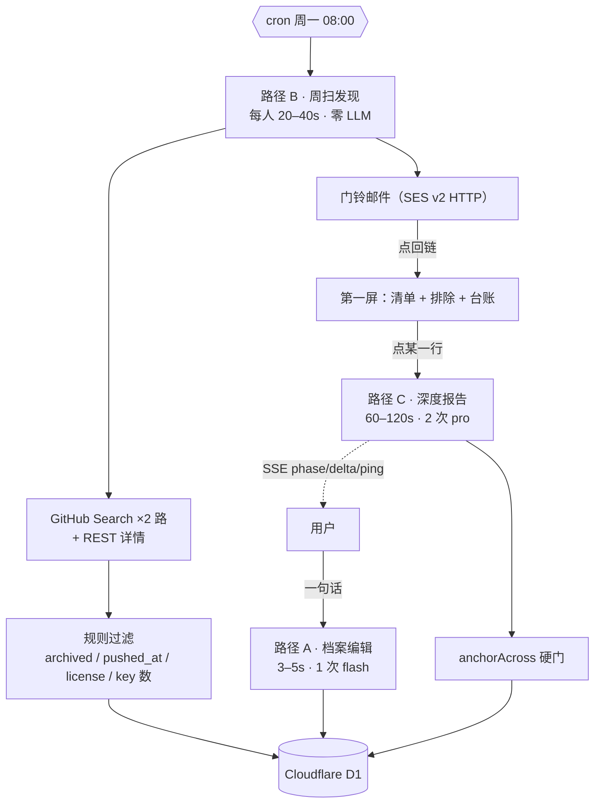

# 003 领域拆解 — 技术方案

> 状态：2026-09-01 草稿。中文名「领域拆解」，slug `weekly-teardown`（slug 不改，改了主站路由和 Service Binding 都要跟着动）。
>
> 上游是 [`01-产品方案.md`](01-产品方案.md)，本稿不重复它的产品论证，只回答「代码怎么写」。凡是产品方案已经拍板的（决策 1–8），这里只在实现层面展开；凡是本稿新引入的技术选择，都写清楚卡点。
>
> 站长 2026-09-01 在本轮技术评审里拍板七项，逐条落在决策 T1–T7。
>
> **术语一次性说明**：本文的「档案」指用户那份可见可改的关注定义（`dossier`），不是文件系统里的文件；「周扫」指每周一 cron 跑一次的候选发现动作；「深度报告」指用户点某一行才跑的那份贵的两节报告。

---

## TL;DR

- 单个 Cloudflare Worker（Hono）+ Cloudflare D1，**不引入任何 AWS 侧计算**（SES 发信除外，它是直调 HTTP API，不是 Lambda）。
- 三条路径的成本量级差三个数量级，所以在代码里也是三条独立的闸：档案编辑（1 次 flash 调用）、周扫发现（**零 LLM**，纯 GitHub API）、深度报告（2 次 pro 调用，$0.4–0.6）。
- 深度报告 60–120 秒，会撞上 Cloudflare 边缘代理「100 秒无字节即 524」的实测限制。**解法是物理复制 002 已经在线上跑通的 SSE 流式 + 10 秒心跳骨架**，不是新发明。
- 主要代价：预算从产品方案的 8.5h 涨到 **9.5h**（SSE 接线 +0.5h、D1 建表迁移 +0.5h），站长已明确接受超支，不走剪枝。

---

## 背景与问题

产品方案已经论证清楚「做什么」和「为什么」。技术侧真正需要回答的是四个问题，其中前两个是**产品方案没有覆盖、会让某条决策做不成**的硬约束。

| # | 问题 | 产品方案怎么说的 | 实际约束 |
|---|---|---|---|
| 1 | 深度报告 60–120 秒在 Worker 里能不能活 | 只论证了「20–40 个子请求离 10,000 上限差两个数量级」 | 子请求数确实不是问题，但**边缘代理约 100 秒无字节就 524**——002 实测踩过，产品方案完全没提 |
| 2 | 跨周快照存哪 | 列在「开放问题」里「倾向 D1，待评审」 | 8 小时切法已经默认按 D1 编排，但当时以为本仓零先例 |
| 3 | 候选清单能不能「查全」 | 风险 1 说查全上限由检索词翻译质量决定 | 还有一层 API 硬顶：**GitHub Search 每个查询最多只能翻到 1000 条** |
| 4 | 多用户下 GitHub 配额够不够 | 未覆盖 | PAT 是**账号级共享桶**（search 30 次/分钟），不是按用户分的 |

### 问题 1 展开：为什么 524 是真问题而不是杞人忧天

场景是用户在 `nanisle.com/products/weekly-teardown` 点了某个仓的「拆开看看」。请求经主站 Worker 的 Service Binding 转发到 003 的 Worker，003 要去抓 HN 讨论、changelog、文件树、5 份源码正文，再调两次 DeepSeek，全程 60–120 秒。

直觉方案是普通 `return c.json(report)`——handler 里同步跑完再一次性返回。卡点是：这条链路经过 Cloudflare 的边缘代理，而代理对「响应体多久没收到新字节」有一个约 100 秒的空闲超时，超时直接给客户端 524。这不是文档里写着的条款，是 002 线上撞过的实测，注释原文留在 [`002/src/worker/index.ts:224`](../002-watch-router/src/worker/index.ts#L224)：

> `100 秒无字节会被 524 掐断——必须边生成边推。`

更麻烦的是 DeepSeek V4 Pro 默认开 thinking，思考阶段**一个 content 字节都不产出**。所以哪怕改成流式转发模型输出，thinking 那几十秒照样是静默的，照样会被掐。002 的解法是流式之外再加一路 `setInterval` 心跳。

### 问题 3 展开：1000 条上限意味着什么

GitHub Search API 对每个查询最多返回 1000 条结果（`total_count` 显示 8 万也只能翻到 1000），`per_page` 上限 100。这条约束把风险 1「残缺但看起来完整」从「取决于我们提示词写得好不好」变成了「**部分残缺是 API 层面注定的**」。

含义是产品方案里那句诚实声明写得还不够准。原文是「我看到的是 GitHub Search 按 star 排序返回的前 N 条」，但用户点开一个热门领域时，真实情况是「GitHub 索引了 8 万个仓，API 只肯给我看 1000 个，我从这 1000 里挑了 5 个」。声明措辞要改成把这个漏斗写全（见决策 T3）。

---

## 方案

### 总览



三条路径的闸各自独立，理由是它们的成本量级差三个数量级——把它们放进同一套配额里，要么周扫被 AI 配额误伤，要么深度报告被周扫的宽松额度放行。

| 路径 | 触发 | 耗时 | LLM | 单次成本 | 闸 |
|---|---|---|---|---|---|
| A 档案编辑 | 用户输入 / 改字段 | 3–5s | 1 次 flash | ~$0.002 | 账号 `ai` 30/天 |
| B 周扫发现 | cron | 20–40s/人 | 形态描述批量 1 次 flash | ~$0.003 | 无（跑的是我们自己） |
| C 深度报告 | 用户点击 | 60–120s | 2 次 pro | $0.4–0.6 | 账号 `gen` 2/天 + IP 3/天 + **全局 $3/天** |

### 决策 T1：深度报告走 SSE 流式 + 10 秒心跳，骨架物理复制 002（站长 2026-09-01 拍板）

**场景**：用户点「拆开看看」，等 60–120 秒。

**直觉方案**：handler 里同步跑完 `return c.json()`。

**卡点**：见「问题 1 展开」——边缘代理 100 秒空闲即 524，且 thinking 阶段完全静默。

**新方案**：照搬 [`002/src/worker/index.ts:210-262`](../002-watch-router/src/worker/index.ts#L210-L262) 那段快车道骨架，四个组成部分一个都不能少：

```ts
const { readable, writable } = new TransformStream<Uint8Array, Uint8Array>();
const writer = writable.getWriter();
const enc = new TextEncoder();
const send = (obj: unknown) => writer.write(enc.encode(`data: ${JSON.stringify(obj)}\n\n`)).catch(() => {});

c.executionCtx.waitUntil((async () => {
  const ping = setInterval(() => void send({ type: "ping" }), 10_000);
  try { /* 抓取 → 两次模型调用 → 锚定 → 拼装 */ }
  finally { clearInterval(ping); await writer.close(); }
})());
return new Response(readable, { headers: { "content-type": "text/event-stream" } });
```

| 组成 | 作用 | 不要它会怎样 |
|---|---|---|
| `TransformStream` + `data: …\n\n` | 边生成边推 | 100 秒后 524 |
| 10 秒 `ping` | thinking 阶段保活 | 模型思考 100 秒照样 524 |
| `waitUntil` 包整段 | 页面关了照跑完 | 用户切走一次就白烧 $0.5 |
| `InflightRecord` 落 D1 | 刷新能接回进度 | 002 已经踩过一次「刷新丢进度」，git log 里有这条修复 |

**事件序列**（前端 `EventSource` 消费）：

```
phase   { phase: "discovering" | "history" | "source" | "anchoring" }
delta   { chars: 1234 }        // 1 秒节流，只报字符数不报内容
ping    {}                     // 10 秒一次，thinking 期间的唯一字节
result  { report: {...} }      // 或 error { message }
```

**代价**：前端要写 `EventSource` 消费和断线重连（刷新后靠 `GET /api/report/inflight` 接回），比一次性 `fetch().then()` 多约 0.5 小时。这就是预算从 8.5h 涨到 9.0h 的那半小时。

### 决策 T2：存储用 Cloudflare D1（站长 2026-09-01 拍板）

**场景**：第二周要按 `(dossierId, weekOf)` 取相邻两周快照做 diff，还要统计「某个 topic 连续 N 周进清单且点击数为 0」这类规则信号（产品方案决策 8）。

**直觉方案**：沿用 001/002 的 DynamoDB + KV，零新技术引入。

**卡点**：DynamoDB 在这里是纯负担——001/002 用它是因为 Lambda 侧也要读同一份数据，而 003 全部逻辑都在 Worker 内，没有这个约束，却要为此背上 `aws4fetch` 手签 SigV4 那一整套代码和一组 IAM 凭证。而 KV 虽然能用前缀 list 取到相邻两周（`weekOf` 用 `2026-W36` 这种字典序可排的格式），但决策 8 那些跨周聚合统计要在代码里手写遍历，每加一条规则就多一段循环。

**新方案**：D1。本仓**有先例**——主站 [`web/wrangler.jsonc:19-26`](../../../web/wrangler.jsonc#L19-L26) 已经在用 `AUTH_DB`，[`web/migrations/`](../../../web/migrations/) 有三个迁移文件，`wrangler d1 migrations` 的用法照抄即可。（Phase R 调研一度报告「本仓 D1 零先例」，那是只搜了产品仓没看主站，此处更正。）

**代价**：产品 Worker 侧自建 D1 是新的，建库 + 写迁移 + 本地 `wrangler d1 execute --local` 跑通约 0.5 小时。

#### 表结构

```sql
-- migrations/0001_init.sql

CREATE TABLE dossier (
  id           TEXT PRIMARY KEY,
  user_email   TEXT NOT NULL UNIQUE,   -- v1 每人一份档案
  sentence     TEXT NOT NULL,          -- 用户原话，AI 永不改写
  domain       TEXT NOT NULL,
  cares_about      TEXT NOT NULL,      -- JSON string[]，≤5
  not_cares_about  TEXT NOT NULL,      -- JSON string[]，≤5
  queries      TEXT NOT NULL,          -- JSON string[]，5–8 条
  rev          INTEGER NOT NULL DEFAULT 1,
  created_at   INTEGER NOT NULL,
  updated_at   INTEGER NOT NULL
);

CREATE TABLE weekly_scan (
  -- 确定性 id：`${dossierId}#${weekOf}`，不掷骰子、不查库（store.ts 的 weeklyScanId）
  id            TEXT PRIMARY KEY,
  dossier_id    TEXT NOT NULL,
  week_of       TEXT NOT NULL,          -- "2026-W36"，字典序即时间序
  dossier_rev   INTEGER NOT NULL,       -- 基于哪一版档案跑的
  queries       TEXT NOT NULL,          -- 当周实际发出的检索词原文（JSON）
  returned      INTEGER NOT NULL,       -- 台账四数：以下全部由代码统计
  admitted      INTEGER NOT NULL,
  excluded      INTEGER NOT NULL,
  fetch_failed  INTEGER NOT NULL,
  created_at    INTEGER NOT NULL
);
CREATE UNIQUE INDEX ux_scan ON weekly_scan(dossier_id, week_of);  -- cron 重跑幂等

CREATE TABLE scan_candidate (
  scan_id         TEXT NOT NULL,
  full_name       TEXT NOT NULL,        -- "owner/repo"
  stars           INTEGER NOT NULL,
  pushed_at       TEXT NOT NULL,
  archived        INTEGER NOT NULL,     -- 0/1
  license         TEXT,                 -- SPDX id，无许可证为 NULL
  repo_created_at TEXT NOT NULL,
  one_liner       TEXT,                 -- 唯一一处模型产出，且只是描述不是判断
  source_route    TEXT NOT NULL,        -- 'stars' | 'updated' | 'both'
  rank            INTEGER NOT NULL,
  PRIMARY KEY (scan_id, full_name)
);

CREATE TABLE scan_exclusion (
  scan_id       TEXT NOT NULL,
  full_name     TEXT NOT NULL,
  reason        TEXT NOT NULL,
  reason_source TEXT NOT NULL,          -- 'rule' | 'model'，UI 分色依据
  appealed_at   INTEGER,                -- 申诉时间戳，非空 = 站长捞回过
  PRIMARY KEY (scan_id, full_name)
);

CREATE TABLE report (
  id             TEXT PRIMARY KEY,
  dossier_id     TEXT NOT NULL,
  full_name      TEXT NOT NULL,
  commit_sha     TEXT NOT NULL,         -- 永久回链的锚点
  payload_json   TEXT NOT NULL,         -- 整份报告，见下方取舍
  est_usd        REAL NOT NULL,
  anchored_ratio REAL NOT NULL,         -- 锚定成功率，产品要在页面上公开
  created_at     INTEGER NOT NULL
);

CREATE TABLE inflight (
  user_email TEXT PRIMARY KEY,          -- 一人同时至多一趟
  full_name  TEXT NOT NULL,
  phase      TEXT NOT NULL,
  started_at INTEGER NOT NULL,
  updated_at INTEGER NOT NULL
);

CREATE TABLE quota (
  subject TEXT NOT NULL,                -- email 或 'ip#1.2.3.4'
  day     TEXT NOT NULL,                -- "2026-09-01"
  kind    TEXT NOT NULL,                -- 'gen' | 'ai'
  used    INTEGER NOT NULL DEFAULT 0,
  PRIMARY KEY (subject, day, kind)
);

CREATE TABLE daily_spend (
  day     TEXT PRIMARY KEY,
  est_usd REAL NOT NULL DEFAULT 0
);
```

三处设计取舍值得说清楚：

**`weekly_scan.id` 是确定性的 `${dossierId}#${weekOf}`，不是随机 id。**（2026-09-01 评审补写）理由是让整个重灌落进**单个 `batch()`**。重跑有三个触发源（cron 失败重试、站长手动补跑、用户改完档案重扫），每一趟都要做「删掉这一周的旧候选/旧排除 + 覆盖台账 + 重灌新子行」。id 若是随机生成的，就必须先 `SELECT` 一次认出这一周已有的行、复用它的 id——而那次 `SELECT` 只能待在 batch 之外，两趟重扫就能在它上面交错：两边都读到「这周还没跑过」，先写的那趟留下台账行的 id 和它的子行，后写的那趟只把台账的**计数**覆盖掉、子行却按自己那个 id 插了进去。结果是页面顶部那句诚实声明的**分母来自后一趟、分子（候选清单）来自前一趟**，而后一趟的子行成为永久孤儿（没有代码路径读得到，`sweepExpired` 也只扫 `quota` 和 `daily_spend`）。id 算得出来，那次 `SELECT` 就不存在，竞态没有落脚的地方。

**报告整体存 JSON blob，不做规范化。** 直觉方案是把 `evidence` 和 `takeaway` 各拆一张表，好处是能按证据查询。卡点是 003 里根本没有「按证据查」这个场景——`basedOn` 的校验发生在生成时的确定性拼装阶段（决策 T4），落库时无依据的 takeaway 已经被丢掉了，存进去的必然是自洽的。拆表只增加 8 小时内的工作量，读取时还要多做一次 join，没有收益。

**配额用 D1 的条件写做原子占位，不是先读后写。** 场景是同一个人两个标签页同时点「拆开看看」。直觉方案 `SELECT used → 判断 → UPDATE` 有竞态：两个请求都读到 1，都判断没超 2，都写成 2，实际跑了两份。改成一句原子语句：

```sql
INSERT INTO quota(subject, day, kind, used) VALUES (?1, ?2, ?3, 1)
  ON CONFLICT(subject, day, kind) DO UPDATE SET used = used + 1
  WHERE quota.used < ?4
RETURNING used;
```

`RETURNING` 无行返回 = 占位失败 = 429。语义与 001 [`store-dynamo.ts:235`](../001-daily-brief/src/shared/store-dynamo.ts#L235) 的 `reserveQuota` 条件写一致：**先占位后干活，占位失败 429，模型报错不退还**（退还会让「失败重试」变成绕过配额的免费通道）。

全局花费闸同理，且必须在**跑之前按预估值占位**而不是跑完按实付累加——跑完才记账的话，10 个并发请求会同时看到「今天才花了 $0.1」然后一起放行。

### 决策 T3：发现层双路检索 + 台账写全漏斗（站长 2026-09-01 拍板）

**场景**：档案里有 6 条检索词，要从 GitHub 上捞出这个领域值得看的仓。

**直觉方案**：每条词发一次 `sort=stars` 的 search，取前 30。

**卡点**：按 star 排序会系统性漏掉新项目。而周更场景下这个偏差比一次性扫描严重得多——**新项目恰恰是「本周增量」里最该出现的东西**，用 star 排序等于每周都在系统性地漏掉这个产品最想给你看的那类东西。

**新方案**：每条检索词发两次，`sort=stars` 取头部、`sort=updated` 取新鲜，合并去重，在 `scan_candidate.source_route` 上标出这个仓是哪条路捞到的（`stars` / `updated` / `both`）。台账分栏显示，读者看得见哪些是「新冒出来的」。

**代价**：查询数翻倍（每人 12–16 次），共享配额压力变大，见决策 T5 的限速设计。

#### 规则层：模型不接触的那部分

产品方案决策 4 要求排除理由分两栏渲染。落到代码是一个纯函数，输入是 GitHub REST 的原始字段，输出是排除理由，**整个函数里没有任何模型调用**：

| 规则 | 判据（全部来自 `GET /repos/{o}/{r}` 的返回字段） | 理由文案 |
|---|---|---|
| 已归档 | `archived === true` | 「已归档（GitHub 字段）」 |
| 停更 | `pushed_at` 早于 18 个月 | 「最后一次 push 在 2024-07」 |
| 许可证冲突 | `license.spdx_id` ∈ {AGPL-3.0, …} | 「AGPL 会污染 MIT」 |
| 无许可证 | `license === null` | 「没有许可证，法律上不可用」 |
| 太小 | `stargazers_count < 10` 且 `repo_created_at` 超过 1 年 | 「一年了还不到 10 星」 |

只有「形态不同」「目标用户不同」这两类才由模型判，写 `reason_source: 'model'`。

#### 门 1：结构性防捏造

产品方案决策 6 的门 1，实现上是 001 [`wizard.ts`](../001-daily-brief/src/worker/wizard.ts) 那个「模型只产出待验证字符串，抓通了才展示」的同构移植：进候选清单的每个仓必须真的 `GET api.github.com/repos/{owner}/{repo}` 拿到 200 才显示，拿不到计入台账的 `fetch_failed` 但不显示。这让「模型编了一个不存在的仓」在结构上不可能发生。

不过 003 的召回本来就来自 Search API 的真实返回，模型只做检索词翻译不做仓库回忆，所以这道门在 003 里更多是**兜底**而非主力防线——真正的防线是「模型不列举项目名」这条架构选择本身。

#### 诚实声明的措辞

产品方案风险 1 的缓解 2 要求页面顶部写死一句不可折叠的声明。基于「问题 3 展开」里查实的 1000 条上限，措辞要把漏斗写全，而不是只说「前 N 条」：

> GitHub 上和这个领域相关的仓可能有上万个。搜索接口每条查询最多只肯返回 1000 个，我用 6 条查询、两种排序去取，实际拿回 87 个，按规则筛掉 82 个，剩下 5 个在这里。**这不是这个领域的全部，也不保证是最好的 5 个。**下面的检索词你可以改，改完重跑。

数字全部从 `weekly_scan` 的四个计数字段渲染，代码算，模型不接触——沿用 001 `types.ts` 那条家法：computed in code, never written by the model。

### 决策 T4：`anchorAcross` 多源锚定 + 判断层硬门

**场景**：深度报告里有十几份材料（HN 讨论、changelog、README、5 份源码），模型给每条结论附一段逐字引文。

**直觉方案**：直接复用 002 的 [`anchorKeyPoints(result, fullText)`](../002-watch-router/src/shared/anchor.ts)，把十几份材料拼成一个大字符串当底本。

**卡点**：会引入 002 没有的失败模式。模型声称引自 A 项目 `src/index.ts` 的一句话，可能在 B 项目的 README 里恰好出现（开源项目之间抄来抄去很常见，`MIT License` 这种更是到处都是），于是一条张冠李戴的引文拿到了 `anchored: true`——而这条引文后面挂着的永久回链会指向 A 的行号，点开根本没有那句话。**这比不锚定更糟，因为它带着一个看起来很硬的凭证。**

**新方案**：

```ts
export type SourceId = string;   // "hn:38291043" | "raw:src/index.ts" | "readme"

export interface AnchorHit {
  anchored: boolean;
  context?: string;              // 命中处前后各 150 字
}

/**
 * 只在 claimedSource 那一份里比对。跨源命中判为失败，不判为成功——
 * 一条挂错来源的引文比一条没有引文的结论更危险，它带着假凭证。
 */
export function anchorAcross(
  quote: string,
  sources: Map<SourceId, string>,
  claimedSource: SourceId,
): AnchorHit;
```

归一化逻辑（`normalizeForAnchor`：去空白 / 标点 / 符号 + 小写）和 `MIN_NEEDLE_CHARS = 4` 从 002 原样保留，一个字不改——这两条已经在 002 线上验证过匹配口径是对的（宽容标点全半角这类无害改动，拦住换词增删这类内容性改写）。

命中时用 `indexOf` 已经拿到的下标顺手截前后各 150 字存进 `context`，零额外 token。

#### 分级要有意反转 002 的家法

| 层 | 002 的做法 | 003 的做法 | 为什么反转 |
|---|---|---|---|
| 事实层（时间线节点、star 数） | 灰显不删 | **沿用灰显不删** | 判断权留给读者 |
| 判断层（takeaway、发展史结论） | — | **直接丢弃** | 判断层是这个产品最想被人读的一层，在最想被读的地方放软门就是自欺——读者会把灰色当排版，照读不误 |

这段话要原样写进代码注释，否则半年后有人「顺手统一一下」就把硬门改回软门了。

#### 判断句怎么锚定：换校验对象

必须把话说破：**判断句在原文里不存在，所以它不可能被锚定**。任何「我们的判断也有引用」都是假的。

002 校验的是「引文 ∈ 原文」。003 判断层校验的是另一件事——「判断 ∈ 已锚定证据的闭包」：

```ts
interface Evidence {
  id: EvidenceId;
  quote: string;
  source: SourceId;
  anchored: boolean;      // anchorAcross 的产出
  permalink: string;      // github.com/{o}/{r}/blob/{sha}/{path}#L12-L28
}

interface Takeaway {
  text: string;
  basedOn: EvidenceId[];  // 非空，且每个 id 对应的证据必须 anchored === true
  caresAboutIndex: number; // 对应档案 caresAbout 的第几条，标不出来即丢弃
}
```

**确定性拼装阶段**（模型返回之后、落库之前，纯代码）逐条过滤：`basedOn` 为空 → 丢；任何一条引用的证据 `anchored === false` → 丢；`caresAboutIndex` 越界 → 丢。丢掉的数量计入 `anchored_ratio` 一起显示，不藏。

页面上要同时写清：**可校验的是推理的地基，不是推理本身。**

这道硬门有一个免费的副作用——它会自动滤掉「要重视开发者体验」这类正确的废话，因为这种句子挂不上任何一段具体的原文。

### 决策 T5：GitHub 配额与 cron 扇出

**场景**：开放使用之后，cron 周一 08:00 要给 N 个用户各跑一次周扫。

**直觉方案**：`Promise.all(users.map(scanOne))` 并发跑完。

**卡点**：GitHub 的 PAT 是**账号级共享桶**，不是按用户分的。search 限额 30 次/分钟，而每人 12–16 次查询（决策 T3 的双路），并发跑到第 3 个用户就开始吃 403。更糟的是 403 之后如果不退避，会被 GitHub 拉进更长的惩罚窗口。

**新方案**：串行 + 按响应头退避。

```ts
// 每次 search 之后读 x-ratelimit-remaining / x-ratelimit-reset
// remaining < 5 时 sleep 到 reset，而不是固定 sleep
```

Workers 的 cron 触发器在「间隔 ≥ 1 小时」这一档有 **15 分钟 CPU 预算**（周更远在这一档内），串行跑几十个用户绰绰有余。这里的时间几乎全花在等网络上，不消耗 CPU 配额。

**代价**：用户数长到几百人时串行会跑不完 15 分钟。那时的解法是按用户分片到多个 cron 时刻（`0 8 * * 1` / `10 8 * * 1` / …），而不是并发——共享桶的约束不会因为并发而消失。这条留给真的有几百人的那天，v1 不做。

#### PAT 是可选的，不破「零 key 端到端」

`GITHUB_PAT` 走 `wrangler secret put` 注入，不进仓库。不配也能跑——匿名档走的是真网络真数据，只是限额从 5000 次/小时掉到 60 次/小时。这一点比 001/002 的 mock 更强：001/002 的 `AI_PROVIDER=mock` 是回放固定样本，而 003 在 mock 下发现层跑的是**真 GitHub**（真检索、真规则、真门 1、真台账），只有措辞是假的。（原文写的是「真 GitHub、真 HN、真锚定」——HN 和锚定是阶段 6/7，写这句话时还不存在，2026-09-01 阶段 4/5 评审改掉。）

`.dev.vars.example` 要把这件事写清楚，别让 fork 的人以为不配 PAT 就跑不了。

### 决策 T6：成本闸 $3/天（站长 2026-09-01 拍板）

001 和 002 的源码里**只有次数配额**（`QUOTA_LIMITS = { gen: 5, ai: 30 }`），没有任何全局花费上限——20 个人各打满账号额度就是几十美元。003 是本仓第一个加全局花费闸的产品。

| 层 | 上限 | 作用 |
|---|---|---|
| 账号 | `gen` 2 份报告/天、`ai` 30 次/天 | 第一道，挡正常人手滑 |
| 出口 IP | `gen` 3 份/天、`ai` 60 次/天 | 第二道，挡开小号（沿用 001 的 `ip#<地址>` 主体形状） |
| 全局 | **$3/天** | 最后保险丝，约 5–7 份报告 |

$3 的算术：单份报告 $0.4–0.6，账号上限 2 份 = 单人最多 $1.2，所以要 3 个人同一天各自打满才碰得到全局闸。碰到了是好信号（真有人在用），手动提额即可。

打满时返回 429，页面写「今天的预算用完了，明天再来」。**把成本上限印在产品脸上，本身就是有限性最诚实的演示。**

站长自己调试会不会把 $3 打满：会，但站长走 `OWNER_AI_EMAILS` 专线（002 已有 `ownerRouteFromEnv` / `applyOwnerRoute`），专线请求不计入全局闸。

### 决策 T7：模型分档

沿用 002 的 [`shared/ai.ts`](../002-watch-router/src/shared/ai.ts)（434 行）**整份物理复制**，不改接口。理由是模板自带的 [`templates/web-app/src/worker/ai.ts`](../../templates/web-app/src/worker/ai.ts) 只有 74 行三档（`mock | anthropic | gateway`），**没有 deepseek**，也没有 003 需要的这几样：

| 002 `ai.ts` 提供的 | 003 为什么需要 |
|---|---|
| `resolveProvider()` 没配 key 自动落回 mock | fork 零配置跑通 |
| `fastVariant()` 基础档/轻任务档切模型 | 档案拆解和形态描述用 flash，深度报告用 pro |
| `ownerRoute()` 按邮箱路由站长专线 | 决策 T6 的专线不计闸 |
| `readSse()` 流式读 | 决策 T1 的 delta 事件靠它 |
| `extractJsonText()` 三级递降解析 | 档案拆解、takeaway 都是 JSON 产出 |
| `JsonShapeError` 单独分类 | 区分「上游故障」和「这次没按格式说话」，后者可重试一次 |

分档：

| 任务 | 模型 | 理由 |
|---|---|---|
| 一句话 → 档案字段 | `deepseek-v4-flash` | 结构化抽取，不需要 thinking |
| 候选仓的一句话形态描述 | `deepseek-v4-flash`，批量一次调用 | 5 个仓一次问完，别发 5 次 |
| 节 1 发展史 | `deepseek-v4-pro` | 判断层 |
| 节 2 源码 takeaway | `deepseek-v4-pro` | 判断层，且要读长正文 |

`AI_MAX_OUTPUT_TOKENS` 设 `32768`，与 002 同值。002 的注释解释了为什么不是 8192 或 16384：V4 Pro 的 thinking 也占输出预算，实测一小时视频用到 14896/16384 其中 thinking 11812，只剩 9% 余量。003 节 2 要读 5 份源码正文，思考量只会更大。

**前缀缓存在 003 大概率失效**，这一点要写在成本估算旁边：002 那 94% 命中率是「同一份转录稿反复当前缀」的场景，而 003 节 2 读的是 5 个不同项目的不同源文件，prompt 前缀跨候选之间天然不共享。所以 $0.4–0.6 这个估算要按**低命中**算，不能拿 002 的经验往下调。

### 主站接入

主站源码在 [`web/`](../../../web/)，[`web/lib/product-mounts.ts`](../../../web/lib/product-mounts.ts) 是唯一真相源——生产的 Service Binding 转发、`next dev` 的反向代理、SSO 手递的目标白名单三层全从它派生。加 003 只动三处：

| 位置 | 改动 | 注意 |
|---|---|---|
| `web/lib/product-mounts.ts` | `{ slug: "weekly-teardown", binding: "WEEKLY_TEARDOWN", devPort: 5201, landing: "app" }` | **`landing` 不能留空**——002 实测过，空值会让 SSO 完成后 302 回介绍页死循环 |
| `web/wrangler.jsonc` 的 `services` | 加 `{ binding: "WEEKLY_TEARDOWN", service: "nanisle-003-weekly-teardown" }` | wrangler 不能 import TS，binding 名必须与上面一致 |
| `web/content/products/003-weekly-teardown.md` | 复制 `_template.md` 填 frontmatter | `title: 领域拆解` |

003 侧 `wrangler.jsonc` 的 `assets.run_worker_first` 要列 `/api/*`、`/auth/*`、`/products/weekly-teardown/*`——SPA fallback 会在 Worker 之前吞掉导航请求，这三条不列就进不了 Worker。

SSO 复制 001 的 [`sso.ts`](../001-daily-brief/src/worker/sso.ts) + [`sso.test.ts`](../001-daily-brief/src/worker/sso.test.ts)，只改 `AUDIENCE = "weekly-teardown"`。测试里的跨仓固定向量（`VECTOR_SECRET` / `VECTOR_PAYLOAD` / `VECTOR_TOKEN`）原样保留——它保证主站、001、002、003 四份实现逐字节一致，改了就失去意义。6 条「拒绝」用例（跨产品 cookie 复用、手递票当会话用）同样原样带过来。

### 为什么不选这些

**为什么不用 `ctx.waitUntil()` + 前端轮询。** 这是最省事的形态：点击后立即 202，后台跑完写库，前端每 3 秒问一次。卡点是 Cloudflare 官方只承诺 `waitUntil` 在响应返回后延续**约 30 秒**，而 003 的深度报告要 60–120 秒。文档没有写清楚超过之后是硬杀还是尽力而为，本仓也没有验证过。押在一个没有文档保证、也没有先例的行为上，比多写 0.5 小时 SSE 风险大得多——而且 SSE 那套 002 线上正跑着。

**为什么不把两节报告拆成两次点击各出一节。** 这样每次只 30–40 秒，轻松落在 100 秒以内，连 SSE 都不用写。卡点有两个：一是节 2（读 5 份源码 + 一次 pro 调用带 thinking）单独就可能超 60 秒，拆了也未必安全，等于用一个确定的体验损失换一个不确定的安全；二是它把「点一行 → 看完整报告」这个产品体验砍成两半，而这是 003 相对一次性调研工具仅剩的体验优势之一。

**为什么不用 DynamoDB。** 见决策 T2 的卡点段。一句话：001/002 用它是因为 Lambda 侧也要读，003 全在 Worker 内，没有这个约束却要背 SigV4 手签的全套代码和一组 IAM 凭证。

**为什么不做成 Claude Code skill。** 产品方案已经论证过（跨周状态是网站形态相对 skill 的唯一存在理由）。技术侧补一条：skill 形态下 `WeeklyScan` 落库、cron、门铃邮件三件事全都没有落脚点，而它们是决策 8 的地基。

---

## 实施计划

十个阶段，每个都能独立验证。**阶段 0 是刹车而不是热身**——它的两项实测任何一项不过，都要停下来改方案，不是改代码。

| # | 阶段 | 类型 | 预算 | 做完了怎么验证 |
|---|---|---|---|---|
| 0 | 出口 spike + 判断层盲测 | 后端 | 0.5h | 见下方展开 |
| 1 | 脚手架 + 主站登记 + SSO | 全栈 | 0.5h | `localhost:3000/products/weekly-teardown` 能进；四份 sso 契约测试同时过（固定向量逐字节一致） |
| 2 | D1 schema + store 层 + 配额/花费闸 | 后端 | 1.0h | `wrangler d1 execute --local --file=migrations/0001_init.sql` 建表成功；配额条件写的并发测试（两个请求同时占位，只有一个拿到 `RETURNING`） |
| 3 | 一句话 → 关注档案 | 全栈 | 1.0h | 输入「我想跟踪 AI agent 的记忆与上下文工程」，四类字段都非空；改一条 `queries` 能触发重跑并 `rev + 1` |
| 4 | 发现层（双路 search → REST → 规则过滤 → 落库） | 后端 | 1.5h | 见下方「查全验收」 |
| 5 | 第一屏（清单 + 排除分色 + 台账 + 申诉） | 前端 | 1.0h | 台账四个数字与 `weekly_scan` 表里一致；申诉一个仓只重跑受影响部分，不重跑整周 |
| 6 | `anchorAcross` + 判断层硬门 | 后端 | 0.5h | 构造一条跨源引文必须判失败；构造一条 `basedOn` 为空的 takeaway 必须消失；`caresAboutIndex` 越界必须消失 |
| 7 | 深度报告两节 + SSE | 全栈 | 2.0h | 对 BibiGPT 跑一次，出「2024 年开源 → … → 转闭源」的时间线（**判据已于 2026-09-01 修正，原文错了**：实查 `JimmyLv/BibiGPT-v1` 的 `archived` 是 `false`、`pushed_at 2026-05-04`、`GPL-3.0`、★6202。002 说的「归档转闭源」指项目转闭源，不是 GitHub 的 archived 位，那个字段挂不上。改挂能挂得上的：`pushed_at` 断崖、README 里的公告、或 release notes 里的措辞变化）；节 2 每条链接点开能看到引文那几行；**生成中刷新页面能接回进度** |
| 8 | cron + 门铃邮件 | 后端 | 0.5h | `wrangler dev --test-scheduled` 打 `/__scheduled?cron=0+8+*+*+1` 能收到信；退订链接生效 |
| 9 | mock 模式 + README + `.dev.vars.example` | 全栈 | 0.5h | `AI_PROVIDER=mock` 下零 key 端到端跑通（真网络真锚定）；花费闸打满返回 429 |
| 10 | 部署 + 线上验一遍 | — | 0.5h | 线上跑一次真实档案，收到第一封门铃邮件 |

**合计 9.5 小时**，超 conventions.md 的 8h 完工定义 1.5h，站长 2026-09-01 明确接受。

### 阶段 0 展开：两项实测，任何一项不过就改方案

**① 出口连通性 spike。** 前面所有延迟数字来自美东住宅 IP，而 Workers 出口是全球共享的 Cloudflare 数据中心 IP。002 已实测「AWS IP 上 B 站一律 412」，同类风险必须先排掉。

部署一个十几行的 Worker，从 CF 出口连打 20 次：`api.github.com`（带 PAT 和不带 PAT 各一轮）、HN Algolia、`raw.githubusercontent.com`、三个 `releases.atom`。记状态码与延迟。

> **注意**：GitHub API 强制要求 `User-Agent` 头，不设会直接 403。这是「Worker 请求 GitHub 报 403」最常见的原因，别误判成 IP 被封。

**通过判据**：GitHub 带 PAT 无 403；HN Algolia 20/20 成功且 p95 < 2 秒。不过就当周退回 skill 形态。

**② 判断层盲测**（产品方案风险 3 要求）。不给项目名，只给 BibiGPT 的源码和 README，看 `deepseek-v4-pro` 能不能得出「开源两年即归档转闭源」这个级别的结论。**不能就把节 2 缩成「只给坐标不给判断」**——列出值得看的文件和行号，不下判断，这样至少不生产 AI slop。

### 阶段 4 展开：查全验收要在这一天做，不是发布前做

产品方案风险 1 的缓解 3：拿 002 立项时那张手工表做基准（5 个项目），输入对应档案，看能捞回多少。**捞回 < 4 个就是不及格。**

这个测试决定的是方案成不成立，不是质量好不好——如果双路检索都捞不回站长手工半小时能找到的东西，那么「每周替你把领域看住」这个承诺就是空的，该停下来重新想发现层，而不是继续往下写 UI。

### 超时剪枝顺序（保险，不是计划）

站长已选「全做」，以下顺序只在真的失控时启用：先砍**节 2 的文件挑选启发式**（退化成只读 README）→ 再砍**申诉按钮** → 再砍**门铃邮件**（第一周手动触发一次）。

**绝不砍**：`anchorAcross` 硬门、检索台账、排除清单的规则/AI 分色、`WeeklyScan` 落库。前三个是产品本身，第四个是第二周的地基。

### 人工门（不由 agent 执行）

| 动作 | 谁做 | 何时 |
|---|---|---|
| `wrangler d1 create nanisle-weekly-teardown` 并把返回的 id 填进 `wrangler.jsonc` | 站长 | 阶段 2 之前 |
| 建最小权限 IAM 用户发 SES（`nanisle.com` 域名身份在 001 的 SES 账号里已验证，**不需要新 AWS 资源、不需要 cdk deploy**） | 站长 | 阶段 8 之前 |
| `wrangler secret put`：`NANISLE_SSO_SECRET` / `DEEPSEEK_API_KEY` / `GITHUB_PAT` / `EMAIL_UNSUB_SECRET` / `AWS_ACCESS_KEY_ID` / `AWS_SECRET_ACCESS_KEY` | 站长 | 阶段 10 之前 |
| `npm run deploy`（产品）+ 主站 deploy | 站长确认后 | 阶段 10 |

### 质量闸

本仓**没有 ESLint，也没有 lint 脚本**，别去找。每个阶段结束跑两条：

```bash
npm run check   # tsc -b && vite build && wrangler deploy --dry-run
npm test        # node --experimental-strip-types --test <显式列出的 .test.ts>
```

---

## 风险与开放问题

产品方案的风险 1–5 仍然全部有效，本节只列**技术侧新增**的。

### 技术风险 1：D1 在产品 Worker 侧是第一次用（最脆弱的技术假设）

主站用 D1 只做认证表——写入少、并发低、schema 稳定。003 要用它承接周扫的批量写入（实测每人每周 **390 行**，不是当初写的「几十行」）和配额的高频条件写。

原文列了三个没验证过的点，现在是两个：

| 点 | 状态 |
|---|---|
| D1 单次 `batch()` 的行数上限 | **2026-09-01 阶段 4/5 评审验掉了**（见下） |
| 条件写在并发下的实际行为 | 仍未在真 D1 上验；测试里那两条并发用例跑的是 `node:sqlite`（同步单连接），验的是「无论谁先谁后，单个 batch 的原子性保证分子分母同源」，不是分布式隔离级别 |
| 免费档的日写入配额 | 仍未验。按 390 行/人/周算，10 个用户一周 3900 行，离免费档很远，但没有实测数字 |

**`batch()` 行数上限的实测**（`wrangler dev --local`，miniflare 的 D1 是真 SQLite，不是测试里那个 `node:sqlite` 假 D1）：一台本地假 GitHub 喂出 390 个仓，`putWeeklyScan` 落了一个 **393 条语句**（2 条 DELETE + 1 条 upsert + 5 候选 + 385 排除）的 batch，没有报错。整条 `POST /api/scan` 端点 35–38ms；同一条路只落 15 条语句时是 17–18ms——也就是说多出来的 378 行只值约 20ms，**这一步不是瓶颈**。顺手往上探：1203 条语句 95ms、3003 条语句 169ms，都正常返回。真正的上限仍然不知道，只知道 390 这个量级绰绰有余。

**测试为什么验不到这件事**：`npm test` 里最大的一次 `putWeeklyScan` 只有 3 行，而且跑的是 `node:sqlite`——`scripts/recall-check.ts` 那个 390 的数字来自一个**不写库**的脚本（它只 import github/discovery/scan-rules，没有 store）。这和阶段 4 那条 `Illegal invocation` 是同一个形状：纯 node 的绿不构成保证。

如果 D1 的条件写在并发下不可靠，退路是把配额挪回 KV（`KV.get` + `put` 有 cas 语义可用），schema 其余部分不受影响。

### 技术风险 2：门铃邮件仍然依赖一组 AWS 凭证

决策 T2 说「不引入 AWS 侧计算」，但发信本身仍要 `AWS_ACCESS_KEY_ID` / `AWS_SECRET_ACCESS_KEY` 走 SigV4 直调 SES v2。好消息是不需要新建任何 AWS 资源；坏消息是它把「fork 之后能不能完整跑」打了个折——fork 的人拿不到 SES 凭证，门铃邮件那条链路对他们是死的。

`.dev.vars.example` 要写明：不设 `EMAIL_UNSUB_SECRET` = 不发邮件，其余功能完整。这与 002 的处理一致。

### 技术风险 3：SSE 在 Service Binding 转发下没验证过

002 的 SSE 是在自己域名下跑的。003 的请求路径多一跳：浏览器 → 主站 Worker → Service Binding → 003 Worker。Service Binding 转发流式响应理论上是透传的（`fetch` 的 `Response` body 是流），但本仓没有验证过**心跳字节是不是真的一路透传到浏览器**，还是在某一跳被缓冲了。

缓冲的话，10 秒心跳到不了客户端，524 照样发生——而且会在阶段 10 线上部署时才暴露，因为本地 `next dev` 走的是反向代理不是 Service Binding。

**缓解**：阶段 7 做完之后不要等到阶段 10，立刻在预览环境（`workers.dev` 直连域 + 主站转发各测一次）验一遍心跳是否到达。这条写进阶段 7 的验收，不要漏。

### 开放问题

| 问题 | 现状 |
|---|---|
| 一个人几份档案 | v1 一份（`dossier.user_email UNIQUE`）。多份会让每周邮件变成多封或一封长信，且画像修正建议的规则要按档案分别统计。等真的想跟踪第二个领域时再拆 UNIQUE 约束 |
| 中文项目在 HN 上覆盖为零 | HN 上中文项目讨论极少，V2EX API 未实测。v1 接受这个缺口，页面标明「这个项目在 HN 上没有记录」，不假装有 |
| `git/trees?recursive=1` 截断 | 上限 10 万条目 / 7MB，超限返回 `truncated: true`。v1 遇到截断就退化成只读 README 并在报告里标注，不做分层递归拉取 |
| 跨周增量与画像修正建议 | 产品方案决策 8 排到第二周。本稿只保证第一周的 `WeeklyScan` 落库结构够用（`dossier_rev` 已经在表里，改过档案之后 diff 能标出来） |


---

## 交接记录

> 2026-09-01 03:50 落稿；05:20、10:40、评审第三轮、评审第四轮、阶段 8、阶段 9、**上线前终审**后更新。阶段 1–9 已实现；五轮评审 + 上线前终审提出的问题已全部处理（第四轮有两条按判断「不修」、终审有三条「不改但写对」，理由都写在各自那一节里），代码在工作区**未提交**。
> 下一步只剩**阶段 10（部署）**，站长要做的事列在文末「上线前终审」的最后一节。

### 进度

| 阶段 | 状态 | 备注 |
|---|---|---|
| 1 脚手架 + 主站登记 + SSO | ✅ 完成，skeptic 通过 | 26 个新文件；主站 5 处登记（比方案多两处：`custom-worker.ts` 的 `Env`、`cloudflare-env.d.ts`） |
| 2 D1 + store + 配额/花费闸 | ✅ 完成，第一轮评审 3 条已全修 | `npm test` 71/71 ✅（62 → 71：并发重跑 2 条、rev 不倒退 1 条、`spendsOffOurAccount` 6 条） |
| 3 一句话 → 关注档案 | ✅ 完成，第二轮评审 7 条已全修 | `npm run check` ✅ / `npm test` 145/145 ✅（126 → 145：竞态与写入路径 5 条、draft 超时 1 条、配置报文不透传 2 条、cron 常量 1 条、渲染层 7 条，另有 store 层 dossier 用例重写） |
| 4 发现层（双路检索 + 台账 + 排除清单） | ✅ 完成，查全验收 5/5（及格线 4） | 落地记录见本文档「阶段 4 落地记录」 |
| 5 第一屏（本周清单 + 分组折叠 + 申诉） | ✅ 完成 | |
| 4/5 第三轮评审 7 条 + 3 条提醒 | ✅ 全部处理（1 条验证掉、1 条按拍板不修） | `npm run check` ✅ / `npm test` 325/325 ✅（272 → 325）；`wrangler dev --local` 真跑五组，见「阶段 4/5 评审」 |
| 6 anchorAcross + 判断层硬门 | ✅ 完成 | |
| 7 深度报告两节 + SSE(后端) | ✅ 完成 | `npm run check` ✅ / `npm test` 369/369 ✅(325 → 369);`wrangler dev --local` 实跑八组,见「阶段 7 落地记录」;前端未做(另一个 agent 按 API CONTRACT 接) |
| 7 评审 4 条 + 3 条提醒 | ✅ 全部处理(2 条按判断不修:TOCTOU、deepseek 内层重试) | `npm run check` ✅ / `npm test` 453/453 ✅(426 → 453);`wrangler dev --local` 真跑九组、反证十处,见「阶段 7 评审」 |
| 8 cron + 门铃邮件 | ✅ 完成 | `npm run check` ✅ / `npm test` 504/504 ✅（453 → 504）；`wrangler dev --test-scheduled` 真跑四趟，见「阶段 8 落地记录」 |
| 9 mock 端到端 + README + `.dev.vars.example` + 两项站长拍板改动 | ✅ 完成 | `npm run check` ✅ / `npm test` 548/548 ✅(504 → 548);`wrangler dev --local` 零 key 真跑全程 + 复查两趟 + 订阅开关两个方向,反证八处,见「阶段 9 与两项收尾改动」 |
| 上线前终审(第六轮) | ✅ 全部处理(3 条「不改但写对」:外键、停更断崖的限制、listDossiers 排序留到上线后) | `npm run check` ✅ / `npm test` 589/589 ✅(548 → 589);跨周落库 + 决策 8 的三个信号 + 五条代码问题;`wrangler dev --local` 真跑六组、反证六处,见「上线前终审」 |
| 10 部署 | 未开始 | 需要站长动手的清单见文末 |

D1 已建：`nanisle-weekly-teardown` / `bfef8852-f59f-449b-8286-774af9b55d5c`，`wrangler.jsonc` 已填真值，`wrangler d1 migrations apply --local` 跑过，**未跑 `--remote`**。

**`migrations/0001_init.sql` 因此仍然是可以直接改的**：第三轮评审给 `weekly_scan` 加了三列、给 `scan_exclusion` 加了一列，第四轮给 `report` 加了 `dossier_rev`，**上线前终审加了三张表(`weekly_change` / `scan_appeal` / `candidate_open`)、两列(`scan_candidate.topics`、`scan_exclusion.pushed_at`)和两条索引**,都是直接改 0001 而不是叠一个 0002——给一个从未部署过的 schema 叠迁移只会留下一份没人需要的考古层。**第一次 `--remote` 之后这条就作废了**，那之后任何 schema 改动都必须是新文件。本地库要重建就把 `.wrangler/state/v3/d1` 删掉再 `apply --local`(2026-09-01 重建过一次,20 条语句全绿)。

### 阶段 1–2 评审三条：问题与修法（2026-09-01 第一轮，已全部修完）

> 下面三段的**问题描述原样保留**，那是给后来人看的历史——每一条底下加了「已修」块，写明改成了什么、落在哪。

**① `putWeeklyScan` 并发重跑会把台账和候选拆散**（`src/shared/store.ts:329-332`）

`SELECT id` 在 `batch()` 之外。评审用真 SQLite 复现了：A 先写、B 在 A 提交前读到 `existing = null`，结果台账行保留 A 的 id 但计数换成 B 的，`getWeeklyScan` 按 A 取子行——**页面顶部诚实声明的分母来自 B 这一趟，分子来自 A 这一趟**，正是这个函数的 docblock 自己说要防的「分母在、分子没了」。B 的子行成为永久孤儿（无路径读、无路径删，`sweepExpired` 只扫 quota 和 daily_spend）。

代码里那句自辩注释「触发源只有两个，不会真的并发」是错的——同一个 docblock 往上 14 行自己写着三个，第三个「用户改完档案重扫」是用户点出来的，双击就能并发。

**改法**：把 `weekly_scan.id` 变成确定性的 `${dossierId}#${weekOf}`，batch 外那次读就不需要了，DELETE + upsert + 重灌全落进同一个 batch，竞态从结构上消失。同时补一条并发用例（假 D1 能复现，交错点就在 `first()` 后的 `await`）。

**✅ 已修（2026-09-01）**

| 落点 | 改了什么 |
|---|---|
| `src/shared/store.ts:129` `weeklyScanId()` | 新增。`${dossierId}#${weekOf}`，唯一一条造 id 的路径 |
| `src/shared/store.ts:388` | `putWeeklyScan` 删掉 batch 外那次 `SELECT id`，改成调 `weeklyScanId()`；DELETE 子行 + 台账 upsert + 重灌**全部**在同一个 `db.batch()` 里 |
| `src/shared/store.ts:113` `NewWeeklyScan` | 新类型 `Omit<WeeklyScan, "id">`，`putWeeklyScan` 的入参改成它——调用方**给不了** id，不留第二条生成路径（与既有的 `NewScanCandidate` / `NewScanExclusion` 同形） |
| `src/shared/store.ts:341-378` docblock | 那句「触发源只有两个、不会真的并发」的自辩注释**删掉了**，换成完整的交错时序表和「不是靠不会撞，是靠结构上撞不出问题」 |
| `migrations/0001_init.sql` `weekly_scan.id` | 补注释说明是确定性 id 及其理由 |

冲突目标仍是 `ON CONFLICT(dossier_id, week_of)`：id 现在由这两列算出来，两个唯一约束永远同时命中同一行，换目标没有区别，留着原样更直白地说明「一个档案一周只有一行」这条业务约束。`getWeeklyScan` / `listRecentScans` 都是按 `(dossier_id, week_of)` 查、再用查回来的 `id` 取子行，不需要改。目前没有任何生产调用方（阶段 3 之后才有），本地 D1 里也没有旧格式的随机 id 数据。

**并发用例**（`src/shared/store.test.ts:462` 与 `:498`，一对）:

- `:462` 两趟并发重跑之后断言：`weekly_scan` 只有 1 行；`scan.id === weeklyScanId(...)`；**分子分母同源**——按 `returned` 认出是哪一趟赢的，然后 `dossierRev`、候选清单、排除清单必须全是同一趟的值；库里所有子行的 `scan_id` 去重之后**只有一个**且等于活着那一行的 id（没有孤儿）。
- `:498` **对照组**（与既有的 `raceyReserve` 同一个用法）：把改之前那版「先 `SELECT` 复用旧 id」的写法原样搬进测试，断言它**必然**拆散——台账 id 是 A 的、计数是 B 的、候选是 A 的，且子行 `scan_id` 去重后有两个。对照组不失败就说明这个测试台交错不起来，上面那条也就没测到东西。

**这条用例测不到什么**（如实记）：假 D1 是 `node:sqlite`，同步驱动、单连接，两个 `batch()` 实际是**先后**执行的，不是真并行；它验的是「无论谁先谁后，单个 batch 的原子性保证分子分母同源」，不是「D1 在分布式下的隔离级别」。D1 有网络、有主从、有重试，真正的并发行为仍要按技术风险 1 那条线上验收去打两个同时的请求。

**② 站长专线跳过花费闸的条件比它的理由宽**（`src/worker/guard.ts:174`）

`isOwnerEmail` 只查邮箱在不在 `OWNER_AI_EMAILS`，**与专线是否真配好、是否回落到自费 provider 无关**。两个会真出错的场景：配了邮箱没配 `OWNER_AI_GATEWAY_URL`（`applyOwnerRoute` 返回 base 配置，钱照烧 DeepSeek）；专线配好但网关挂了（`ai.ts:391` 拿 base 重试，钱同样落自费账）。而站长恰恰是调试期跑深度报告最密集的人。

**改法**：判据挂在「这次调用实际用的是不是自费 provider」（如要求 `ownerRoute(env)?.cfg.gatewayUrl` 存在才豁免），而不是挂在身份上；或给专线单开一行 `daily_spend` 记账，闸不拦但账要有。

**✅ 已修（2026-09-01）**

`isOwnerEmail` **删掉**（它只有这一个调用点，留着只会让下一个人再抓错判据），换成 `spendsOffOurAccount(env, email)`（`src/worker/guard.ts:155`），`reserveOrDeny` 第三道闸的条件改成 `estUsd > 0 && !spendsOffOurAccount(...)`（`:217`）。判据按 `shared/ai.ts` 的**真实字段**写，命中名单之后还要求路由表里有一个能把账单挪走的字段：

| `OWNER_AI_*` 配置 | 豁免？ | 为什么 |
|---|---|---|
| `OWNER_AI_GATEWAY_URL` 有值 | ✅ | 站长自己那台订阅网关，钱在他的订阅上 |
| `OWNER_AI_PROVIDER=mock` | ✅ | 压根不出网，零成本 |
| 只配了 `OWNER_AI_EMAILS` | ❌ | `ownerRouteFromEnv` 的 `cfg` 是空对象，`applyOwnerRoute` 盖上去等于没盖，走的是 `DEEPSEEK_API_KEY`——**这就是这条评审的场景** |
| 只配了 `OWNER_AI_MODEL` / `OWNER_AI_MAX_OUTPUT_TOKENS` | ❌ | 只换型号和长度，换不掉付钱的那个账号 |
| `OWNER_AI_PROVIDER=deepseek` / `anthropic` | ❌ | 这两档用的正是我们自己的 key |
| `OWNER_AI_PROVIDER=gateway` 但没有 `OWNER_AI_GATEWAY_URL` | ❌ | 会回落到公共的 `AI_GATEWAY_URL`，那是这个部署自己的网关，仍是我们的钱 |

函数头写明了：豁免的是「这笔钱不从我们的 key 里出」，不是「这个人是站长」。测试落在新文件 `src/worker/guard.test.ts`（6 条，上表逐行钉住）。为了让 `node --test` 能 import 到 guard，`guard.ts` 与 `env.ts` 的相对 import 补了 `.ts` 后缀（node 的 ESM 解析器不补后缀；tsconfig 已开 `allowImportingTsExtensions` + `noEmit`，vite / wrangler 两边都认），两个文件顶部写了理由。

**没修、也修不了的那半个洞**（已写进函数头注释，见下方「待站长拍板」）：专线配好但网关当时挂了时，`complete()` 会拿 fallback（= base 配置）重试一次，钱同样落回 DeepSeek 账上，而这一趟在闸口已经被放过了。占位必须发生在调用之前（否则 10 个并发会一起看到「今天才花了 $0.1」），这一层看不见后面会不会回落，**结构上补不了**。要堵只能在 `ai.ts` 的回落分支被触发后补记一笔 `daily_spend`（闸不拦但账要有）——阶段 7 真有 AI 调用点了再做。

**③ `putDossier` 允许 `rev` 倒退**（`src/shared/store.ts:263`）

`ON CONFLICT(user_email) DO UPDATE` 里有 `rev = excluded.rev`，而 docblock 只承诺了不换 `id`/`created_at`，没提 `rev` 也可写。阶段 3 的保存 handler 若从请求体构造 `Dossier`，rev 缺省成 1 或带回客户端旧值 → 库里 rev 5 被打回 1，之后 `weekly_scan.dossier_rev` 会在内容不同的两版档案上出现同一个 rev，**决策 8 那条「清单变了是因为你改了档案，还是这周真有新东西」的归因直接给出错误答案，且全程不报错**。

`store.test.ts:482` 的 `assert.equal(back.rev, 2)` 把这个行为钉成了「预期」，改的时候要一并改测试。

**改法**：`rev = MAX(dossier.rev, excluded.rev)`，或把 `rev` 从 SET 列表删掉、写 rev 只走已有的 `bumpDossierRev`（两条写路径并存才是根因）。

**✅ 已修（2026-09-01）：选了「从 SET 列表删掉」。** `src/shared/store.ts:295` 的 `ON CONFLICT(user_email) DO UPDATE SET` 里那句 `rev = excluded.rev` 已删，INSERT 分支仍用 `d.rev`（那是这份档案的**起始**版本）。docblock（`:265-288`）从「不换 id / created_at」扩成三条，逐条写明理由。

**为什么不选 `MAX()`。** `MAX()` 挡得住倒退，但它保留了两条写路径——而两条写路径并存正是评审自己点出的根因，挡住倒退只是挡住了这个根因**今天**的一种表现。更实际的一点：`MAX()` 等于默认「客户端报上来的 rev 有参考价值」，可它没有——阶段 3 的保存 handler 是从请求体构造 `Dossier` 的，那个 rev 要么是缺省值、要么是客户端手里的旧快照，两种都不该参与决定库里的版本号。删掉之后语义只剩一句话：**putDossier 存内容，bumpDossierRev 涨版本**，调用顺序是「存完内容，内容真的变了再 bump」。

测试：`store.test.ts:573` 那条把 `assert.equal(back.rev, 2)` 改成了 `1`（旧断言把「客户端说 rev 是几就是几」钉成了预期）；新增 `:584` 一条——bump 到 3 之后拿 `rev: 1` 的旧快照存回去，断言库里仍是 3、内容照常更新，`rev: 0` 与 `rev: -1`（handler 忘了填的形状）同样进不去。

### 阶段 3 评审：问题与修法（2026-09-01 第二轮，已全部修完）

> 与上一节同样的规矩：**问题描述原样保留**，那是给后来人看的历史；每一条底下加「已修」块，写明改成了什么、落在哪。
>
> 这一轮的七条里有五条共享同一个形状：**代码算出了正确的结论，却没有把它送到该去的地方**——理由算出来没显示、rev 算出来没和内容一起落库、sentence 的判据读出来没进 WHERE、注释写出来的理由和代码实际做的事不是一回事。所以修法也共享同一个形状：**把结论和它的落点之间那段缝焊死**，能焊在类型上就不靠自觉，能焊在单条 SQL 里就不靠事务。

**① 前端「加一条 / 改一条」被规则拒绝时静默丢弃，理由从没显示**（`src/react-app/Dossier.tsx:165-169` / `:186-190`）

`onCommit={(v) => { onEditTarget(null); const r = addItem(items, v, max); if (r.ok) onItems(r.list); }}`——`r.ok === false` 那一支**什么都不做**：不提示、不保留输入框。失败场景：节 04 里模型给了 `KV cache`，用户点「+ 加一条检索词」输入 `kv cache` 回车 → `addItem` 返回 `{ok:false, reason:"「kv cache」已经在这一栏里了。"}` → 输入框收起、计数仍是 5/8、页面上没有任何字，用户最可能的反应是再打一遍。改一条撞车时更糟：拒绝后那一条**原地弹回旧文本**，像是自己打错了。

这违反了 `dossier-edit.ts` 自己写的那句「三种拒绝都当场给理由，不静默吞掉」，也正是 docs/01 风险 1 那条「错得很安静」。`dossier-edit.test.ts:76` 有一条用例叫「addItem 拒绝空、满、重复，且每种都给理由」——**纯函数确实给了理由，但没有任何一层把它送到屏幕上，测试绿着行为是坏的**。

**✅ 已修**

| 落点 | 改了什么 |
|---|---|
| `Dossier.tsx` `DossierView` | 新增 `const [reject, setReject] = useState<string \| null>(null)`；`goEdit()` 包住 `setEdit`，换编辑位置时把上一条理由作废 |
| `Dossier.tsx` `ListColumn`（已 `export`） | 新增**必填** props `reject: string \| null` / `onReject: (msg: string \| null) => void`；`mine` 只在「edit 指向本栏」时才取值，别的栏不跟着报错 |
| `Dossier.tsx` add / replace 两条 onCommit | 拒绝 → `onReject(r.reason)` 后**直接 return**，不动 `onEditTarget`、不动数据；成功 → `onReject(null)` 收掉上一条理由再提交 |
| `Dossier.tsx` `Item` | 编辑态多一个 `reject` 插槽，理由渲染在那一行的输入框下面（`<p className="reject-note" role="alert">`） |
| `index.css` | 新增 `.item.item-editing { flex-wrap: wrap }` 与 `.reject-note`（朱红、11.5px、贴在输入框下） |

**「拒绝时保留输入框和用户刚打的内容」——选了保留。** 理由是这一条评审的病根不是「没提示」，是**「用户不知道自己刚才那次操作有没有发生」**。收起输入框会同时抹掉两个线索：他打的内容没了、光标位置也没了，于是「重复了」和「我是不是没按到回车」在屏幕上长得一模一样。保留之后，输入框、他打的字、理由三样同时在原地，下一步动作（改两个字再回车）是零成本的。代价是输入框会一直开着直到用户 Esc 或改对——可以接受，它不挡任何东西，Esc 一直有效。

**理由显示的位置：选了输入框下面的内联行，没有走 `onNotice` 那个页顶横幅。** 评审建议照抄 `moveItem` 的写法（`onNotice`），我没照抄，理由是这一页很长：用户在节 04 按回车时，页顶的横幅多半在屏幕外，**那和什么都不显示的差别很小**，而这条评审要修的正是「什么都不显示」。`moveItem` 仍然走横幅——它没有输入框可挂，而且动的是相隔一整个版面的两栏之间的东西，页面级的一句话更合适。两种拒绝走两条通道，是因为它们在版面上的位置不同，不是因为偷懒。

**补的渲染层用例**（新文件 `src/react-app/render.test.ts`，7 条）：

- 打法：`esbuild` 把 `Dossier.tsx` 打成 `.mjs`（node 的 `--experimental-strip-types` 不认 JSX），react / react-dom 保持 external 以共用同一个 React 实例；`ListColumn` / `Item` 都是**无 hook 的纯函数组件**，可以直接当函数调用拿到元素树，在树上找到输入框那个元素、调它的 `onCommit`——等价于用户敲了回车，但不需要 DOM 事件；再用 `react-dom/server` 渲染成 HTML 断言。
- 断言了什么：① 撞重复时 `onItems` **零次**、`onEditTarget` **零次**（输入框留在原地）、`onReject` 拿到的那句话**逐字等于纯函数算出来的 reason**（不是组件另写的一句）；② 把那句 reason 喂回 props 再渲染，HTML 里**真的有这句话**且带 `role="alert"`；③ 改一条撞车同样不静默、不弹回旧文本；④ 成功那一路会 `onReject(null)` 把红字收掉；⑤ 理由不跟着别的栏跑；⑥ 整页 SSR 冒烟（原话原样在里面）。
- **反证做过**：把修复退回去（拒绝时 `onEditTarget(null)` + 不渲染理由），这套用例 **3 条当场红**；改回来 7/7 绿。没做反证的测试和没有测试差不多，这一条评审本身就是证据。
- **测不到什么**（如实记）：`DossierView` 那个 `useState(reject)` 到 `ListColumn` 的接线——SSR 渲染器不支持状态更新，没有 DOM 就驱动不了。这一段靠 TypeScript 兜：两个 prop 是**必填**的，漏传编译不过；剩下的风险只有「传了个空实现」，而那在 `DossierView` 里是一眼能看见的两行。CSS 有没有把 `.reject-note` 藏起来、真实浏览器里的输入法/失焦行为，也测不到。

**② `putDossier` 与 `bumpDossierRev` 不原子**（`src/worker/dossier.ts:443-468`）

先 `await putDossier(...)` 再 `await bumpDossierRev(...)`，两句之间没有 batch/事务。用户点保存后立刻刷新或关标签页（Worker 请求被取消），或第二句撞上 D1 瞬时错误 → 库里内容已是新版、`rev` 还是旧值。之后 `weekly_scan.dossier_rev` 会**在内容不同的两版档案上出现同一个 rev**——正是上一轮评审判定必须修的那个归因错误，换了个触发源又回来了。**而且救不回来**：用户再点一次保存，`sameDossierFields` 返回 true，`changed=false`，这一版永远不会补上 rev。第二句抛异常时还会走 Hono 默认错误处理，回一个非 JSON 的 500。

反向窗口同源：`:466` 那条 409 只挡住「putDossier 之后、bump 之前被删」；反过来（`getDossier` 之后、`putDossier` 之前被删）没挡——`putDossier` 会拿 `existing.id` 把已被删掉的档案**原地复活**（id、createdAt 照旧，而周扫和报告已经删干净了）。

**✅ 已修：没有用 `db.batch([put, bump])`，用的是「一条 UPDATE」。**

| 落点 | 改了什么 |
|---|---|
| `store.ts` `putDossier` / `bumpDossierRev` | **两个函数都删掉了** |
| `store.ts` `createDossier(db, NewDossier)` | 新建专用。`INSERT ... ON CONFLICT(user_email) DO NOTHING RETURNING *`；`rev` 在 SQL 里写死 1，入参类型 `NewDossier` 里**没有 rev 这个字段**；已有档案时返回 `null`（不是抛错） |
| `store.ts` `updateDossier(db, {...})` | 更新专用。**单条** `UPDATE ... SET domain=…, updated_at=?, rev = rev + ?bump WHERE user_email = ? AND sentence = ? RETURNING *`；`bumpRev` 传 0/1 |
| `dossier.ts` PUT handler | `existing === null` → `createDossier`，撞上 → 409 + `refresh`；否则 → `updateDossier`，无行 → 读一次库分类成 409（被删）或 400（原话对不上） |

**为什么不是 `db.batch([put, bump])`。** batch 能保证原子，但它**仍然是两条写 rev 的路径并存**（upsert 里的 `rev` + 单独的 bump），而「两条写路径并存才是根因」是上一轮的结论——batch 只是让这两条路径同生共死，没有减少它们。把 `rev = rev + ?` 直接写进那条 UPDATE 之后：原子性由**单条语句**给（比隐式事务更强，中途没有可被打断的点），rev 的写入口也只剩两个——`createDossier` 的初值 1、`updateDossier` 的自增，**和改动前一样多，没有造出第三条**。评审特别提醒的「别因为拆函数又多一条写 rev 的路径」，落地方式就是把 bump 并进 UPDATE，而不是把它 export 成一条可组合的 statement。

**反向窗口（复活）也一起堵了**：更新走 `UPDATE`，行没了就是一行都改不到，SQL 层面上没有「插回去」这条分支；新建走 `INSERT ... DO NOTHING`，别人先建好了就一行都写不进。两个方向都不再依赖 handler 那次 `getDossier` 读到的东西是否仍然成立。

**用例**（`dossier.test.ts`，端点层，靠假 D1 的 `afterRead` 钩子在「读完档案」和「写回去」之间插进另一个标签页的动作）：读到 null 之后别人先建好 → 409 且**库里那份的 sentence / domain / rev 一个字没动**；读到档案之后它被删 → 409 且**没有复活**；读完之后库里那句话被换 → 400 且没有副作用；以及一条结构断言——**一次保存对 `dossier` 表只发一条写语句**（假 D1 记 SQL 台账，`writes.length === 1`），这条是「内容和 rev 同一条语句」唯一能被自动验证的形式。

**③ `sentence` 在 store 层仍有第二条写路径**（`src/shared/store.ts:296`）

`ON CONFLICT(user_email) DO UPDATE SET sentence = excluded.sentence, ...`。「原话不许改」唯一的防线在 `dossier.ts:439-441`，判据来自 `:437` 那次 `getDossier`，是 TOCTOU 读。失败场景：用户两个标签页都停在种子屏，各自 draft 出一句话后几乎同时点保存。A 先落库存下 S1；B 的 `existing` 读到 null，跳过 400 检查，`putDossier` 走 ON CONFLICT 分支，把 `sentence` 直接改写成 S2。产品文档管这个字段叫「基准」，结果被一次竞态安静换掉，而 `rev` 因为 `existing === null` 也不涨。

**✅ 已修：`sentence` 从 UPDATE 路径上彻底消失了，而且不是「静默忽略」。**

`updateDossier` 的 SET 列表里没有 `sentence`（改不了），**同时它在 `WHERE` 里**（对不上就一行都改不到）。B 那次保存因此不会「静默地不改 sentence 但改了其他字段」——它**一行都改不到**，handler 读一次库分类之后回 400 `SENTENCE_LOCKED_MSG`。新建路径同理：`createDossier` 撞上已有档案时 `DO NOTHING`，返回 null，handler 回 409 `CREATE_RACED_MSG`。

**选了「返回可识别失败让路由回 400/409」，没选「静默忽略」。** 理由：静默忽略会留下一份**原话是 S1、四节讲的是 S2** 的档案——用户手里那四节是从他自己那句话推出来的，存进一份以别人那句话为基准的档案里，页面上看起来完全正常，而这个产品的全部立场就是「四节要能对着原话被质疑」（docs/01 决策 3）。这种「看起来对、其实基准和内容来自两句话」的状态，比一个 409 难解释一万倍，而且**没有任何东西会报错**。所以宁可让后到的那次保存失败，并在文案里说清「另一个地方已经建好了一份，刷新看那一份」。

**④ 一次 draft 最坏打 4 次上游（deepseek 档 8 次）**

评审用假网关实测：每次都返回非 JSON → 502、**2 次**；第 1 次非 JSON、之后一直「只有 2 条检索词」→ 400、**4 次**；每次都返回 2 条检索词 → 400、2 次。链路是 `round()`（最多 2 轮）× `complete()` 对 `JsonShapeError` 的一次重试 = 4，没有嵌套成指数。但 **deepseek 档还有第三层**：`completeDeepseek` 对「空 content / 流未带 finish_reason」自己再重试一次，最坏一次 draft 发出 **8 个真实生成请求**。后果不是钱（flash 8 次才 $0.016），是**墙钟**：8 次串行生成足以把交互端点拖过 CF 那条 100 秒线，用户拿到 524 而不是那句「模型这次没按格式说话」，**而 `ai` 额度已经扣掉了**。

（关于「交接记录里写的 3 次是错的」：这份文档里**没有**这个数字——阶段 3 那次实现没有更新交接记录，那句话没有落进任何文件（`grep` 过 docs/、README、src/）。所以不存在「把 3 改成 4」这个动作，改为在上面把三层重试的来源和实测数字写进来。）

**✅ 已修**

| 落点 | 改了什么 |
|---|---|
| `ai.ts` `CompleteInput.signal` | 新增（003 相对 002 的加法）。字段注释写明「三层重试各自只知道自己那一层」，一个信号贯穿全部 |
| `ai.ts` `completeDeepseek` | `fetch(..., { signal: input.signal })`——信号也贯穿它自己那个 `for` 循环 |
| `ai.ts` SDK 路径 | `client.messages.stream(body, { signal: input.signal })`，连 SDK 自己的重试一起管住 |
| `dossier.ts` draft | `const signal = AbortSignal.timeout(draftBudgetMs(c.env))`，两轮 `round` 共用；catch 里**先问 `signal.aborted`** 再谈错误类型（超时的抛出形状取决于走哪条路：fetch 抛 `TimeoutError`，SDK 包成自己的 abort 错误，按类型认全太脆），命中就回 504 + `DRAFT_TIMEOUT_MSG` |
| `env.ts` `draftBudgetMs` / `DRAFT_BUDGET_MS` | 默认 45 秒。可配是为了**能把超时这条路真的跑一遍**——没跑过的超时和没有超时长得一模一样 |
| `dossier.ts` cfg 构造 | 顺手挪进 try：`AI_PROVIDER` 配错时 `resolveProvider` 在这一步抛，原来它在 try 外面，会走 Hono 默认错误处理回一个**非 JSON 的 500** |

文案里写清了「这一次已经计入今天的额度」——额度是在 `reserveOrDeny` 那步真花掉的，不说的话用户会以为什么都没发生，然后连点五次。

**用例**：一台**永远不回应**的假网关（接了请求就不写响应，模拟上游黑洞丢包）+ `DRAFT_BUDGET_MS: "300"` → 断言 504、文案里有「额度」、整趟 < 10 秒。这条用例真正验的是**信号有没有接通**这条链（`AbortSignal.timeout` → `CompleteInput.signal` → SDK/fetch）。

**⑤ 代码注释里的理由是假的**（`App.tsx:243`、`dossier-edit.ts:158-161`）

两处都写「draft 端点是先占配额再调模型的，一次注定 400 的请求照样吃掉一次 ai 额度」。实际上 `dossier.ts:319-323` 的空句子 / 超长句子两个 400 **发生在 `:325` 的 `reserveOrDeny` 之前**，不扣额度。前端预校验本身是对的（省一次往返），但写下的理由是假的，下一个人照着这句话去动闸口顺序会出事。

**✅ 已修**：两处都改成真实理由——「省一次注定失败的往返，而且理由能直接显示在输入框旁边」，并**保留了那句假话作为反面**：注释里明写「原来写的是……，是假的；下一个人照着它去动闸口顺序，才会真的把额度扣上」。删掉假话不如把它钉在原地：下一个人读到的是一条已经被排除的假设，而不是一句无从判断的空白。

**⑥ 两处前端写死的后端事实**

`App.tsx:314` 的「下周一 08:00 UTC」——真源是 `wrangler.jsonc:15` 的 `0 8 * * 1`，改 cron 时不会有人想到去改这句回执。`App.tsx:30-35` 自己声明了 `interface Health`，而 `/api/health` 的形状不在 `types.ts` 里——`types.ts` 号称唯一真源，这是目前唯一的例外；阶段 5 要往 health 里加 `email`/`loginUrl` 时这两份定义就会分叉。

**✅ 已修**

| 落点 | 改了什么 |
|---|---|
| `types.ts` `HealthResponse` | health 的形状进 `types.ts`；`App.tsx` 那份 `interface Health` 删掉，`index.ts` 的返回值标注成 `const body: HealthResponse`（少给一个字段当场编译不过） |
| `types.ts` `WEEKLY_SCAN_SCHEDULE` | `{ cron: "0 8 * * 1", human: "每周一 08:00 UTC" }`；两处回执文案改用 `.human` |
| `dossier.test.ts`「部署配置与共享常量」 | **读 `wrangler.jsonc` 把 cron 和常量钉在一起**：改了一边不改另一边测试当场红。Worker 运行时读不到 wrangler.jsonc，两处各写一份是躲不掉的，能躲掉的是「不一致时没人知道」 |
| `wrangler.jsonc` triggers | 上面加了三行 `>>>` 指路，写明改 cron 要一起改哪个常量、以及有测试钉着 |

（`loginUrl` 写死那条是已知的，等阶段 5 让 health 返回它，本轮按评审的话没动。）

**⑦ `aiFailure` 会把英文配置报文原样回给用户**（`dossier.ts:288-292`）

`makeClient` / `resolveProvider` 抛的 `AiError` 消息形如 `gateway mode needs AI_GATEWAY_URL and AI_GATEWAY_KEY`、`Unknown AI_PROVIDER "x"`，会照着 `err.message` 走进 `{error}` 显示。而 `types.ts:91-92` 写的是「error 是**可以直接显示给用户**的中文文案」。只在配错的实例上出现，但确实把环境变量名露给了任何登录用户。

**✅ 已修**：`ai.ts` 新增 `AiConfigError extends AiError`（status 仍是 500，`shouldFallBack` 行为不变），`resolveProvider` / `makeClient` 三处抛它；`aiFailure` 单独认这一类——**真报文进 `console.error`，用户拿到「这个部署的 AI 配置有问题，已经记进日志了」**。没有用「status === 500 就当配置错」这种隐式约定：那是一条没人知道的耦合，下一个人在别处抛一个 500 就会把它悄悄破坏掉。

**用例**：`AI_PROVIDER=gateway` 少配地址、`AI_PROVIDER=没这个东西` 两种，各断言 500 + 响应是 JSON + 文案里出现「配置」+ `AI_GATEWAY_URL` / `AI_GATEWAY_KEY` / `ANTHROPIC_API_KEY` / `AI_PROVIDER` **一个都不许出现**。

**评审的两条「提醒」，都动了**

- **`InlineInput.tsx:42-57` 的 `settled` guard 在它自己举的例子里会反过来咬人。** 原来 `commit()` 第一行是 `if (settled.current) return`，于是一旦 `cancel()` 把它置成 true，该实例此后**任何**提交都被吞掉——注释举的「调用方在取消后仍然渲染这个框」那个例子，正是它自己会坏的例子。而 ① 的修法把这个用法**从不可达变成了默认路径**（拒绝时输入框留在原地），不改就会当场咬到：「回车 → 被拒 → 改两个字 → 点到别处」，最后那次 blur 提交会被上一轮的闩挡掉，用户刚改的内容安静消失。**改了实现**：键盘提交不看这个闩（`commit`），只有失焦提交看（`commitOnBlur`）；`onChange` 里把闩清零（用户又在打字 = 这一轮还没完）。注释重写成「这道闩只用来挡紧接着的那一次 blur」，并写明这两条规矩缺一条就会咬到自己。
- **两标签页陈旧草稿会卡在无解的 400。** A 页停在 draft 态、B 页已用另一句话保存过档案 → A 页保存撞「原话不许改」400 → FailBox 给「再试一次」，而重试永远是同一个 400；草稿态下又没有删档按钮，**文案叫他做的事他做不到**。**改了**：`types.ts` 的 `ApiError` 加一个 `refresh?: true`（语义是「重试没有出路，只能刷新」），`SENTENCE_LOCKED_MSG` / `CREATE_RACED_MSG` / `DOSSIER_GONE_MSG` 三处都带上它；`FailBox` 看到 `refresh` 就给「刷新页面」并**不给**「再试一次」。为什么要一个字段而不是看状态码：同是 400，字段缺失那种重试是有意义的，「这条路已经死了」只有 handler 知道。

### 待站长拍板

- ~~**站长专线要不要也跳过账号/IP 次数闸？**~~ **已拍板（2026-09-01）：不跳过**，站长照吃 `gen: 2`/天，站长已知悉。实现不变。
- **`daily_spend` 要不要给「回落到自费 provider」的调用补记一笔？**（评审 ② 修完之后剩下的那半个洞）专线配好但网关挂了时，`ai.ts` 的 fallback 会拿 base 配置重试，钱落回 DeepSeek 账上，而闸口在调用之前就已经放过了这一趟。占位必须前置（跑完记账的话 10 个并发会一起看到「今天才花了 $0.1」），所以闸口那一层结构上补不了。要堵只能在 `complete()` 的回落分支里补记——**闸不拦但账要有**。等阶段 7 真有 AI 调用点了再定，现在没有调用点，写了也验不了。
- **schema 要不要补外键？** 方案的 SQL 没写，实现照做，孤儿洞暂时堵在代码层（`putDossier` 冲突时不更新 `id`；`putWeeklyScan` 的确定性 id 堵掉了子行那一侧）。补 `REFERENCES` 防御性更强，但删档案时要一并想清楚级联。
- **worker 层的相对 import 要不要统一带 `.ts` 后缀？** 修评审 ② 时为了让 `guard.test.ts` 能被 `node --test` 加载，只给 `guard.ts` 和 `env.ts` 这条依赖链补了后缀，`index.ts` / `sso.ts` 仍是原样，现在**两种写法并存**。后果是下一个想给 worker 某个文件写单测的人会先撞一次 `ERR_MODULE_NOT_FOUND`。统一成带后缀是一次性的小改动，但不属于这次评审的范围，没自作主张。

### 下个 session 起手

1. ~~修第一轮三条 + 补并发用例~~ 已完成（2026-09-01，`npm test` 71/71 ✅）
2. ~~阶段 3（一句话 → 关注档案）~~ 已完成；~~修第二轮七条~~ 已完成（2026-09-01，`npm run check` ✅ / `npm test` 145/145 ✅）
3. 进阶段 4（发现层：GitHub 双路检索 + 台账 + 排除清单）。**写周扫时注意**：档案的写入口现在只有 `createDossier` / `updateDossier` 两个，`putDossier` / `bumpDossierRev` 已经不存在了；周扫要记的 `dossier_rev` 直接从 `getDossier` 拿
4. `.claude/agents/` 五份定义已改成 nanisle 版，重启后生效，`/team-lead` 可直接用专职 agent


---

## 阶段 4 落地记录（2026-09-01）

### 查全验收：5/5 通过（及格线 4）

002 立项手工表的 5 个项目——`JimmyLv/BibiGPT-v1`、`wendy7756/AI-Video-Transcriber`、`lycohana/BiliSum`、`DevRico003/youtube_summarizer`、`martinopiaggi/summarize`——全部捞回。脚本 `scripts/recall-check.ts`，真跑网络，不进 `npm test`。

**方案最脆弱的假设（风险 1）在这个领域上成立了。**但这个 5/5 有三条限制，读的人必须一起知道：

| 限制 | 说明 |
|---|---|
| 检索词是手写的不是模型现产的 | 跑验收的机器上没有 `DEEPSEEK_API_KEY`。手写时照 `DRAFT_SYSTEM` 的每条要求来，并加了 `assertNoLeak()`：检索词里出现基准项目的标识就拒跑（脚本和基准同一个人写，「不小心」写进去毫不费力，而那样的 5/5 和真的 5/5 长得一模一样） |
| 5 个全部由 `sort=stars` 捞到 | `updated` 一路在这个基准上零加分。双路的价值在别处：最终清单第 4 名 `lomar92/ytube-skipper`（★0）完全来自 `updated`。**双路验的不是「能不能捞回你手工找到的那些」，而是「能不能捞回你手工找不到的那些」，而后者没有基准可比** |
| 8 条检索词只用了 3 条就凑齐 | 查全在这个领域宽裕，不能据此推断别的领域也宽裕 |

### 站长 2026-09-01 拍板两项

- **排除清单保等式**：`returned = admitted + excluded + fetchFailed` 必须成立，所以「排名在前 5 之外」的每一个也落一行。实测一周 386 行（153 行是排名之外）。理由：诚实声明写着「拿回 M 个、筛掉 K 个、剩下 5 个」，把 153 个记成一个数字就是「分母有据、分子无据」——正是这句话反对的东西。UI 噪音靠阶段 5 的分组折叠解决，不靠少落库。
- **许可证规则维持现状**：只挡 AGPL 家族，不挡 GPL；无许可证维持硬排除（实测一趟筛掉 145/391 = 37%）。所以 `JimmyLv/BibiGPT-v1`（GPL-3.0）照常进候选清单。

### 实测数字（可作为后续阶段的量级参照）

```
台账 { weekOf: '2026-W36', returned: 391, admitted: 5, excluded: 386, fetchFailed: 0 }
排除 386 = 153 排名之外 / 145 没有许可证 / 70 停更 / 10 太小 / 6 AGPL / 2 已归档
rate { authenticated: false, searchCalls: 16, coreCalls: 5, waitedMs: 112472 }
```

`putWeeklyScan` 原注释估「排除 ~50 行」是拍脑袋的，实测 386，已更正。

### 新增的两条运维事实

1. **生产必须配 `GITHUB_PAT`。** 匿名档 search 10 次/分钟，16 路要等 112 秒，而 `SCAN_BUDGET_MS` 默认 75 秒（受 CF 那条 100 秒线约束，提不上去）。结果是 `queryCount: 7/8` 加一句诚实的 `stopped`——**每个用户手动触发都会拿到残缺扫描**。阶段 8 的 cron 不受 100 秒线约束（15 分钟预算），要另给一个大得多的预算值。
2. **`GITHUB_API_BASE` 是测试专用 env**（把数据源整个换掉），生产别配。已在 `env.ts` 和 `.dev.vars.example` 注明，但它确实是一个配错就静默改变行为的开关。

### 一个只在 workerd 上出现的 bug（已修，值得记住）

`this.doFetch = opts.fetchImpl ?? fetch` —— 把全局 `fetch` 存进字段再用 `this.doFetch(...)` 调，receiver 从 `globalThis` 变成实例。node 不管，**workerd 抛 `Illegal invocation`**。

症状：`npm test`（node）全绿、`recall-check`（node）5/5，**一上 workerd 16 路 search 全部失败**，而且失败得很体面——每一路都进 `trace.error`，台账如实写 `returned: 0`，页面显示一份「这周什么都没捞到」的**正常结果**。

**教训**：两个纯 node 的验证都看不见它。凡是碰全局对象方法的代码，node 上的测试全绿不构成任何保证，必须在 `wrangler dev --local` 上真跑一次。修法是包一层箭头函数（`src/shared/github.ts:245`，注释在那里）。

---

## 阶段 4/5 评审：问题与修法（2026-09-01 第三轮）

> 站长在阶段 5 之后做了一轮评审，提了 4 条必须修 + 3 条建议修 + 3 条提醒 + 1 条「不修，记录即可」。**问题描述一条不删**——记录一个洞长什么样，比记录它被补上了有用得多。
>
> 这一轮有一个贯穿的主题：**纯 node 的绿不构成保证**。阶段 4 的 `Illegal invocation` 是第一次，这一轮的必须修 1 是第二次。所以收尾多了一条硬规矩：每一轮结束都要在 `wrangler dev --local` 上真跑一遍，而不只是 `npm test` 全绿。

### 必须修 1：二次限流的重试在生产上必挂 —— **已修**

**问题**（`src/shared/github.ts`）：`linkedSignal()` 在请求开始时就起了 `setTimeout(..., GITHUB_TIMEOUT_MS)`（12 秒），而 403/429 + `retry-after` 那条路是**先真的 sleep 完再用同一个 `link.signal` 打第二发**。GitHub 的 `retry-after` 典型值是 60 秒、代码自己的兜底默认也是 60，**超时定时器在 sleep 期间就烧掉了**，第二发拿到一个已经 aborted 的信号，当场 reject：

```
THREW: Error | github: 12000ms 超时 | calls= 2 elapsed= 13039
```

后果不是「慢」。凡是 `retry-after ≥ 12` 秒（几乎所有真实的二次限流），这一路检索**白等一轮再报一个假的「超时」**，而 `discovery.ts` 只把它记成普通失败（不是 `RateBudgetError`）继续往下打——正是决策 T5 说的「403 之后不退避会被 GitHub 拉进更长的惩罚窗口」。

**为什么测试没抓到**：`github.test.ts` 的 `sleep` 是假的（只推假时钟，真实耗时 0ms），12 秒的**真**定时器根本没机会响。

**修法**：把「发一发」提成 `attempt()`，每一发新建自己的超时信号；sleep 之后走的是一个全新的 `linkedSignal`。整趟的 `deadline` 仍然尊重，而且判据从「睡得下吗」改成了**「睡完还打得下一整发吗」**（`assertRoomToWait`：`now + waitMs + timeoutMs > deadline` 就直接抛 `RateBudgetError`）——只比 sleep 的话，会出现「等满 60 秒，醒来发现预算只剩 2 秒，第二发当场超时」，白等一轮还换回一个假的错误。

**新增的测试抓手**：`GithubClientOptions.timeoutMs`（测试专用）。有了它，用**真 setTimeout**（超时 50ms、sleep 100ms）就能在 0.1 秒里复现同一个 bug，而不必真等 12 秒。

**反证做了两次**：

- node（`npm test`）：把 `attempt()` 退回成复用外层信号，新用例当场红 1 条（断言原文是「第二发根本没发出去 —— 第一发的超时定时器烧到它头上了」）；
- **workerd**（`npm run build` + `wrangler dev --local`，假 GitHub 回 403 + `retry-after: 13`）：退回后 trace 里出现 `video summarize/stars → github: 12000ms 超时`，`returned` 从 30 掉到 25；修复后 7 次 search、`waitedMs: 13000`、trace 零错误、`returned: 30`。

### 必须修 2：门 1 的 catch 把「GitHub 挂了/被限流/预算到了」全记成「这个仓不存在」 —— **已修**

**问题**（`src/worker/scan.ts`）：`getRepo()` 很用心地把 404/410/451 回 `null`、5xx 抛错，注释写明「两件事必须分开」。但调用方一个 `catch` 把**所有**异常（5xx、403 限流、`AbortError`、`RateBudgetError`）都 `console.error` 然后 `fetchFailed += 1`。实测（假 GitHub 的 `GET /repos` 全回 503，9 个通过规则的仓）：

```
status 200
台账 { returned: 9, admitted: 0, excluded: 0, fetchFailed: 9 }
stopped undefined   coreCalls 9
```

用户拿到一份 **HTTP 200 的「这周什么都没有」**，台账信誓旦旦说「9 个仓抓不通」，`stopped` 是空的——**页面把「GitHub 全挂」渲染成一份正常的空结果**（风险 1「错得很安静」）。而且循环不会提前收工：`candidates.length < SCAN_PICK_LIMIT` 永远不满足，会把 `ranked` 里全部幸存者（实测 ~240 个）一个个试过去，最终写 `fetchFailed: 240`。

**修法**（新函数 `gateStopReason()` + 循环里的三条分支）：

| 异常 | 处置 |
|---|---|
| `RateBudgetError` | 设 `stopped`、**break**。这个仓没被验证过，不计 `fetchFailed` |
| `GithubError` 403 / 429 | 同上，**立刻停**不等凑数——决策 T5：403 之后继续打换来更长的惩罚窗口，而那个桶全站共用 |
| 整趟预算的 abort（`TimeoutError` / `AbortError`） | 同上 |
| 5xx / 单发超时 / 网络抖动 | 这一个计 `fetchFailed`，**连续** `GATE_ERROR_STREAK`（3）次才设 `stopped` 并 break。抓通一个就清零——偶发的一次 5xx 是 GitHub 的日常，为它停掉整周太脆 |
| `getRepo()` 返回 `null`（404/410/451） | 计 `fetchFailed`，继续。**这一栏现在只装「仓真的不在了」** |

**提前 break 时剩下那些算进哪一栏**：算 `excluded`，理由是一句新的话、一个新的 kind（`not-reached`）。想清楚这件事的关键是站长阶段 4 定的口径——**等式是一个划分，不是三个独立的计数器**：每个 `returned` 进来的仓恰好落进一栏。剩下那些既没进清单（不是 `admitted`）、也没被规则筛掉、更没被抓过（不是 `fetchFailed`），所以只能进 `excluded`；而写成原来那句 `ranked-out`（「它排第 9，而每周只挑 5 个」）是**撒谎**——一份只列出 0 行的清单配着一句「每周只挑 5 个」，读者无从知道差额在哪。真相是「我根本没走到它」，所以另立一句：

> 这一趟没跑完 —— 门 1 连续 3 次抓不通（GitHub 侧错误），剩下的仓一个都没验证过；门 1 没轮到验证它。它按「星数 / 活跃度」交替排在第 4 位（共 390 个通过规则）

**`wrangler dev --local` 实测（修复后）**：

```
台账 { returned: 390, admitted: 0, excluded: 387, fetchFailed: 3 }
等式 true | coreCalls 3
stopped: 门 1 连续 3 次抓不通(GitHub 侧错误),剩下的仓一个都没验证过
kind [ [ 'not-reached', 387 ] ]
```

`coreCalls` 从 240 降到 3；`fetchFailed` 只剩真的试过的那 3 个；387 条 `not-reached` 把等式补齐。

### 必须修 3：被截断的那一趟，刷新之后诚实声明反而变得不诚实 —— **已修**

**问题**：`honestyOf` 的注释自己写着「写档案里的条数就是在说一件没发生过的事」，但落库时写的是 `dossier.queries`（档案全部 8 条），不是实际发出的 7 条；`migrations/0001_init.sql` 那一列的注释也明写「**当周实际发出的**检索词原文」，两边对不上。而 `claimedTotal` 和 `stopped` 干脆只挂在 POST 响应上：

| 路径 | queryCount | claimedTotal | stopped |
|---|---|---|---|
| POST 响应 | 7（诚实） | 81234 | 有 |
| 刷新后 GET | **8（假的）** | **0** | **丢了** |

而阶段 4 落地记录写着「匿名档下每个用户手动触发都会拿到残缺扫描」——**这是默认路径不是边角**。

**修法**（三层一起改）：

1. **schema**：`weekly_scan` 加三列 `route_count` / `claimed_total` / `stopped`（0001 直接改，因为它从未 apply 到远端）；`queries` 改成写实际发出的那几条。
2. **`honestyOf(scan)` 的 trace 参数删掉。** 这是这条修复的要害：原来它接一个可选 trace，于是同一周有**两种算法**。修法不是「让 GET 也想办法凑出 trace」，而是把只有「刚跑完」才知道的那几个数落库，让这个函数退化成一次字段搬运——**没有分支，就没有两条路径分叉的余地**。
3. **`RunScanResponse.stopped` 删掉**（连同前端 `RunExtras.stopped`）。它现在是 `WeeklyScan.stopped`，POST 和 GET 读同一个字段。同一件事有两个出处，迟早只有一个是对的。

**「实际发出」的口径**（这一条评审没说，是实现时必须定的）：只数 **trace 里没有 error 的那些路**。一条 `RateBudgetError` 的路根本没发出去（`throttle` 在 fetch 之前就抛了），一条 422 的路发出去了但一个仓都没带回来——两种都没有为 `returned` 贡献任何东西，数进去就是虚报覆盖面。出错的那几路一条不少地留在 trace 里（第 03 节整表列出），外加一句 `stopped`。前端文案跟着改成「这一周真的跑通的检索词」。

**核心断言**（`scan.test.ts`「被截断的一趟：POST 和 GET 说的是同一句话」）：跑一趟真的被截断的扫描 → 落库 → 从 GET 路径读回来 → `assert.deepEqual(back.honesty, ran.honesty)` + `stopped` 逐字相等。不是「存进去了」，是「两条路径说的是同一句话」。另有一条钉住「下一趟跑全了 `stopped` 要跟着清掉」——警示不能挂在一份完整的清单上。

**`wrangler dev --local` 实测**（假 GitHub 第一路就报「额度 0，600 秒后重置」）：

```
POST honesty {"searchCap":1000,"queryCount":1,"routeCount":1,"returned":4,"excluded":0,"admitted":4,"fetchFailed":0,"claimedTotal":81234}
GET  honesty {"searchCap":1000,"queryCount":1,"routeCount":1,"returned":4,"excluded":0,"admitted":4,"fetchFailed":0,"claimedTotal":81234}
一致? true
POST stopped: GitHub 配额要等 601 秒,超过这趟的预算
GET  stopped: GitHub 配额要等 601 秒,超过这趟的预算
落库的 queries: ["video summarize"] ← 档案里有 3 条
```

### 必须修 4：`scan_exclusion` 加 `reason_kind` —— **已修**

**问题**：阶段 5 的第一屏要把 293–386 行排除按类型分组，而在这之前只能**解析中文 `reason` 文案**来分组，那文案是 `scan-rules.ts` 的显示字符串。分叉的症状是「一大批条目掉进『其他』组」——不报错、不崩、页面照样好看，分组头上照样印着一个真实的数字。阶段 5 用「测试真的调 `excludeReason()` 生成理由再交给分类器」钉住了它，但正解是加一列。**而且越拖越贵**：历史行没法回填（要重扫），现在库里还没有真实历史。

**修法**：

- `excludeReason()` 的返回值从 `string | null` 改成 `{ kind, reason } | null`——**造理由的地方同时说出它是哪一类**。
- `scan_exclusion.reason_kind TEXT NOT NULL`；`classifyExclusion()` 只读这一列，一个字符串都不解析。
- `ExclusionKind` 落在 `types.ts`（它既是线上契约也是 D1 的一列），`ExclusionGroupKey = ExclusionKind | "other"`——**不另抄一份联合**，抄一份就等于给「落库的类型」和「分组的类型」各留一个能分叉的地方。`other` 的含义因此从「文案改过了」变成「库里有一个这份代码不认识的 kind」。
- `scan-groups.ts` 加一条编译期断言 `_EveryKindHasMeta`：加了新 kind 却忘了写中文标签/说明，`npm run check` 当场不过。

**一处对评审原文的偏离，需要站长知道**：评审给的枚举写的是 `too-small`，实现用的是 **`tiny`**。理由是 `ExclusionGroupKey`（阶段 5 已经在用，CSS class 和 UI 文案都挂在上面）用的就是 `tiny`，而这条改动的全部意义是**让落库的 kind 直接就是分组键，中间不许有翻译表**——用 `too-small` 就得再加一层映射，那正是要消灭的东西。其余六个（`archived` / `stale` / `copyleft` / `no-license` / `ranked-out` / `model`）与评审给的一字不差，另加了必须修 2 引入的 `not-reached`。

**阶段 5 那套测试按评审的话简化但没删**：`scan-groups.test.ts` 第一组现在断言「`excludeReason` 真的产出的 kind 就是分组键」（中间仍然不许手抄），外加一条新的「**每个 kind 都有对应的中文文案且非空**」——加了新 kind 却没写标签，症状是页面上出现一个没有名字的分组头，同样是安静的错。`scan-rules.test.ts` 每条规则也补了 kind 断言。

### 建议修 5：one-liner 兜底键在同名仓上张冠李戴 —— **已修**

**问题**：`const alt = parsed[r.fullName.split("/")[1] ?? ""]`。模型按裸仓名返回时（这正是这条兜底存在的前提），同一批 ≤5 个候选里如果有两个仓重名——`A/youtube_summarizer` 和 `B/youtube_summarizer` 在「长视频总结」这种领域里同时进清单毫不稀奇——两个候选会拿到**同一句**描述，其中一句挂在错的仓上。

**修法**：先数这一批里每个裸名出现几次，**兜底只在裸名唯一时启用**。宁可两个都 null：少一句话是页面上可见的降级（有专门的文案），挂错了是这一屏唯一一处模型产出在骗人，而且看不出来。

顺手把这段逻辑提成导出的纯函数 `assignOneLiners(repos, parsed)`——原来它埋在一个要真的调模型的函数里，测不了。四条用例，其中一条就是评审要的那条：两个同名仓 + 模型按裸名返回 → 断言**没有任何一个**拿到描述。

### 建议修 6：390 条语句的 `batch()` 从来没在真 D1 上跑过 —— **已验证，不需要改代码**

见上方「技术风险 1」的更新：`wrangler dev --local` 上落了一个 393 条语句的 batch，35–38ms，无报错；1203 条 95ms、3003 条 169ms。`store.ts` 那段量级注释已经从「未验证」改成「在这个量级上验过」。

### 建议修 7：`ScanCandidate` 没有「是申诉进来的」标记 —— **已修（选了读取侧 join）**

**问题**：阶段 5 的第一屏靠 `exclusions` 里的 `appealedAt` 做名字 join。同一个响应里 join 是安全的，但**阶段 8 的门铃邮件**如果只拿候选清单渲染，那枚「你捞回来的」徽记和那句「原本因为 X 被排除」会**安静地消失**。

**两个选项，选了后者（读取侧保证 join），理由三条**：

1. 那句理由已经在同一个 `scan_id` 的排除行上了（申诉不删排除行，只盖 `appealed_at`）。再存一份就是同一件事有两个出处，而两个出处迟早只有一个是对的——申诉的 upsert 要记得写，而重跑的 `putWeeklyScan` 根本写不出来，只能填 NULL。
2. `getWeeklyScan` 本来就要把排除行整批读出来（第一屏要显示全部 385 条），join 是一个 Map 查表，**不多一次往返、不多一条语句**。
3. 加一列意味着**写入路径**多一个必须维护的不变量；读取侧 join 是一个没有写入路径的派生值——它不可能和源头分叉。

落地：`ScanCandidate.appealedFrom: string | null`（`NewScanCandidate` 把它 Omit 掉，写入方给不了），`getWeeklyScan` 填。前端 `ScanView` 里那段自己配对的代码删掉了，`CandidateList` 不再需要 `appealedReasons` 这个 prop。`sourceRoute: "appealed"` 保持原样（评审复核认可）。

### 三条提醒的处置

| 提醒 | 处置 |
|---|---|
| `GITHUB_API_BASE` 无任何校验 | **加了 `env.ts` 的 `githubApiBase()`**：必须是合法 URL 且 https（本地 `localhost` / `127.0.0.1` 的 http 放行，测试的假 GitHub 就是它）；不合法就 `console.error` 并**当没配过**（回落到真 GitHub）。确实不是 SSRF，但它是一个配错就静默换掉整个数据源的开关，而 docs 里那句「生产不配」是一行注释，注释拦不住手滑 |
| README:57 的两处矛盾 | **改了**。① 「real HN, real anchoring」删掉（阶段 6/7，现在不存在），并在原地写明这句话曾经在那儿；② 「plenty for one dossier — 花一两分钟退避」改成「匿名档下手动触发**通常是被截断的，不只是慢**」，附上 112s vs 75s 的实测对照和「生产应该配 PAT」。决策 T5 里同一句「真 HN、真锚定」也一并改了 |
| `admitted` 可以 > `SCAN_PICK_LIMIT` | **写进 `types.ts` 的 `SCAN_PICK_LIMIT` 注释**，并点名阶段 8 的门铃邮件是第一个会踩的地方：别在模板里写死五行，也别拿 `slice(0, 5)` 把用户自己捞回来的东西悄悄截掉 |

### 不修：申诉不学习（站长拍板保持现状）

阶段 5 实现的是**纯粹的单周强制入列**：下周同一个仓照样被同一条规则筛掉，还得再点一次。决策 4 提到「沿用 001 `feedback.ts` 的捞回回路」，而 `feedback.ts` 是会累积口味的。

**这是有意的收缩。** 理由：产品方案**决策 8** 已经给申诉安排了归宿——「某个被排除的仓被站长申诉过两次」正是画像修正建议的**规则触发条件之一**，而画像修正建议排在第二周。所以申诉的累积效应应该走那条路（规则触发 → 模型写成人话 → 站长点确认才改档案 → `rev + 1`），而不是在第一屏偷偷改变下周的筛选——后者会让规则层变得不可核对，正是这个产品最反对的东西。

代码里那段边界说明（`scan.ts` 申诉端点函数头的「它的边界（必须说清楚）」）保持原样，它已经写明了这件事。

### 这一轮之后的质量闸（收尾规矩变了）

```bash
npm run check   # tsc -b && vite build && wrangler deploy --dry-run
npm test        # node --test，325 条（第四轮之后 453 条）
npm run build && npx wrangler dev --local   # ← 新增：每一轮都要真跑一遍
```

第三条不是可选项。这一轮的必须修 1 和必须修 2 都是「node 上绿、真环境上挂」的形状，而阶段 4 的 `Illegal invocation` 是同一形状的第一例。

**注意 `wrangler dev` 跑的是 `dist/` 里的构建产物，不是热重载源码**——改完代码要先 `npm run build` 再重启 dev，否则你验的是上一版。这一轮踩过：第一次做「反证」时忘了重新构建，跑出来的是修复后的行为，差点得出「这个 bug 在 workerd 上不存在」的错误结论。判断方法很简单：改一句会出现在响应里的文案，看它变没变。

---

## 阶段 7 落地记录(2026-09-01)· 深度报告两节 + SSE(后端)

> 前端没做,由另一个 agent 按下面的 API CONTRACT 接。本节只记后端。

### 新增/改动的文件

| 文件 | 是什么 |
|---|---|
| `src/shared/hn.ts`(新) | HN Algolia 接入。找发布帖 + 取 30 条候选评论;**排序和取数全在代码里**,模型只被允许从这 30 条里挑 3 条 |
| `src/shared/changelog.ts`(新) | `releases.atom` 解析 + 锚定底本 + 「引文落在哪一条 release 上」→ 那一条的 tag 回链 |
| `src/shared/source-pick.ts`(新) | 节 2 的文件挑选启发式。**零 import、零模型**,同 `scan-rules.ts` 的家法 |
| `src/worker/report.ts`(新) | 三条路由 + 抓取编排 + 确定性拼装 |
| `src/worker/report.test.ts`(新) | 44 条 |
| `src/shared/anchor.ts` | `AnchorHit` 加 `startChar` / `endChar`(算 context 那一步**已经算完了**的两个下标)。不回给调用方的话,行号只能在 report.ts 里再写一遍归一化 + indexOf ——第二份匹配口径迟早和锚定判定分叉,症状是「锚定说命中、链接点开不是那几行」 |
| `src/shared/github.ts` | `defaultBranch` 字段;第三个计数桶 `calls.raw`;`request()` 的 bucket 可为 null;新方法 `resolveCommit` / `getTree` / `getReadme` / `getRawFile` / `getReleasesAtom`;`contentBase` / `webBase` 两个测试根 |
| `src/shared/ai.ts` | `CompleteInput.onFallback` + `CompleteResult.fellBack`(补那半个洞,见下) |
| `src/shared/store.ts` | `addSpend()` —— 无条件记账,不看上限 |
| `src/shared/types.ts` | 报告的全部线上契约 + `REPORT_EST_USD` 等常量 |
| `src/worker/env.ts` | `REPORT_BUDGET_MS` / `REPORT_PING_MS` / `githubBases()` |
| `src/worker/index.ts` | 挂 `reportRoutes`(在 `app.all("*")` 兜底之前) |
| `README.md` / `.dev.vars.example` | 两个新 env 的「不配会怎样」 |

### 阶段 3 遗留的那半个洞,补上了

评审 ② 修完之后剩下的:**专线配好但网关当时挂了**时,`ai.ts` 的 fallback 拿 base 配置重试一次,钱落回我们自己的 DeepSeek 账上,而这一趟在闸口已经被 `spendsOffOurAccount` 放过了。占位必须前置(否则 10 个并发会一起看到「今天才花了 $0.1」),所以闸口那层结构上补不了。

补法是 `CompleteInput.onFallback` + `store.addSpend()`:**闸不拦,但账要有**。两个细节值得记:

1. **回调在 fallback 那一发发出去之前**,不是等它成功之后。回落那一发失败时 token 一样烧掉了,等成功再记账等于给「失败的重试」开了一条免费通道。
2. **用 `addSpend` 不是 `reserveSpend`。**这笔钱已经花掉了;拿 `reserveSpend` 记的话,超过 $3 时它返回 `ok: false` 然后**什么都不写**,账上永远停在 $3 而真实花费还在涨。保险丝烧断之后电表不能跟着停。

### 节 2 的文件挑选:规则与顺序

一、硬排除(`excludeFile`):路径段命中 `test/ tests/ __tests__/ spec/ e2e/ fixtures/ vendor/ third_party/ node_modules/ dist/ build/ target/ .github/ …`;文件名像测试(`(^|[._-])(test|tests|spec)([._-]|$)`,**比对整个文件名不是 stem** —— 用 stem 的话 `a.test.ts` 的第一个点之前是 `a`,最常见的那种测试文件名一个都拦不住);锁文件;二进制/构建产物后缀;>100KB。

二、加分(从重到轻):仓根入口文件 +60;`src/`(或 lib/app/internal/pkg/cmd)下的入口文件 +45;**路径命中档案 `caresAbout` 的一条 +40(可叠加)**;在 `src/` 等目录下 +20;别处的入口文件名 +15;认得出的源码/文档后缀 +10;层级越浅 +12/9/6/3。

三、扣分:后缀认不出 −25;小于 200 字节 −30。

四、排序:分数降序,**同分按路径字典序升序**。同分不许靠 `Array.sort` 的稳定性去决定 —— 那等于让顺序取决于 GitHub 返回树的顺序,而「同一个 commit 复用旧报告」这条去重建立在「同样的输入挑出同样的文件」上。

README 不参与打分,它走 `GET /repos/{o}/{r}/readme?ref=<sha>` 单独拿(README 的文件名有十几种写法,猜错的代价是文件树被截断时**一个源都没有**,而那正是最需要它的时候),然后从候选里剔掉,免得占两个名额。

**这个启发式的边界要说清楚**:路径几乎总是英文,而档案是用户用中文写的,所以中文 `caresAbout` 条目在这里命中率接近零。命中不了不会让节 2 失效——那时靠「README + 入口文件 + 层级浅」这几条通用规则挑,产出的 takeaway 照样要过 `caresAboutIndex` 那道硬门。**挑文件时没对上,不等于写结论时可以不对上。**

### 锚定接线

`SourceId` 的命名有一条硬约束:**必须能对上永久回链**。`anchorAcross` 只在 `claimedSource` 那一份里比对,而回链是另一段代码按 source 拼出来的;两者对不上时的症状是「引文真的锚定成功了,链接点开却没有那句话」——一条带着硬凭证的假证据。所以名字里带上路径 / objectID,让拼链接那步拿得到它需要的一切,不必再去别处查表:

| SourceId | 内容 | 回链 |
|---|---|---|
| `repo` | `GET /repos` 的字段快照(created_at / pushed_at / archived / stars / license / head_commit …) | `github.com/{o}/{r}` |
| `changelog` | `releases.atom` 解析后的全部 release 拼成一份文本 | 命中区间对应那条的 `releases/tag/vX`;拿不到下标退回 `releases` 页,**不猜 tag** |
| `hn:<objectID>` | 一条 story 或 comment 的正文(HTML 已转纯文本) | `news.ycombinator.com/item?id=<id>` |
| `readme` | README 正文(前 12288 字符) | `github.com/{o}/{r}/blob/<sha>/<readmePath>#L12-L28` |
| `raw:<path>` | 一份源码正文(前 12288 字符) | `github.com/{o}/{r}/blob/<sha>/<path>#L12-L28` |

`EvidenceTable` 对 `(source, quote)` 去重:同一条证据数两遍会让 `anchoredRatio` 静静地偏掉,而它要印在页面上。

**跨源拒绝的用例怎么构造的**:把一句**真的存在于 `raw:src/index.ts`**、且**真的不存在于 `readme`** 的话,让假模型声称 `source: "readme"`;同一份响应里另给一条同样的引文但来源写对。断言前者消失、后者留下,并且用两条 `assert.ok(INDEX_TS.includes(...))` / `assert.ok(!README_MD.includes(...))` 钉住「拒绝的理由是来源不对,不是这句话我们没抓到」——少了这两条,这个用例在「锚定整个坏掉」时也会绿。

### `estUsd` 怎么估的

`REPORT_EST_USD = 0.6`,**取 docs/02 给的 $0.4–0.6 区间的上限**,不取中间值。

理由是前缀缓存在 003 大概率失效:002 那 94% 命中率来自「同一份转录稿反复当前缀」,而 003 节 2 读的是 5 个不同项目的不同源文件,前缀跨候选之间天然不共享。**估低了的后果不是省钱,是全局 $3 的保险丝在真实花费到 $4 时还没响。**顺带对上决策 T6 的算术:$3 ÷ $0.6 = 5 份/天,和它说的「约 5–7 份」一致。

`REPORT_CALL_EST_USD = 0.3`(两次 pro 调用各占一半)是回落补记账时的单位。

### 一处相对方案的偏离

`phase` 的取值用的是**任务书给的** `fetching | history | source | anchoring`,不是决策 T1 正文里写的 `discovering | history | source | anchoring`。两者只差第一个词,但它同时是 `inflight.phase` 落库的值和前端的文案键,必须只有一个出处。

### `wrangler dev --local` 实跑(真 workerd,先 `npm run build`)

假上游一台机器扮演 api.github.com / raw / github.com / HN / AI 网关,每次生成前拖 12 秒(用来数心跳)。八组:

**① 畸形 fullName / 不在候选清单 → 400,而且一次网络都不发**
```
HTTP/1.1 400 Bad Request
{"error":"请求里要有 weekOf(2026-W36 这样)和 fullName(owner/repo)。"}
{"error":"这个仓不在这一周的候选清单上。深度报告只拆你清单上的东西 —— 被排除的先点「这个该进来」捞回来。"}
假上游收到的请求数:0
```

**② SSE 原始事件流**(时间戳是 curl 收到那一行的时刻)
```
[42:10] data: {"type":"phase","phase":"fetching"}
[42:10] data: {"type":"phase","phase":"history"}
[42:20] data: {"type":"ping"}          ← 心跳,10 秒
[42:22] data: {"type":"delta","chars":64}
[42:22] data: {"type":"phase","phase":"source"}
[42:30] data: {"type":"ping"}          ← 心跳,又 10 秒
[42:34] data: {"type":"delta","chars":405}
[42:34] data: {"type":"phase","phase":"anchoring"}
[42:34] data: {"type":"result","report":{...}}
```

**③ inflight 落 D1**(另一条 curl 每 4 秒问一次 `GET /api/report/inflight`)
```
[14s] {"inflight":{"fullName":"acme/bibigpt","phase":"history",...}}
[23s] {"inflight":{"fullName":"acme/bibigpt","phase":"source",...}}
[35s] {"inflight":null}                ← 跑完清掉
```

**④ 硬门与回链**(从 `GET /api/report` 读回落库的那一份)
```
anchoredRatio = 0.818
节 1 gateNote: 模型给了 2 条,1 条挂得上已锚定的原文,1 条挂不上已丢弃
节 2 gateNote: 模型给了 3 条,1 条挂得上已锚定的原文,2 条挂不上已丢弃
节 2 丢弃: unanchored-evidence / 跨源:声称引自 readme,那句话只在 src/index.ts 里
           cares-about-out-of-range / 下标越界
时间线: created@2023-02-14 | hn-story@2023-03-01 | hn-comment@2023-03-01 |
        release@2023-05-01 | release@2025-06-01 | last-push@2026-05-04
读过的文件: README.md(40字/999分), src/index.ts(224字/84分), src/resume.ts(55字/79分)
回链: ✓ raw:src/index.ts -> .../blob/aaaa…aa7/src/index.ts#L3
      ✗ readme          -> .../blob/aaaa…aa7/README.md      ← 锚不上就没有 #L,不猜行号
      ✓ changelog       -> .../releases/tag/v2.0.0
回链里不是 sha 的条数 = 0
```

**⑤ 同 commit 去重**:第二次 POST 回 `content-type: application/json` + `cached: true` + 同一个 `report.id`;假上游的 AI 调用次数**仍是 2**(没有第三次),`quota.gen` 仍是 1,`daily_spend` 仍是 0.6。

**⑥ `waitUntil`**:`curl --max-time 5` 在第 5 秒掐断客户端(只收到 2 个事件),之后假上游照常收到第 3、4 次 AI 调用;等它跑完查库,`report` 表里有一行、`inflight` 已清空、`quota.gen` 涨到 2。**页面关了照跑完,这条在真 workerd 上成立。**

**⑦ gen 额度打满 → 429**
```
HTTP/1.1 429 Too Many Requests
Retry-After: 15330
{"error":"今天的深度报告额度用完了(每个账号每天 2 份)。明天自动恢复。","scope":"account"}
```

**⑧ 全局花费闸**(把当日花费顶到 2.7,一份 0.6 顶不进去)
```
{"error":"今天的预算用完了,明天再来。","scope":"global"}
之后 quota:dev@local gen=0 / ip#unknown gen=0   ← 被后面的闸拦下时,前面已占的次数退还了
```

### 反证(退回三处,各红了几条)

| 退回什么 | 红了 |
|---|---|
| ① `anchorAcross` 改成跨源也算命中(claimedSource 退化成「随便哪一份都行」) | `report.test.ts` **3 条** + `anchor.test.ts` **3 条** |
| ② 判断层硬门改成灰显不删(`gateTakeaways` 记下理由但仍 `kept.push`) | `report.test.ts` **3 条** + `anchor.test.ts` **11 条** |
| ③ 永久回链的 sha 换成分支名(`blob/${defaultBranch}/`) | `report.test.ts` **1 条**(「blob 链接里是 commit sha 不是分支名」) |

三处都改回来之后 369/369 绿。

### 这一轮踩到的两个坑

1. **`beforeEach(seed)` 会把 TestContext 当第一个实参传进去。** `seed(cares = [...])` 收到的是那个 context 对象而不是默认值,档案的 `caresAbout` 静静地变成空数组;而 `caresAbout` 为空时判断层硬门把所有 takeaway 都按「下标越界」丢掉,于是一整批用例红得莫名其妙,而**每一条的报错都指向别的地方**。写成 `beforeEach(() => seed())`。
2. **`node --experimental-strip-types` 不认参数属性。** `constructor(private readonly m: Material) {}` 在 `tsc` 下没问题,`npm test` 当场 `ERR_UNSUPPORTED_TYPESCRIPT_SYNTAX` —— 那是「只擦类型」模式,擦不掉需要生成赋值语句的东西。

### 待站长拍板 / 需要知道的

1. **深度报告只拆「这一周候选清单上的仓」**(不在清单上回 400)。这是我加的一道结构性门:`scanId` 由用户自己的 `dossier.id` 算出来,越权不成立,顺带挡住「拿这个端点当通用 GitHub 报告代理」。代价是被排除的仓要先点「这个该进来」捞回来才能拆。方案里没有这一条,如果不要,删掉 `NOT_A_CANDIDATE_MSG` 那两行即可。
2. **节 1 的模型不只挑 3 条评论,还写 ≤3 条发展史判断。** docs/01 决策 7 写的是「模型在这一节唯一被允许的动作是从 30 条候选评论里挑 3 条」,而同一份文档决策 6 又把「发展史结论」列进判断层。我按后者实现:**取数和排序确实一条都不归模型**(时间线节点、评论候选池、排序全是代码建的),模型多做的是「写判断」,而那些判断走的是和节 2 完全一样的硬门。如果站长的原意是节 1 一条判断都不出,把 `HISTORY_SYSTEM` 的 takeaways 那一段删掉即可,时间线不受影响。
3. **文件树被截断时只读 README,一次 raw 都不发。** 按方案的开放问题做的(不做分层递归拉取),报告里有 `tree-truncated` 标注。
4. **`getRepo` + `resolveCommit` 这两次 GitHub 调用发生在配额占位之前。** 不这么排的话,「命中去重」这件事就必须扣一次额度才知道,去重的意义正好被抵消。代价是登录用户可以用这两次免费调用去打 GitHub 的共享桶——它们不花钱,但会吃 core 额度。
5. **技术风险 3(SSE 在 Service Binding 转发下没验证过)仍然没验。** 本轮验的是 003 自己这一跳的 SSE;浏览器 → 主站 Worker → Service Binding → 003 这条链上心跳会不会被某一跳缓冲住,只有阶段 10 线上部署才知道。

---

## 阶段 7 评审：问题与修法（2026-09-01 第四轮）

> **问题描述原样保留**，那是给后来人看的历史；每一条底下加一块「已修 / 未修」，写明改成了什么、落在哪、为什么。
>
> 收尾三条全跑过：`npm run check` ✅ / `npm test` **453/453** ✅（426 → 453）/ `npm run build && wrangler dev --local` 真跑九组（见本节末尾）。

### 必须修 1：`runReport` 的 GithubClient 漏传 `deadline`，`REPORT_BUDGET_MS` 对退避完全无效 —— **已修**

`report.ts:697` 建客户端时只传了 `signal`：

```ts
const gh = new GithubClient({ pat: env.GITHUB_PAT, ...bases, signal });
```

而同文件 971 行和 `scan.ts:325` / `scan.ts:774` 三处**都传了 `deadline`**，只有这一处漏了。

`github.ts` 的 `assertRoomToWait` 第一行是 `if (this.deadline === undefined) return;`——没有 deadline 它是空操作。而 `realSleep` 是裸 `setTimeout`，**不认 AbortSignal**。所以 `AbortSignal.timeout(180_000)` 只能掐断 fetch，**掐不断 sleep**。

两条真会出错的路：

| 路 | 触发 | 睡多久 |
|---|---|---|
| 二次限流（`github.ts:465-476`） | 403/429 + `retry-after`，值**由上游给**，兜底默认 60 秒 | 对 `bucket = null` 的请求同样生效——`getRawFile`（节 2 ≤4 次）和 `getReleasesAtom` 各撞一次 60 秒 = +240 秒；撞一次 3600 = 一小时 |
| 主限流（`github.ts:389-395`） | 匿名档 core 桶 60 次/小时 | `waitMs` 最大接近一小时。`runReport` 新建的客户端 `rate.remaining` 初值是 `null`，所以 `getReadme` 那一发不 throttle、absorb 之后 `getTree` 才 throttle——**正好落在没有 deadline 的那个客户端上** |

后果：一趟报告在 `waitUntil` 里挂几十分钟，SSE 每 10 秒照发心跳（**页面一直转圈、看不出卡住了**），`inflight` 前 10 分钟挡着重试，而 `gen` 额度已经扣掉。顺带：`RateBudgetError` 在 `runReport` 里结构上永远抛不出来，`report.ts:1053` 那个 `err instanceof RateBudgetError` 分支是**死代码**。

**✅ 已修（2026-09-01）**

| 落点 | 改了什么 |
|---|---|
| `src/worker/report.ts` 路由 | `const deadline = Date.now() + Math.max(1_000, budget - 5_000)` **只算一次**，解析 commit 的客户端和 `runReport` 共用。原来这个表达式内联在解析那一处，`runReport` 那边就没有第二份 |
| `src/worker/report.ts` `RunDeps` | 新增必填字段 `deadline: number`，docblock 里写全上面两条失败路径。**必填**是有意的：可选的话下一个调用方照样会忘 |
| `src/worker/report.ts` `runReport` | `new GithubClient({ ..., signal, deadline })`；`HnClient` 也一起补上 `deadline` |
| `src/shared/github.ts` `nap()` | 新增。退避的 sleep 现在**认整趟信号**：`Promise.race([rawSleep(ms), 外层 abort])`，睡到一半外面不要了就当场醒并抛出外层的 reason。`throttle` 和二次限流两处都改成调它 |
| `src/shared/hn.ts` | `HnClientOptions` 加 `deadline` / `now`；每次请求前 `roomToCall()`，剩下的时间不够打一整发就不打。**这里返回 null 降级不抛错**——HN 这一跳挂了只是少一块材料，不是整趟收工 |

**为什么值得让 `realSleep` 认 signal**（任务书让我判断）：值得，而且是这条修复的另一半。`deadline` 管的是「明知睡不起就别睡」，它挡不住「睡到一半外面已经不要了」——客户端断开、整趟预算到点，`AbortSignal.timeout` 响了，而那个 `setTimeout` 还老实躺着。一共 15 行，代价只有一处 `addEventListener` / `removeEventListener` 配对。

**测试**（`report.test.ts` + `github.test.ts`）：

- 「retry-after 睡不起时抛 `RateBudgetError`，不在 `waitUntil` 里干等」——假上游对 `GET /readme` 回 403 + `retry-after: 8`，`REPORT_BUDGET_MS=4000`，断言整趟 < 3 秒、SSE 末尾是 `error` 事件、`inflight` 清干净。**反证**：删掉 `runReport` 里那个 `deadline`，当场红。
- 「整趟信号在 sleep 期间响了 → 当场醒，不睡满、不再打一发」——原来那条用例断言的是「睡满再打一发、那一发拿到已 abort 的信号」，判据跟着改了。**反证**：把 `nap()` 退回 `rawSleep()`，当场红。

### 必须修 2：HN 评论的 `points` 永远是 0 —— 排序依据不存在，而页面把 0 当事实印出来 —— **已修**

评审实测（真 API，`hn.algolia.com/api/v1/search?tags=comment,story_3742902`）：

```
3747325 points= None author= sp332
3744339 points= None author= Udo
3744206 points= None author= simonw
```

**HN 不公开评论分数**，Algolia 索引里 comment 的 `points` 是 `null`（本轮复查更狠：那个键**根本不存在**）。`hn.ts:110` 的 `int(null)` → `0`。三个后果：

1. `sortComments` 退化成纯按 `createdAt` 升序；而 `fetchComments` 拿 `hitsPerPage=90`、Algolia 对这个查询默认按 objectID 降序（新的在前），所以**一条超过 90 评论的热帖，候选池是「最新 90 条里最早的 30 条」**——一个没人设计过的口径。`hn.ts:31-38` 那段「30 不是随手写的数」的全部论证建立在一个不存在的排序上。
2. **提示词在说假话**：`report.ts:581` 写「共 N 条，**按分数排好了**」，而 `:579` 给模型的每一行都是 `points=0`。
3. **页面上印出一个凭空来的数字**：`report.ts:778` 的时间线标签是 `HN 评论 · ${c.author}(${c.points} 分)` → 每条渲染成「(0 分)」；mock 档 `:616` 更直白：`[mock] 这条当年拿了 0 分`。**在一个把「反捏造」写进立场 4 的产品里，这是页面上唯一一个凭空来的数字。**

**站长 2026-09-01 拍板：改用 HN 官方 API 的 `kids` 顺序。**

**✅ 已修（2026-09-01）**

先补三条本轮实测，它们决定了实现形状（都是直接打真 API，不是查文档）：

| 查的东西 | 结果 | 对实现的含义 |
|---|---|---|
| `firebaseio.com/v0/item/3742902.json` | `kids` 31 条，顺序**不是**升序 | 这就是 HN 的排名，唯一来源 |
| `algolia/api/v1/search?tags=comment,story_X&hitsPerPage=90` | 82 条，按 objectID **降序**；hit 里没有 `points` 键 | **不能拿它对齐 `kids`**：热帖里 kids 前 30 条多半很早，而 search 给的是最新的 N 条，交集会很惨 |
| `algolia/api/v1/items/3742902` | 一次给整棵树，children 按 id 升序，字段是 `id` / `text`（不是 objectID / comment_text） | 一次批量、覆盖完整。实测 kids 前 12 条 **12/12** 对得上 |

| 落点 | 改了什么 |
|---|---|
| `src/shared/hn.ts` `HN_FIREBASE_BASE` | 新常量。HN 官方 API 根，候选池排序的唯一来源 |
| `src/shared/hn.ts` `fetchKids()` | 新方法。`GET /v0/item/<storyId>.json` → `kids` 的**顺序**。拿不到回 null（不是回一个别的顺序） |
| `src/shared/hn.ts` `fetchTopLevel()` | 新方法。`GET /api/v1/items/<storyId>` 一次批量取正文，按 id 索引，只读顶层 `children`（`kids` 本来就只有顶层） |
| `src/shared/hn.ts` `fetchComments()` | 返回值从 `HnComment[]` 变成 `HnCommentPool { comments, order, missing }`。先要排序、再要正文、按 id 对齐；对不上的 `missing += 1` **如实少给** |
| `src/shared/hn.ts` `HnComment` | 删掉 `points`，换成 `rank: number \| null`（`kids` 里的下标，1 起）。**`rank` 是 `kids` 的下标不是候选池的下标**：少给一条不改变 HN 把它排在第几 |
| `src/shared/hn.ts` `sortComments()` | **整个删掉**。它排的是一个不存在的量 |
| `src/worker/report.ts` 提示词 | 两种口径两句话。`kids`：「这是 HN 自己排在最前面的 N 条，hnRank 就是它在 HN 上的位次」；降级：「按发表时间从早到晚排的 —— 这不是 HN 的排序，我们这次拿不到」。每行的 `points=0` 换成 `hnRank=N`（降级时连 `hnRank` 都不给） |
| `src/worker/report.ts` 时间线标签 | `HN 评论 · ${author}(HN 排在第 N 条)`；`rank === null` 时**一个字都不提排序** |
| `src/worker/report.ts` mock 档 | 「这条当年拿了 0 分」→「[mock] HN 把它排在第 N 条」 |
| `src/shared/types.ts` | `HistorySection` 加 `commentOrder` / `commentsMissing`；`ReportCommentOrder` 与 `HnCommentOrder` 在 `report.ts` 顶部双向 extends 钉死不许分叉；`ReportNoteKind` 加 `hn-no-ranking` |
| `src/react-app/Report.tsx` `HnBlock` | 两种口径两段文案。`kids`：说明这是 HN 自己的排序，并**明写「分数印不出来：HN 不公开评论分数」**；降级：「不代表当年被顶得最高」。`missing > 0` 时说「如实少给了 —— 没有拿后面的评论补上来充数」 |

**降级怎么做的**（任务书要求「不要偷偷退回旧的假排序」）：`kids` 拿不到时**不是**退回 Algolia 的返回顺序（那个口径既不是排名也不稳定），而是退到「按发表时间升序」——**我们真的知道、而且说得出口**的一件事，顺带还对上节 1 要的东西（早发的评论是在没有后见之明的情况下写的）。同时三处一起改口：报告的 `notes` 加一条 `hn-no-ranking`、提示词换措辞、页面换文案。三处必须一起动，少一处就有人在页面上读到假话。

**测试**：假上游按**真实形状**重造——`hnComments` 的字段是 `id` / `text`、`points: null`，评论**不再走 `/search`**（还有人打那条路就回 500，当回归哨兵）。`hnKids` 的顺序**故意和时间顺序相反**，否则「用的是 kids 还是时间」在断言里分辨不出来。7 条新用例：kids 顺序、提示词里没有 `points=` 也没有「按分数」、时间线印「HN 排在第 N 条」且整份报告里搜不到评论分数、mock 档不说分数、正文对不上时如实少给、拿不到 kids 时三处一起改口、降级时标签不提排序。前端另加 3 条渲染用例。

### 必须修 3：去重键加上 `dossierRev`（站长 2026-09-01 拍板）—— **已修**

`report.ts:990` 的去重键是 `(dossierId, fullName, commitSha)`，不含 `dossierRev`。而 `types.ts` 里 `dossierRev` 的字段注释自己写着「**档案改过之后同一个仓值得重跑一次**」——这句话在代码里没有任何实现路径。

失败场景**正是风险 3 的缓解动作本身**：用户看到一堆「真但无用」的 takeaway，回去改 `caresAbout`（rev+1），再点同一个仓——拿回的是按旧 `caresAbout` 跑的旧报告，`caresAboutIndex` 指的是旧快照，而 `Report.tsx:568` 只印「档案 v3」**不和当前 rev 比对**，页面上没有任何东西说这一份过时了。

**✅ 已修（2026-09-01）**

| 落点 | 改了什么 |
|---|---|
| `migrations/0001_init.sql` | `report` 表加 `dossier_rev INTEGER NOT NULL`；`ix_report_commit` 索引跟着加第四列。**直接改 0001 而不是叠 0002**——这个库从未 `--remote` 过（见「交接记录」那条规矩），给一个没上线的 schema 叠迁移只会留下考古层 |
| `src/shared/store.ts` `Report` | 加 `dossierRev`；`mapReport` / `putReport` 跟着走 |
| `src/shared/store.ts` `findReport` | 签名多一个 `dossierRev`，`WHERE` 多一列。docblock 写全失败场景与代价 |
| `src/worker/report.ts` | `findReport(db, dossier.id, fullName, commit.sha, dossier.rev)`；`saveReport` 落 `dossierRev` |
| `src/worker/report.ts` `latestReport` | 手写的行映射也补上这一列（「某个仓最近一次的报告」不限 commit / rev，行为不变） |
| `src/react-app/Scan.tsx` | 清单页那句代价说明改了：「同一个 commit 拆过第二次不重跑也不扣额度 —— **除非你中间改过档案**……那是新的一份，**要再扣一份额度**」。原来那句话在改档案之后会变成假的 |

**要不要在页面上「和当前 rev 比对并标注过时」**：不做了，这条修复让它变成不必要的——改了档案再点就是新的一份，旧报告只会从「上次拆的结果」那个入口进去，而那一页已经有「这份报告基于的那一版档案 v3」和整块 `caresAbout` 快照。再加一条「你的档案已经是 v4 了」属于同一件事说两遍。

**测试**：`store.test.ts` 一条（rev 变了找不到、rev 没变照旧复用、两版各存各的互不覆盖），`report.test.ts` 一条端到端（跑一次 → 改档案 rev+1 → 再点同一行：不是 cached、id 不同、`caresAbout` 是新快照、`gen` 额度涨到 2；同一版再点一次仍然命中去重、一格额度都不动）。

### 建议修 4：`onFallback → addSpend` 这条补记账链路零测试 —— **已修**

阶段 7 落地记录把它写成「阶段 3 遗留的那半个洞，补上了」。但 `grep -rn "onFallback\|addSpend"` 在 `report.test.ts` / `store.test.ts` / `ai.test.ts` 里**一处都没有**。这条链路的失败形状恰好是 `guard.ts:14-17` 自己立规矩要防的那个：「管着一天 $3 的保险丝、出错形状是闸门静默失效的东西，必须有测试钉着」。三个接头（`ai.ts` 的触发时机、`report.ts` 的 `onFallbackSpend` 接线、`store.ts` 的 `addSpend` 无条件写）**一个都没有被跑过**。

**✅ 已修（2026-09-01）** —— 三个接头各自钉住，且**每一条都做了反证**：

| 接头 | 用例 | 反证退回什么 → 红了几条 |
|---|---|---|
| `ai.ts` 的**时机** | `onFallback` / `onRetry` 都在那一发**发出去之前**触发——两条用例故意让**重试本身也失败**，回调仍然必须被调过一次（等成功再记账 = 给失败的重试开免费通道） | `onFallback` 挪到 `completeOnce(fallback)` 之后 → **1 条**；`onRetry` 换成 `void input.onRetry` → **2 条** |
| `report.ts` 的**接线** | 端到端：站长专线打不通 → 回落 → 闸口一分钱没占（`spendsOffOurAccount`），而 `daily_spend` 是 0.6（两次调用各 0.3）；报告 `notes` 里有一条 `ai-fell-back` | —— |
| `store.ts` 的**无条件写** | 当日已顶到 $2.9（闸是 $3），专线仍放行 → 记完是 **$3.5**；并且下一个普通请求真的被拦住 | 把 `addSpend` 换成 `reserveSpend` → **1 条**（只有越过上限那条分辨得出来，这正是它们唯一的区别） |

`store.test.ts` 另补三条单测：越上限照写、当天第一笔走 INSERT 分支也不看上限、NaN / 负数挡在 SQL 之外。

顺带把 `ai.ts` 的一句空头承诺兑现了：`CompleteResult.fellBack` 的注释写着「调用方据此在报告里如实标注」，而 `grep fellBack` **全仓只有 ai.ts 自己**。现在 `runReport` 读它，回落过就在 `notes` 里落一条 `ai-fell-back`（页面上 notes 不许折叠）。

### 建议修 5：`AnchorLedger` 的注释和代码对不上 —— **已修**

`Report.tsx:143-145` 注释说「旁边那个『证据共 N 条』是**这一页真的渲染了几条**」，而 `:147` 代码是 `<N v={report.evidence.length} />`——后端整张证据表，**包含被硬门丢掉的 takeaway 造出来的证据**，那些一条都不会被渲染。

数字本身没错（不藏是对的），错的是注释。而这个文件开头刚立完「本文件一个数都不算」的规矩，**下一个人照着这条注释去「修正」，最可能的动作正好是让前端自己数一遍——那就是这条规矩要防的分叉。**

**✅ 已修（2026-09-01）**：注释改成「后端整张证据表的条数，含被丢弃的判断挂过的证据」，并把「别改成前端自己数」写成一段明确的禁令（连同它为什么是禁令）。**页面文案也一起改了**——光改注释不够，页面上那句「这份报告一共 N 条证据」同样会让读者去数：现在写的是「一共 N 条证据（**含被丢弃的判断挂过的那些**）」。补一条渲染用例钉住这个口径（夹具里 4 条证据只有 2 条会被渲染，断言印的是 4）。

### 建议修 6：节 1 的 takeaway 上限应该是 3 不是 5 —— **已修**

`parseTakeaways`（`report.ts:420`）对两节都按 `TAKEAWAY_LIMIT = 5` 截。节 1 的提示词写的是「最多 3 条发展史判断」，`docs/01` 决策 7 也是 ≤3，**但代码不拦**——模型给 5 条就留 5 条。

**✅ 已修（2026-09-01）**：`types.ts` 加 `HISTORY_TAKEAWAY_LIMIT = 3`，`parseTakeaways(raw, limit)` 的上限改成入参，两节各传各的。用例：模型给 5 条合法 takeaway，节 1 只留 3 条、`gateNote` 说的是「模型给了 3 条」。**反证**：节 1 传回 `TAKEAWAY_LIMIT` → 当场红。

### 建议修 7：`complete()` 的重试让最坏 4 次 pro 调用，而 `estUsd` 按 2 次估 —— **已修（选了补记账，不是提高估值）**

`ai.ts:434-437` 无 fallback 那一支在 `JsonShapeError` 时会**整发重来一次**。一份报告最坏 4 次 pro 调用，而 `REPORT_EST_USD = 0.6` 是按 2 次估的。

**✅ 已修（2026-09-01）**：`CompleteInput` 加 `onRetry`，和 `onFallback` 完全同形（同一个时机、同一条记账口径），`report.ts` 把两者接到同一个 `onExtraSpend(usd, why)` 上，落进 `addSpend`。

**为什么不是把 `REPORT_EST_USD` 提到 1.2。**这道闸是**预扣**：提到 1.2 会让 $3 的全局闸从「一天 5 份」掉到「一天 2 份」，而重试是**少见路径**——常见的一份报告就是 2 次调用。按最坏值预扣等于让常见情况替少见情况买单，而保险丝要拦的是「失控的那一天」，不需要这个代价。补记账拿到的是同一个效果的另一半：**这一趟照跑，但账面立刻真实，下一个请求撞到被顶高的当日花费上就会被拦住。**这和 `store.ts addSpend` 的立场是同一条（闸不拦，但账要有），也和它防的东西是同一个（保险丝烧断之后电表不能跟着停）。

**一个仍然没盖住的口子，说清楚**：`completeDeepseek` 内部对「空 content / 流没带 finish_reason」还有一层自己的重试（`attempt 0/1`），那一层没有接缝可挂回调。它的量级比 JSON 重试小（那是连接层瞬时故障，不是常态），而且**只在 deepseek 直连档存在**（网关档走 SDK 路径）。真要盖住得给 `completeDeepseek` 也开一个回调——本轮没做，记在这里。

### 三条提醒的处置

| 提醒 | 处置 |
|---|---|
| `void touch(p)` 与 `finally` 里 `await clearInflight` 没有顺序保证（DELETE 先落地会留下一行 10 分钟清不掉的 inflight），而同一个文件专门为 `spendWrites` 收了个数组 | **已修。**加 `touchWrites` 数组 + `queueTouch()`，`finally` 里在 `clearInflight` **之前**等干净。两处写法不一致本身就是个信号 |
| `report.ts:963` 的 busy 判定是读-判-写的 TOCTOU：两个标签页同时点，两趟都会跑；第一趟结束时的 `clearInflight` 会把第二趟的 inflight 一起删掉，第二趟刷新之后接不回进度 | **不修，记在这里。**上限有 `gen=2/天` 兜着（钱不会失控），而修它要么给 inflight 加一个「谁写的」判据（`clearInflight` 变成条件删除），要么把 busy 判定做成原子占位——两者都要动 schema 或加一列 token，收益是「双击时第二趟能接回进度」。这个代价换这个收益不划算，等真的有人报「双击之后转圈接不回来」再修 |
| `permalinkFor` / `blobUrl` 把路径**原样**拼进 URL，而 `github.ts:635` 取同一个文件时是逐段 `encodeURIComponent` 的；路径带 `#` 或 `?` 的文件回链会断在错的地方 | **已修。**加 `encodeRepoPath()`（逐段编码，斜杠留着当分隔符），两处都过它。这条是「永久回链」这个核心承诺上的正确性问题，改动 3 行。用例：路径 `src/a#b.ts` → `blobUrl` 是 `.../src/a%23b.ts`、`permalink` 是 `.../src/a%23b.ts#L3`。**顺带修了假上游**：它原来不解码路径段，所以这类文件在测试里永远 404 |
| `ai.ts:288` 说 `fellBack` 给「调用方据此在报告里如实标注」用，但全仓无人读它 | **已修（选了接上，不是改注释）。**见建议修 4 末尾 |

### 这一轮的反证（十处，逐条退回跑一遍）

| 退回什么 | 红了 |
|---|---|
| ① `runReport` 的 GithubClient 不传 `deadline` | **1 条**（退避真的睡满了） |
| ② `throttle` / 二次限流的 `nap()` 退回裸 `rawSleep()` | **1 条**（sleep 期间被取消不醒） |
| ③ 候选池不认 `kids`，退回「Algolia 给什么顺序就用什么」 | **5 条** |
| ④ 时间线标签退回印分数 | **2 条** |
| ⑤ 去重键去掉 `dossierRev` | **2 条** |
| ⑥ 补记账用 `reserveSpend` 而不是 `addSpend` | **1 条**（只有越上限那条分辨得出来） |
| ⑦ `onFallback` 挪到回落成功之后 | **1 条** |
| ⑧ JSON 重试不记账 | **2 条** |
| ⑨ 节 1 的上限退回 `TAKEAWAY_LIMIT` | **1 条** |
| ⑩ 回链路径不编码 | **1 条** |

十处全部还原之后 453/453 绿。

### `wrangler dev --local` 实跑（真 workerd，先 `npm run build`）

一台假上游同时扮演 api.github.com / raw / github.com / HN Algolia / **HN 官方 Firebase** / AI 网关；先 `PUT /api/dossier` + `POST /api/scan` 把候选清单建出来，再打 `POST /api/report`。

**① 候选池按 `kids` 排，提示词说的是实话**

```
### 候选评论(这是 HN 自己排在最前面的 2 条,hnRank 就是它在 HN 上的位次;从中挑 3 条)

#1 commentId=38291200 source=`hn:38291200` hnRank=1 at=2023-03-01T11:00:00Z
#2 commentId=38291100 source=`hn:38291100` hnRank=2 at=2023-03-01T10:00:00Z

提示词里有 points= 吗:False    有「按分数」吗:False
```

（`kids` 故意把发得**更晚**的 38291200 排在前面——按时间排会反过来。）

**② 报告与页面上的口径**

```
commentOrder = kids   候选 2 条   missing = 0
节 1 takeaways = 3(模型给了 5 条)      ← 建议修 6
节 1 gateNote = 模型给了 3 条,3 条挂得上已锚定的原文,0 条挂不上已丢弃
节 2 gateNote = 模型给了 2 条,1 条挂得上已锚定的原文,1 条挂不上已丢弃
时间线:
    created  2023-02-14 | 仓库建立
    hn-story 2023-03-01 | HN 发布帖(214 分 / 87 条评论)      ← story 的分数是真的
    hn-comment 2023-03-01 | HN 评论 · skeptic(HN 排在第 2 条) | 当年唯一说到上游会断的
    release  2025-06-01 | 首个 release:v2.0.0 转闭源
    last-push 2026-05-04 | 最后一次 push
报告里出现过的「N 分」: ['发布帖(214 分']            ← 只剩这一个,而它是真的
回链里不是 sha 的条数 = 0
anchoredRatio = 0.875;节 2 丢弃 1 条(跨源:声称引自 readme,那句话只在 src/index.ts 里)
```

**③ 同一个 commit + 同一版档案 → 命中去重**

```
Content-Type: application/json
cached=True  id=a3cd364e  dossierRev=1
假上游 AI 调用次数 = 2                    ← 没有第三次
```

**④ 改档案（rev 1 → 2）再点同一行 → 新报告（必须修 3）**

```
Content-Type: text/event-stream
重跑了(不是 cached):id=566118dc  dossierRev=2
caresAbout 快照=['改成在意别的了:出口 IP 与限流']
假上游 AI 调用次数 = 4

sqlite> SELECT id, commit_sha, dossier_rev FROM report;
a3cd364e…  aaaa…aa7  1
566118dc…  aaaa…aa7  2               ← 同一个 commit,两版档案各存各的
daily_spend = 1.2
```

**⑤ 拿不到 `kids`（HN 官方接口挂了）→ 降级，而且说出来**

```
commentOrder = chronological   候选 2 条
notes: hn-no-ranking - 拿不到 HN 官方的评论排序(它的 item 接口这会儿没给出 kids),
       所以候选评论是按发表时间从早到晚给的 —— 这不是 HN 自己的排序,下面那几条不代表当年被顶得最高。
时间线上的 HN 评论节点: HN 评论 · skeptic        ← 一个字都不提排序
```

**⑥ `kids` 里有、正文取不到 → 如实少给**

```
commentOrder = kids   候选 2 条   missing = 1
note: HN 把 1 条评论排进了前面,但它们的正文在 Algolia 索引里取不到(删了 / 没索引),
      这几条就如实少给了 —— 没有拿后面的评论补上来充数。
时间线: HN 评论 · skeptic(HN 排在第 2 条)      ← 名次仍是 kids 的下标
```

**⑦ 二次限流 `retry-after: 3600`（GitHub 真发过这个值）→ 不干等（必须修 1）**

```
整趟墙钟 105 ms                   ← 不认 deadline 的话这里要挂一小时
data: {"type":"phase","phase":"fetching"}
data: {"type":"error","error":"GitHub 这会儿不通,材料没抓齐。这一次已经计入今天的额度,过几分钟再试。"}

dev 日志:
X [ERROR] report: 整趟失败 RateBudgetError: GitHub 配额要等 3600 秒,超过这趟的预算
    at GithubClient.assertRoomToWait … at async GithubClient.getReadme … at async runReport
    { status: 429, waitMs: 3600000 }

SELECT count(*) FROM inflight;  →  0        ← 走这条路也不留死行
quota: dev@local gen=1 / ip#unknown gen=1   ← 已开跑就计额度,如实
```

（这同时说明 `report.ts` 那个 `err instanceof RateBudgetError` 分支不再是死代码。）

**⑧ 站长专线打不通 → 回落自费 provider（建议修 4）**

```
notes: ai-fell-back - 这一趟里有调用打在站长专线上失败了,回落到备用 provider 重跑了一次
       —— 产出照常,但这一份的措辞不是专线那个模型写的。
daily_spend = 0.6         ← 闸口一分钱没占(专线不计全局闸),这 0.6 全是 addSpend 记的
quota: gen = 1            ← 次数闸对谁都照计
```

**⑨ 当日已花 $2.9(闸是 $3)、专线仍放行 → 补记账照写，下一个普通请求真的被拦住**

```
SELECT est_usd FROM daily_spend;  →  3.4999999999999996      ← reserveSpend 会停在 2.9
普通用户此时点「拆开看看」:
HTTP/1.1 429 Too Many Requests
{"error":"今天的预算用完了,明天再来。","scope":"global"}
```

### 这一轮踩到的三件事

1. **假数据比真数据「完整」时，测试验的是一个不存在的世界。**必须修 2 之所以能活到阶段 7 结束，唯一原因是假上游给评论造了 `points`，而真上游连这个键都没有。以后凡是新接一个外部源，假上游的**字段集合**要照着一次真调用的返回抄，不要照着「我们需要什么」造。
2. **`.dev.vars` 改了不会热生效。**中途给 `wrangler dev` 追加 `OWNER_AI_*` 想验回落，结果那一趟走的还是旧 env——`daily_spend` 恰好也是 0.6（普通档预扣的那 0.6），差点得出「回落记账没接上」的错误结论。改 env 必须重启 dev，判断方法和「改代码要重新 build」那条一样：先改一句会出现在响应里的东西，看它变没变。
3. **上一轮留下的 `wrangler dev` 会一直占着本地 D1。**改了 `migrations/0001_init.sql` 之后 `rm -rf .wrangler/state/v3/d1` 报 `Device or resource busy`，真凶是几小时前那个还活着的 dev 进程（它还会自动重启 workerd，所以只杀 workerd 没用）。要杀的是 `wrangler.js dev` 那个 node 进程。

### 待站长拍板 / 需要知道的（本轮新增）

1. **`GET /api/v1/items/<storyId>` 会把整棵评论树一次拉下来。**实测一条 82 评论的帖子约 35KB；两千条评论的超大帖会是几 MB。目前的兜底是 `HN_TIMEOUT_MS`（10 秒）——超了就当拿不到正文，降级路径接得住。真要收紧只能改成按 `kids` 逐条打官方 `/v0/item/<id>.json`，那是 30 次网络，不划算。**先这样，记着。**
2. **`migrations/0001_init.sql` 又改了一次**（`report` 表加 `dossier_rev`）。这仍然合法，因为这个库从未 `--remote` 过；**第一次 `--remote` 之后这条就作废**。本地库要跟上：`rm -rf .wrangler/state/v3/d1 && wrangler d1 migrations apply nanisle-weekly-teardown --local`。
3. **提醒里的 TOCTOU（双击两趟都跑）按「不修」处理了**，理由见上表。如果站长认为「双击之后第二趟接不回进度」值得修，那要动 inflight 的删除口径（加一个 owner token），不是一行的事。
4. **`completeDeepseek` 内部那层重试仍然不记账**（建议修 7 末尾），只在 deepseek 直连档存在。


---

## 阶段 8 落地记录（2026-09-01）

### 新增/改动的文件

| 文件 | 干什么 |
|---|---|
| `src/worker/cron.ts`（新） | `runWeeklyCron`(串行扇出 + 预算 + 失败隔离)、`sendDoorbell`(幂等发信)、`diffAgainstPrevious`、`emailRoutes`(GET/POST `/unsub`) |
| `src/shared/email.ts`（新） | 从 002 **物理复制**:退订 token(HMAC)、SES v2 SigV4 直调;模板换成 003 的三段式 |
| `src/shared/scan-diff.ts`（新） | 跨周 diff 纯函数 + `starJumpThreshold` |
| `src/worker/cron.test.ts` / `src/shared/email.test.ts` / `src/shared/scan-diff.test.ts`（新） | 51 条用例 |
| `migrations/0001_init.sql` | 加 `weekly_email`(发信台账,PK = scan_id)和 `email_optout` |
| `src/shared/store.ts` | `listDossiers` / `listScanCandidates` / `claimWeeklyEmail` / `markWeeklyEmail` / `getWeeklyEmail` / `optOutEmail` / `isOptedOut`;`deleteDossierCascade` 连带删 `weekly_email` |
| `src/shared/github.ts` | `GithubClientOptions.rateState` + `newRateState()`:**整趟 cron 共用一份额度状态** |
| `src/worker/scan.ts` | `RunScanDeps.rateState` 透传(交互路径不传) |
| `src/worker/env.ts` | `CRON_SCAN_BUDGET_MS`(默认 300000)、`CRON_BUDGET_MS`(默认 780000) |
| `src/worker/index.ts` | `scheduled()` 接上 `ctx.waitUntil(runWeeklyCron(...))`;挂 `emailRoutes` |
| `package.json` | 新增依赖 `aws4fetch`;三份新测试进 `npm test` |

### 编排

- **预算**:整趟 13 分钟(15 分钟硬上限留 2 分钟余量),单用户 5 分钟,且每个人实际拿到的是 `min(单用户预算, 整趟剩余)`。到点之后没轮到的人记 `notReached`,不是被运行时静默掐断。
- **串行粒度**:一个用户一趟(周扫 → 落库 → diff → 发信),`for...of` + `await`。**光串行不够**:每个用户各 new 一个 `GithubClient` 的话,新 client 的 `remaining` 是 null、`throttle()` 直接放行,于是每个用户开头都把退避归零一次。所以整趟共用一份 `RateState`,`deadline` / `signal` / 调用计数仍按用户各算各的。
- **失败隔离**:每个人整段包一个 try,异常吞掉、`failed += 1`、记 error 日志、继续下一个。**吞掉但数得出来**——收工那条日志把 `users / scanned / failed / notReached` 和五种发信结局全打出来。
- **`sweepExpired()` 放在最前面**:一个 batch 的事,排在几十趟周扫后面的话,整趟撞上预算就永远轮不到它。

### 「邮件只发一次」怎么记的,为什么这么记

一张 `weekly_email` 表,**主键就是 `scan_id`(= `${dossierId}#${weekOf}`)**,发信前先 `INSERT ... ON CONFLICT DO NOTHING RETURNING`:抢到行的那一趟才发。

- **为什么不是 `weekly_scan` 上的一列**:那张表被 `putWeeklyScan` 整行 upsert(重跑要覆盖台账和 `stopped`),多一列「不许被覆盖」的例外,迟早在某次改 SET 列表时被顺手覆盖掉,症状是「重扫一次就又发一封信」。
- **为什么不是「先查有没有,没有就发」**:cron 会重试,两趟交错都会读到「还没发过」。判断和写入必须是同一次原子写(和 `reserveQuota` 防的是同一类竞态)。
- **先抢再发,不是先发再记**:先发后记的话,发成功但写库失败会在下次重试时重发。
- **抢到了但 SES 报错时不删认领行、也不重试**:明知的取舍,丢一封 vs 发两封,选丢一封。清单本来就在网页上一行不少,而一封重复的信是收件人唯一会记住的错误,也是被标垃圾的最快路径。发失败的查得到:`SELECT * FROM weekly_email WHERE sent_at IS NULL`。
- **没配凭证时不认领**:等站长把 secret 配上,同一周补跑一次仍然发得出去。

### star 跃迁的阈值:比例,但两头夹住

`threshold = clamp(prevStars × 20%, 50, 1000)`。

纯绝对值对两头都说错话(+100 星对 40 星的新项目是翻两倍半,对 5 万星的老仓是 0.2% 的日常波动),而周更清单里这两种仓**必然同时存在**(决策 T3 的 `sort=updated` 那一路捞的就是还没有 star 的新东西)。纯比例同样两头都错:20% 对 8 星的仓是「多了 2 颗星」,对 5 万星的仓是「多了一万颗」——那种事一年都未必有一次,等于这一类变化对大仓永不触发,而「一个成熟项目一周涨了两千星」恰恰最值得知道。

三个数字都是拍的,但拍的方式可解释:20% 是「一周涨两成」的直觉;50 是 `scan-rules` 那条「一年还不到 10 星就排除」的量级往上一档;1000 是「一周一千星」这个在 GitHub 上确实少见的事件。**只报涨不报跌**——star 掉数几乎只有一个来源(GitHub 清理刷量账号),那是平台的动作不是项目的变化。

### `wrangler dev --test-scheduled` 实跑(真 workerd + 真 GitHub + 真 D1)

**`/__scheduled` 打不通**——本产品有 `assets`,这条路径会被资产层按 `not_found_handling` 吞掉,返回 SPA 的 index.html。**能用的是 `/cdn-cgi/handler/scheduled?cron=0+8+*+*+1`**,这一条真的进 `scheduled()`。

四趟(两趟不配邮件、两趟配了假 AWS 凭证):

```
[cron] 0 8 * * 1 起跑:档案 1 份,预算 780000ms,清掉过期行 quota=0 spend=0
[cron] dev@local 2026-W36 台账 returned=60 admitted=5 excluded=54 fetchFailed=1
[cron] 邮件未配置(EMAIL_UNSUB_SECRET / AWS 凭证缺一),没发。下面是本该发给 dev@local 的正文: …(整封 text 打进日志)
[cron] 收工:档案 1 份,扫完 1,失败 0,没轮到 0;信 sent=0 duplicate=0 optout=0 unconfigured=1 failed=0;耗时 50546ms

# 配上假 AWS 凭证之后
[cron] 门铃信发送失败:dev@local — SES send failed (HTTP 403) — The security token included in the request is invalid.
[cron] 收工:… 信 sent=0 duplicate=0 optout=0 unconfigured=0 failed=1;耗时 4224ms
[cron] dev@local 2026-W36 这一周的门铃信已经发过了,跳过
[cron] 收工:… 信 sent=0 duplicate=1 optout=0 unconfigured=0 failed=0;耗时 58746ms
```

三件事因此在**真 D1 / 真 workerd** 上验过了,不只是 node:sqlite 上:

1. `ON CONFLICT DO NOTHING RETURNING` 的认领语义(第二趟拿到 duplicate);
2. SES 的 403 是**AWS 真的回的**——说明 aws4fetch 的 SigV4 签名和请求体是真被造出来并发出去的,不是被假函数跳过去了;
3. 两趟**并发**的 `/cdn-cgi/handler/scheduled`(第一趟 curl 超时断开、服务端照跑)之后,`weekly_scan` 仍然只有一行——确定性 id 的幂等在真 D1 上成立。

### 反证(退回五处,各红了几条)

| 退回 | 红了 |
|---|---|
| ① 邮件正文每行候选后面加一句 takeaway(带引文和 commit) | 2 条(email 的「没有报告正文」+ cron 的「第一周……没有报告正文」) |
| ② 邮件模板 `candidates.slice(0, 5)` | 1 条(`admitted > 5` 时一行都不截断) |
| ③ cron 的 `for...of` 改成 `Promise.all(dossiers.map(...))` | 1 条(任何时刻只有一个 GitHub 请求在飞)。**注意:台账、计数、邮件全都还是对的**,只有这一行红——所以这条断言必须直接量「同时几个请求在飞」,间接指标一个都拦不住 |
| ④ `claimWeeklyEmail` 恒返回 true(去掉发一次的守卫) | 2 条(同一周跑两次只发一封 + SES 失败后不重发) |
| ⑤ `diffWeeks` 在第一周把全部候选算成「新出现」 | 1 条(没有上一周时如实说,不假装有增量) |

### 需要站长做的事

1. **建最小权限 IAM 用户**(只有 `ses:SendEmail`)。`nanisle.com` 域名身份在 001 的 SES 账号里已验证,**不需要新建 AWS 资源、不需要 cdk deploy**。
2. `wrangler secret put`:`EMAIL_UNSUB_SECRET`(随便一串长随机)、`AWS_ACCESS_KEY_ID`、`AWS_SECRET_ACCESS_KEY`。三样缺一样就不发信,其余功能完整。
3. **生产必须配 `GITHUB_PAT`**(阶段 4 就记过):匿名档 search 10 次/分钟,cron 串行给 N 个用户跑会把 13 分钟的整趟预算全花在退避上。

### 开放问题(阶段 8 新增)

- **退订之后怎么重新订阅?** 目前没有入口。`email_optout` 那一行在删档案时**故意不删**(退订是用户对「别给我发信」的表态,删档不该把它抹掉,否则「删档重建」会变成一条谁都没想到的重新订阅路径)。要做的话是第一屏加一个开关,读写 `email_optout`——半小时的事,但要站长先拍板「重新订阅该由谁触发」。
- **cron 单趟上限 500 个档案**。超过会记一条 error 日志然后只扫前 500 个。真到那一天按决策 T5 分片到多个 cron 时刻,不是改成并发。

## 阶段 9 与两项收尾改动(2026-09-01)

站长 2026-09-01 拍板两项(复查、订阅开关),连同阶段 9 的「mock 模式 + README + `.dev.vars.example`」一起收尾。

### 新增/改动的文件

| 文件 | 干什么 |
|---|---|
| `src/shared/github.ts` | `hardStopKind(err)`:「这个错该不该让整条循环停下来」的**唯一判据**(budget / ratelimit / aborted / null) |
| `src/worker/scan.ts` | `gateStopReason` 改成 `hardStopKind` 的薄封装,措辞一字不改 |
| `src/shared/scan-diff.ts` | `RecheckOutcome` / `RecheckChange` / `RecheckReport` / `EMPTY_RECHECK` / `foldRecheck`(纯函数);`diffWeeks` 收第三个可选参数 |
| `src/worker/cron.ts` | `RecheckProbe` / `probeFromClient` / `recheckPrevious`(唯一做 I/O 的地方)、`newRecheckClient`、`RECHECK_MAX=10`、`RECHECK_BUDGET_MS=60s`;`sendDoorbell` 改回 `DoorbellResult`;`CronOutcome.recheck` 三个数;GET/PUT `/api/email` |
| `src/shared/email.ts` | `recheckLines`:死讯排在最前面,诚实那句账永远都在 |
| `src/shared/store.ts` | `resubscribeEmail`(和 `optOutEmail` 写同一行) |
| `src/shared/types.ts` | `EmailPrefs` / `PutEmailPrefsRequest` |
| `src/react-app/Dossier.tsx` | `EmailSwitch`(无 hook 纯函数组件) |
| `src/react-app/App.tsx` | 订阅状态的取/写、`FailFrom` 加 `"email"`、档案屏挂上开关 |
| `src/react-app/index.css` | `.mailbox*` |
| `src/worker/env.test.ts`(新) | `.dev.vars.example` × `env.ts` 的契约测试 |
| `tsconfig.scripts.json`(新)+ `@types/node` | `scripts/` 进类型闸 |
| `README.md` / 产品仓根 `README.md`、`README.zh-CN.md` | 状态刷新到阶段 9;目录表补 003 那一行 |

`npm test` 504 → **548**(新增 44 条)。**没有 schema 变更**:复查的结果不落库(它是派生值,唯一的消费者是那一封信,重算的成本是 ≤10 次 REST),`email_optout` 阶段 8 就建好了。

### 一、上周候选本周复查

**要补的洞**:归档的仓被规则层筛掉,**进不了本周候选清单**——而阶段 8 的 diff 比的是「上周清单 vs 本周清单」,两边都在才比得成。于是「你上周在看的那个项目这周归档了」在产品里是看不见的:它只是从清单里安静地消失,而那和「它排名掉下去了」长得一模一样。这正是 docs/01 风险 1,发生在我们自己的产品逻辑里。

**分层**:纯函数(`foldRecheck` + `diffWeeks`)在 `shared/scan-diff.ts`,I/O(`recheckPrevious`)在 `worker/cron.ts`。理由同阶段 8:这一层出错的形状是「邮件里写了一条根本没发生的变化」,那种错在一封邮件里看不出来,只能靠喂快照逐类断言。

**复查是归档/许可证的唯一出处**。`diffWeeks` 收到 `recheck` 之后,对 `recheck.resolved` 里的仓**跳过**这两类比较——不跳的话同一条会在邮件里出现两次。复查**没查成**的仓才退回用两周的扫描快照比一次(那份数据同样是真的 `GET /repos` 拿到的,只是早了几十秒)。star 跃迁永远只看扫描快照:复查那一发比周扫晚几十秒,拿它当「本周的 star 数」会让同一个仓在不同字段上有两个时刻的值。

**404 和 5xx 怎么分开的**:不靠在复查这一层猜状态码,靠 `GithubClient.getRepo` 已有的口径——404/410/451 返回 `null`,其余抛异常。所以

```
null   → { kind: "gone" }        仓真的不在了。**这是答案,值得报。**
抛错   → { kind: "unchecked" }   我们不知道它怎么样了。**一个字都不说它出事了。**
```

这条分法是阶段 4/5 评审必须修 2 的直接复用:那次是门 1 一个光秃秃的 catch 把「GitHub 全挂」记成了「9 个仓不存在」,页面把事故渲染成一份正常的空结果。

**限流当场停**:判据走 `hardStopKind`(和门 1 共用一份),403 之后剩下的仓一律记 `unchecked` 并带上同一个理由,**不是静默跳过**——「没轮到」和「查过了、一切正常」在邮件里是完全不同的两句话。

**成本**:每人 ≤10 次 core 调用(`RECHECK_MAX`),走已有的 `GithubClient`,**共用整趟那份 `RateState`**(不共用就等于这几发绕过了退避),`deadline`/`signal` 是复查自己的、被整趟剩余时间夹住(复查是锦上添花,不该把下一个用户的周扫挤掉)。退订的人**一次都不查**——信都不发了,没有理由花全站共用的额度。

**诚实**:`checked / changed / unchecked` 三个数进邮件、进单用户日志、进收工日志。`checked` 的口径是**本该查几个**(= 上一周清单的长度),不是「查成了几个」——后者会让 GitHub 全挂的那一周印出「复查了 0 个,0 个有变化」,字面全对,读起来是「一切正常」。`checked === 0` 时邮件里**一个字都不提复查**:说「复查了 0 个」是把「没做」说成「做了没发现」。

#### 「停更断崖」:不做,这是想清楚之后的决定

1. `pushed_at` 只会变新不会变旧,所以「断崖」不可能是一次比较的结果。它的真实含义只能是**「上周之后一次提交都没有」——一件没有发生的事**;而另外三类(归档 / 换许可证 / 仓没了)全都是作者主动按下的、有字段作证的状态跃迁。
2. 一周没提交对一个健康项目是常态,不是信号。按这条报出去就是每周一早准时送达一条假警报——docs/01 风险 1 说的「每周准时被误导一次」,这次是我们自己造的。而这条产品线的全部信用押在「报出来的每一条都真的发生过」上。
3. 说得出口的形态是「**连续 N 周**(N 至少 8)一次提交都没有」,那需要 N 周的历史。**那份历史正在攒**:`scan_candidate.pushed_at` 每周都在落库,想做的那一天不用改 schema、不用多打一次 API,只要多读几行 `listScanCandidates`。所以这不是永久放弃,是等数据——而现在做,等于上线一条**在生产上无法验证**的规则。
4. 规则层已经有一条诚实版的「停更」:`pushed_at` 超过 18 个月直接排除(`scan-rules` 的 `stale`)。那条线拉得很长,长到不会误伤,这是有意的。

### 二、第一屏加订阅开关

**放在档案屏,不是第一屏。** 三条理由,第三条是决定性的:

1. 第一屏是「这一周的内容」,整屏每周换一次。订阅状态不是这一周的属性,放在那里会被读成「这一周不发」。
2. 档案屏已经是这个产品所有「怎么服务你」的开关所在:那句原话、关心什么、检索词、删档。邮件订阅和它们是同一类东西,不是内容。
3. **`email_optout` 在删档时故意不删**(store.ts `deleteDossierCascade`,阶段 8 的取舍:否则「删档重建」会变成一条谁都没想到的重新订阅路径),而删档按钮就在这一屏。两个动作并排,那条取舍才解释得清——分到两屏的话,「我删了档案怎么还在收信」会变成一个没有地方回答的问题。这条取舍**保持不变**,开关是它缺的那个正门。

**两处状态怎么保证一致**:不是靠同步,是**结构上就是同一个状态**。

| 入口 | 门禁 | 写的东西 |
|---|---|---|
| `GET/POST /unsub?token=`(邮件里那条链接、Gmail 一键退订) | 免登录,HMAC token 认人 | `optOutEmail` → `email_optout` 那一行 |
| `PUT /api/email`(那个开关) | `userGuard` | `optOutEmail` / `resubscribeEmail` → **同一行** |
| cron 发信前 / 开关读状态 | — | 都调 `isOptedOut` → **同一行** |

三条路由都挂在 `cron.ts` 的 `emailRoutes` 上,凑在一个文件里,「会不会分叉」这个问题一眼看得完。开关如果写另一张表(比如 dossier 上加一列),就会出现「档案说在收、optout 说退订了」这种没有任何一层报错的分叉,而 cron 读的是 `isOptedOut` ——用户在页面上看着「在收」却永远收不到信。

**几条刻意的设计**:

- **`optedOut` 而不是 `subscribed`**:请求体、响应、数据库那一列、退订链接那条路,**同一个词、同一个方向**。中间任何一处取反都是一个迟早会被写反的地方,而写反的症状是「用户点了『开始收信』结果被退订了」,页面上还写着保存成功。
- **PUT 回的是改完之后重新读一遍库**,不是把请求体回显。回显的话写入静默失败时页面会显示一个根本没生效的状态。
- **只认真正的布尔**,漏传 / 传 `"false"` 字符串一律 400,不猜一个方向。
- **前端不做乐观更新**,`prefs` 为 null 时显示「正在读订阅状态…」而不是编一个「在收」出来——一个默认显示「在收」的开关在真实状态是「已退订」时是一句谎话。
- **`configured` 也回给前端**:没配 SES 凭证的实例(fork 的人)本来就没有信会发,开关不能装作有用。

**文案**说清三件事:退订之后失去的是**主动告诉你**的那部分(尤其是「你上周在看的那个项目归档了 / 没了」——它已经不在清单上了,所以你不会在网页上撞见它);退订**不影响网页**(周扫照跑、清单和排除理由照常落库、深度拆解照样能点);以及邮件底部那条一键退订链接和这个开关是同一件事。

### 三、阶段 9 收尾

**1. `AI_PROVIDER=mock` 零 key 端到端 —— 真跑过了。** 没有 `.dev.vars`、环境里没有任何 key,`wrangler dev --local`:

```
/api/health                       {"ok":true,"provider":"mock","hasPat":false,"hasDb":true}
POST /api/dossier/draft           sentence 原样回显;domain 带 [mock] 前缀
PUT  /api/dossier                 rev 2
POST /api/scan            (5s)    returned=144 admitted=5 excluded=139 fetchFailed=0
                                  claimedTotal=170887 routeCount=2 queryCount=3
                                  stopped="GitHub 配额要等 57 秒,超过这趟的预算"
                                  rate {authenticated:false, searchCalls:6, coreCalls:5}
GET  /api/scan                    刷新之后台账 / stopped / honesty 一字不差(阶段 4/5 必须修 3 仍然成立)
POST /api/report         (19s)    SSE:phase fetching → ping → history → source → anchoring → result
                                  commitSha=91934f25… 时间线 6 个节点,读了 5 份真源码,anchoredRatio=1
```

**003 的 mock 到底假在哪**,这次逐层核过:发现层的双路检索、规则层、门 1、台账四个数**全是真的**;报告那一趟解析出的是**真 commit sha**、读的是 `raw.githubusercontent.com` 上的**真源码**、锚定是真跑的(`anchoredRatio: 1`,锚不上照样丢)。**唯一假的是措辞**:候选仓那句形态描述,和节 2 的 takeaway 句子,两者都带 `[mock]` 前缀。这一条现在写进 README 了,措辞按实测改过(旧版那段还说「HN 与锚定属于阶段 6-7,尚不存在」)。

**2. `.dev.vars.example` 对 `env.ts` 逐个核过**:`AppEnv` 37 个字段,其中 2 个是**绑定**(`ASSETS: Fetcher`、`TEARDOWN_DB: D1Database`,归 wrangler.jsonc),**35 个 env var 全部在示例文件里有一行**,一个不缺。这次补的是「不配会怎样」——`AI_MODEL` / `FAST_AI_*` / `AI_MAX_OUTPUT_TOKENS` / `AI_DISABLED` / `AI_GATEWAY_*` / `AWS_REGION` / `EMAIL_FROM` / `NANISLE_URL` / `APP_URL` 原来只说了「是什么」没说「不配会怎样」。顺带修了一个**错的**:本地触发 cron 写的是 `/__scheduled`,而阶段 8 实测那条路会被资产层吞掉,正确的是 `/cdn-cgi/handler/scheduled`。

**而且把这件事变成了一条测试**(`src/worker/env.test.ts`):读 `env.ts` 的源码文本解析 `AppEnv`,`string` 字段必须在 `.dev.vars.example` 里有 `NAME=` 行,示例文件里也不许留 `env.ts` 已经不读的变量,非 string 字段必须在 `wrangler.jsonc` 里有对应的 `"binding"`。理由:漏一个 env var **不报错**——它只是让 fork 的人永远不知道有这个开关,而 004、005 会照着 003 抄这份文件。这类「不报错的错」在这个仓里的处理方式一直是「让它响」。

**3–4. README**:产品 README 的状态从「Phases 1-4 of 10」刷到「阶段 1-9 已完成,剩阶段 10 部署」,补了复查与订阅开关两节、cron 的本地触发方式、env var 表的缺项,以及上面那段实测。产品仓根 `README.md` / `README.zh-CN.md` 的目录表补上了 003 那一行(001/002 早有)。

**5. 花费闸 429 复验**(`wrangler dev --local`,真 D1):把当天 `daily_spend` 灌成 3.0 再点一次拆解 →

```
HTTP 429   {"error":"今天的预算用完了,明天再来。","scope":"global"}   Retry-After: 86026
```

文案与 T6 指定的一字不差,没有被后来的改动破坏。

**6. `scripts/` 的类型闸**:装了 `@types/node`,加 `tsconfig.scripts.json` 并挂进 `tsconfig.json` 的 references。**单独一个项目而不是塞进 worker 项目**:那个项目的 `types` 是 `@cloudflare/workers-types`,而这个脚本是拿 node 直接跑的,两套全局类型(node 的 `fetch`/`Response` vs workers 的)混在一个项目里会互相打架,而它们各自都是对的。分成两个项目反而多了一层好处——**同一份 `src/shared` 在两个运行时的类型下各被检查一遍**,而 `github.ts` 那个 `Illegal invocation` 的坑正好是「node 上对、workerd 上错」那一类。

闸是真的会响(临时塞一行 `const x: number = "…"` 验过):

```
scripts/recall-check.ts(188,7): error TS2322: Type 'string' is not assignable to type 'number'.
```

### `wrangler dev --local` 实跑:复查那条路(真 workerd + 真 GitHub + 真 D1)

造一个「上周的清单」灌进本地 D1(`local-1#2026-W35`),里面放**真实存在、且真的已经归档**的仓——`facebookarchive/draft-js`(GitHub 实查 `archived: true`)、`google/gxui`(`archived: true`,许可证已是 BSD-3-Clause),一个**真的不存在**的名字,以及一个这周还在清单上的活仓。把它们的上周快照记成「没归档、MIT」,然后打 `/cdn-cgi/handler/scheduled?cron=0+8+*+*+1`。

第一趟(4 个仓)邮件正文里的那一节:

```
—— 与上一次(2026-W35)比 ——

换许可证:openclaw/openclaw(MIT → NOASSERTION)
转归档:facebookarchive/draft-js —— 作者按了归档,所以它这周被规则筛掉、不在上面那份清单里了。你上周在看的就是它。
转归档:google/gxui —— 作者按了归档,所以它这周被规则筛掉、不在上面那份清单里了。你上周在看的就是它。
换许可证:google/gxui(MIT → BSD-3-Clause),而且它这周不在清单里了
已经没了:nanisle-test/definitely-not-a-real-repo-003 —— GitHub 现在返回 404(删库 / 改名 / 被下架),它同时也不在本周清单里了。
新进清单:Pipe-Bomb/server、vinta/awesome-python、tfalsone/statsplusplus、awesome-selfhosted/awesome-selfhosted
star 跃迁:openclaw/openclaw(380,000 → 388,521,+8,521)
(复查了上一周清单上的 4 个仓:4 个有变化,0 个没查成。)

[cron] 收工:… 复查 checked=4 changed=4 unchecked=0;耗时 65730ms
```

**这就是阶段 8 看不见的那两条**:`draft-js` 和 `gxui` 这周一行都不在清单里,阶段 8 的 diff 对它们无话可说。`openclaw/openclaw` 那条 MIT → NOASSERTION 是真的(GitHub 现在就这么报),而且它是**复查报的**——它这周还在清单里,所以周扫那条口径本来也能比出来,`resolved` 保证了它只出现一次。

第二趟把上周清单撑到 12 个(超过 `RECHECK_MAX = 10`),验「没查成」那一栏:

```
(复查了上一周清单上的 12 个仓:3 个有变化,2 个没查成。)
没查成的不代表它们出事了,只代表这一次没问到 GitHub:
  · colinhacks/zod —— 这一周只复查了清单上的前 10 个(上限,免得把周扫的 GitHub 额度吃光)
  · honojs/hono —— 这一周只复查了清单上的前 10 个(上限,免得把周扫的 GitHub 额度吃光)

[cron] 收工:… 复查 checked=12 changed=3 unchecked=2;耗时 67960ms
```

**「已经没了」和「没查成」在正文里是两栏、两种措辞、两个数字。** 5xx 那条路在真 GitHub 上没法点菜,它由 `cron.test.ts` 里那台假 GitHub 强制返回 503 来验(见反证 ③)。

### `wrangler dev --local` 实跑:订阅开关的两个方向

```
GET  /api/email                       {"email":"dev@local","optedOut":false,"configured":false}
PUT  {"optedOut":true}                {"email":"dev@local","optedOut":true,…}
GET  /api/email                       optedOut:true          ← 落库了,不是内存里的乐观更新
PUT  {"optedOut":false}               optedOut:false
PUT  {"optedOut":"true"} / {}         HTTP 400 {"error":"optedOut 必须是 true 或 false。"}
```

两处状态一致,也在真 workerd 上验过(**注意本地要打带挂载前缀的那条路径**):

```
GET  /products/weekly-teardown/unsub?token=…   200「已退订领域拆解的每周门铃邮件。」
GET  /api/email                                optedOut:true      ← 邮件那条路写完,开关立刻读到
PUT  {"optedOut":false}                        optedOut:false
POST /products/weekly-teardown/unsub?token=…   200 {"ok":true}    ← Gmail 的一键退订
GET  /api/email                                optedOut:true
GET  …/unsub?token=AAAA.BBBB                   400,而且没有任何人被退订
```

**本地一个新坑**:裸的 `/unsub` 打不通——`wrangler.jsonc` 的 `run_worker_first` 只列了 `/api/*`、`/auth/*`、`/products/weekly-teardown/*`,裸路径会被资产层的 SPA fallback 吞掉,返回一整页 `index.html` 而且是 200。线上不受影响(邮件里那条链接由 `appUrl()` 拼出来,本来就带挂载前缀,主站 Service Binding 原样转发)。这和阶段 8 那个 `/__scheduled` 是同一个坑的第二次出现。

### 反证(退回八处,各红了几条)

| 退回 | 红了 |
|---|---|
| ① 复查只查「这周还在清单里的仓」 | **3 条**(掉出清单+已归档、404、503 三条端到端全塌 —— 因为那三个仓这周都不在清单上,复查压根不会去问它们) |
| ② 订阅开关写另一张表(退订 / 重订都改成写 `inflight`) | **4 条**(双向开关、退订链接点完开关读到、删档不删退订、按账号各管各的)。注意开关自己的读写**全都是对的**,红的全是「跨过那道缝去看 cron 怎么想」的断言 |
| ③ 404 和 5xx 混成一栏(抛异常也记成 `gone`) | **3 条**(端到端那条 503、`recheckPrevious` 的三分法、限流当场停) |
| ④ `.dev.vars.example` 删掉 `# CRON_BUDGET_MS=` 一行 | **1 条**,而且报文直接点名:`env.ts 读了这些变量,但 .dev.vars.example 里没有:CRON_BUDGET_MS` |
| ⑤ 复查撞上 403 之后继续打下一个仓 | **1 条**(限流当场停 —— 断言的是「只打了一发」这个直接量,和阶段 8 那条 `maxInFlight` 同一个立场) |
| ⑥ `EmailSwitch` 的按钮方向写反(`onChange(!on)`) | **1 条**(点「重新开始收」会被退订。渲染出来的 HTML 一切正常,只有那条走回调的断言拦得住) |
| ⑦ 去掉 `checked === 0` 那道门,复查的账无条件印 | **1 条**(「没做复查时一个字都不提」) |
| ⑧ `diffWeeks` 不把复查算进 `changed` | **2 条**(只有复查报出变化的那一周会被算成「没有变化」;顺带 `resolved` 去重那条也塌) |

八处全部退回后跑的是对应文件的用例,验完即还原;末尾 `npm test` 548/548 绿。

### 还没做 / 站长在阶段 10 之前要做的事

1. **测试文件仍然不在任何 tsconfig 项目里**(`tsconfig.app/worker.json` 各自 `exclude` 掉了 `*.test.ts`)。这次改 `WeekDiff` 加字段时,三份测试的夹具漏了新字段,**类型闸一声不响**,是跑起来才炸的。现在有了 `@types/node`,给测试也开一个项目是可行的——但那是另一件事,而且大概率会翻出一批既有的类型问题,不该混在这一轮里做。
2. **复查的结果不落库**。它是派生值,唯一的消费者是那一封信;信发失败时那一趟的复查结论只剩日志里那一行。要留档就得加一张表,而现在还没有第二个消费者。
3. `GITHUB_PAT` **生产必须配**(阶段 4 起记了三次)。这一轮又多了每人 ≤10 次 core 调用。
4. 阶段 8 那三件事照旧:建只有 `ses:SendEmail` 的最小权限 IAM 用户;`wrangler secret put` 三样(`EMAIL_UNSUB_SECRET` / `AWS_ACCESS_KEY_ID` / `AWS_SECRET_ACCESS_KEY`);`wrangler d1 migrations apply --remote`(本轮**没有**新 migration)。
5. **中文名已定「领域拆解」**(docs/01 开放问题里那一条可以关了),slug 维持 `weekly-teardown`。
6. 部署走 `npm run deploy`,不要手打 `wrangler deploy`(它不带 build)。

## 上线前终审:问题与修法(2026-09-01 第六轮,已全部修完)

阶段 1–9 全部完成之后的上线前终审。结论是**先改再上线**,站长拍板三条(跨周落库、
决策 8 的三个信号现在开始攒、五条代码问题),外加三处「不改但要在文档里写对」。

**这一轮直接改 `migrations/0001_init.sql`,不叠 0002** —— `wrangler d1 migrations
apply --remote` **从未跑过**,所以那份 schema 还没有真实历史要保护。这是最后一次:
`--remote` 一跑,它就冻结了。本地库用
`rm -rf .wrangler/state/v3/d1 && wrangler d1 migrations apply nanisle-weekly-teardown --local`
重建过,20 条语句全绿。

### 必须修 1:跨周 diff 算完只进了一封可能发不出去的邮件 —— **已修**(站长拍板)

**问题。** `diffAgainstPrevious` 算完之后,那份结论的唯一去处是门铃邮件的正文。
本地库里就躺着实物:

```
weekly_email  { sent_at: null, error: 'SES send failed (HTTP 403)' }
```

按阶段 8 定下的取舍(认领行不删、不重试,理由是「丢一封 vs 发两封,选丢一封」),
那一周的门铃**永远不会补发**。于是 W35→W36 的候选换血和那趟复查的结论**全丢了**
—— D1 里没有任何一行记得它们。那条取舍当初的理由是「清单本来就在网页上一行不少」,
而这句话对跨周结论**不成立**:清单在库里,结论只在信里。

**连带后果比 bug 本身更重。** docs/01 风险 4 的判据原文是「如果站长从不去翻上一周的
结果,那就该退回 skill 形态」——**而产品里没有「翻上一周」这个动作可翻**。一条执行不了
的判据不是判据。而跨周状态是这个产品相对一个 Claude Code skill 的**全部存在理由**
(docs/01「为什么不做成 skill」),它却是唯一一样不落库的东西。

**修法。** 新建 `weekly_change` 表(schema 见下),`cron.ts` 拆成两个函数:

| 函数 | 干什么 | 什么时候不做 |
|---|---|---|
| `settleWeek` | 读回整包周扫 → 复查 → diff → **落库** | 从不跳过 |
| `sendDoorbell` | 渲染 → 认领 → 发信 | 退订 / 没配凭证 / 已发过 |

顺序是**先结算落库,再发信**。发信失败、没配凭证、收件人退订,三件事一件都不该带走
结论。`CronOutcome` 里的复查三数改从 `settled.diff.recheck` 读(同一件事不再有两个出处)。

**退订那道门跟着搬了位置,而且方向掉了个个儿。** 原来 `sendDoorbell` 第一件事就是
`isOptedOut` 早退,于是**退订之后跨周变化连算都不算**。退订是「别给我发邮件」,不是
「别帮我看了」——周扫照跑、清单和排除理由照常落库,跨周结论凭什么例外?代价是复查那
≤10 次 GitHub 调用退订的人也照花(阶段 9 的注释写着「退订的人一次都不查」,这条被
本轮推翻),换回来的是「你上周在看的那个项目死了」这件事在库里有记录 —— 而它恰恰是
退订之后**网页上唯一还能看到它的地方**(那个仓已经不在清单上了)。

#### `weekly_change` 的 schema 与取舍

```sql
CREATE TABLE weekly_change (
  scan_id           TEXT PRIMARY KEY,   -- = ${dossier_id}#${week_of},与 weekly_scan 同键
  dossier_id        TEXT NOT NULL,
  week_of           TEXT NOT NULL,
  prev_week_of      TEXT,               -- 可空:第一周没有上一周
  appeared_count    INTEGER NOT NULL,   -- diff 四类各存条数
  archived_count    INTEGER NOT NULL,
  license_count     INTEGER NOT NULL,
  star_jump_count   INTEGER NOT NULL,
  recheck_checked   INTEGER NOT NULL,   -- 复查三数
  recheck_changed   INTEGER NOT NULL,
  recheck_unchecked INTEGER NOT NULL,
  changed           INTEGER NOT NULL,   -- 0/1
  changes_json      TEXT NOT NULL,      -- 整份 WeekDiff 明细
  created_at        INTEGER NOT NULL
);
CREATE INDEX ix_change_recent ON weekly_change(dossier_id, week_of DESC);
```

三处非显然的选择,理由各自很具体:

1. **明细存整份 `WeekDiff`,而不是「够画一个页面的东西」。** 网页和邮件必须**读同一份**
   (家法同 `ScanHonesty` 那条 docblock:后端把数字算好,前端只拼字不算数)。让网页
   自己再 diff 一遍的话,同一周会有两条算法——邮件那份是 cron 当时的输入算的,网页那份
   是此刻的库算的,两者在「上一周是哪一周」「复查查成了几个」这些地方必然分叉,而分叉
   之后两边都会理直气壮地印出一个数。
2. **计数单独成列,但它们和明细不可能分叉。** 列是给 SQL 聚合用的(决策 8 的规则要问
   「最近连续几周有没有变化」这类问题,不该为此拉出每周几 KB 的 JSON)。写入只有
   `putWeeklyChange` 一个函数,它**只收一个 `diff`**,列和 JSON 都由它从同一份算出来
   —— 调用方连传一组自相矛盾的数的机会都没有。
3. **`changed` 不是「四类条数之和 > 0」。** 复查报出来的变化(转归档 / 换许可证 / 仓没了)
   不进那四栏。漏掉它的话,一个「上周那个仓这周归档了、别的什么都没动」的星期会被落库
   成「没有变化」——而那正是复查这一整条改动要报的事。

`changes_json` 解析不了时,读取侧 `console.error` 并**当这一行不存在**(口径抄
`report.ts` 的 `parseStored`:payload 坏了就当没有,而且要响)。不这么做的话页面会印出
「4 个仓有变化」然后底下一行都不列。

### 必须修 2:决策 8 的三个信号,历史从今天开始攒 —— **已修**(站长拍板)

三条的共同性质:**列 0002 能加,历史不能。** 所以现在加。

| 加了什么 | 补的是哪条规则的哪个洞 |
|---|---|
| `scan_candidate.topics`(JSON) | 「某个 topic 连续 N 周进清单且点击数为 0」——在这之前**这条规则连主语都没有**,库里根本没有 topic 这个东西。而 `GithubRepo.topics` 在周扫时就拿在手上(one-liner 的提示词就是用它拼的),存下来不多打一次 API |
| `scan_appeal(dossier_id, week_of, full_name, at)` | 「某个被排除的仓被站长申诉过两次」——`appealed_at` 挂在 `scan_exclusion` 上,而 `putWeeklyScan` 每次重跑先 `DELETE FROM scan_exclusion WHERE scan_id = ?`,所以那一列能数的只有「在没被重跑覆盖过的那些周里」。顺带修掉下面的 A2 |
| `candidate_open(scan_id, full_name, at)` | 「点击数」。`report` 表答不了:①去重命中时它**什么都不写**,于是第二周点同一个仓等于没点过;②它没有 `week_of` / `scan_id`,只能拿 `created_at` 反推是哪一周,而补跑和跨周重拆都会让这个反推出错 |

**点击数同时是风险 2 判据的唯一数据源**(「第二周结束时,如果点开的深度报告少于 2 份,
就停下来复盘形态」)。写入点在 `POST /api/report` 里「确认这个仓真的在这一周的清单上」
**之后**、一切闸门和网络**之前**:记的是「他点了这一行」这个动作,不是「报告生成成功了」。
配额拒了、GitHub 不通、正在跑另一单,都不改变「他想看这个」这件事,而这三种失败恰恰是
最该被看见的需求信号(想看却没看成)。台账只增不改,`COUNT(DISTINCT full_name)` 数
「几个仓被点过」、`COUNT(*)` 数「点了几下」——合并成一行只答得了前一个。

两条判据现在都查得出来,SQL 写在 `0001_init.sql` 的表注释里。

### 必须修 3(A2):「现在重跑这一周」会静默清掉用户自己捞回来的仓 —— **已修**

**问题。** `putWeeklyScan` 第一件事就是按 `scan_id` 删光候选和排除,而 `scan_id` 是
(档案, 周) 算出来的,同一周必然撞上。用户申诉过 3 个仓(每个花掉一次 `ai` 额度 + 一次
GitHub 调用),点一下重跑,「你捞回来的」那一节连同 3 行候选一起消失。**而台账是重新算
的,所以四个数照样自洽,没有一处会报错,页面看起来完全正常。** 更难受的是:台账对不上
时页面给的提示原文就是「请把这一周重跑一次」(`Scan.tsx`)。

**修法(后端这半)。** `runWeeklyScan` 在 `putWeeklyScan` 之前读 `scan_appeal`,把这一周
申诉过的仓重新搬回候选(`restoreAppeals`)。三条设计:

- **门 1 照旧**:每个要搬的仓真打一次 `GET /repos`。`0001_init.sql` 写死的表不变量是
  「`scan_candidate` 每一行都是真的 `GET /repos` 拿到 200 的」,拿 search 索引里那份凑数
  会让一个昨天刚删掉的仓靠一条一周前的申诉记录重新出现在清单上。抓不通 → 记 `missing`。
- **规则层故意不重跑**:申诉的全部意思就是「我知道它被规则筛了,我还是要它」。
- **台账口径抄 `appealExclusion`**:admitted +N、excluded −N、returned 不动。排除行留着
  (「你把一个没有许可证的仓捞进来了」正是这个动作最该留下的痕迹),只是不再被数进 excluded。

**恢复不了的边界,以及为什么不硬恢复。** 只有「这一趟又搜到了它」的仓才搬得回来。这一趟
压根没搜到它(排名掉出 search 的 1000 条上限、检索词改过、这一趟提前收工)就不搬:它不在
`returned` 里,凭空加进 `admitted` 会让划分等式 `returned = admitted + excluded + fetchFailed`
说谎,而那句诚实声明是这个产品对「残缺但看起来完整」唯一的正面回应。**不搬,但要说出来**
——`RunScanResponse.appeals.missing` 上响应、进日志,而 `scan_appeal` 那一行留着,
**下一次搜到它的重跑会自动把它搬回来**,用户不用再点一次、也不用再花一次额度。

线上实跑印证了这条边界不是理论(见下面的实跑记录):同一趟里 2 个恢复、1 个 missing
——missing 的那个是从 `sort=updated` 那一路捞回来的小仓,一周之内排名就翻篇了。

### 必须修 4(A3):`scheduled()` 整趟没有 try/catch —— **已修**

**问题。** `index.ts` 是 `ctx.waitUntil(runWeeklyCron(env, ...))`,没有 `.catch`;而
`runWeeklyCron` 起手的 `sweepExpired` 和 `listDossiers` 都在任何 try 之外。周一早上 D1
抖一下 → 整趟抛出去,**没有「起跑」也没有「收工」日志,一个用户都没扫**,而 **cron 触发器
不重试**,这一周对所有人就这么过去了。这跟这个函数自己的立场矛盾:每个用户的失败都被数了
(`failed`),整趟的失败反倒没有。

**修法**,四件事:

1. 「起跑」那条日志排在**任何一次库操作之前** —— D1 在起手那两次读上挂掉时,它是「这一趟
   到底有没有被触发」的唯一证据;
2. `sweepExpired` **单独包一层**:它是顺手做的清理,挂了只该让 quota 表多留几天垃圾,不该
   让所有人这一周什么都收不到;
3. 整段包一个 try,异常记进新字段 `CronOutcome.tripError` 并**照常打「收工」**。它非 null 的
   含义是「这一周一个用户都没扫到」,和 `failed`(某几个人没扫到)是两件事,不能混成一个数;
4. `runWeeklyCron` **不再往外抛**(cron 没有上游能处理这个异常),`index.ts` 那条 `.catch`
   保留为最后一道兜底。

### 必须修 5(C3):`/api/health` 的 `hasDb` 证明不了迁移跑过 —— **已修**

**问题。** `hasDb: Boolean(c.env.TEARDOWN_DB)` 只证明 wrangler.jsonc 里配了个 binding。
**忘了跑 `wrangler d1 migrations apply --remote` 的话它照样回 true**,然后每一个真端点 500。
而那恰恰是首次部署最可能踩的坑:一个只在「什么都没坏」时才说真话的健康检查,在最需要它的
那一刻说了假话。

**修法。** 真跑一次 `SELECT 1 FROM dossier LIMIT 1`,结果分四档(`HealthResponse.db`):

| 值 | 含义 | 处置 |
|---|---|---|
| `ok` | 库接上了,表也在 | — |
| `no-binding` | `env.TEARDOWN_DB` 根本不在 | 改 wrangler.jsonc |
| `no-tables` | binding 在,查不到表 | **跑迁移** |
| `error` | 别的错(D1 这会儿不通) | 只能等 |

`hasDb` 保留(前端在用),但它现在 = `db === "ok"`。查询挑 `dossier` 是因为它是这个产品
第一张被写的表;**空库也算 `ok`** —— 没有行不是坏。`no-tables` 靠认 `no such table`
这个 SQLite 原话,认错了也只会把 no-tables 说成 error(两种都是「库不能用」),不会把坏的
说成好的。健康检查自己**不许崩**:它是排障时唯一还能打的端点。

### 顺手修的四条

| 问题 | 修法 |
|---|---|
| `ix_report_recent ON report(dossier_id, created_at DESC)` 的注释里那个消费者(「这个档案最近跑过哪些报告,倒序翻页」)**不存在**,全仓零命中;真正在跑 `ORDER BY created_at DESC` 的是 `latestReport`,条件是 `dossier_id AND full_name` | 改成 `ix_report_latest ON report(dossier_id, full_name, created_at DESC)` |
| `sweepExpired` 的 `DELETE FROM quota WHERE day < ?` 走**全表扫**(主键是 `(subject, day, kind)`,`day` 不是最左列),而 quota 是全站最热的写入表 | 加 `ix_quota_day ON quota(day)` |
| `scan_candidate.source_route` 的注释写着 `'stars' \| 'updated' \| 'both'`,漏了 `'appealed'`,而 `scan.ts` 真的会写它。冻结之后这句就是永久错的 | 补全,并写清 `'appealed'` 不是一条检索路 |
| `latestReport` 在 `report.ts` 里**裸写 SQL**,违反 `store.ts` 顶部那条家法 | 挪进 store 层 |

顺带还修了一个这一轮自己差点造出来的:`deleteDossierCascade` 原来用
`.then((out) => [out[2], out[3]])` 按**下标**取回执,而这一轮往那个 batch 里插了三条新语句
—— 返回给用户的「删掉了 3 周的扫描结果」会安静地变成另一条语句的行数。改成按语句对象
`indexOf` 取。

`src/worker/index.ts` 的相对 import 补上了 `.ts` 后缀:它一直是全仓唯一没带的文件,因为
从来没有测试 import 过它;这一轮给 `/api/health` 和 `scheduled()` 补测试时,第一件事就是
它整片解析不了。

### 不改,但要写对的三条

**外键不加。** 终审论证过,我认可:

1. 两条父子关系已经被**结构**保护:`scan_id` 是算出来的不是查出来的(`weeklyScanId`),
   子行 INSERT 和父行 UPSERT 在**同一个 `db.batch()`** 里,要么全成要么全不成;
2. 唯一真会出孤儿的窄窗口(删档和写周扫交错),FK **不但堵不住还会把它变严重**:那一刻
   父行已经没了,带 FK 的 INSERT 会让**整个 batch 失败**,于是「一行删档残留」变成
   「这个用户这一周的周扫全丢」;
3. 一趟落 ~390 行全带 FK 检查 = 390 次额外索引查找,而 **D1 按读行计费**。

**「停更断崖」的注释改准了**(`cron.ts` 的 `recheckPrevious` 第 3 条)。原文写的
「这不是永久放弃,是等数据」对**成熟项目**成立,对**新项目不成立**:`scan_candidate` 一周
只装 ≤5 个,一个停更的小项目会**先掉出清单**,它的 pushed_at 历史恰好断在它开始停更的那一刻
——正是最需要历史的那一类。

**我选了「给排除行也存 `pushed_at`」,而不是只把限制写清楚。** 理由三条:①这一轮的其余三个
信号用的都是同一条逻辑(列 0002 能加、历史不能,所以现在加),对这一条网开一面前后不一致;
②成本是一列 TEXT 挂在**本来就要写的** ~385 行上,数据在规则层判 `stale` 时就拿在手上,
不多打一次 API;③这是最后一次能改 0001 的机会。**但限制照样写清楚了**(写在那一列的注释
和 `recheckPrevious` 里):这份历史仍然有洞——一个仓这一周压根没被 search 返回(排名掉出
1000 条上限、这一趟提前收工),它这一周就一行都没有。所以那条规则的判据只能是「**有记录的
那几周里连续没动过**」,不能是「连续 N 周」的字面意思;不区分的话,一个「我们没看见」的
星期会被读成「它没提交」,那就是我们自己造出来的假警报。

### 上线后再说:`listDossiers` 的排序会饿死最后注册的人

`ORDER BY created_at ASC, id ASC`(`store.ts`)每周同一个顺序,所以 cron 撞上 13 分钟整趟
预算时**被截掉的永远是最后注册的那几个人**。那不是「这周运气差」,是「他们**每周**什么都
收不到」,而唯一的痕迹是收工日志里 `notReached` 那个整数。

真实容量:**带 PAT 约 20–25 人、不带 PAT 约 6 人**(不是 `CRON_MAX_USERS` 写的 500 ——
那个数挡的是内存,不是时间)。改法不用动 schema:按「最久没扫到的排前面」排(`MAX(week_of)`
从 `weekly_scan` 现算),饿死就变成轮流。**当前用户数下不咬人,所以留到上线后**;真到那一天,
再往上还有决策 T5 写的「按用户分片到多个 cron 时刻」。

### 前端契约(另一个 agent 按这份做)

**`GET /api/scan/changes?weekOf=…`** —— 不传 `weekOf` 取最近一周(按 `week_of` 倒序)。
`weekOf` 形状不对回 400。响应 `GetScanChangesResponse`:

```ts
{ change: WeeklyChange | null }

interface WeeklyChange {
  scanId: string;            // `${dossierId}#${weekOf}`
  dossierId: string;
  weekOf: string;
  prevWeekOf: string | null; // null = 第一周;恒等于 diff.prevWeekOf
  counts: {
    appeared: number; archived: number; licenseChanged: number; starJumps: number;
    recheckChecked: number; recheckChanged: number; recheckUnchecked: number;
    changed: boolean;        // 不等于四类之和 > 0
  };
  diff: WeekDiff;            // 正本在 shared/scan-diff.ts,types.ts 转出去
  createdAt: number;
}
```

三条页面上必须守的规矩,都是后端已经守着的同一条:

- **200 + `change: null` = 「这一周没有跨周记录」,不是「没有变化」。**「记了、没变化」是
  `change` 非 null 而 `counts.changed === false`。两句话不能写成一句。
- **`counts.recheckChecked === 0` 时一个字都不要提复查。** 说「复查了 0 个」是把「没做」
  说成「做了没发现」(邮件模板里是同一条规矩)。
- **`recheckUnchecked` 和「没了」是两栏。**「没查成」不代表它出事了,只代表这一次没问到
  GitHub;明细在 `diff.recheck.unavailable`(带每一条的 `why`)。

**另外两条端点确认够用**(终审搜过 `src/react-app/`,两条目前**零消费者**):

- `GET /api/scan/history?n=`(默认 8、上限 52)回 `{ scans: WeeklyScan[] }`,按 `week_of`
  倒序,只有台账没有明细 —— 够画「翻周」那一列(每一项有 `weekOf` / 四个计数 / `stopped`)。
- `GET /api/scan?weekOf=`(不传取最近一周)回 `{ scan, candidates, exclusions, honesty }`
  整包,`weekOf` 形状不对 400、那一周没有回 `{ scan: null }` + 200 —— 够画选中那一周的全部内容。
  候选行本轮多了 `topics: string[]`,排除行多了 `pushedAt: string`。

**重跑那颗按钮的文案**:**重跑会保留申诉**,但恢复得走门 1、而且要求这一趟又搜到了那个仓。
`POST /api/scan` 的响应新增 `appeals: { restored: string[]; missing: string[] }`,页面照着说
「捞回来的 N 个还在;有 M 个这一趟没搜到,下次搜到会自动回来」。**确认对话框要不要在重跑前
提示「将影响 N 个申诉」由前端定**,`N` 从当前这一包里数 `candidates.filter(c => c.appealedFrom)`
就有,不需要新端点。

### 这一轮的反证(退回六处,各红了几条)

| 退回 | 红了 |
|---|---|
| ① 退订的人跳过 diff(阶段 9 的旧行为) | 1 条(退订的人照算照落库) |
| ② `restoreAppeals` 直接返回空(重跑不恢复申诉) | **4 条**(恢复、门 1 挡 404、没搜到记 missing、下次搜到自动回来) |
| ③ `hasDb` 改回 `Boolean(env.TEARDOWN_DB)` | 2 条(表不在时必须是 false、D1 不通时不许崩) |
| ④ 记点击挪到去重之后(只有真跑那趟才记) | 1 条(**去重命中也要记**)。注意「跑一趟记一次」「没跑成也记」「坏请求不记」三条**全绿** —— 所以这条断言必须直接打「点第二次」这个场景,别的都拦不住 |
| ⑤ 去掉 `runWeeklyCron` 的整趟 try | 3 条(cron 2 条 + index 的 `scheduled()` 1 条)。**`index.ts` 那条 `.catch` 拦住了 rejection,但「收工」日志照样没有** —— 兜底只保证不炸,保证不了留下痕迹 |
| ⑥ `putWeeklyChange` 挪到发信成功之后 | **4 条**(退订的人、SES 报错、没配凭证、落库在发信之前)。这四条恰好就是「结论跟着信走」的四种死法 |

六处全部退回后跑的是对应文件的用例,验完即还原;末尾 `npm test` **589/589** 绿。

### `wrangler dev --local` 实跑(真 workerd + 真 D1 + 真 GitHub)

本地库先重建过(`rm -rf .wrangler/state/v3/d1` + `migrations apply --local`,20 条语句)。
**踩到的第一个坑照旧**:上一次 session 留下的 wrangler dev 还占着本地 D1(`Device or
resource busy`),而且杀掉 workerd 之后父进程会立刻把它拉起来——要杀的是那棵 node 进程树。

**① 第一周:落一行,`prev_week_of` 为 null**

```
[cron] 0 8 * * 1 起跑,预算 780000ms
[cron] 名单:档案 1 份,清掉过期行 quota=0 spend=0
[cron] dev@local 2026-W36 台账 returned=176 admitted=5 excluded=171 fetchFailed=0
[cron] 收工:… 信 unconfigured=1;复查 checked=0 changed=0 unchecked=0;耗时 4965ms

weekly_change → prev_week_of=null, 四类全 0, recheck_checked=0, changed=0
```

**② 灌一份上一周(W35,里面放真的已归档 / 真的不存在的仓)之后再跑**

```
[cron] dev@local 复查上一周清单上的 4 个仓:3 个有变化,0 个没查成;
       facebookarchive/draft-js archived(已掉出清单);google/gxui archived(已掉出清单);
       google/gxui license(已掉出清单);nanisle-test/definitely-not-a-real-repo-003 gone(已掉出清单)
[cron] 收工:… 复查 checked=4 changed=3 unchecked=0;耗时 26009ms

weekly_change → prev_week_of=2026-W35, appeared=5, recheck_checked=4 changed=3 unchecked=0,
                changed=1, changes_json 773 字节
```

`GET /api/scan/changes` 读回来的就是这一份(明细里 `google/gxui` 的
`license: MIT → BSD-3-Clause`、`draft-js` 的 `archived`、那个不存在的仓的 `gone`,
`stillListed` 全是 false)。`?weekOf=2026-W35` 回 `{"change":null}`(那一周是手工灌的,
没有跨周记录),`?weekOf=nope` 回 400。

**③ 退订之后照算照落库**

```
PUT /api/email {"optedOut":true} → {"email":"dev@local","optedOut":true,"configured":false}
[cron] 收工:… 信 sent=0 duplicate=0 optout=1 unconfigured=0 failed=0;复查 checked=4 changed=3 unchecked=0
GET /api/scan/changes → change 非 null,counts.recheckChecked=4
```

**④ 重跑之后申诉被恢复(真 GitHub,一趟里两种结局都撞上了)**

```
申诉 3 个:1deat0r/3V0-Agent(sort=updated 那一路的小仓)、mem0ai/mem0、alibaba/zvec
scan_appeal → 3 行

POST /api/scan(重跑)
  appeals { restored: ['alibaba/zvec', 'mem0ai/mem0'], missing: ['1deat0r/3V0-Agent'] }
  honesty { returned:174, admitted:7, excluded:167, fetchFailed:0 }
  等式    174 == 174
  恢复回来的 alibaba/zvec  rank 6  appealedFrom「通过了全部规则,但……排在第 14 位」
  恢复回来的 mem0ai/mem0   rank 7  appealedFrom「通过了全部规则,但……排在第 9 位」
  [scan] 上次的申诉 —— 恢复 2 个(其中搬回 2 个),没恢复 1 个
```

missing 的那个正是边界本身:它一周之内就掉出了 `sort=updated` 那一路的返回范围。
**台账等式在恢复之后照样成立**,而这是这条改动最容易写坏的地方。

**⑤ `hasDb` 在表不存在时说真话 + cron 整趟失败留得下痕迹**

```
DROP TABLE dossier            ← 模拟「忘了跑迁移」
GET /api/health  {"ok":true,"provider":"mock","hasPat":false,"hasDb":false,"db":"no-tables"}

curl /cdn-cgi/handler/scheduled?cron=0+8+*+*+1  → ok(**没有抛出去**)
[cron] 0 8 * * 1 起跑,预算 780000ms
[cron] 整趟失败(cron 触发器不重试,这一周对所有人就这么过去了): D1_ERROR: no such table: dossier
[cron] 收工:档案 0 份,扫完 0,失败 0,没轮到 0;信 …;复查 …;整趟异常=D1_ERROR: no such table: dossier;耗时 6ms
```

「起跑 / 整趟失败 / 收工」三条都在,而且 `tripError` 进了收工那一行 —— 这正是改之前**一条
都不会有**的那种情况。

**⑥ 顺带确认的字段**:候选行上 `topics` 真的落库了(`['ai-agents','anthropic','claude']`,
刷新走 GET 照样在),排除行上 `pushedAt` 也在(`ranked-out` 那 126 条每条都有)。

### 这一轮之后的质量闸

```
npm run check   tsc -b + vite build + wrangler deploy --dry-run   全绿
npm test        589/589(548 → 589,新增 41 条)
```

新增了一份测试文件 `src/worker/index.test.ts`(健康检查四档 + `scheduled()` 不抛异常),
已挂进 `package.json` 的 `npm test`。

### 还没做 / 上线前站长要做的事(在阶段 9 那份之上)

1. **`wrangler d1 migrations apply --remote` 还没跑过** —— 跑之前 `0001_init.sql` 都还能改,
   跑完就冻结。本轮是最后一次直接改它。
2. 前端那一屏(翻上一周 / 重跑确认框)由另一个 agent 按上面那份契约做。
3. 阶段 8/9 记的那几条照旧:最小权限 IAM(只有 `ses:SendEmail`)、三样 `wrangler secret put`
   (`EMAIL_UNSUB_SECRET` / `AWS_ACCESS_KEY_ID` / `AWS_SECRET_ACCESS_KEY`)、生产必须配
   `GITHUB_PAT`、部署走 `npm run deploy`。

---

## 冻结前最后一轮(2026-09-01,`--remote` 之前的最后一次改 0001)

上一轮终审之后又过了一遍。这一轮**只做四件事**,共同的性质是:三件在 `migrations/0001_init.sql`
一旦 `--remote` 就再也补不回来(**列 0002 能加,历史不能**),一件是一个「每个下游都得自己
记得做一次」的推导 —— 而想不起来的那一次不会报错。

改完之后本地库重建过(`rm -rf .wrangler/state/v3/d1` + `migrations apply --local`),
**21 条 `CREATE` 全绿**(14 张表 + 7 条索引;wrangler 报 22 commands,多出来的那条是它自己
往迁移表里记的一笔)。

### 一、`week_view`:风险 4 的仪器

**问题。** 上一轮把「翻上一周」这个动作造出来了(跨周那一屏 + `weekly_change`),但**没有任何
东西记录站长有没有真的去翻**。docs/01 风险 4 的原话是:

> 第二个月诚实复盘一次:**如果站长从不去翻上一周的结果**,那就该把这个产品退回 skill 形态,
> 这不丢人。

而复盘那天能拿出来的证据只有记忆,**而人对自己行为的回忆偏向乐观** —— 一条只能靠回忆执行的
判据,和没有判据是同一件事。而这条判据的全部意义,恰恰是在你不想承认的时候逼你承认。

这和上一轮加 `candidate_open` 支撑风险 2 是**同一条逻辑**,连成本结构都一样:列 0002 能加,
历史不能。

**schema。**

```sql
CREATE TABLE week_view (
  dossier_id     TEXT NOT NULL,
  week_of        TEXT NOT NULL,    -- 翻到的是哪一周
  surface        TEXT NOT NULL,    -- 'changes' | 'scan':哪条端点记的
  at             INTEGER NOT NULL,
  latest_week_of TEXT,             -- **那一刻**库里最新的那一周(取自 weekly_scan);NULL = 一次周扫都没跑过
  explicit       INTEGER NOT NULL, -- 0/1:调用方显式带了 ?weekOf= 吗
  PRIMARY KEY (dossier_id, week_of, surface, at)
);
CREATE INDEX ix_week_view_at ON week_view(dossier_id, at);
```

四个非显然的选择:

1. **`at` 进主键 —— 一次翻阅一行,不合并。** 「翻到过哪几周」用 `COUNT(DISTINCT week_of)`,
   「翻过几次」用 `COUNT(*)`。合并成一行只答得了前一个,而「他又回去看了一次」是比
   「他看过」强得多的信号。

2. **`latest_week_of` 写在行上,不在复盘时现算。** 它是「翻到本周」和「翻上一周」的分界线,
   而这两者是完全不同的信号:只看最新那一周 =「我收到了这周的清单」,那是一个 skill 也
   给得了的东西;`week_of < latest_week_of` 才是这个产品相对 skill 的存在理由。
   **两条替代方案各自会说谎:**

   | 替代方案 | 它怎么说谎 |
   |---|---|
   | 复盘时拿 `weekly_scan.created_at` 反推「那时最新的是哪一周」 | 重跑会把 `created_at` 覆盖成重跑当天,于是一次「翻旧的」被读成「看最新的」 |
   | 拿翻阅时刻的日历周(`isoWeek(at)`)当参照 | 周一 08:00 UTC 的 cron 跑之前,最新的那一周就是上一个日历周 —— 于是**每个周一早上的正常查看都会被记成「翻上一周」**。一个每周准时说谎一次的仪器,比没有仪器更糟 |

   参照系统一取 `weekly_scan` 而不是 `weekly_change`:一周可以有周扫而没有跨周记录,反过来
   不可能 —— 周扫是那个更全的参照系。两条端点必须用同一个定义,否则同一次翻阅落下的两行会
   被判成一行「翻本周」、一行「翻上一周」。

3. **`surface` 分开两条端点。** 跨周那一屏一次翻阅**并发打两条**(`App.tsx` 的 `loadWeek`),
   所以一次翻阅落两行。不区分来源的话 `COUNT(*)` 就是真实次数的两倍,而那种错在一张几十行
   的表里看不出来。两条都记而不是只记一条,是因为它们证明的不是同一件事:`changes` 证明他
   打开了跨周结论,`scan` 证明他把那一周的整包清单也拉下来了 —— 将来门铃邮件直链
   `?view=changes` 时,可能只有其中一条被打到。

4. **写失败不往外抛。** `recordWeekView` 是全仓唯一一个吞异常的写入(吞掉之后 `console.error`)。
   理由很具体:把仪器的故障变成 500,等于**仪器坏了的时候连被量的行为本身也不让发生** ——
   站长点进跨周屏看到一屏红色错误,那一次「翻」就没了,而我们本来只是想数它。代价是这份历史
   可能有洞,所以失败要响:洞可以接受,悄悄的洞不行。

**哪些调用算「翻」——这是这一条最需要判断的地方。**

| 调用 | 记不记 | 为什么 |
|---|---|---|
| `GET /api/scan/changes`,**不带** `weekOf`(进跨周屏的首次自动加载) | **记**,`explicit = 0` | 他得点那个入口才到得了这一屏,**这个动作确实发生了**。不记的话,一个只看最新那一份的人会被数成「从来没打开过」—— 而那是另一件事,该得出另一个结论 |
| `GET /api/scan/changes?weekOf=…` | 记,`explicit = 1` | 他自己挑了一周 |
| `GET /api/scan?weekOf=…` | 记,`explicit = 1` | 跨周屏取那一周清单走的就是它,而**只有这一屏会带 `weekOf`** |
| `GET /api/scan`,**不带** `weekOf` | **不记** | 那是第一屏(清单屏)进屏时的默认加载,和跨周一点关系都没有。记进去就是往判据的数据源里灌噪声,而这份数据将来要回答的是「要不要把产品退回 skill 形态」—— 噪声在那里的代价,是把一个该退的结论说成不该退 |
| 那一周没有跨周记录(`change: null`) | **照记** | 他翻了,只是那一周没东西。只在有内容时才记的话,这份数据会答成「他从来没翻过」—— 把一次没找到东西的翻阅算成没翻过,恰好是这条判据最不能出的那种错 |
| `weekOf` 形状不对(400) | 不记 | 那不是一次翻阅 |
| 没有档案 | 不记 | 没有 `dossier_id` 可挂 |

**首次自动加载到底算不算,单独说一句。** 算,但**它天然不构成「翻上一周」**:自动加载落到的
是最新那一周,于是 `week_of == latest_week_of`,在复盘 SQL 里被归进「只看了本周」那一类。
判据要数的那个数(`looked_back`)一条也没被它污染,而「他打开过这一屏几次」这个较弱的问题
同时也答得了 —— 一份数据换两个强度的答案,比二选一强。

**它不上页面。** 站长明确的意思是这份数据用于第二个月的复盘,不是实时给自己看的计数器 ——
后者会反过来改变行为(为了让数字好看去点一下),而判据要量的恰恰是**没人看着时**的真实行为。
落库、可查即可;复盘 SQL 写在 `docs/03` 的「第二个月复盘」那一节,三条,都能直接跑。

### 二、`resolved` 的歧义:后端直接给 `unchanged`

**问题。** `RecheckReport.resolved` 的定义是「复查真的给出了答案(**ok 或 gone**)的仓名」——
**它包含刚被删库的那几个**。而任务书和直觉都会把它读成「查过没事」,照字面渲染就会把一个死掉
的仓印在「没事」那一栏,**正好是这一屏最想避免的那种错**。

前端上一轮已经用 `resolved − changes` 的名字减法绕开了,而那个减法本身是对的。问题不在这一次,
在下一次:

> 现在每个下游(网页、**将来的邮件模板**)都得自己想起来做这个减法,**而想不起来的那次不会
> 报错** —— 它只会安静地把一个死掉的仓印进「没事」那一栏。

**修法。** `RecheckReport` 加 `unchanged: string[]`(真的查过、而且真的没事的),前端那段减法
删掉改用它。`resolved` **保留** —— 它有自己的语义(`diffWeeks` 用它决定哪些仓由复查说了算),
只是**不该被读成「没事」**。两者的区别写死在 `scan-diff.ts` 的 docblock 里:

```
resolved = unchanged ∪ { changes 里出现过的仓名 }
checked  = unchanged.length + changed + unchecked
```

`unchanged` 是在 `foldRecheck` 的循环里**攒**出来的,不是在返回处减出来的:减法版本要靠
`changes` 里的名字去过滤 `resolved`,而那是一次可以写错、也可以被下游忘掉的推导 —— 这一整条
改动就是为了把它从下游手里收回来。

顺带:`store.ts` 的 `mapWeeklyChange` 把 `recheck.unchanged` 也纳入形状体检,**故意不做「缺了
就当空数组」的兜底** —— 兜底会让一份 5 个仓全都平安的复查渲染成「查过没事:0 个」,字面不报错,
读起来却像什么都没查到。宁可当这一行不存在并响一声(口径同 `report.ts` 的 `parseStored`)。

### 三、四条 docblock / 校验的修正

**① `weekOf` 的形状校验提到 `getDossier` 之前(两条端点都改了)。** 改之前,
`GET /api/scan/changes?weekOf=nope` 在**没有档案**时回 200 `{change:null}`(`getDossier` 的早退
排在校验前面),有档案时才回 400。它不咬人(脏串反正没被拿去查库),但**一道「有时候才检查」
的门会让调用方按运气总结规律**,而那种规律迟早在另一条路上失效。`GET /api/scan` 是同一个洞,
一起修了 —— 只修一条会造出「两条形状相同的端点行为不同」,那比原来的问题更难查。

**② 两条端点的「最近一周」不是同一个东西,写进两边的 docblock。** `GET /api/scan/changes`
不传 `weekOf` 取最近一条**跨周记录**(`weekly_change`),`GET /api/scan` 取最近一次**周扫**
(`weekly_scan`)。有周扫而没有跨周记录的那一周(跑在跨周落库上线之前、或者那趟 cron 在 diff
之前就挂了)就是两者分叉的活样本。

后果:都不传的话,页面会把 A 周的结论和 B 周的清单**并排摆着,不报错,只是说的不是同一件事**。
网页已经绕开了(`loadWeek` 先读 history 定出那一周,两条都显式带 `weekOf`),**但门铃邮件将来
直链 `?view=changes` 会踩** —— 那条链接不带周次,页面吃默认值,两条端点各自「最近」一次。

为什么不干脆把默认统一成一个:那要么让 `GET /api/scan` 去查 `weekly_change`(于是「看这一周的
清单」被一张跨周表决定,而清单本来和跨周无关),要么让 `changes` 回一份「这一周没有跨周记录」
的 200 + null(它已经是这么回的了)。真正的修法是**调用方别吃默认值**,所以把代价写在门口,
而不是在两条端点之间造一条隐式耦合。

**③ 复查那三个数补上了页面级自检(`RecheckCheck`),没有选「写清楚它没有自检」。**

上一轮前端指出:页面上别的每个数都有自检(`LedgerCheck` / `ChangeCheck`),只有
`recheckChecked` / `recheckChanged` / `recheckUnchecked` 没有 —— 因为 `changed` 的口径是
「几个**仓**出事了」而 `changes` 是「一共几**条**变化」(一个仓归档 + 换许可证是两条一个仓),
所以 `checked = changed + unchecked + 没事的` 在明细层验不了。

两条路里选了「补一个能验的口径」,而且**不用新增任何字段** —— 因为那从来不是口径问题,是
**缺一块拼图**:缺的正是「没事的那些」,而【二】刚好把它补上了。于是等式在明细层**精确成立**:

```
checked = changed(仓数) + unchecked + unchanged.length
```

理由是上一周清单上的每个仓恰好落进三处之一 —— 没查成 / 出事了 / 查过没事。另外
`unchecked === unavailable.length` 也一起验(同一个数的两处投影)。**`changes.length` 故意不
参与等式**:拿条数去验会造出一个「一个仓同时归档又换许可证」时必然误报的假警报,而假警报正是
这类自检最该防的东西的反面(立场同 `ChangeCheck` 对 `changed` 的处理)。

选它而不是选「写明没有自检」的理由很直接:**「无人核对」在这个产品里不是一句免责声明,是一个
待修的洞。** 而这一次修它的成本是零 —— 拼图已经在手上了,不补反而要多写一段解释为什么不补。

**④ 契约摘要写错的两处(代码本来就是对的,但 docblock 值得写清)。**
`LicenseChange.from/to` 是 `string | null` 不是 `string`(**`null` = 没有许可证,而「本来不能抄
现在能抄了」正是最该说的那一种**);`RecheckChange.license` 是 `{ from, to }` 不是 `string`。
两处渲染都确认过 handle 了 `null`:网页走 `Changes.tsx` 的 `lic()`、邮件走 `email.ts` 的
`licenseLabel()`,都印「没有许可证」四个字而不是留白 —— **留白会被读成「我没查」**。四格里
「换许可证」那一格的 null 这一轮补了用例(复查那一行本来就有)。

### 反证(退回六处,各红了几条)

| 退回 | 红了 |
|---|---|
| ① `unchanged` 实现成 `resolved` 的别名 | **3 条**(gone 在 resolved 里不在 unchanged 里、出事的仓不进 unchanged、账要平那条等式) |
| ② `weekOf` 校验退回 `getDossier` 之后(两条端点) | 1 条(**没有档案时也必须 400**)。注意「有档案时 400」那条**全绿** —— 所以这条断言必须直接打「没有档案」这个场景,别的都拦不住 |
| ③ `recordWeekView` 整个不记 | **6 条**(两条端点各记一行 / 翻上一周的判定 / 首次加载 explicit=0 / 那一周没记录也照记 / 翻第二次落第二行 / latest 为 NULL)。而「清单屏默认加载不记」那条**照样绿** —— 负向断言拦不住「什么都不记」,它只拦得住「记多了」 |
| ④ `GET /api/scan` 不带 `weekOf` 也一起记 | 1 条(**清单屏默认加载不记**)。这条正是上一格拦不住的那半边,两条断言合起来才把「记什么」夹住 |
| ⑤ 前端退回自己做减法 + 自检不接线 | 2 条(这一栏读的是 `unchanged` / 自检真的挂进了 `RecheckPanel`)。**第一条一开始拦不住** —— 两种实现在一份自洽的输入上给出同一个答案,必须喂一份 `resolved − changes ≠ unchanged` 的输入才钉得死「到底读谁」;第二条防的是「组件写好了但没接线」,只测组件本身永远发现不了 |
| ⑥ `mapWeeklyChange` 的形状体检不查 `unchanged` | 1 条(老行必须当坏行退掉,不给它兜一个空数组) |

六处全部退回后跑的是对应文件的用例,验完即还原(三份备份逐一 `diff` 过,零差异)。

### `wrangler dev --local` 实跑(真 workerd + 真 D1 + 真 GitHub)

本地库先重建过。**踩到的第一个坑照旧**:上一次 session 留下的
`wrangler dev --local --port 8799` 还占着本地 D1,而它的父进程链有六层
(bash → npx → cmd → wrangler.js → cli.js → workerd),杀 workerd 会被立刻拉起来 ——
要 `taskkill /PID <树根> /T /F` 整棵树。

**① `?weekOf=nope` 在没有档案时也 400(改之前这里是 200)**

```
GET /api/scan/changes?weekOf=nope   → 400 {"error":"weekOf 的格式应该是 2026-W36 这样。"}
GET /api/scan?weekOf=nope           → 400 {"error":"weekOf 的格式应该是 2026-W36 这样。"}
GET /api/scan/changes?weekOf=2026-W35(合法,没有档案) → 200 {"change":null}
```

**② `unchanged` 不含 gone 的仓(整条真管线:真 GitHub 复查 → foldRecheck → 落库 → 读回来)**

手工灌一份 W35 清单(4 个仓:一个真的已归档、一个真的不存在、两个健康),再触发本地 cron:

```
[cron] dev@local 2026-W36 台账 returned=229 admitted=5 excluded=224 fetchFailed=0
[cron] dev@local 复查上一周清单上的 4 个仓:2 个有变化,0 个没查成;
       facebookarchive/draft-js archived(已掉出清单);
       nanisle-test/definitely-not-a-real-repo-003 gone(已掉出清单)
[cron] 收工:… 复查 checked=4 changed=2 unchecked=0;耗时 63422ms

GET /api/scan/changes?weekOf=2026-W36
  resolved  = [facebookarchive/draft-js, nanisle-test/definitely-not-a-real-repo-003,
               mem0ai/mem0, openai/whisper]
  unchanged = [mem0ai/mem0, openai/whisper]
  changes   = [facebookarchive/draft-js:archived,
               nanisle-test/definitely-not-a-real-repo-003:gone]

  gone 的那个仓 | 在 resolved 里 = true | 在 unchanged 里 = false
  账要平 checked == changed + unchecked + unchanged.length : 4 == 4
```

**③ `week_view` 真的记上了**

按前端真实的调用顺序打一遍(清单屏默认加载 → 进跨周屏首次自动加载 → 主动翻到 W35):

```
week_of     surface   explicit  latest_week_of  at
2026-W36    changes   0         2026-W36        1788318909407
2026-W35    changes   1         2026-W36        1788318910500
2026-W35    scan      1         2026-W36        1788318910546
```

`GET /api/scan` 那次默认加载**一行都没记**(表里没有它的痕迹,这正是设计);第一行是进屏时的
自动加载,后两行是一次真实的「翻上一周」落下的两行(一次翻阅两条端点)。复盘 SQL 跑出来:

```
opened=2  picked=1  looked_back=1  weeks_seen=2

week_of     kind           times
2026-W36    current-only   1
2026-W35    looked-back    1
```

`looked_back = 1` 就是风险 4 的判据要数的那个数。

### 这一轮之后的质量闸

```
npm run check   tsc -b + vite build + wrangler deploy --dry-run   全绿
npm test        675/675(651 → 675,新增 24 条)
```

### 还没做 / 上线前站长要做的事

1. **`wrangler d1 migrations apply --remote` 仍然没跑过** —— **这是最后一次能改 0001 的机会,
   本轮已经用掉。** 冻结前要对的那份清单(14 张表逐表列出 + 一条能机器核的 SQL)写在
   `docs/03` 的第 2 节。
2. 门铃邮件的模板将来要用 `recheck.unchanged`(别再自己减一次),而且链接要带上 `weekOf`
   —— 否则会踩上面【三】② 那条「两条端点的最近一周不是同一个东西」。
3. 阶段 8/9 与终审记的那几条照旧:最小权限 IAM(只有 `ses:SendEmail`)、三样
   `wrangler secret put`、生产必须配 `GITHUB_PAT`、部署走 `npm run deploy`(产品先、主站后)。
